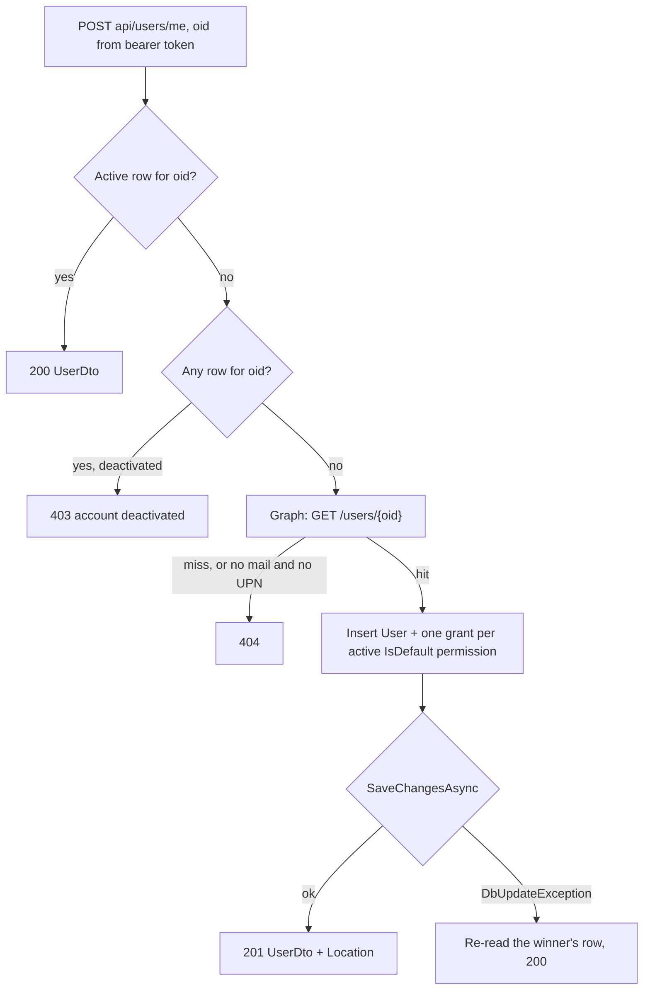

# Users and Permissions

The user lifecycle, how grants are assigned, and the invariants that stop an administrator locking
the tenant out. The authorization mechanism itself is in
[../architecture/auth-and-permissions.md](../architecture/auth-and-permissions.md).

## The row keys on the directory object id

Every `Core.User` row's primary key is the Entra object id. That single decision is what makes the
three provisioning paths converge instead of racing.

## Three provisioning paths

### Self-provisioning on first sign-in

`POST api/users/me` — a `POST` rather than a `GET` because the call can create.

- **Deactivated is not absent.** A second cheap `AnyAsync` probe runs *only* when the active lookup
  misses. Without it a deactivated user would be treated as new, re-insert their own object id, and
  fail with a duplicate key instead of a clear 403. The happy path stays at one query.
- **The duplicate-insert race is swallowed on purpose.** MSAL can emit more than one signed-in
  notification per session, so two first-sign-in calls can both pass the existence check. The loser
  clears the change tracker, re-reads the winner's row and returns 200.
- **Email resolution** prefers `mail`, falling back to `userPrincipalName`; neither yields a 404
  rather than a null in the non-nullable column. The message names the **object id**, not the
  address, because handlers log the message and PII must not reach logs.
- **This call warms the permission cache** on every path — existing, created and race-loser. The
  write is ordered against concurrent evictions by an invalidation stamp captured *before* the
  grants are read, so a sign-in racing a revoke cannot republish the pre-revoke set.

A self-provisioned user receives **exactly** the permissions flagged `IsDefault`.

### Administrator pre-creation

`POST api/users` provisions someone before they have ever signed in, from an email address alone.
Graph resolves it, and the returned id becomes the row's primary key — which is the crux: the user's
first `POST api/users/me` then finds the row and takes the existing-user path, keeping the
permissions the administrator assigned.

The requested `permissionIds` **plus every default** are granted, so a pre-created user is never
worse off than one who self-provisions.

Two safeguards in the Graph lookup:

- The email is embedded in an OData filter by concatenation, so a single quote is **escaped by
  doubling**. Without that, an address containing an apostrophe both breaks the query and opens an
  injection vector into the filter.
- **`$top=2`, not `1`.** `mail` is not unique in Entra ID — shared mailboxes, mail-enabled objects,
  mail/UPN collisions — and this id becomes a primary key, so silently taking the first match could
  bind a pre-creation to the wrong person. More than one match is a 400.

This route is also the **reactivation path**: a previously deactivated row cannot be re-inserted, so
the service revives it — clearing `DateDeactivated`, refreshing the profile from Graph, and adding
missing grants. Grants that survived deactivation are skipped, since re-granting one would violate
the filtered unique index on `(UserId, PermissionId) WHERE DateDeactivated IS NULL`. An **active**
user with that email is a 400, not a revive.

### Administrator management

| Task | Route |
| --- | --- |
| Find users | `GET api/users?name=&skip=&take=&permissionId=&sort=&dir=` |
| Inspect one user and their grants | `GET api/users/{id}` |
| Edit profile and replace the permission set | `PUT api/users/{id}` |
| Add or remove one permission | `POST` / `DELETE api/users/{userId}/permissions/{permissionId}` |
| Revoke access | `DELETE api/users/{id}` |

`PUT` writes `firstName`, `lastName` and `email` directly and does **not** consult Graph, so
administrator edits override the directory values until the next revive rewrites them.

## Default permissions

`Permission.IsDefault` is the only knob administrators have over what a brand-new user can do.

| Path | Defaults applied |
| --- | --- |
| `POST api/users/me` — first sign-in | Yes — exactly the active `IsDefault` permissions |
| `POST api/users` — pre-creation or revive | Yes — requested ids **union** every default |
| `PUT api/users/{id}` | **No** |
| `POST api/users/{userId}/permissions/{permissionId}` | **No** — explicit grant only |

The flag applies at provisioning time, never retroactively. Turning it on does not backfill existing
users, and an administrator who omits a default from a `PUT` body revokes it permanently for that
user. Both are deliberate: `PUT` is a *complete desired set*, and a rule that silently re-added
defaults would make it impossible to take a permission away from one person.

### Privileged rows can never be default

Three things close that off:

1. The seeded `Administrator` row is created with `IsDefault = false`.
2. Permissions auto-created by an MCP server never set the flag.
3. `PermissionService.EnsurePermissionIsCustom` rejects **all** mutation of both kinds of row,
   throwing a 400 at the top of update and deactivate.

`PUT api/permissions/{id}` is the only route that can flip the flag and it refuses those rows, and
`CreatePermissionActionDto` has no `mcpServerId` field, so a newly created default cannot be
attached to a server afterwards.

## Safety invariants

Every admin route authorizes off a single grant, so the failure mode to design against is an
administrator locking themselves — or the tenant — out.

| Invariant | Enforced in | Result |
| --- | --- | --- |
| An administrator cannot revoke their own Administrator grant via the bulk diff | `UserService.EnsureAdministratorNotSelfRevoked` | 400 |
| ...nor via the single-grant route | `PermissionService.RevokePermissionAsync` | 400 |
| An administrator cannot deactivate their own account | `UserService.DeactivateUserAsync` | 400 |
| Deactivating a user cascades soft-delete to every active grant | same `SaveChangesAsync` | 204 |
| ...and evicts their cached grant set | after the save | 204 |
| The built-in Administrator permission cannot be edited or deactivated | `EnsurePermissionIsCustom` | 400 |

**The self-revocation guard is duplicated on purpose.** Both routes can remove the same grant;
guarding only the bulk diff would leave the lockout reachable through the single-grant route. The
check is scoped to "the caller's own row" — administrators can freely revoke *other* administrators.

**Deactivation must cascade** because `PermissionEndpointFilter` authorizes purely on
`Core.UserPermission` and never joins `Core.User`. Leaving a deactivated administrator's grant alive
would leave them with full admin access despite having no active account.

**Deactivation has two halves.** Authorization reads the cache, so the cascade alone is not enough —
a cached entry written before the deactivation would keep serving revoked grants. The service also
invalidates that user's entry after the save. The cascade removes the rows; the eviction makes the
removal visible on the next request.

That eviction is **per instance**. In a scaled-out deployment other instances keep serving their
cached entry until it expires, so a deactivated administrator can retain access elsewhere for up to
`Permissions:Cache:EntryLifetime` (default 5 minutes). The same applies to every revoke here.

No single API call can reduce the system to zero active administrators. That property holds only
through the API — direct SQL, or disabling the last administrator in Entra ID, will still get you
there.

## Known limit: deactivation is not session revocation

Only two places consult `User.DateDeactivated`: the sign-in handshake, which returns 403, and
`GrantPermissionAsync`, which refuses to grant. An already-issued access token stays valid until it
expires. Admin routes are cut off indirectly, through the grant cascade and cache eviction above.

## The admin area

A lazy layout route with a rail, reached only through `canMatch: [adminCanMatch]` so a non-admin
never requests the chunk. Four screens — users, models, MCP servers, reports — each with its own
route-scoped store, over a shared kit of data table, bulk action bar and paginator.

The seam worth knowing: the **root** catalog stores (`ModelCatalogStore`, `McpCatalogStore`) and the
**screen** stores are separate, and coordinate through `adminEvents`. A save that demotes another
row, or a 204 that describes nothing, is a fact only a refetch can learn.

`AdminReportsStore` is provided on the screen, not the layout, so back-navigation gets a fresh empty
instance rather than a stale report.

## Key files

| Path | Role |
| --- | --- |
| `enterprise-gpt-api/Enterprise.Gpt.Service/UserService.cs` | The three paths, the diff, the invariants |
| `enterprise-gpt-api/Enterprise.Gpt.Service/PermissionService.cs` | Grant, revoke, `EnsurePermissionIsCustom` |
| `enterprise-gpt-api/Enterprise.Gpt.Service/GraphService.cs` | Directory lookup, filter escaping, `$top=2` |
| `enterprise-gpt-api/Enterprise.Gpt.Api/Endpoints/UserEndpoints.cs` | Sign-in and the admin routes |
| `enterprise-gpt-ui/src/app/features/admin/` | The four screens and their stores |
| `enterprise-gpt-api/tests/Enterprise.Gpt.Integration.Test/` | Lockout and cascade tests |

## Related

- [../architecture/auth-and-permissions.md](../architecture/auth-and-permissions.md)
- [projects.md](projects.md)
- [../conversations/usage-and-reporting.md](../conversations/usage-and-reporting.md)
