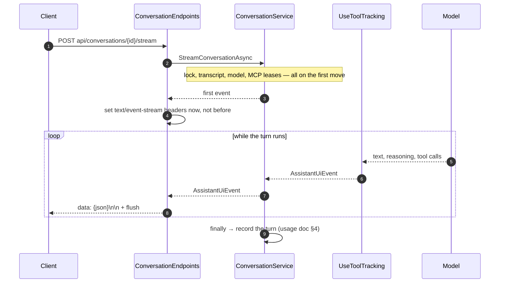

# Conversation Streaming Contract

End-to-end reference for what `POST api/conversations/{id}/stream` writes on the wire: the server-sent-event framing, the JSON event contract inside each frame, and how a client folds a sequence of those events back into the assistant's answer and its tree of tool activity. Audience: whoever writes or maintains a client of this endpoint. The shipped consumer is the rebuilt `enterprise-gpt-ui/` client, whose streaming layer is documented in [Conversation Streaming Client](streaming-client.md) and mapped file by file in §7. Companion to [Conversation Usage and Favourites](usage-and-favorites.md), which covers what the same turn records in the database.

## 1. Overview

The endpoint used to write the model's answer as raw bytes: no framing, no structure, nothing but the text as it arrived. A client read it with `body.getReader()` and appended whatever came out.

That was enough while a turn was only ever "the model talking". It is not enough now. A turn can call a function, reach an MCP server, or run an agent that calls tools of its own, and those calls take seconds during which the old contract had exactly one thing to say: nothing. There was no way to express *"the assistant is calling the Weather MCP, which is 3 of 7 cities through a forecast lookup"* in a stream whose entire vocabulary was answer text.

So the stream now carries **events instead of text**. Each one is a JSON object in its own SSE frame, and answer text is just one of the eight kinds:

```text
data: {"kind":"ActivityStarted","scopeId":"s1","depth":1,"toolKind":"McpTool","displayName":"Weather_get_forecast","source":"Weather","timestamp":"2026-08-08T10:14:02.117+00:00"}

data: {"kind":"TextDelta","depth":0,"toolKind":"Unknown","text":"It will be "}
```

The payload is `Andes.Extensions.AI.AssistantUiEvent`, the UI contract from the tool-tracking middleware described in the usage document — not a shape this repository defines. That is deliberate: the package ships a **TypeScript mirror of the same contract**, plus the reducer that folds a sequence of events into a renderable tree, so a client does not have to reimplement either (§5.2).

What this does **not** change: the route, the request body, the authentication, the error surface, and the `text/event-stream` content type. A client that already handles the failure modes keeps handling them the same way. Only the bytes between the headers and the end of the body are different.

### 1.1 A turn, end to end



### 1.2 Where each piece lives

| Concern | Where |
|---|---|
| Framing and serialization | `ConversationEndpoints.StreamConversationAsync` ([`ConversationEndpoints.cs`](../../enterprise-gpt-api/Enterprise.Gpt.Api/Endpoints/ConversationEndpoints.cs)) |
| Producing the events | `ConversationService.StreamConversationCoreAsync` ([`ConversationService.cs`](../../enterprise-gpt-api/Enterprise.Gpt.Service/ConversationService.cs)), via `ToUiEventsAsync()` |
| The event type and its JSON | `Andes.Extensions.AI.UI` 0.8.0 — `AssistantUiEvent`, `AssistantUiJsonContext` |
| The client-side reducer | `Andes.Extensions.AI.UI` 0.8.0, `typescript/andes-assistant-ui.ts` (§5.2) |
| What the turn records | [Conversation Usage and Favourites](usage-and-favorites.md) |

## 2. Quick start

Consume the stream with `fetch`, split the body on blank lines, and fold each frame into a snapshot:

```typescript
import {
  createInitialSnapshot,
  foldAssistantEvents,
  type AssistantUiEvent,
} from './andes-assistant-ui';

const response = await fetch(`${apiUrl}conversations/${id}/stream`, {
  method: 'POST',
  headers: {
    'Content-Type': 'application/json',
    Accept: 'text/event-stream',
    Authorization: `Bearer ${accessToken}`,
  },
  body: JSON.stringify({ prompt, modelId, mcpServers }),
  signal: abortController.signal,
});

// A failure before the first frame is a normal Problem Details response (§3.3).
if (!response.ok) {
  throw new Error((await response.json()).detail ?? response.statusText);
}

const reader = response.body!.getReader();
const decoder = new TextDecoder();
let buffer = '';
let snapshot = createInitialSnapshot();

for (;;) {
  const { value, done } = await reader.read();
  if (done) break;

  buffer += decoder.decode(value, { stream: true });

  // Frames are separated by a blank line; the tail may be a partial frame.
  let separator: number;
  while ((separator = buffer.indexOf('\n\n')) !== -1) {
    const frame = buffer.slice(0, separator);
    buffer = buffer.slice(separator + 2);

    const event = JSON.parse(frame.slice('data: '.length)) as AssistantUiEvent;
    snapshot = foldAssistantEvents(snapshot, event);
    render(snapshot);
  }
}
```

`snapshot.text` is the answer, `snapshot.activities` is the tool tree, and `snapshot.usage` is filled in when the turn finishes. That is the whole client.

## 3. The transport

### 3.1 Headers, and why they are set on the first frame

| Header | Value | Why |
|---|---|---|
| `Content-Type` | `text/event-stream` | |
| `Cache-Control` | `no-cache` | |
| `X-Accel-Buffering` | `no` | Reverse proxies buffer a response by default, which holds every frame until the turn ends. Streaming activity that arrives all at once, after the answer, is worse than not streaming it |

`Connection` is deliberately absent: it is a hop-by-hop header Kestrel owns, and it is invalid under HTTP/2.

All three are written **on the first frame, not up front**. Everything that can fail a turn — acquiring the conversation lock, reading the transcript, resolving the model, leasing the MCP servers — happens on the first move of the sequence, so setting the headers eagerly would put streaming headers on a `409` or a `404` and its JSON body. This is also why `TypedResults.ServerSentEvents`, the obvious .NET 10 answer, is not usable here: it commits the response before enumerating, so a client would receive `200 OK` and then discover the turn never started. The first frame is now the synthetic `Status` of §4.3, which the service yields after all of those checks and before the model's first token — the trade-off §3.3 records.

A turn that produces nothing still gets the headers, so a reader always sees a well-formed empty stream rather than a bare `200` it cannot interpret.

### 3.2 Framing rules

One event per frame, and nothing else:

```text
data: {"kind":"TextDelta","depth":0,"toolKind":"Unknown","text":"Hello"}\n\n
```

- **No event name.** Every frame goes on the default channel, and a client switches on the payload's own `kind` discriminator instead. A named channel would put the same information in two places, and `EventSource` cannot send the `POST` body this endpoint requires anyway.
- **No `id:`, no `retry:`.** The stream is not resumable — a turn is a single database transaction and a single Cosmos append, not a cursor a client can seek into. Reconnecting starts a new turn.
- **Exactly one `data:` line per frame.** Serialized JSON never contains a raw newline, so no continuation handling is needed on either side.
- **Frames are separated by a blank line** and flushed individually. A client must buffer across `read()` boundaries: a chunk can end mid-frame.

The JSON comes from `AssistantUiJsonContext.Default.AssistantUiEvent`, the package's source-generated serializer context. That matters beyond trim safety — it is what pins the wire format to **camelCase keys, string enum values (`"McpTool"`, not `2`), and omitted nulls**, which is exactly what the shipped TypeScript interface declares. Serializing with ambient `JsonSerializerOptions` instead would silently drift the two apart.

### 3.3 Errors before and after the first frame

**Before** — the normal API error surface, RFC 9457 Problem Details with a `type` from [`ProblemTypes`](../../enterprise-gpt-api/Enterprise.Gpt.Api/Problems/ProblemTypes.cs):

| Status | `type` | When |
|---|---|---|
| `400` | `/problems/validation-error` | The request body failed validation; `errors` is keyed by property name |
| `403` | `/problems/forbidden` | The caller may not use something the turn needs |
| `404` | `/problems/resource-not-found` | The conversation is unknown, deactivated, or another user's |
| `409` | `/problems/conversation-busy` | A turn is already in flight for this conversation |
| `502` | `/problems/mcp-server-unavailable` | A selected MCP server could not be reached, or its on-behalf-of token could not be acquired — a consent or Conditional Access requirement included, since these servers are consented tenant-wide and a UI-required result is a registration fault, not something the caller can act on |
| `503` | `/problems/provider-not-configured` | The model exists but this deployment has no chat client for its provider — an operator fixes it, not the caller |

The line between "before" and "after" is the **synthetic opening pair** (§4.3). Everything in the table runs ahead of the first yield — the conversation lock, the conversation reads, first-turn naming, model resolution, and MCP validation and tool acquisition — so those failures still arrive as ordinary problem JSON. The model's first token does not: the two synthetic frames commit the response to `text/event-stream` *before* the provider is called, so a provider that faults on its very first token — a bad deployment, an expired key, exhausted quota — now surfaces as the mid-stream truncation below instead of a problem response. That is the deliberate price of the opening pair: the client hears something during model latency, and first-token faults lose their problem body.

**After** — there is no error surface left. The exception handlers short-circuit on `Response.HasStarted` rather than corrupting a stream that is already `200 OK` with half an answer in it, so a mid-stream failure reaches the client as **a body that simply stops**. A client cannot distinguish that from a network drop and should not try to; treat an ended body with no `Finished` event as an incomplete turn and say so in the UI.

That rule is unchanged by the transcript write §4.1.1 describes, and it is worth being precise about why: a turn whose write fails **after** the model finished still gets a `Finished` frame — the answer genuinely completed, and holding the frame back exists precisely so that fact cannot be lost — just one carrying no `metadata`. "No `Finished` at all" and "`Finished` with no `metadata`" are different signals answering different questions: the first says the turn did not end well, the second says it ended well but the transcript does not (yet, or ever) hold the message a client could act on by id.

The turn is still recorded when this happens — see [usage §4](usage-and-favorites.md#4-what-happens-on-a-chat-turn). It is also recorded when a client disconnects on the opening pair itself: the synthetic yields sit inside the same `try`/`finally` that persists the turn's outcome, so a caller that heard only the first frames still counts as a turn.

## 4. The event contract

### 4.1 Event kinds

`kind` is the discriminator, and it tells the client which of the fields in §4.2 are meaningful.

| `kind` | Meaning | Carries |
|---|---|---|
| `Status` | A request-level status line, such as `"Reasoning…"`; the turn's first, `"Starting"`, is the server's own (§4.3) | `message` |
| `ActivityStarted` | A tool, MCP call or agent began | `scopeId`, `parentScopeId`, `displayName`, `source`, `toolKind`, `depth` |
| `ActivityProgress` | A sub-status reported from inside a running activity | `scopeId`, `message`, `progress`, `progressTotal` |
| `ActivityCompleted` | That activity returned | `scopeId`, `durationSeconds` |
| `ActivityFailed` | That activity threw | `scopeId`, `durationSeconds` |
| `TextDelta` | A chunk of the assistant's answer | `text` |
| `ReasoningDelta` | A chunk of reasoning text — the turn's first is server-authored, the rest are the model's reasoning summary | `text` |
| `Finished` | The turn ran to completion | `usage`, `durationSeconds`, `metadata` (§4.1.1) |

Three of these deserve their own note, and `Finished` has a fourth of its own (§4.1.1).

**`ReasoningDelta` is display-only.** It is streamed so the user can see the model thinking, and it is never written to the Cosmos transcript: replaying a model's own reasoning back to it on the next turn is neither useful nor what providers expect. Only `TextDelta` is transcribed.

**The first `ReasoningDelta` of every turn is server-authored.** The service seeds `"Reviewing the request and preparing a response.\n\n"` ahead of the model's first event (§4.3) — a deliberate contract deviation, requested by the product: the package documents `ReasoningDelta` as model-sourced text, and this one is not. Every turn therefore carries non-null reasoning text whatever model serves it, so a client can no longer infer "this model streams reasoning" from the field's presence alone. The trailing blank line is load-bearing — the reducer accumulates reasoning deltas verbatim, so it is what separates this sentence from a reasoning-capable model's own first delta.

**Model reasoning does now arrive, on some turns.** Until recently the seeded sentence was all any turn produced: the single Azure provider talked to Chat Completions, which returns no reasoning content at all, so the separating blank line marked a boundary nothing was ever written after. The **Azure OpenAI** provider now talks to the Responses API, and a model whose catalog row sets `isReasoningEnabled` streams its own reasoning summary as further `ReasoningDelta` frames — arriving before the first `TextDelta`, and interleaved with activity events if the turn calls a tool while reasoning. So the honest expectation for a client is: **one** `ReasoningDelta` on most turns and **many** on some, decided by the provider and the model's catalog row rather than by anything on the wire. A client that shows a reasoning region should treat the seeded sentence as *not* reasoning — the shipped client suppresses it and renders only what follows — and must not assume more will come. See [Azure OpenAI §5](../models/azure-openai.md#5-reasoning) for what makes a turn produce them — and note that the *other* Azure provider ([Azure AI Foundry](../models/azure-ai-foundry.md), Chat Completions on the same resource) never produces any, so a client cannot infer the capability from "the model is on Azure" either.

**`Finished` is not a terminator.** It arrives only when the turn ran to completion; a cancelled or faulted turn ends the body without it. End-of-body is the terminator, and `Finished` is the signal that the turn ended *well* — plus the only place a client gets the turn's total token usage.

### 4.1.1 `Finished` carries the persisted message's identity (US-1101)

Since `Andes.Extensions.AI.UI` 0.8.0, `AssistantUiEvent` carries an optional `metadata: Record<string, string>`, and the service uses exactly one key on it: `assistantMessageId`, the transcript id of the assistant message this turn wrote. The key name is the constant `IConversationService.AssistantMessageIdMetadataKey` — an **opaque identifier clients match verbatim**, like the `/problems/` type URIs in §3.3, so renaming it is a breaking API change.

**The frame is held back, not forwarded live.** The middleware's own `Finished` is the last event the tool-tracking pipeline produces, and it used to reach the client the moment it was yielded — before `PersistTurnAsync` (§6.1's write, running in the `finally` below the model loop) had minted an id for anything. `ConversationService.StreamConversationCoreAsync` now intercepts it, keeps it out of the sequence, and re-yields it — stamped, if there is anything to stamp it with — only after that write has answered. Two consequences follow structurally, not by convention:

- **`Finished` is always the true last frame of a completed turn.** Nothing the middleware could still emit after it arrives ahead of it on the wire, because the frame itself does not go out until the write is done.
- **The identifier is claimed only when the transcript actually holds it.** A turn cannot receive a promise about a message that was never written.

Exactly when the key is present:

| Turn outcome | `Finished` sent? | `metadata` |
|---|---|---|
| Completed, transcript write succeeded | Yes | `{ "assistantMessageId": "<guid>" }` |
| Completed, transcript write failed or threw | Yes | Absent — the serializer omits a null object entirely, not an empty one |
| Cancelled or faulted | No | — (§4.1's existing rule; nothing changed here) |

A write that **throws** is the one case worth spelling out, because it is easy to assume the frame is a casualty of the exception: the failure is captured with `ExceptionDispatchInfo`, the metadata-less `Finished` is yielded first, and only then is the exception rethrown — after the frame, never instead of it. A turn that ran to completion must not be downgraded, by an unrelated write failure, into one the client can only read as truncated (§3.3's "ended without `Finished`" case). On a stream that has already started, the rethrow reaches the same `Response.HasStarted` short-circuit as any other post-first-frame fault (§3.3), so nothing about the body's framing changes — only the exception is now raised one statement later than it used to be.

See [Transcript Storage §6.1](transcript-storage.md#61-writing-a-turn) for the write this ordering depends on.

### 4.2 Fields

Every field except `kind`, `depth` and `timestamp` is optional and **omitted entirely when null**, so a TypeScript client sees them as `?:`.

| Field | Type | Notes |
|---|---|---|
| `kind` | string | The discriminator from §4.1 |
| `message` | string | The status line (`Status`) or the sub-status text (`ActivityProgress`) |
| `scopeId` | string | The activity this event targets; stable across every event for that activity |
| `parentScopeId` | string | The enclosing activity, absent when the activity is top-level (§5.1) |
| `depth` | number | Display depth: `0` request-level, `1` a top-level activity, `2` a sub-status, deeper for nesting |
| `toolKind` | string | `Unknown`, `Function`, `McpTool` or `Agent` — a badge, kept separate from the label |
| `displayName` | string | The clean name, with no `"Calling"` prefix and no kind word appended. Render it once and show `toolKind` as a badge; the contract carries no pre-composed header strings, so labels localize. **What the name *is* depends on `toolKind`** — see the carve-out below |
| `source` | string | Where the tool came from — an MCP server's name, or an agent's. For `McpTool` it is the server's **catalog** name, the one an administrator registered and the user picked in the server selector |
| `progress` / `progressTotal` | number | Numerator and denominator for a progress bar. MCP servers report these as single-precision floats widened to `double`, so format with a rounding specifier before display |
| `durationSeconds` | number | Elapsed time for a completion event, or the whole turn's duration on `Finished` |
| `text` | string | The answer chunk (`TextDelta`) or the reasoning chunk (`ReasoningDelta`) |
| `usage` | object | `{ inputTokens?, outputTokens?, totalTokens? }`, on `Finished` only. Each count is optional because a provider may report only some |
| `metadata` | `Record<string, string>` | Application-supplied values the package does not interpret. This application writes it on `Finished` only, carrying `assistantMessageId` when the transcript write succeeded (§4.1.1); omitted entirely otherwise |
| `timestamp` | string | ISO 8601, and only meaningful for status and activity events. `TextDelta`, `ReasoningDelta` and `Finished` have no source progress event and leave it at its default — **consume events in stream order, never sorted by this** |

> **`depth` here is not the `Depth` column in the audit trail.** The event's depth is a *display* depth that counts the request as level 0 and inserts a level for sub-statuses; the persisted [`ConversationUsageToolCall.Depth`](usage-and-favorites.md#63-coreconversationusagetoolcall) counts nesting only, so a tool the assistant called directly is `1` on the wire and `0` in the database. They answer different questions and are not interchangeable.

**`displayName` means something different per `toolKind`, and that changed in 0.7.0.** The field is one string in the schema and three different things in practice:

| `toolKind` | What `displayName` carries | What `source` carries |
|---|---|---|
| `McpTool` | The **raw MCP tool name** the model called. For a tool this API leased it is `{sanitizedServer}_{tool}` — `Weather_get_forecast` — because `McpToolProvider` renames every leased tool before handing it to the tracking wrapper | The **catalog** server name — `Weather` |
| `Function` | The function's own identifier, a code name in whatever case the declaration used (`search_documents`) | Absent — a plain function has no origin beyond itself |
| `Agent` | The agent's display name, already written for a reader (`Forecast Agent`) | The agent's identifier |

Through 0.5.0 an `McpTool` activity put the **server** name in both fields, so a card read `Weather` twice and never named the tool that ran. Nothing in the schema changed — no field was added, removed or retyped, and `npm run check:contract` compares the vendored TypeScript rather than the meaning — so this is the kind of upgrade that passes every mechanical check and still changes what a user reads (§9).

**A client is expected to undo the prefix.** `source` is the exact string the prefix was built from, which is a property of the API rather than a coincidence: `McpToolProvider` builds the prefix with `SanitizeToolNamePrefix(server.Name)` and passes that same `server.Name` to `WithTracking`, deliberately rather than letting the wrapper read the server's self-advertised `ServerInfo` name — those two strings need not agree, and if they diverged the prefix would no longer be strippable. The shipped client does the stripping in [`activity-label.ts`](../../enterprise-gpt-ui/src/app/domain/stream/activity-label.ts): sanitize `source` the same way, remove a leading `{sanitized}_`, turn the remaining underscores into spaces and upper-case the first character, so `Weather_get_forecast` + `Weather` renders as **Get forecast** with **Weather** beneath it. Every branch that cannot prove the prefix leaves the name alone — a wrong strip produces a plausible-looking wrong label, while an unstripped one is merely verbose.

### 4.3 A turn, frame by frame

A turn that calls one MCP tool and then answers, with the frames' blank-line separators elided:

```json
{"kind":"Status","depth":0,"toolKind":"Unknown","message":"Starting","timestamp":"2026-08-08T10:14:01.874+00:00"}
{"kind":"ReasoningDelta","depth":0,"toolKind":"Unknown","text":"Reviewing the request and preparing a response.\n\n"}
{"kind":"ActivityStarted","scopeId":"s1","depth":1,"toolKind":"McpTool","displayName":"Weather_get_forecast","source":"Weather","timestamp":"2026-08-08T10:14:02.117+00:00"}
{"kind":"ActivityProgress","scopeId":"s1","depth":2,"toolKind":"McpTool","message":"Fetching forecasts","progress":3,"progressTotal":7,"timestamp":"2026-08-08T10:14:03.402+00:00"}
{"kind":"ActivityCompleted","scopeId":"s1","depth":1,"toolKind":"McpTool","durationSeconds":2.41,"timestamp":"2026-08-08T10:14:04.531+00:00"}
{"kind":"TextDelta","depth":0,"toolKind":"Unknown","text":"It will be "}
{"kind":"TextDelta","depth":0,"toolKind":"Unknown","text":"sunny."}
{"kind":"Finished","depth":0,"toolKind":"Unknown","durationSeconds":5.02,"usage":{"inputTokens":812,"outputTokens":146,"totalTokens":958},"metadata":{"assistantMessageId":"5b7e2f1a-9c3d-4e6b-8f21-0a1b2c3d4e5f"}}
```

The first two frames are the server's own, and **every** turn opens with them — synthesized in `ConversationService.StreamConversationCoreAsync` as plain `AssistantUiEvent` yields, not through the middleware's `ChatProgressUpdate.CreateCustom(...)`. They sit after every failure point that can still answer with problem JSON and ahead of the model's first token (§3.3), so the client hears something during model latency. The `Status` carries a real timestamp; the `ReasoningDelta` leaves it at its default, per §4.2's rule for deltas, and its trailing blank line separates it from a model's own first reasoning delta (§4.1).

The **last** frame is server-authored too, in the opposite sense: `Finished` is the middleware's, but this service holds it back and re-yields it once the transcript write has answered, which is what lets it carry `metadata.assistantMessageId` at all (§4.1.1). A turn whose write failed would still show this exact `Finished` shape minus the `metadata` object — `durationSeconds` and `usage` are unaffected, because the middleware computed both before the write ever started.

The MCP activity names the **tool** (`Weather_get_forecast`) and leaves the **server** in `source` (`Weather`); a client renders that pair as "Get forecast" over "Weather" (§4.2).

Note what is *not* there: no prompt, no tool arguments, no tool results (§6.1).

## 5. Rebuilding the activity tree

### 5.1 `scopeId`, `parentScopeId` and nesting

Activity events are flat on the wire and hierarchical in meaning. `scopeId` identifies one activity and is stable across its `ActivityStarted`, every `ActivityProgress`, and its `ActivityCompleted` or `ActivityFailed`. `parentScopeId` names the activity it ran inside.

Three rules are enough to fold them:

1. **`ActivityStarted` whose `parentScopeId` names an existing card** — append the new card to that card's children, at any depth.
2. **`ActivityStarted` with no `parentScopeId`, or one that matches no card** — a new root. Both cases are normal: the request itself has no card, so a top-level tool's parent is a scope the tree does not contain. Falling back to a root is also the right behaviour for a genuinely unattached event — an unattached card is a rendering imperfection, a dropped one is a lost tool call.
3. **Every other activity event** — find the card by `scopeId` and update it in place. Events for an unknown scope are ignored.

Agents nest arbitrarily: an agent invoked as a tool opens its own scope, and the tools it calls are children of that scope, so the tree can be several levels deep. The same nesting is what the audit trail persists as `ParentId`, which is why [usage §3.6](usage-and-favorites.md#36-the-tool-call-tree) and this section describe the same shape from two sides.

### 5.2 Do not write the reducer — the package ships it

`Andes.Extensions.AI.UI` 0.8.0 includes a TypeScript file that is a 1:1 mirror of the C# contract, generated against the same JSON the endpoint writes:

```text
~/.nuget/packages/andes.extensions.ai.ui/0.8.0/typescript/andes-assistant-ui.ts
```

It exports the interfaces (`AssistantUiEvent`, `AssistantActivity`, `AssistantStatusSnapshot`, `UsageSummary`, `SubStatus`) and two functions:

```typescript
export function createInitialSnapshot(): AssistantStatusSnapshot;
export function foldAssistantEvents(
  snapshot: AssistantStatusSnapshot,
  event: AssistantUiEvent,
): AssistantStatusSnapshot;
```

`foldAssistantEvents` implements §5.1 exactly, returns a new immutable snapshot per event, and is the direct counterpart of the C# `AssistantStatusReducer` — so a Blazor client and a SPA render the identical tree from the identical bytes. Copy the file into the SPA rather than reimplementing it: a hand-written fold that disagrees with the C# reducer is a bug that only shows up on nested agents, which is the case nobody tests by hand.

The snapshot it produces is what a component binds to:

| Property | Contents |
|---|---|
| `assistantStatus` | The current request-level status line — `"Starting"` from every turn's first frame (§4.3) |
| `phase` | `Running`, `Completed` or `Failed` |
| `activities` | Root activity cards, each with `subStatuses`, `children` and `usage` |
| `text` | The answer so far |
| `reasoningText` | The reasoning summary so far — never empty once a turn starts, since the server seeds it (§4.1, §4.3) |
| `usage` | The turn's totals, once `Finished` arrives |
| `metadata` | Every event's `metadata` merged, last write per key — `assistantMessageId` once `Finished` arrives with one (§4.1.1) |

## 6. What the stream deliberately is not

### 6.1 It carries no prompt content, arguments or results

The tracking middleware's privacy posture is its default and this application does not opt out of it: progress events never carry prompt content, tool arguments, or tool results. What flows is model *output* — the answer text and the reasoning summary — plus metadata about which tool ran, for how long, and what it cost.

That is a property of the events, not of the transport, so it holds for the out-of-band usage report the audit trail is built from too. Neither the stream nor the database ever sees a tool's arguments.

### 6.2 Only the answer is transcribed

`TextDelta` text is accumulated and appended to the Cosmos transcript when the turn completes. Everything else — status lines, activity cards, reasoning, progress — is live-only and is gone when the page is closed. Reopening a conversation replays the answer, not the work that produced it.

The consequence for a client: the activity tree is **not** available on `GET api/conversations/{id}/messages`. If a UI wants to show what a past turn did, that history is in SQL ([usage §7](usage-and-favorites.md#7-reporting)), and there is no endpoint over it yet.

### 6.3 It is not resumable and not multiplexed

One turn per conversation at a time — a second concurrent `POST` gets `409`. A dropped connection cancels the turn; it does not pause it.

## 7. The client that reads this stream

This section used to record a breaking change: the old `enterprise-ui/` client read the body with `body.getReader()` and appended each chunk as answer text, so the framed contract broke it loudly — the literal `data: {"kind":"TextDelta",…}` frames landed in the chat bubble. That client is deleted, nothing was migrated, and the rebuild at `enterprise-gpt-ui/` shipped its streaming layer against this document (US-404, US-405). [Conversation Streaming Client](streaming-client.md) documents that layer end to end; what follows maps the rewrite steps this section used to prescribe onto where each one landed.

1. **Frame parsing** — shipped as [`createSseFrameCodec()`](../../enterprise-gpt-ui/src/app/domain/stream/sse-frame-codec.ts), a synchronous push decoder behind the [`StreamCodec`](../../enterprise-gpt-ui/src/app/domain/stream/stream-codec.ts) interface: §3.2's framing, a carry-over buffer for chunk boundaries that fall mid-frame or mid-character, and a `flush()` that salvages a final frame that truncation robbed of its blank line. A raw-text fallback ([`raw-text-codec.ts`](../../enterprise-gpt-ui/src/app/domain/stream/raw-text-codec.ts)), selected by the `features.rawStreamCodec` config flag, serves a deployment still running a pre-framing server.
2. **The reducer** — vendored byte-for-byte at [`domain/stream/andes/assistant-ui.contract.ts`](../../enterprise-gpt-ui/src/app/domain/stream/andes/assistant-ui.contract.ts) and drift-checked by `npm run check:contract`, exactly as §5.2 prescribes. Its fold semantics for all eight event kinds are pinned by [`assistant-ui.fold.spec.ts`](../../enterprise-gpt-ui/src/app/domain/stream/andes/assistant-ui.fold.spec.ts) — which exercises the vendored `foldAssistantEvents`, never a reimplementation.
3. **A store, not a string** — the transport half exists: [`ConversationStreamClient`](../../enterprise-gpt-ui/src/app/core/stream/conversation-stream-client.ts) delivers batches of already-decoded events, checks the problem body before reading a single body byte (§3.3's "before" table), and treats a fault after the body began as §3.3's "after" case — a graceful completion, leaving "ended without `Finished`" detection to the turn store US-406 builds. The selection half also exists: [`TurnSettingsStore`](../../enterprise-gpt-ui/src/app/core/chat/turn-settings-store.ts) holds the model and MCP servers the next turn will use (US-402, US-403).
4. **Activity rendering** — shipped on top of the snapshot the vendored fold produces. [`ActivityCard`](../../enterprise-gpt-ui/src/app/features/chat/transcript/activity-card.ts) draws one card per activity with `toolKind` as a separate badge and `source` beneath the label, recurses into `children` for nesting, and puts each card's cost strip behind a chevron. The label is `displayName` through [`activityLabel`](../../enterprise-gpt-ui/src/app/domain/stream/activity-label.ts), which applies §4.2's per-kind carve-out. **The cost strip shows duration only** — see §9 for why no token figure reaches it.
5. **Cancellation** — shipped with the transport: the caller's Stop, sign-out, and unsubscription compose into one `AbortSignal` that aborts the fetch. The server-side behaviour is unchanged — aborting still ends the turn, and the server still records what it spent.

## 8. Testing

Covered in [`Endpoints/ConversationEndpointsTests.cs`](../../enterprise-gpt-api/tests/Enterprise.Gpt.Unit.Test/Endpoints/ConversationEndpointsTests.cs) and [`Services/ConversationServiceTests.cs`](../../enterprise-gpt-api/tests/Enterprise.Gpt.Unit.Test/Services/ConversationServiceTests.cs):

| Area | Asserted |
|---|---|
| Framing | each event becomes its own `data: …\n\n` frame, in order, under the streaming headers including `X-Accel-Buffering: no` |
| Serialization | camelCase property names and string enum values (`"kind":"TextDelta"`), so the wire format matches the shipped TypeScript interface |
| Activity events | an event carrying no text is still a well-formed frame — the payload's `kind` is what makes it renderable, not the presence of `text` |
| Empty turns | a turn that yields nothing still sets the streaming headers |
| Opening pair | every turn's first two events are the `Status` `"Starting"` (real timestamp) then the server-authored `ReasoningDelta` (default timestamp, trailing blank line), ahead of the first model event |
| Activity production | a real tool run through a real `UseToolTracking()` → `UseFunctionInvocation()` pipeline emits `ActivityStarted` with the tool's name and kind, an `ActivityCompleted`, and `TextDelta`s alongside them |
| Transcription | only the `TextDelta` text reaches the Cosmos transcript |
| `Finished`'s identity (US-1101) | a completed turn's `Finished` carries `metadata.assistantMessageId` matching the transcript's own id and arrives last; the transcript is already written by the time it does; a failed transcript write still yields `Finished`, with no `metadata`, followed by the rethrown exception; a client-disconnect abandonment and a faulted stream both emit no `Finished` at all; the wire test pins the metadata object serializing as `{"assistantMessageId":"…"}` and its complete omission when unset |

## 9. Known limits

- **No resumption, no `Last-Event-ID`.** A dropped connection loses the turn (§6.3).
- **No mid-stream error signal.** A turn that faults after the first frame ends the body with no explanation (§3.3) — and since the synthetic opening pair, that includes a provider faulting on its very first token. A terminal `error` event kind would be a contract addition, not a fix, and would still not help a connection that dies.
- **Beyond the opening pair, `Status` events are the middleware's own.** The two frames every turn opens with (§4.3) are the only events this application authors itself — yielded directly as `AssistantUiEvent`s in the service, not through the middleware. A mid-turn request-level status would still come from `ChatProgressUpdate.CreateCustom(...)`.
- **The activity tree is not persisted for replay.** It is reconstructible from SQL but not exposed over HTTP (§6.2).
- **No per-activity token cost ever reaches the wire, and the per-turn accounting did not change that.** `AssistantActivity.usage` exists in the contract and the client already formats it, but the fold never writes it: the only `usage` on the wire is the turn total on `Finished`. Three separate things would each have to give, and they are independent. First, `ToolCallUsage.Usage` is null for an MCP tool because the MCP protocol has no token field — so the middleware has nothing to attribute. Second, what a tool *actually* costs is the growth of the **next** iteration's prompt ([usage §3.9](usage-and-favorites.md#39-turn-rows-partition-the-assistant-columns-they-never-add-to-them)), a number that does not exist yet when `ActivityCompleted` is emitted — the tool has returned, but the turn it feeds has not run. Third, by `Finished` the figure *is* computable, but no event kind attaches usage to an already-completed activity, and it would be a group figure rather than a per-tool one whenever an iteration issued several calls. So the SQL trail can answer "what did this tool cost" after the fact while the live card cannot, and that asymmetry is structural rather than an omission.
- **`AssistantUiEvent` is a package type, not ours.** Its JSON shape is pinned by `Andes.Extensions.AI.UI` 0.8.0; a major upgrade of that package is an API change for every client of this endpoint, and should be treated as one.
- **A package upgrade can change what a field *means* without changing the shape it has.** 0.5.0 → 0.7.0 added, removed and retyped nothing, and `npm run check:contract` — which diffs the vendored TypeScript against the package's own — passed on the new file exactly as it had on the old. What changed was the content of `displayName` on an `McpTool` activity (§4.2), which is invisible to every mechanical gate and visible to every user. Read the package's release notes on an upgrade; the drift check is not a substitute for them.
- **0.7.0 → 0.8.0 is the opposite case: an addition that stays invisible until used.** It adds `metadata?: Record<string, string>` to `AssistantUiEvent` and `AssistantStatusSnapshot` and nothing else — the public-surface delta across all four `Andes.Extensions.AI*` packages is exactly those three members, all in `.UI`. A client that ignores the field is unaffected, which is what makes this release safe to take without a corresponding frontend story: US-1101 shipped the backend half alone, and the vendored fold already merges `metadata` generically (§5.2), ahead of any feature reading `assistantMessageId` off it.
- **A client that undoes the tool-name prefix depends on two API decisions staying true.** `McpToolProvider` must keep building the prefix from the catalog name *and* keep handing `WithTracking` that same catalog name. Reverting to the overload that reads the server's self-advertised name would leave `source` and the prefix as two different strings, and every stripped label would silently stop stripping — no error, no failing check, just verbose labels.

## 10. Key files

| Concern | File |
|---|---|
| Framing, serialization, headers | [`Enterprise.Gpt.Api/Endpoints/ConversationEndpoints.cs`](../../enterprise-gpt-api/Enterprise.Gpt.Api/Endpoints/ConversationEndpoints.cs) |
| Event production, transcription, finalization | [`Enterprise.Gpt.Service/ConversationService.cs`](../../enterprise-gpt-api/Enterprise.Gpt.Service/ConversationService.cs) |
| Pipeline registration (`UseToolTracking` before `UseFunctionInvocation`) | [`Enterprise.Gpt.Api/Program.cs`](../../enterprise-gpt-api/Enterprise.Gpt.Api/Program.cs) |
| Client codec | [`enterprise-gpt-ui/src/app/domain/stream/sse-frame-codec.ts`](../../enterprise-gpt-ui/src/app/domain/stream/sse-frame-codec.ts) |
| Client transport | [`enterprise-gpt-ui/src/app/core/stream/conversation-stream-client.ts`](../../enterprise-gpt-ui/src/app/core/stream/conversation-stream-client.ts) |
| Client label derivation (§4.2) | [`enterprise-gpt-ui/src/app/domain/stream/activity-label.ts`](../../enterprise-gpt-ui/src/app/domain/stream/activity-label.ts) |
| The catalog name behind `source` and the tool prefix | [`Enterprise.Gpt.Service/McpToolProvider.cs`](../../enterprise-gpt-api/Enterprise.Gpt.Service/McpToolProvider.cs) (`SanitizeToolNamePrefix`, `WithTracking(server.Name, enableProgress: true)`) |
| TypeScript contract and reducer | `Andes.Extensions.AI.UI` 0.8.0, `typescript/andes-assistant-ui.ts`, vendored at [`enterprise-gpt-ui/src/app/domain/stream/andes/assistant-ui.contract.ts`](../../enterprise-gpt-ui/src/app/domain/stream/andes/assistant-ui.contract.ts) |
| Related reference | [Conversation Streaming Client](streaming-client.md), [Conversation Usage and Favourites](usage-and-favorites.md), [Model Management](../models/model-management.md), [Azure OpenAI Provider](../models/azure-openai.md) |
