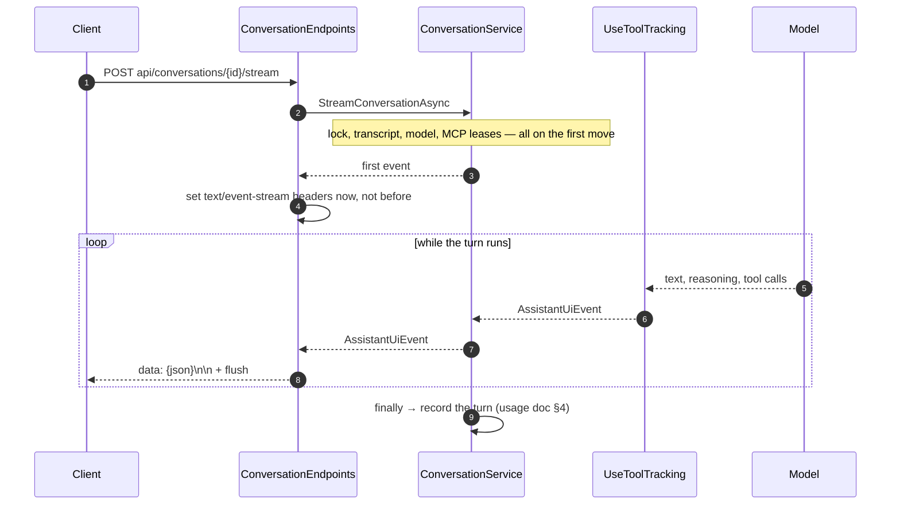

# Conversation Streaming Contract

End-to-end reference for what `POST api/conversations/{id}/stream` writes on the wire: the server-sent-event framing, the JSON event contract inside each frame, and how a client folds a sequence of those events back into the assistant's answer and its tree of tool activity. Audience: whoever writes or maintains a client of this endpoint. The shipped consumer is the rebuilt `enterprise-gpt-ui/` client, whose streaming layer is documented in [Conversation Streaming Client](streaming-client.md) and mapped file by file in §7. Companion to [Conversation Usage and Favourites](usage-and-favorites.md), which covers what the same turn records in the database.

## 1. Overview

The endpoint used to write the model's answer as raw bytes: no framing, no structure, nothing but the text as it arrived. A client read it with `body.getReader()` and appended whatever came out.

That was enough while a turn was only ever "the model talking". It is not enough now. A turn can call a function, reach an MCP server, or run an agent that calls tools of its own, and those calls take seconds during which the old contract had exactly one thing to say: nothing. There was no way to express *"the assistant is calling the Weather MCP, which is 3 of 7 cities through a forecast lookup"* in a stream whose entire vocabulary was answer text.

So the stream now carries **events instead of text**. Each one is a JSON object in its own SSE frame, and answer text is just one of the eight kinds:

```text
data: {"kind":"ActivityStarted","scopeId":"s1","depth":1,"toolKind":"McpTool","displayName":"Weather","source":"Weather","timestamp":"2026-08-08T10:14:02.117+00:00"}

data: {"kind":"TextDelta","depth":0,"toolKind":"Unknown","text":"It will be "}
```

The payload is `Andes.Extensions.AI.AssistantUiEvent`, the UI contract from the tool-tracking middleware described in the usage document — not a shape this repository defines. That is deliberate: the package ships a **TypeScript mirror of the same contract**, plus the reducer that folds a sequence of events into a renderable tree, so a client does not have to reimplement either (§5.2).

What this does **not** change: the route, the request body, the authentication, the error surface, and the `text/event-stream` content type. A client that already handles the failure modes keeps handling them the same way. Only the bytes between the headers and the end of the body are different.

### 1.1 A turn, end to end



### 1.2 Where each piece lives

| Concern | Where |
|---|---|
| Framing and serialization | `ConversationEndpoints.StreamConversationAsync` ([`ConversationEndpoints.cs`](../../enterprise-gpt-api/Enterprise.Gpt.Api/Endpoints/ConversationEndpoints.cs)) |
| Producing the events | `ConversationService.StreamConversationCoreAsync` ([`ConversationService.cs`](../../enterprise-gpt-api/Enterprise.Gpt.Service/ConversationService.cs)), via `ToUiEventsAsync()` |
| The event type and its JSON | `Andes.Extensions.AI.UI` 0.5.0 — `AssistantUiEvent`, `AssistantUiJsonContext` |
| The client-side reducer | `Andes.Extensions.AI.UI` 0.5.0, `typescript/andes-assistant-ui.ts` (§5.2) |
| What the turn records | [Conversation Usage and Favourites](usage-and-favorites.md) |

## 2. Quick start

Consume the stream with `fetch`, split the body on blank lines, and fold each frame into a snapshot:

```typescript
import {
  createInitialSnapshot,
  foldAssistantEvents,
  type AssistantUiEvent,
} from './andes-assistant-ui';

const response = await fetch(`${apiUrl}conversations/${id}/stream`, {
  method: 'POST',
  headers: {
    'Content-Type': 'application/json',
    Accept: 'text/event-stream',
    Authorization: `Bearer ${accessToken}`,
  },
  body: JSON.stringify({ prompt, modelId, mcpServers }),
  signal: abortController.signal,
});

// A failure before the first frame is a normal Problem Details response (§3.3).
if (!response.ok) {
  throw new Error((await response.json()).detail ?? response.statusText);
}

const reader = response.body!.getReader();
const decoder = new TextDecoder();
let buffer = '';
let snapshot = createInitialSnapshot();

for (;;) {
  const { value, done } = await reader.read();
  if (done) break;

  buffer += decoder.decode(value, { stream: true });

  // Frames are separated by a blank line; the tail may be a partial frame.
  let separator: number;
  while ((separator = buffer.indexOf('\n\n')) !== -1) {
    const frame = buffer.slice(0, separator);
    buffer = buffer.slice(separator + 2);

    const event = JSON.parse(frame.slice('data: '.length)) as AssistantUiEvent;
    snapshot = foldAssistantEvents(snapshot, event);
    render(snapshot);
  }
}
```

`snapshot.text` is the answer, `snapshot.activities` is the tool tree, and `snapshot.usage` is filled in when the turn finishes. That is the whole client.

## 3. The transport

### 3.1 Headers, and why they are set on the first frame

| Header | Value | Why |
|---|---|---|
| `Content-Type` | `text/event-stream` | |
| `Cache-Control` | `no-cache` | |
| `X-Accel-Buffering` | `no` | Reverse proxies buffer a response by default, which holds every frame until the turn ends. Streaming activity that arrives all at once, after the answer, is worse than not streaming it |

`Connection` is deliberately absent: it is a hop-by-hop header Kestrel owns, and it is invalid under HTTP/2.

All three are written **on the first frame, not up front**. Everything that can fail a turn — acquiring the conversation lock, reading the transcript, resolving the model, leasing the MCP servers — happens on the first move of the sequence, so setting the headers eagerly would put streaming headers on a `409` or a `404` and its JSON body. This is also why `TypedResults.ServerSentEvents`, the obvious .NET 10 answer, is not usable here: it commits the response before enumerating, so a client would receive `200 OK` and then discover the turn never started.

A turn that produces nothing still gets the headers, so a reader always sees a well-formed empty stream rather than a bare `200` it cannot interpret.

### 3.2 Framing rules

One event per frame, and nothing else:

```text
data: {"kind":"TextDelta","depth":0,"toolKind":"Unknown","text":"Hello"}\n\n
```

- **No event name.** Every frame goes on the default channel, and a client switches on the payload's own `kind` discriminator instead. A named channel would put the same information in two places, and `EventSource` cannot send the `POST` body this endpoint requires anyway.
- **No `id:`, no `retry:`.** The stream is not resumable — a turn is a single database transaction and a single Cosmos append, not a cursor a client can seek into. Reconnecting starts a new turn.
- **Exactly one `data:` line per frame.** Serialized JSON never contains a raw newline, so no continuation handling is needed on either side.
- **Frames are separated by a blank line** and flushed individually. A client must buffer across `read()` boundaries: a chunk can end mid-frame.

The JSON comes from `AssistantUiJsonContext.Default.AssistantUiEvent`, the package's source-generated serializer context. That matters beyond trim safety — it is what pins the wire format to **camelCase keys, string enum values (`"McpTool"`, not `2`), and omitted nulls**, which is exactly what the shipped TypeScript interface declares. Serializing with ambient `JsonSerializerOptions` instead would silently drift the two apart.

### 3.3 Errors before and after the first frame

**Before** — the normal API error surface, RFC 9457 Problem Details with a `type` from [`ProblemTypes`](../../enterprise-gpt-api/Enterprise.Gpt.Api/Problems/ProblemTypes.cs):

| Status | `type` | When |
|---|---|---|
| `400` | `/problems/validation-error` | The request body failed validation; `errors` is keyed by property name |
| `403` | `/problems/mcp-authorization-required` | A selected MCP server needs consent. Deliberately not `401`, which would send clients into a token-refresh loop that cannot fix a consent requirement |
| `403` | `/problems/forbidden` | The caller may not use something the turn needs |
| `404` | `/problems/resource-not-found` | The conversation is unknown, deactivated, or another user's |
| `409` | `/problems/conversation-busy` | A turn is already in flight for this conversation |
| `502` | `/problems/mcp-server-unavailable` | A selected MCP server could not be reached |
| `503` | `/problems/provider-not-configured` | The model exists but this deployment has no chat client for its provider — an operator fixes it, not the caller |

**After** — there is no error surface left. The exception handlers short-circuit on `Response.HasStarted` rather than corrupting a stream that is already `200 OK` with half an answer in it, so a mid-stream failure reaches the client as **a body that simply stops**. A client cannot distinguish that from a network drop and should not try to; treat an ended body with no `Finished` event as an incomplete turn and say so in the UI.

The turn is still recorded when this happens — see [usage §4](usage-and-favorites.md#4-what-happens-on-a-chat-turn).

## 4. The event contract

### 4.1 Event kinds

`kind` is the discriminator, and it tells the client which of the fields in §4.2 are meaningful.

| `kind` | Meaning | Carries |
|---|---|---|
| `Status` | A request-level status line, such as `"Reasoning…"` | `message` |
| `ActivityStarted` | A tool, MCP call or agent began | `scopeId`, `parentScopeId`, `displayName`, `source`, `toolKind`, `depth` |
| `ActivityProgress` | A sub-status reported from inside a running activity | `scopeId`, `message`, `progress`, `progressTotal` |
| `ActivityCompleted` | That activity returned | `scopeId`, `durationSeconds` |
| `ActivityFailed` | That activity threw | `scopeId`, `durationSeconds` |
| `TextDelta` | A chunk of the assistant's answer | `text` |
| `ReasoningDelta` | A chunk of the model's reasoning summary | `text` |
| `Finished` | The turn ran to completion | `usage`, `durationSeconds` |

Two of these deserve their own note.

**`ReasoningDelta` is display-only.** It is streamed so the user can see the model thinking, and it is never written to the Cosmos transcript: replaying a model's own reasoning back to it on the next turn is neither useful nor what providers expect. Only `TextDelta` is transcribed.

**`Finished` is not a terminator.** It arrives only when the turn ran to completion; a cancelled or faulted turn ends the body without it. End-of-body is the terminator, and `Finished` is the signal that the turn ended *well* — plus the only place a client gets the turn's total token usage.

### 4.2 Fields

Every field except `kind`, `depth` and `timestamp` is optional and **omitted entirely when null**, so a TypeScript client sees them as `?:`.

| Field | Type | Notes |
|---|---|---|
| `kind` | string | The discriminator from §4.1 |
| `message` | string | The status line (`Status`) or the sub-status text (`ActivityProgress`) |
| `scopeId` | string | The activity this event targets; stable across every event for that activity |
| `parentScopeId` | string | The enclosing activity, absent when the activity is top-level (§5.1) |
| `depth` | number | Display depth: `0` request-level, `1` a top-level activity, `2` a sub-status, deeper for nesting |
| `toolKind` | string | `Unknown`, `Function`, `McpTool` or `Agent` — a badge, kept separate from the label |
| `displayName` | string | The clean name, with no `"Calling"` prefix and no kind word appended. Render it once and show `toolKind` as a badge; the contract carries no pre-composed header strings, so labels localize |
| `source` | string | Where the tool came from — an MCP server's name, or an agent's |
| `progress` / `progressTotal` | number | Numerator and denominator for a progress bar. MCP servers report these as single-precision floats widened to `double`, so format with a rounding specifier before display |
| `durationSeconds` | number | Elapsed time for a completion event, or the whole turn's duration on `Finished` |
| `text` | string | The answer chunk (`TextDelta`) or the reasoning chunk (`ReasoningDelta`) |
| `usage` | object | `{ inputTokens?, outputTokens?, totalTokens? }`, on `Finished` only. Each count is optional because a provider may report only some |
| `timestamp` | string | ISO 8601, and only meaningful for status and activity events. `TextDelta`, `ReasoningDelta` and `Finished` have no source progress event and leave it at its default — **consume events in stream order, never sorted by this** |

> **`depth` here is not the `Depth` column in the audit trail.** The event's depth is a *display* depth that counts the request as level 0 and inserts a level for sub-statuses; the persisted [`ConversationUsageToolCall.Depth`](usage-and-favorites.md#63-coreconversationusagetoolcall) counts nesting only, so a tool the assistant called directly is `1` on the wire and `0` in the database. They answer different questions and are not interchangeable.

### 4.3 A turn, frame by frame

A turn that calls one MCP tool and then answers, with the frames' blank-line separators elided:

```json
{"kind":"ActivityStarted","scopeId":"s1","depth":1,"toolKind":"McpTool","displayName":"Weather","source":"Weather","timestamp":"2026-08-08T10:14:02.117+00:00"}
{"kind":"ActivityProgress","scopeId":"s1","depth":2,"toolKind":"McpTool","message":"Fetching forecasts","progress":3,"progressTotal":7,"timestamp":"2026-08-08T10:14:03.402+00:00"}
{"kind":"ActivityCompleted","scopeId":"s1","depth":1,"toolKind":"McpTool","durationSeconds":2.41,"timestamp":"2026-08-08T10:14:04.531+00:00"}
{"kind":"TextDelta","depth":0,"toolKind":"Unknown","text":"It will be "}
{"kind":"TextDelta","depth":0,"toolKind":"Unknown","text":"sunny."}
{"kind":"Finished","depth":0,"toolKind":"Unknown","durationSeconds":5.02,"usage":{"inputTokens":812,"outputTokens":146,"totalTokens":958}}
```

Note what is *not* there: no prompt, no tool arguments, no tool results (§6.1).

## 5. Rebuilding the activity tree

### 5.1 `scopeId`, `parentScopeId` and nesting

Activity events are flat on the wire and hierarchical in meaning. `scopeId` identifies one activity and is stable across its `ActivityStarted`, every `ActivityProgress`, and its `ActivityCompleted` or `ActivityFailed`. `parentScopeId` names the activity it ran inside.

Three rules are enough to fold them:

1. **`ActivityStarted` whose `parentScopeId` names an existing card** — append the new card to that card's children, at any depth.
2. **`ActivityStarted` with no `parentScopeId`, or one that matches no card** — a new root. Both cases are normal: the request itself has no card, so a top-level tool's parent is a scope the tree does not contain. Falling back to a root is also the right behaviour for a genuinely unattached event — an unattached card is a rendering imperfection, a dropped one is a lost tool call.
3. **Every other activity event** — find the card by `scopeId` and update it in place. Events for an unknown scope are ignored.

Agents nest arbitrarily: an agent invoked as a tool opens its own scope, and the tools it calls are children of that scope, so the tree can be several levels deep. The same nesting is what the audit trail persists as `ParentId`, which is why [usage §3.6](usage-and-favorites.md#36-the-tool-call-tree) and this section describe the same shape from two sides.

### 5.2 Do not write the reducer — the package ships it

`Andes.Extensions.AI.UI` 0.5.0 includes a TypeScript file that is a 1:1 mirror of the C# contract, generated against the same JSON the endpoint writes:

```text
~/.nuget/packages/andes.extensions.ai.ui/0.5.0/typescript/andes-assistant-ui.ts
```

It exports the interfaces (`AssistantUiEvent`, `AssistantActivity`, `AssistantStatusSnapshot`, `UsageSummary`, `SubStatus`) and two functions:

```typescript
export function createInitialSnapshot(): AssistantStatusSnapshot;
export function foldAssistantEvents(
  snapshot: AssistantStatusSnapshot,
  event: AssistantUiEvent,
): AssistantStatusSnapshot;
```

`foldAssistantEvents` implements §5.1 exactly, returns a new immutable snapshot per event, and is the direct counterpart of the C# `AssistantStatusReducer` — so a Blazor client and a SPA render the identical tree from the identical bytes. Copy the file into the SPA rather than reimplementing it: a hand-written fold that disagrees with the C# reducer is a bug that only shows up on nested agents, which is the case nobody tests by hand.

The snapshot it produces is what a component binds to:

| Property | Contents |
|---|---|
| `assistantStatus` | The current request-level status line |
| `phase` | `Running`, `Completed` or `Failed` |
| `activities` | Root activity cards, each with `subStatuses`, `children` and `usage` |
| `text` | The answer so far |
| `reasoningText` | The reasoning summary so far, when the model streams one |
| `usage` | The turn's totals, once `Finished` arrives |

## 6. What the stream deliberately is not

### 6.1 It carries no prompt content, arguments or results

The tracking middleware's privacy posture is its default and this application does not opt out of it: progress events never carry prompt content, tool arguments, or tool results. What flows is model *output* — the answer text and the reasoning summary — plus metadata about which tool ran, for how long, and what it cost.

That is a property of the events, not of the transport, so it holds for the out-of-band usage report the audit trail is built from too. Neither the stream nor the database ever sees a tool's arguments.

### 6.2 Only the answer is transcribed

`TextDelta` text is accumulated and appended to the Cosmos transcript when the turn completes. Everything else — status lines, activity cards, reasoning, progress — is live-only and is gone when the page is closed. Reopening a conversation replays the answer, not the work that produced it.

The consequence for a client: the activity tree is **not** available on `GET api/conversations/{id}/messages`. If a UI wants to show what a past turn did, that history is in SQL ([usage §7](usage-and-favorites.md#7-reporting)), and there is no endpoint over it yet.

### 6.3 It is not resumable and not multiplexed

One turn per conversation at a time — a second concurrent `POST` gets `409`. A dropped connection cancels the turn; it does not pause it.

## 7. The client that reads this stream

This section used to record a breaking change: the old `enterprise-ui/` client read the body with `body.getReader()` and appended each chunk as answer text, so the framed contract broke it loudly — the literal `data: {"kind":"TextDelta",…}` frames landed in the chat bubble. That client is deleted, nothing was migrated, and the rebuild at `enterprise-gpt-ui/` shipped its streaming layer against this document (US-404, US-405). [Conversation Streaming Client](streaming-client.md) documents that layer end to end; what follows maps the rewrite steps this section used to prescribe onto where each one landed.

1. **Frame parsing** — shipped as [`createSseFrameCodec()`](../../enterprise-gpt-ui/src/app/domain/stream/sse-frame-codec.ts), a synchronous push decoder behind the [`StreamCodec`](../../enterprise-gpt-ui/src/app/domain/stream/stream-codec.ts) interface: §3.2's framing, a carry-over buffer for chunk boundaries that fall mid-frame or mid-character, and a `flush()` that salvages a final frame that truncation robbed of its blank line. A raw-text fallback ([`raw-text-codec.ts`](../../enterprise-gpt-ui/src/app/domain/stream/raw-text-codec.ts)), selected by the `features.rawStreamCodec` config flag, serves a deployment still running a pre-framing server.
2. **The reducer** — vendored byte-for-byte at [`domain/stream/andes/assistant-ui.contract.ts`](../../enterprise-gpt-ui/src/app/domain/stream/andes/assistant-ui.contract.ts) and drift-checked by `npm run check:contract`, exactly as §5.2 prescribes. Its fold semantics for all eight event kinds are pinned by [`assistant-ui.fold.spec.ts`](../../enterprise-gpt-ui/src/app/domain/stream/andes/assistant-ui.fold.spec.ts) — which exercises the vendored `foldAssistantEvents`, never a reimplementation.
3. **A store, not a string** — the transport half exists: [`ConversationStreamClient`](../../enterprise-gpt-ui/src/app/core/stream/conversation-stream-client.ts) delivers batches of already-decoded events, checks the problem body before reading a single body byte (§3.3's "before" table), and treats a fault after the body began as §3.3's "after" case — a graceful completion, leaving "ended without `Finished`" detection to the turn store US-406 builds. The selection half also exists: [`TurnSettingsStore`](../../enterprise-gpt-ui/src/app/core/chat/turn-settings-store.ts) holds the model and MCP servers the next turn will use (US-402, US-403).
4. **Activity rendering** — still to come (US-406 and EP-5/EP-6), on top of the snapshot the vendored fold produces.
5. **Cancellation** — shipped with the transport: the caller's Stop, sign-out, and unsubscription compose into one `AbortSignal` that aborts the fetch. The server-side behaviour is unchanged — aborting still ends the turn, and the server still records what it spent.

## 8. Testing

Covered in [`Endpoints/ConversationEndpointsTests.cs`](../../enterprise-gpt-api/tests/Enterprise.Gpt.Unit.Test/Endpoints/ConversationEndpointsTests.cs) and [`Services/ConversationServiceTests.cs`](../../enterprise-gpt-api/tests/Enterprise.Gpt.Unit.Test/Services/ConversationServiceTests.cs):

| Area | Asserted |
|---|---|
| Framing | each event becomes its own `data: …\n\n` frame, in order, under the streaming headers including `X-Accel-Buffering: no` |
| Serialization | camelCase property names and string enum values (`"kind":"TextDelta"`), so the wire format matches the shipped TypeScript interface |
| Activity events | an event carrying no text is still a well-formed frame — the payload's `kind` is what makes it renderable, not the presence of `text` |
| Empty turns | a turn that yields nothing still sets the streaming headers |
| Activity production | a real tool run through a real `UseToolTracking()` → `UseFunctionInvocation()` pipeline emits `ActivityStarted` with the tool's name and kind, an `ActivityCompleted`, and `TextDelta`s alongside them |
| Transcription | only the `TextDelta` text reaches the Cosmos transcript |

## 9. Known limits

- **No resumption, no `Last-Event-ID`.** A dropped connection loses the turn (§6.3).
- **No mid-stream error signal.** A turn that faults after the first frame ends the body with no explanation (§3.3). A terminal `error` event kind would be a contract addition, not a fix, and would still not help a connection that dies.
- **`Status` events are the middleware's own.** This application emits no request-level statuses of its own, so a client sees nothing between accepting the request and the first activity or text. `ChatProgressUpdate.CreateCustom(...)` is how that would change.
- **The activity tree is not persisted for replay.** It is reconstructible from SQL but not exposed over HTTP (§6.2).
- **`AssistantUiEvent` is a package type, not ours.** Its JSON shape is pinned by `Andes.Extensions.AI.UI` 0.5.0; a major upgrade of that package is an API change for every client of this endpoint, and should be treated as one.

## 10. Key files

| Concern | File |
|---|---|
| Framing, serialization, headers | [`Enterprise.Gpt.Api/Endpoints/ConversationEndpoints.cs`](../../enterprise-gpt-api/Enterprise.Gpt.Api/Endpoints/ConversationEndpoints.cs) |
| Event production, transcription, finalization | [`Enterprise.Gpt.Service/ConversationService.cs`](../../enterprise-gpt-api/Enterprise.Gpt.Service/ConversationService.cs) |
| Pipeline registration (`UseToolTracking` before `UseFunctionInvocation`) | [`Enterprise.Gpt.Api/Program.cs`](../../enterprise-gpt-api/Enterprise.Gpt.Api/Program.cs) |
| Client codec | [`enterprise-gpt-ui/src/app/domain/stream/sse-frame-codec.ts`](../../enterprise-gpt-ui/src/app/domain/stream/sse-frame-codec.ts) |
| Client transport | [`enterprise-gpt-ui/src/app/core/stream/conversation-stream-client.ts`](../../enterprise-gpt-ui/src/app/core/stream/conversation-stream-client.ts) |
| TypeScript contract and reducer | `Andes.Extensions.AI.UI` 0.5.0, `typescript/andes-assistant-ui.ts`, vendored at [`enterprise-gpt-ui/src/app/domain/stream/andes/assistant-ui.contract.ts`](../../enterprise-gpt-ui/src/app/domain/stream/andes/assistant-ui.contract.ts) |
| Related reference | [Conversation Streaming Client](streaming-client.md), [Conversation Usage and Favourites](usage-and-favorites.md), [Model Management](../models/model-management.md) |
