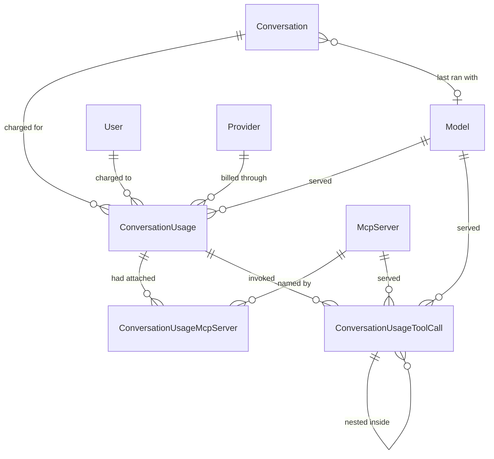

# Conversation Usage and Favourites

End-to-end reference for the conversation usage audit trail: the append-only record of every model call charged to a conversation, of every tool that call invoked, the model and MCP selection a conversation is resumed with, and the favourite flag. Covers the data model, what is recorded when, how cancelled and naming calls are accounted for, the resume shape returned by `GET api/conversations/{id}`, the favourite routes, how the schema reaches a real database, and the reports the trail makes possible. Audience: engineers maintaining conversations, and whoever has to answer "what did we spend, and on what?".

Companion to [Conversation Streaming Contract](streaming-contract.md), which covers the events the same turn writes to the client while it runs.

## 1. Overview

Before this feature the platform billed model calls it could not account for. A conversation carried running `InputTokens`/`OutputTokens` counters and nothing else: no per-call breakdown, no record of which model or provider served a turn, and two whole classes of call that moved no counter at all — a turn the user cancelled, and the completion that names a conversation from its first prompt. Both are billed by the provider. Neither was recorded anywhere.

Four things close that gap:

1. **An audit trail.** `Core.ConversationUsage` gets one row per model call, with the model, the provider, the deployment, the token split, and how the call ended. `Core.ConversationUsageMcpServer` names the MCP servers that were attached to it. Rows are never updated and never soft-deleted (§3).
2. **Per-tool attribution.** `Core.ConversationUsageToolCall` gets one row per tool the call invoked — a function, an MCP tool, or an agent — with nesting preserved, so a turn's cost breaks down into *which* tool spent it rather than landing in one undifferentiated total (§3.6).
3. **Model tracking.** `Core.Conversation` gains a nullable `ModelId` — the model its most recent turn ran with — so a client can reopen a conversation on the model it was last used with, and so that lookup does not have to read the audit trail (§5.1).
4. **A favourite flag.** `Core.Conversation.IsFavorite`, set through a dedicated route and filterable from the search endpoint (§5.2, §5.3).

Per-tool attribution arrived after the rest, and it moved two things the first release had promised not to touch. **A turn's token counters now include what its tools spent** (§4), and **the streaming endpoint now writes structured events instead of raw answer text** — a breaking change for API clients, documented in [Conversation Streaming Contract](streaming-contract.md). The permission model is still unchanged. The **Cosmos DB transcript format is not** — it since became one document per message with a header, documented in [Transcript Storage and Tokenization](transcript-storage-and-tokenization.md); this document's references to "appending to the transcript" now mean writing that turn's two message documents as one transactional batch.

> **Before deploying this:** the schema in §6 now ships as **EF Core migrations** that `Database.Migrate()` applies at startup — that changed with the release that added token prices, and §6.5 has been rewritten accordingly. A database that was built out of band, before migrations existed, needs baselining before it can take them. Read §6.5 first; getting this wrong either fails startup or leaves **every completed chat turn failing after its answer has already been streamed**.

### 1.1 Data model at a glance



The edges from `ConversationUsage` to `Model`, `Provider` and `McpServer` are foreign keys for referential integrity, not the values reports read: the deployment name, the provider and the server name are **also copied onto the row** as they stood when the call ran (§3.2). `ConversationUsageToolCall` follows the same convention with its `Source` column, and its two catalog edges are both nullable — an MCP call is attributed only when it can be correlated, and nothing today can name the model behind a tool call at all (§3.7, §9).

### 1.2 Where each piece lives

| Concern | Where |
|---|---|
| Writing a chat turn's usage row | `ConversationService.PersistTurnAsync` ([`ConversationService.cs`](../../enterprise-gpt-api/Enterprise.Gpt.Service/ConversationService.cs)) |
| Classifying how a turn ended | `ConversationService.StreamConversationCoreAsync`, the `try`/`finally` around the stream loop (§4) |
| Collecting the tool-tracking report | [`Chat/ChatUsageScope.cs`](../../enterprise-gpt-api/Enterprise.Gpt.Service/Chat/ChatUsageScope.cs) and [`Chat/ChatUsageObserver.cs`](../../enterprise-gpt-api/Enterprise.Gpt.Service/Chat/ChatUsageObserver.cs) (§4.4) |
| Turning the report into audit rows | [`Chat/UsageReportTranslator.cs`](../../enterprise-gpt-api/Enterprise.Gpt.Service/Chat/UsageReportTranslator.cs) (§3.6) |
| Inserting the middleware into every pipeline | `UseToolTracking(...)` in [`Program.cs`](../../enterprise-gpt-api/Enterprise.Gpt.Api/Program.cs) |
| Writing a naming call's usage row | `ConversationService.UpdateConversationNameAsync` (§4.2) |
| Restoring model + MCP selection | `ConversationService.GetConversationAsync` (§5.1) |
| Favourites | `ConversationService.SetConversationFavoriteAsync`, `SearchConversationsAsync` (§5.2, §5.3) |
| Entities and mapping | [`ConversationUsage.cs`](../../enterprise-gpt-api/Enterprise.Gpt.Entity/ConversationUsage.cs), [`ConversationUsageMcpServer.cs`](../../enterprise-gpt-api/Enterprise.Gpt.Entity/ConversationUsageMcpServer.cs), [`ConversationUsageToolCall.cs`](../../enterprise-gpt-api/Enterprise.Gpt.Entity/ConversationUsageToolCall.cs), [`Conversation.cs`](../../enterprise-gpt-api/Enterprise.Gpt.Entity/Conversation.cs) |
| Schema | EF Core migrations in [`Repository/Migrations/`](../../enterprise-gpt-api/Enterprise.Gpt.Repository/Migrations), applied by `Database.Migrate()` at startup (§6.5) |

## 2. Quick start

Star a conversation, then list only the starred ones:

```http
PUT /api/conversations/9c1f1c8e-6a1e-4c1a-9f7a-2b3c4d5e6f70/favorite
Authorization: Bearer <token>
Content-Type: application/json

{ "isFavorite": true }
```

```http
204 No Content
```

```http
GET /api/conversations/search?isFavorite=true&take=20
→ 200 PaginatedResponseDto<ConversationDto>   (each item carries modelId and isFavorite)
```

Reopen a conversation with the model and tools it was last run with:

```http
GET /api/conversations/9c1f1c8e-6a1e-4c1a-9f7a-2b3c4d5e6f70
→ 200 ConversationDetailDto   (adds mcpServerIds)
```

And, from the reporting side, what a conversation cost — the assistant's own turns and its tools, side by side:

```sql
SELECT Kind, Status, DeploymentName,
       InputTokens, OutputTokens,               -- the assistant's own turns
       ToolInputTokens, ToolOutputTokens,       -- everything its tools spent
       DateCreated
FROM   [Core].[ConversationUsage]
WHERE  ConversationId = '9C1F1C8E-6A1E-4C1A-9F7A-2B3C4D5E6F70'
ORDER BY DateCreated;
```

Then which tools those were, for one of those turns:

```sql
SELECT Depth, Sequence, Kind, ToolName, Source, TotalTokens, SubtreeTotalTokens, DurationMs, Succeeded
FROM   [Core].[ConversationUsageToolCall]
WHERE  ConversationUsageId = @usageId
ORDER BY Depth, Sequence;
```

## 3. The audit trail

### 3.1 One row per model call

A row is written for each call the platform makes on a user's behalf, classified by [`ConversationUsageKinds`](../../enterprise-gpt-api/Enterprise.Gpt.Common/Enums/ConversationUsageKinds.cs):

| Kind | Value | Written by |
|---|---|---|
| `Chat` | 1 | Every chat turn, at finalization — completed or not (§4) |
| `Naming` | 2 | The completion that names a conversation from its opening prompt (§4.2) |

and by how it ended, [`ConversationUsageStatuses`](../../enterprise-gpt-api/Enterprise.Gpt.Common/Enums/ConversationUsageStatuses.cs):

| Status | Value | Meaning |
|---|---|---|
| `Completed` | 1 | The model produced its complete response |
| `Cancelled` | 2 | The caller cancelled or the client disconnected mid-stream |
| `Failed` | 3 | The call faulted before the response completed |

A conversation's **first** turn therefore writes two rows: one `Naming` and one `Chat`.

### 3.2 Snapshots, not joins

`ProviderId`, `DeploymentName`, `McpServerName` and — since the pricing release — `InputPricePerMillionTokens` and `OutputPricePerMillionTokens` are copied onto the audit rows even though the foreign keys could reach them. That is the point: the catalog is editable. An administrator can rename a model, repoint it at a different provider, rename an MCP server, or **change a price**, and a report that joined out to the catalog would silently rewrite the history of every call those rows ever served. `ModelId` still points at the catalog row, so a report can group either way — by what the model is called *now* (join) or by what actually billed the call *then* (`DeploymentName`).

The prices deserve the emphasis, because the failure they prevent is quieter than a rename's. Renaming a model makes a report's labels wrong, which someone notices. Repricing a model without a snapshot makes every historical figure *plausible* and wrong — last quarter's spend silently restated at this quarter's rates, with nothing to compare against. Both prices are **nullable**, and a null means the model was unpriced when the call ran, not that the call was free (§3.5).

### 3.3 Append-only

`ConversationUsage` derives from `BaseEntity`, not `BaseModifiedEntity`: there is no `DateModified`, nothing updates a row after it is written, and `DateDeactivated` stays `null` forever. A usage record that can be edited or hidden is not an audit trail. `DateCreated` is the moment the call *finished*, and it is the timestamp every report groups by.

### 3.4 MCP rows record attachment; tool-call rows record invocation

The two MCP-related child tables answer different questions and are easy to confuse.

A `ConversationUsageMcpServer` row means the server was **selected by the client and successfully leased**, so its tools were on the request. It does not mean the model called any of them, and it is written whether or not it did. It is also what §5.1 reads to restore a conversation's tool selection.

A `ConversationUsageToolCall` row with `Kind = McpTool` means a tool **actually ran** (§3.6). A turn can easily have three attachment rows and one invocation row, or three attachment rows and none at all.

Reports built on the two therefore mean different things: attachment answers "what was on the table", invocation answers "what was used". §7 has a query for each.

### 3.5 `TotalTokens` is computed, and now spans tools

`ConversationUsage.TotalTokens` is an expression-bodied C# getter with no backing field, so EF does not map it and there is no column. Giving it a setter would add a column that could disagree with its own operands.

What it computes has widened. There are now four token columns on the row, two price columns beside them, and three unmapped getters over the lot:

| Member | Column? | Meaning |
|---|---|---|
| `InputTokens`, `OutputTokens` | yes | The **assistant's own** model turns, tools excluded |
| `ToolInputTokens`, `ToolOutputTokens` | yes | Everything **every tool** consumed, nested tools included |
| `InputPricePerMillionTokens`, `OutputPricePerMillionTokens` | yes | USD per **1,000,000** tokens, snapshotted from the catalog when the call ran (§3.2). Nullable |
| `AssistantTokens` | no | `InputTokens + OutputTokens` — the assistant-only figure |
| `TotalTokens` | no | `AssistantTokens + ToolInputTokens + ToolOutputTokens` — the whole call |
| `Cost` | no | What the call cost in USD, at the prices on the row |

`Cost` is
`(InputTokens + ToolInputTokens) / 1000000 × InputPrice + (OutputTokens + ToolOutputTokens) / 1000000 × OutputPrice`,
and it is unmapped for the same reason `TotalTokens` is: a getter with no backing field cannot drift from the operands it is derived from, where a column could. Three things about it are load-bearing.

- **Null when either price is null.** A missing price is not a zero price, and treating it as one would report a partial figure as a whole one. A `Cost` of `null` says "this call is unpriced"; a `Cost` of `0` says the model is genuinely free.
- **Tool tokens are priced at the *driving* model's rate**, which makes the figure an approximation by construction. Nothing in a tool call names the model behind it — `ConversationUsageToolCall.ModelId` is null on every row this application can write (§9) — so there is no other rate to attribute them to. For a turn whose tools ran on a cheaper or dearer model than the assistant, `Cost` is wrong in a direction nothing records.
- **It is client-side only, and this is the trap.** Being unmapped, `Cost` **cannot appear in a LINQ query**: a `Sum(x => x.Cost)` compiles and then fails to translate at run time, in exactly the reporting code the member exists for. A report aggregates the arithmetic in SQL instead — §7 has the query.

The change of meaning matters for anything written against the first release: `TotalTokens` used to mean "the assistant's turns", because that was all there was. **It now means the whole call**, and the old meaning moved to `AssistantTokens`. A SQL report that adds `InputTokens + OutputTokens` is still computing the assistant-only number and is now understating the call, silently. §7 spells out which is which per query.

`ToolInputTokens`/`ToolOutputTokens` are denormalized from the child rows so the split of a call is readable without touching the tool table at all. They are zero when no tool ran — and also when the tools that ran surfaced no usage, which is the common case for an MCP server that does not report what it spent.

### 3.6 The tool-call tree

`Core.ConversationUsageToolCall` holds one row per invocation, classified by [`ConversationToolKinds`](../../enterprise-gpt-api/Enterprise.Gpt.Common/Enums/ConversationToolKinds.cs):

| Kind | Value | Meaning |
|---|---|---|
| `Unknown` | 0 | The category could not be determined — a tool declaration the pipeline could not invoke, seen only through the model's function call |
| `Function` | 1 | A plain in-process function tool |
| `McpTool` | 2 | A tool served by an MCP server. What the server spends internally is opaque, so it reports usage only if it chooses to surface it |
| `Agent` | 3 | An agent exposed to the model as a function. Its run may use a different model and may call tools of its own, which become child rows |

These are the values the middleware's own `ToolKind` uses, mirrored into an enum this repository owns rather than persisting the library's. **The numbers are an on-disk contract**: a package upgrade that renumbered its enum must not silently renumber ten million audit rows, and the entity layer has no other reason to depend on the tracking middleware.

**Nesting.** A tool that calls tools — an agent, or an MCP tool running its own tracked pipeline — produces child rows linked by `ParentId`, arbitrarily deep. `Depth` is denormalized from the parent chain (`0` for a tool the assistant called directly) and `Sequence` orders siblings in the order the middleware reported them, because nothing else does reliably: identifiers are assigned on save, and `DateCreated` is the whole turn's timestamp rather than the invocation's. Every row also carries `ConversationUsageId`, nested ones included, so a turn's whole tree loads in one query instead of a walk down the chain.

**The token-column split, which is the one thing to get right.** The middleware reports each invocation's usage as a **rollup** — its own consumption plus every descendant's. Persisting that number alone would double-count a nested agent under any `SUM`, so each row stores both:

| Column | Holds |
|---|---|
| `InputTokens`, `OutputTokens`, `TotalTokens` | What **this invocation alone** consumed, with its children subtracted out |
| `SubtreeTotalTokens` | The reported rollup: this invocation **and everything nested inside it** |

with the invariant

```text
SubtreeTotalTokens = TotalTokens + sum(children.SubtreeTotalTokens)
```

The practical rule follows from that invariant, and every query in §7 obeys it:

- **Summing the own-token columns** (`InputTokens`, `OutputTokens`, `TotalTokens`) over any filter — a kind, a server, a month, the whole table — counts each token **exactly once**. This is what a report wants.
- **Summing `SubtreeTotalTokens`** over anything other than top-level rows (`ParentId IS NULL`) **double-counts** every nested call. It exists so the end-to-end cost of one call is a single-column read, not so it can be aggregated freely.

Three smaller properties of the columns:

- **Null is not zero.** A tool that surfaced no usage leaves all four token columns `null`, which says "nothing was attributed" rather than "it was free". `SUM` ignores nulls, so reports need `ISNULL(...)` only where they also want a count.
- **`TotalTokens` is stored, not recomputed.** Providers do not always agree that the total is the sum of its operands — cached and reasoning tokens are billed without appearing in either — so the reported total is kept as reported. Corollary: `ToolInputTokens + ToolOutputTokens` on the parent and `SUM(SubtreeTotalTokens)` over the top-level rows can legitimately disagree. Pick one and do not join across them.
- **An own-token value is floored at zero.** The rollup is computed as own-plus-children upstream, so a negative could only come from a defect there; letting one reach a column other queries `SUM` would corrupt totals far from where it originated.

**A failed invocation is recorded, not dropped.** `Succeeded` is `false` and whatever it consumed before throwing is still on the row — the same reasoning that makes cancelled turns worth recording at all (§4.1). `DurationMs` is on every row regardless of outcome.

### 3.7 Attributing an MCP call to a catalog server

`McpServerId` is resolved by the tool **name**, not by the reported source. `McpToolProvider` stamps a sanitized `{prefix}_` onto every tool it leases, so the name the model called carries its server with it, and the longest matching prefix wins — two servers whose names sanitize to prefixes where one extends the other would otherwise send the more specific server's tools to the shorter one.

When no prefix matches, the reported `Source` name is compared against the leased servers' catalog names. When that misses too, `McpServerId` stays **null rather than guessed**, so a report can tell "not an MCP tool" from "an MCP tool we could not place". `Source` is written either way, snapshotted as it stood at the time, for the same reason `DeploymentName` is (§3.2).

## 4. What happens on a chat turn

Finalization runs in a `finally` inside the streaming iterator, so it runs on **every** exit path — the loop completing, the request being cancelled, or the model call faulting:

```text
acquire conversation lock
  ├─ first turn? → name the conversation      → Naming usage row + counters (§4.2)
  ├─ stream events to the client               (streaming-contract.md)
  └─ finally
        ├─ dispose the response stream         → the middleware finalizes and reports (§4.4)
        └─ PersistTurnAsync
              ├─ transaction ┐ conversation counters += tokens, ModelId = model, DateModified = now
              │              ├ insert ConversationUsage (+ one child row per attached MCP server)
              │              └ insert the ConversationUsageToolCall tree, as one graph
              └─ completed only → append user + assistant messages to the Cosmos transcript
```

The counter update and both audit inserts share one transaction, so a conversation whose totals moved always carries the rows that account for the movement. Finalization runs with `CancellationToken.None` — the token that ended the stream is exactly the one that would abort the write recording it.

**The counters now move by everything the turn consumed**, tools included: `Core.Conversation.InputTokens` gains `InputTokens + ToolInputTokens` and `OutputTokens` gains `OutputTokens + ToolOutputTokens`. So does the Cosmos transcript's `/totalTokens` increment and the `usage` block on the assistant message, which is why `CosmosConversationUsage` is deliberately *not* the same split as the identically named SQL columns: what belongs beside a message in a transcript is what the turn cost, and the breakdown belongs in the relational trail. Both figures are derived from the same numbers written to the audit row rather than read separately off the report, so a conversation's counters cannot disagree with the sum of its rows.

The tool-call tree is saved as **one object graph**, not row by row: EF assigns the sequential keys and fixes each child's `ParentId` from the navigation, so nesting survives without generating random identifiers into the clustered key of the fastest-growing table in the schema (§6.1).

| Outcome | Usage row | Tool-call rows | Counters | Transcript |
|---|---|---|---|---|
| Stream completes | `Chat` / `Completed`, `AssistantMessageId` set | whatever ran | moved | user + assistant messages appended |
| Client disconnects, or stop pressed | `Chat` / `Cancelled` | whatever ran before the stop | moved | **not** appended |
| Model call faults | `Chat` / `Failed` | whatever ran before the fault | moved | **not** appended |
| First-turn naming call | `Naming` / `Completed` | none — naming attaches no tools | moved | name patched only |

### 4.1 Abandoned turns are billed and recorded, but never transcribed

Tokens the model produced before the user hit stop are tokens the provider charged for. Previously they were lost entirely: the conversation's counters never moved and no record existed. Now the turn is recorded with `Cancelled` or `Failed` and the counters move — including for the tools it had already run (§4.4 explains how the numbers survive, and what they still cannot capture).

The partial answer is deliberately **not** appended to the Cosmos transcript. The transcript is replayed to the model on every later turn, so a truncated answer would be presented as something the assistant actually said, forever. The turn is accounted for in SQL and absent from the conversation history — those two facts are consistent, not contradictory.

Two consequences worth knowing:

- **`AssistantMessageId` is `null`** on cancelled and failed rows, and on naming rows. On a completed row it correlates to the assistant message in the Cosmos transcript — best-effort, because the audit row commits before the transcript append is attempted. A failed append logs both identifiers so the pair can be reconciled.
- **Recording an abandoned turn can itself fail silently.** If `PersistTurnAsync` throws while the turn is already failing, the exception is logged and swallowed: throwing out of a `finally` would replace the in-flight exception, and a cancelled turn would surface to the client as a database error instead of the `499` it is owed. Losing the usage row is the lesser harm. A turn that *completed* has no exception to mask, so its finalization failures still propagate.

### 4.2 Naming calls are real calls

`UpdateConversationNameAsync` runs inline on a conversation's first turn and asks the model for a short title. It is a real completion against a real deployment, billed like any other, and it used to be charged to nobody — which made every conversation's totals, and every report built on them, understate what was spent. It now writes its own `Naming` row and adds its tokens to the conversation counters, in the same transaction as the rename.

Naming rows never carry MCP child rows: the naming call attaches no tools.

### 4.3 Naming charges accumulate on a repeatedly failing first turn

Naming is triggered by the transcript holding only the seeded system prompt. An abandoned turn is not transcribed (§4.1), so a conversation whose first turn keeps failing stays at one message — and **every retry re-enters the naming path**, writing another `Naming` row and another charge. A conversation with a dozen naming rows is a conversation whose first turn failed a dozen times, not a bug in the accounting.

### 4.4 How the numbers survive a cancelled turn

The tracking middleware publishes its report two ways: **in-band**, as the final update of the streamed response, and **out-of-band**, to every registered `IChatProgressObserver`. Only the second is usable here. The in-band update is exactly what a cancelled turn never reaches — the user pressed stop, the enumeration ended, and the update that carried the totals was never produced — and those tokens were billed all the same.

So the service collects the report out of band. [`ChatUsageObserver`](../../enterprise-gpt-api/Enterprise.Gpt.Service/Chat/ChatUsageObserver.cs) is a singleton the container hands to `UseToolTracking()` when each chat client is built; it routes `OnRequestCompleted` into the [`ChatUsageScope`](../../enterprise-gpt-api/Enterprise.Gpt.Service/Chat/ChatUsageScope.cs) the calling flow opened. The observer fires **once per request in every outcome**, which is the whole point.

Two details of that plumbing are load-bearing and non-obvious:

- **The scope is entered around each move of the enumerator, not once at the top.** An `async IAsyncEnumerable` resumes on whatever execution context its consumer supplies, so anything written to an `AsyncLocal<T>` inside one is gone after the first `yield return`. Re-entering the scope around each `MoveNextAsync` — and around the disposal below — is what keeps the ambient in effect for exactly the windows the middleware occupies.
- **Disposing the enumerator happens before the report is read**, inside its own `try`/`catch`. Disposal is where the middleware finalizes a request that was abandoned rather than drained, and where it hands the observer the partial account of what that turn had already spent. It is guarded separately because it runs ahead of the audit write: a provider aborting its stream during teardown would otherwise replace the exception already in flight and skip the accounting entirely.

A turn that produced no report at all is still recorded, at zero tokens, with a warning logged. A gap in the audit trail is worse than a zero-token row explaining the gap.

**The honest limit.** Providers report usage at the **end of a model turn**, not continuously. A turn cut off mid-flight — stopped while the model was still generating its first response — was billed for the tokens produced up to that instant, and nothing in the response says how many. Those tokens are unknowable, not merely unrecorded. What §4.1 guarantees is that everything the provider *did* report before the stop is recorded; tool calls that had already finished are on the row in full, and a model turn that had not finished contributes nothing. A cancelled turn's numbers are therefore a lower bound, and the further into a turn the stop lands, the tighter that bound gets.

## 5. API surface

All routes are in the authenticated `api/conversations` group and are scoped to the signed-in user. A conversation belonging to someone else is reported as `404`, never `403`, so the API cannot be used to probe for conversation ids. Errors are RFC 9457 Problem Details with `type` values from [`ProblemTypes`](../../enterprise-gpt-api/Enterprise.Gpt.Api/Problems/ProblemTypes.cs) — `/problems/resource-not-found` for the 404s here.

`POST /api/conversations/{id}/stream` is the route that produces everything §3 and §4 record, and its **response body changed shape in this release**. It has its own reference: [Conversation Streaming Contract](streaming-contract.md).

| Verb | Route | Success | Failure modes |
|---|---|---|---|
| GET | `/api/conversations/{id:guid}` | `200 ConversationDetailDto` | 404 unknown, deactivated, or another user's |
| PUT | `/api/conversations/{id:guid}/favorite` | `204` | 400 malformed body, 404 unknown, deactivated, or another user's |
| GET | `/api/conversations/search?name=&skip=&take=&isFavorite=` | `200 PaginatedResponseDto<ConversationDto>` | — (paging is clamped, not rejected) |

### 5.1 The resume shape — `ConversationDetailDto`

`GET /api/conversations/{id}` returns [`ConversationDetailDto`](../../enterprise-gpt-api/Enterprise.Gpt.Dto/ConversationDto.cs), which extends `ConversationDto` with the MCP selection:

```json
{
  "id": "9c1f1c8e-6a1e-4c1a-9f7a-2b3c4d5e6f70",
  "projectId": null,
  "modelId": "c36e22ed-1f4b-4f6d-9a2c-7e8f9a0b1c2d",
  "name": "Q3 pricing questions",
  "isFavorite": true,
  "dateCreated": "2026-08-01T09:14:23.117+00:00",
  "dateModified": "2026-08-01T10:02:11.884+00:00",
  "mcpServerIds": ["3f2a91b5-8c7d-4e6f-9a0b-1c2d3e4f5a6b"]
}
```

Together, `modelId` and `mcpServerIds` are enough for a client to restore the model picker and the tool selection exactly as the conversation was last run. Four rules govern them:

- **`modelId` comes from the conversation row**, denormalized on every turn, so the common case costs no extra query. It is set for abandoned turns too — it is still the model the user last chose.
- **`mcpServerIds` comes from the newest `Chat` usage row.** `Naming` rows are excluded; because naming is the newest row on a conversation's first turn, including them would blank the selection exactly when the user most expects it back.
- **The list is filtered to servers that are still active and still permitted for the caller**, matching what the streaming path will accept. Handing back a deactivated or revoked server would have the client replay it into the next turn and take a `404` or a `403` it cannot act on. The audit row keeps the historical selection either way — filtering happens on read, not on write.
- **The list is empty in two different situations** — no turn has run yet, and no servers were selected — and the response does not distinguish them. That ambiguity is why `mcpServerIds` is on the detail shape and not on `ConversationDto`: the listing would pay a subquery per row to return a field clients could not interpret.

The selection is fetched in a second round trip rather than as a correlated subquery: taking the newest turn's collection per conversation row translates to SQL `APPLY`, which not every provider this model runs on can express.

### 5.2 Favourites — `PUT /api/conversations/{id}/favorite`

```http
PUT /api/conversations/{id}/favorite
{ "isFavorite": false }
→ 204 No Content
```

It is a dedicated route rather than a field on `PUT /api/conversations`, which is a **full-representation** replace: a client renaming a conversation without echoing the flag back would silently un-favourite it. The same trap already exists there for `projectId`, and adding a second field to it was not worth the risk.

Two deliberate omissions:

- **No Cosmos write.** The flag only affects how conversations are listed; the transcript has no use for it. Keeping it out also keeps a star click off a document a live turn may be appending to.
- **`DateModified` is not bumped.** Starring a conversation does not modify it, and moving the SQL timestamp would put it out of step with the Cosmos document's own, which the transcript endpoint returns.

The request has no FluentValidation validator — `isFavorite` is a `bool`, so the only 400 it can produce is a binding failure, which carries no `errors` dictionary.

### 5.3 Filtering the search — `?isFavorite=`

`GET /api/conversations/search` takes an optional `isFavorite`: `true` returns only favourites, `false` only non-favourites, and **omitting it applies no filter at all** (it is a `bool?`, not a defaulted `bool`). The name filter, paging and newest-first ordering are unchanged.

### 5.4 `ConversationDto` gains two fields

`modelId` (nullable) and `isFavorite` are now on `ConversationDto`, so they appear on the search listing, on `POST`, and on `PUT` as well as on the detail read. Both the materialized mapper and the `MapToChatDtoExpression` projection carry them; a new conversation returns `"modelId": null` until its first turn runs.

## 6. Database schema

Three tables and four columns, all in the `Core` schema, following the conventions the rest of the database already uses: every foreign key is `NoAction`, soft delete is a nullable `DateDeactivated` with no query filter, and `Version` is a `rowversion`. Note that `Core.Ref` is a single schema whose name contains a dot — SQL references need `[Core.Ref].[Model]`.

They did not all land at once. `Core.ConversationUsageToolCall` (§6.3) and the `ToolInputTokens`/`ToolOutputTokens` columns (§6.1) came with per-tool attribution; **the pricing release adds `InputPricePerMillionTokens` and `OutputPricePerMillionTokens` to both `Core.ConversationUsage` (§6.1) and `[Core.Ref].[Model]`**, and — more consequentially than the columns themselves — it is the first change to ship as a **real EF Core migration**. §6.5 is how any of it reaches a database, and is mandatory reading before a deployment.

### 6.1 `Core.ConversationUsage`

[`ConversationUsage`](../../enterprise-gpt-api/Enterprise.Gpt.Entity/ConversationUsage.cs), [`ConversationUsageConfiguration`](../../enterprise-gpt-api/Enterprise.Gpt.Repository/Configurations/ConversationUsageConfiguration.cs)

| Column | Type | Null | Notes |
|---|---|---|---|
| `Id` | `uniqueidentifier` | no | PK (clustered). No database default — EF assigns a **sequential** GUID client-side, because this is the fastest-growing table in the schema and random keys fragment its clustered index |
| `ConversationId` | `uniqueidentifier` | no | FK → `Core.Conversation(Id)` |
| `UserId` | `uniqueidentifier` | no | FK → `Core.User(Id)`; denormalized from the conversation so per-user reporting needs no join |
| `ModelId` | `uniqueidentifier` | no | FK → `[Core.Ref].Model(Id)` |
| `ProviderId` | `uniqueidentifier` | no | FK → `[Core.Ref].Provider(Id)`; snapshotted (§3.2) |
| `DeploymentName` | `nvarchar(512)` | no | snapshotted; 512 to match the catalog column |
| `Kind` | `int` | no | `ConversationUsageKinds` |
| `Status` | `int` | no | `ConversationUsageStatuses` |
| `InputTokens` | `bigint` | no | the **assistant's own** model turns (§3.5) |
| `OutputTokens` | `bigint` | no | the assistant's own model turns |
| `ToolInputTokens` | `bigint` | no | **new in this release.** Everything the call's tools consumed, nested tools included; `DEFAULT 0` for existing rows |
| `ToolOutputTokens` | `bigint` | no | **new in this release**, on the same terms; `DEFAULT 0` for existing rows |
| `InputPricePerMillionTokens` | `decimal(18, 6)` | yes | USD per 1,000,000 input tokens, **snapshotted** from `[Core.Ref].[Model]` at write time (§3.2). Null means the model was unpriced, not free. Six decimal places because per-million prices run to fractions of a cent |
| `OutputPricePerMillionTokens` | `decimal(18, 6)` | yes | USD per 1,000,000 output tokens, on the same terms |
| `AssistantMessageId` | `uniqueidentifier` | yes | correlates to the Cosmos transcript message; no FK, Cosmos is a different store |
| `DateCreated` | `datetimeoffset` | no | when the call finished |
| `DateDeactivated` | `datetimeoffset` | yes | inherited from `BaseEntity`; always `null` here (§3.3) |
| `Version` | `rowversion` | no | inherited; nothing updates these rows, so it never changes |

Indexes:

| Index | Serves |
|---|---|
| `(ConversationId, Kind, DateCreated)` | the per-conversation history, and the newest-`Chat`-turn lookup in §5.1 — `Kind` is in the key because that lookup filters on it, otherwise the engine scans back through however many naming rows sit at the tail |
| `(UserId, DateCreated)` | usage for one user over a period |
| `(ModelId, DateCreated)` | usage for one model over a period |

EF also adds a foreign-key index for `ProviderId` by convention; the other three foreign keys already lead an index above.

### 6.2 `Core.ConversationUsageMcpServer`

[`ConversationUsageMcpServer`](../../enterprise-gpt-api/Enterprise.Gpt.Entity/ConversationUsageMcpServer.cs), [`ConversationUsageMcpServerConfiguration`](../../enterprise-gpt-api/Enterprise.Gpt.Repository/Configurations/ConversationUsageMcpServerConfiguration.cs)

`Id`, `ConversationUsageId` (FK → `Core.ConversationUsage`), `McpServerId` (FK → `[Core.Ref].McpServer`), `McpServerName nvarchar(256)` (snapshotted), plus the inherited `DateCreated`, `DateDeactivated` and `Version`.

Indexes: `(ConversationUsageId, McpServerId)` **unique** — a server is attached to a call at most once — and `(McpServerId)` for per-server reporting. The unique index is unfiltered, unlike the other unique indexes in this model: these rows are append-only, so no soft-deleted row can ever block a replacement.

### 6.3 `Core.ConversationUsageToolCall`

**New in this release.** [`ConversationUsageToolCall`](../../enterprise-gpt-api/Enterprise.Gpt.Entity/ConversationUsageToolCall.cs), [`ConversationUsageToolCallConfiguration`](../../enterprise-gpt-api/Enterprise.Gpt.Repository/Configurations/ConversationUsageToolCallConfiguration.cs)

One row per tool invocation, nesting carried by a self-reference (§3.6).

| Column | Type | Null | Notes |
|---|---|---|---|
| `Id` | `uniqueidentifier` | no | PK (clustered), sequential and client-assigned for the same reason as §6.1 — this table grows faster than its parent |
| `ConversationUsageId` | `uniqueidentifier` | no | FK → `Core.ConversationUsage(Id)`. Carried by **every** row, nested ones included, so a turn's tree loads in one query |
| `ParentId` | `uniqueidentifier` | yes | FK → `Core.ConversationUsageToolCall(Id)` — the **self-reference**. `null` when the model called the tool directly |
| `Sequence` | `int` | no | position among siblings, in the order the middleware reported them |
| `Depth` | `int` | no | nesting depth, `0` for a directly-called tool. Denormalized so a tree render or a top-level filter needs no recursive query |
| `Kind` | `int` | no | `ConversationToolKinds` — an on-disk contract (§3.6) |
| `ToolName` | `nvarchar(256)` | no | the name as the model called it, `{prefix}_{tool}` for a leased MCP tool |
| `Source` | `nvarchar(256)` | yes | the MCP server's or agent's name, snapshotted. `null` for a plain function, which has no origin beyond itself |
| `CallId` | `nvarchar(128)` | yes | the identifier the model assigned to the function call; `null` when the invocation did not come from a model's tool loop |
| `McpServerId` | `uniqueidentifier` | yes | FK → `[Core.Ref].McpServer(Id)`; resolved by tool-name prefix, `null` rather than guessed (§3.7) |
| `ModelId` | `uniqueidentifier` | yes | FK → `[Core.Ref].Model(Id)`. **Always `null` today** — nothing in a tool call names the model behind it (§9) |
| `DeploymentName` | `nvarchar(512)` | yes | the deployment that billed the invocation, snapshotted. Always `null` today, for the same reason |
| `InputTokens` | `bigint` | yes | this invocation **alone**, children subtracted out. `null` means nothing was attributed, which is not zero |
| `OutputTokens` | `bigint` | yes | this invocation alone |
| `TotalTokens` | `bigint` | yes | this invocation alone, **as reported** rather than recomputed from its operands |
| `SubtreeTotalTokens` | `bigint` | yes | the reported rollup: this invocation and everything nested inside it |
| `DurationMs` | `bigint` | no | how long the invocation took |
| `Succeeded` | `bit` | no | `0` for an invocation that threw; it is recorded, not dropped |
| `DateCreated` | `datetimeoffset` | no | the parent call's timestamp, shared by every row in the tree |
| `DateDeactivated` | `datetimeoffset` | yes | inherited from `BaseEntity`; always `null` here (§3.3) |
| `Version` | `rowversion` | no | inherited; nothing updates these rows, so it never changes |

Four foreign keys, all `NoAction` like every other key in this model: `ConversationUsageId`, the self-referencing `ParentId`, `McpServerId` and `ModelId`.

Indexes:

| Index | Serves |
|---|---|
| `(ConversationUsageId, Sequence)` | reading one call's tools back in report order — the per-turn breakdown in §7 |
| `(ParentId)` | walking down from a parent, and the lookup the self-referencing FK constraint itself needs |
| `(Kind, DateCreated)` | "what did MCP tools cost this month", and the same question per kind |
| `(McpServerId, DateCreated)` | usage reported for one MCP server over a period |

EF adds a foreign-key index for `ModelId` by convention. Nothing else does: an explicit `(ModelId, DateCreated)` would cost writes on the largest table in the schema to serve a column that is null on every row this application can currently write. It goes in with the first agent that reports a model.

**The self-reference has a cost worth knowing before you write a cleanup script.** With `NoAction` on `ParentId` and no cascade anywhere in this model, a set-based `DELETE` over the table has no ordering guarantee and will trip the constraint. Break the links first, then delete — which is exactly what the integration fixture's reset does:

```sql
UPDATE [Core].[ConversationUsageToolCall] SET ParentId = NULL WHERE ParentId IS NOT NULL;
DELETE  FROM [Core].[ConversationUsageToolCall];
```

### 6.4 `Core.Conversation` gains two columns

| Column | Type | Null | Notes |
|---|---|---|---|
| `ModelId` | `uniqueidentifier` | yes | FK → `[Core.Ref].Model(Id)`; `null` until the first turn runs |
| `IsFavorite` | `bit` | no | defaults to `0` for existing rows |

The relationship is configured in [`ConversationConfiguration`](../../enterprise-gpt-api/Enterprise.Gpt.Repository/Configurations/ConversationConfiguration.cs) rather than by annotation, for the same reason `ProjectId` is: an annotation-only mapping would make the navigation required. Two listing indexes come with it:

- `(UserId, DateDeactivated, DateCreated DESC)` — the sidebar listing. The trailing descending `DateCreated` is what lets the engine page straight off the index instead of sorting the user's whole history on each request.
- `(UserId, DateDeactivated, IsFavorite, DateCreated DESC)` — the favourites-only variant. A separate index rather than one combined: placed before `DateCreated`, `IsFavorite` would break the ordering for the unfiltered listing; placed after it, it could not narrow the seek.

EF adds a foreign-key index for `Core.Conversation.ModelId` by convention.

### 6.5 Applying the schema — read this before deploying

> **This section used to say the opposite, and earlier releases were deployed on the strength of it.** `Enterprise.Gpt.Repository/Migrations/` is **no longer empty**, so `Database.Migrate()` at startup no longer applies nothing. Two migrations are checked in, and the application runs them itself on every start outside the `Testing` environment.

| Migration | Contains |
|---|---|
| `20260811024339_InitialCreate` | The **whole schema** as a baseline — every table in §6.1–§6.4 included |
| `20260813040917_AddTokenPrices` | The four price columns: `InputPricePerMillionTokens` and `OutputPricePerMillionTokens` on both `[Core.Ref].[Model]` and `Core.ConversationUsage` |

Which of the two cases below you are in decides everything about this deployment.

**Case 1 — a database that has never had this application's schema.** Nothing to do. `Database.Migrate()` creates `__EFMigrationsHistory`, applies both migrations in order, and the app starts.

**Case 2 — a database whose schema was applied out of band**, which is every environment stood up before migrations existed, because every previous release in this document shipped as "EF model changes only, apply them yourself". Those databases have the objects and **no `__EFMigrationsHistory` table**. `Database.Migrate()` cannot tell that apart from an empty database: it will try to apply `InitialCreate` and fail on the first `CREATE TABLE` for an object that already exists, and startup rethrows — the app does not start.

The fix for Case 2 is to **baseline** the database: tell EF that `InitialCreate` is already applied, so only `AddTokenPrices` runs. Confirm the existing schema actually matches the baseline first, then, against the target database:

```sql
IF OBJECT_ID(N'[__EFMigrationsHistory]') IS NULL
    CREATE TABLE [__EFMigrationsHistory] (
        [MigrationId]    nvarchar(150) NOT NULL,
        [ProductVersion] nvarchar(32)  NOT NULL,
        CONSTRAINT [PK___EFMigrationsHistory] PRIMARY KEY ([MigrationId]));

INSERT INTO [__EFMigrationsHistory] ([MigrationId], [ProductVersion])
VALUES (N'20260811024339_InitialCreate', N'10.0.10');
```

Then deploy. `AddTokenPrices` is `ALTER TABLE … ADD` on two existing tables, all four columns nullable, so it takes no downtime and needs no backfill: existing rows get `NULL`, which reads as "unpriced", which is exactly what they were (§3.5).

**Every failure mode below is now a startup failure rather than a run-time one**, which is the practical gain from migrations: `Database.Migrate()` rethrows, so a database missing an object stops the deployment instead of letting it serve traffic that fails halfway. They are kept here because a deployment that bypasses the migration block — an environment misconfigured as `Testing`, or a start that was forced past the error — puts a database back into exactly these states:

- Missing `Core.ConversationUsage` or `Core.ConversationUsageMcpServer`: a conversation's **first** turn fails before producing any text, because the naming call writes its usage row inside a transaction (§4.2); every **later** turn streams its answer and then throws at finalization.
- Missing `Core.ConversationUsageToolCall` or the tool-token columns: **every completed turn fails after its answer has already streamed.** That failure is worth understanding, because it lands somewhere that looks like a bug elsewhere. `PersistTurnAsync` runs in a `finally`, and the `catch` around it is filtered `when (!completed)` so that a cancelled turn's recording failure cannot replace the exception already in flight (§4.1). A turn that *completed* has no exception to mask, so its `Invalid object name 'Core.ConversationUsageToolCall'` propagates — out of a response that has already begun, past exception handlers that short-circuit on `Response.HasStarted`. The client sees a full answer and then a stream that dies with no error, the conversation's counters never move, and nothing is transcribed.
- Missing the two price columns on `Core.ConversationUsage`: the same failure as the row above, and for the same reason — `PersistTurnAsync` writes the snapshot unconditionally, so the insert fails on a column that is not there.

Two carry-overs still apply: run any hand-applied SQL with `SET QUOTED_IDENTIFIER ON` and `SET ANSI_NULLS ON` (the surrounding schema has filtered indexes, and `sqlcmd` connects with `QUOTED_IDENTIFIER OFF`), and target **SQL Server 2025 or later**, which the application pins through `UseCompatibilityLevel(170)` — a pre-2025 engine rejects it, and LocalDB below that version cannot host this database at all.

**Neither test harness runs migrations.** Both build the schema from the EF model — `SqliteDbContextFixture` for unit tests, Testcontainers plus `EnsureCreatedAsync` for integration tests — and startup skips the migration block entirely in the `Testing` environment. So `dotnet test` passes regardless of what any real database looks like, and schema drift still cannot fail the build.

## 7. Reporting

Everything below reads the audit tables directly; there is no reporting API (§9). Substitute a real window for `@from`/`@to` — the trail grows by one row per model call and one more per tool invocation, so unbounded scans get expensive quickly, and every index in §6.1 and §6.3 has `DateCreated` in it for exactly that reason.

**Read this before copying a query.** Three things are silent traps:

1. On `Core.ConversationUsage`, `InputTokens + OutputTokens` is now the **assistant-only** figure (§3.5). The whole call is `InputTokens + OutputTokens + ToolInputTokens + ToolOutputTokens`. The queries below name both, so the choice is explicit rather than accidental.
2. On `Core.ConversationUsageToolCall`, sum the **own-token** columns (`InputTokens`, `OutputTokens`, `TotalTokens`) over *all* rows, or `SubtreeTotalTokens` over *top-level* rows only (`ParentId IS NULL`). Either counts each token exactly once. Summing `SubtreeTotalTokens` across all rows double-counts every nested call (§3.6).
3. **Cost is computed in SQL, never in LINQ.** `ConversationUsage.Cost` is unmapped, so it cannot be translated into a query (§3.5) — the arithmetic is spelled out in the two cost queries below instead. And prices are per **1,000,000** tokens, so every cost expression divides by `1000000.0`; dividing by `1000` overstates spend a thousandfold, which is large enough to be caught and small enough to look plausible in a single cell.

**What a conversation cost.** The query the price snapshots exist for. It touches **only** `Core.ConversationUsage` — no join to `[Core.Ref].[Model]`, deliberately, because joining out to today's prices would restate history (§3.2). Naming and chat calls are both included: naming is a real billed call (§4.2).

```sql
SELECT   u.ConversationId,
         COUNT(*) AS Calls,
         SUM(u.InputTokens + u.ToolInputTokens)   AS InputTokens,
         SUM(u.OutputTokens + u.ToolOutputTokens) AS OutputTokens,
         SUM((u.InputTokens  + u.ToolInputTokens)  / 1000000.0 * u.InputPricePerMillionTokens
           + (u.OutputTokens + u.ToolOutputTokens) / 1000000.0 * u.OutputPricePerMillionTokens) AS CostUsd,
         SUM(CASE WHEN u.InputPricePerMillionTokens  IS NULL
                    OR u.OutputPricePerMillionTokens IS NULL THEN 1 ELSE 0 END) AS UnpricedCalls
FROM     [Core].[ConversationUsage] u
WHERE    u.ConversationId = @conversationId
GROUP BY u.ConversationId;
```

`UnpricedCalls` is not decoration — it is what makes `CostUsd` readable. `SUM` skips nulls, so a conversation whose model was unpriced for half its life reports a cost for the other half **with no indication that anything is missing**. A non-zero `UnpricedCalls` means the figure is a floor, not a total.

**Cost by model, over a period.** Grouped on the snapshotted `DeploymentName` rather than the catalog `Name`, so a renamed or repointed model does not move historical spend, and again with no join.

```sql
SELECT   u.DeploymentName,
         COUNT(*) AS Calls,
         SUM((u.InputTokens  + u.ToolInputTokens)  / 1000000.0 * u.InputPricePerMillionTokens
           + (u.OutputTokens + u.ToolOutputTokens) / 1000000.0 * u.OutputPricePerMillionTokens) AS CostUsd,
         SUM(CASE WHEN u.InputPricePerMillionTokens  IS NULL
                    OR u.OutputPricePerMillionTokens IS NULL THEN 1 ELSE 0 END) AS UnpricedCalls,
         MIN(u.InputPricePerMillionTokens)  AS MinInputPrice,
         MAX(u.InputPricePerMillionTokens)  AS MaxInputPrice
FROM     [Core].[ConversationUsage] u
WHERE    u.DateCreated >= @from AND u.DateCreated < @to
GROUP BY u.DeploymentName
ORDER BY CostUsd DESC;
```

`MinInputPrice` and `MaxInputPrice` differing over a window is not a defect: it means the model was repriced inside it, and the snapshot did its job. Group by price as well as deployment to split the window at the change.

Two caveats carry into every cost number here. Tool tokens are priced at the **driving model's** rate, because nothing in a tool call names the model behind it (§3.5, §9) — so a turn whose tools ran elsewhere is costed wrong in a direction nothing records. And a `Cancelled` turn's tokens are a lower bound (§4.4), so its cost is too.

**Tokens by model, over a period.** Grouping on the catalog `Name` reports under the label the model has *now*; group on `u.DeploymentName` instead to report under what actually billed the call. Note that the tool columns are attributed to the model that *drove* the turn, not to whatever ran inside a tool — nothing knows that (§9).

```sql
SELECT   m.Name                                AS Model,
         COUNT(*)                              AS Calls,
         SUM(u.InputTokens + u.OutputTokens)   AS AssistantTokens,
         SUM(u.ToolInputTokens + u.ToolOutputTokens) AS ToolTokens,
         SUM(u.InputTokens + u.OutputTokens
             + u.ToolInputTokens + u.ToolOutputTokens) AS TotalTokens
FROM     [Core].[ConversationUsage] u
JOIN     [Core.Ref].[Model] m ON m.Id = u.ModelId
WHERE    u.DateCreated >= @from AND u.DateCreated < @to
GROUP BY m.Name
ORDER BY TotalTokens DESC;
```

**Tokens by provider.** `u.ProviderId` is the snapshot, so repointing a model at another provider does not move historical calls.

```sql
SELECT   p.Name AS Provider,
         COUNT(*) AS Calls,
         SUM(u.InputTokens + u.OutputTokens
             + u.ToolInputTokens + u.ToolOutputTokens) AS TotalTokens
FROM     [Core].[ConversationUsage] u
JOIN     [Core.Ref].[Provider] p ON p.Id = u.ProviderId
WHERE    u.DateCreated >= @from AND u.DateCreated < @to
GROUP BY p.Name
ORDER BY TotalTokens DESC;
```

**Tokens by user, by day.**

```sql
SELECT   CAST(u.DateCreated AS date) AS [Day],
         usr.Email,
         SUM(u.InputTokens + u.OutputTokens
             + u.ToolInputTokens + u.ToolOutputTokens) AS TotalTokens
FROM     [Core].[ConversationUsage] u
JOIN     [Core].[User] usr ON usr.Id = u.UserId
WHERE    u.DateCreated >= @from AND u.DateCreated < @to
GROUP BY CAST(u.DateCreated AS date), usr.Email
ORDER BY [Day], TotalTokens DESC;
```

**What abandoned turns cost.** This is the number that did not exist before: tokens billed for answers nobody read. `Kind` 1 is `Chat` and 2 is `Naming`; `Status` 1 is `Completed`, 2 `Cancelled`, 3 `Failed`. A cancelled turn's total is a **lower bound** (§4.4).

```sql
SELECT   CASE u.Status WHEN 1 THEN 'Completed' WHEN 2 THEN 'Cancelled' ELSE 'Failed' END AS Outcome,
         COUNT(*) AS Calls,
         SUM(u.InputTokens + u.OutputTokens
             + u.ToolInputTokens + u.ToolOutputTokens) AS TotalTokens
FROM     [Core].[ConversationUsage] u
WHERE    u.Kind = 1
  AND    u.DateCreated >= @from AND u.DateCreated < @to
GROUP BY u.Status;
```

**What naming costs.** One row per conversation created, so this is effectively a per-conversation overhead — and an outlier count here points at first turns that keep failing (§4.3). The tool columns are always zero here, because naming attaches no tools.

```sql
SELECT   COUNT(*) AS NamingCalls,
         SUM(u.InputTokens + u.OutputTokens) AS TotalTokens
FROM     [Core].[ConversationUsage] u
WHERE    u.Kind = 2 AND u.DateCreated >= @from AND u.DateCreated < @to;
```

**Tokens by tool kind.** Every row at every depth, so the own-token columns are the ones to sum. Served by `(Kind, DateCreated)`.

```sql
SELECT   CASE t.Kind WHEN 0 THEN 'Unknown' WHEN 1 THEN 'Function'
                     WHEN 2 THEN 'McpTool' ELSE 'Agent' END AS ToolKind,
         COUNT(*)                                          AS Invocations,
         SUM(CASE WHEN t.Succeeded = 0 THEN 1 ELSE 0 END)  AS Failures,
         SUM(ISNULL(t.InputTokens, 0))                     AS InputTokens,
         SUM(ISNULL(t.OutputTokens, 0))                    AS OutputTokens,
         SUM(CASE WHEN t.TotalTokens IS NULL THEN 1 ELSE 0 END) AS UnreportedUsage
FROM     [Core].[ConversationUsageToolCall] t
WHERE    t.DateCreated >= @from AND t.DateCreated < @to
GROUP BY t.Kind
ORDER BY InputTokens + OutputTokens DESC;
```

`UnreportedUsage` is not noise, it is the answer to "why is the MCP row so cheap": a server that does not surface what it spent leaves the token columns null (§3.6), and those invocations cost something the platform cannot see.

**Tokens by MCP server — invocation, not attachment.** This counts tools that actually ran, which is the question the previous release could not answer (§3.4). Joining the catalog reports under the server's *current* name; group on `t.Source` for the name as it stood at the time.

```sql
SELECT   s.Name                            AS McpServer,
         COUNT(*)                          AS Invocations,
         COUNT(DISTINCT t.ToolName)        AS DistinctTools,
         SUM(ISNULL(t.InputTokens, 0) + ISNULL(t.OutputTokens, 0)) AS Tokens
FROM     [Core].[ConversationUsageToolCall] t
JOIN     [Core.Ref].[McpServer] s ON s.Id = t.McpServerId
WHERE    t.Kind = 2
  AND    t.DateCreated >= @from AND t.DateCreated < @to
GROUP BY s.Name
ORDER BY Invocations DESC;
```

The inner join drops MCP calls that could not be attributed to a catalog row (§3.7). Count them, rather than assuming there are none:

```sql
SELECT   t.Source, COUNT(*) AS UnattributedInvocations
FROM     [Core].[ConversationUsageToolCall] t
WHERE    t.Kind = 2 AND t.McpServerId IS NULL
  AND    t.DateCreated >= @from AND t.DateCreated < @to
GROUP BY t.Source;
```

**Usage per MCP server — attachment.** The older question, kept because it is still worth asking: `McpServerName` is the snapshot, so a renamed server does not retroactively rename its history. A turn with two servers attached counts its tokens under both, and a server can be attached without the model calling any of its tools (§3.4).

```sql
SELECT   s.McpServerName,
         COUNT(*) AS CallsAttachedTo,
         SUM(u.InputTokens + u.OutputTokens
             + u.ToolInputTokens + u.ToolOutputTokens) AS TokensOnThoseCalls
FROM     [Core].[ConversationUsageMcpServer] s
JOIN     [Core].[ConversationUsage] u ON u.Id = s.ConversationUsageId
WHERE    u.DateCreated >= @from AND u.DateCreated < @to
GROUP BY s.McpServerName
ORDER BY CallsAttachedTo DESC;
```

**What one turn cost, tools and all.** Start with the row itself:

```sql
SELECT   u.Id, u.Status, u.DeploymentName,
         u.InputTokens      AS AssistantInput,
         u.OutputTokens     AS AssistantOutput,
         u.ToolInputTokens  AS ToolInput,
         u.ToolOutputTokens AS ToolOutput,
         u.InputTokens + u.OutputTokens
           + u.ToolInputTokens + u.ToolOutputTokens AS TurnTotal
FROM     [Core].[ConversationUsage] u
WHERE    u.ConversationId = @conversationId
ORDER BY u.DateCreated;
```

then expand one turn into its tool tree. `Depth`/`Sequence` alone order by *level*, not pre-order, so a readable tree needs the sibling path built recursively:

```sql
WITH Tree AS (
    SELECT t.Id, t.ToolName, t.Kind, t.Depth, t.TotalTokens, t.SubtreeTotalTokens,
           t.DurationMs, t.Succeeded,
           CAST(RIGHT('00000' + CAST(t.Sequence AS varchar(5)), 5) AS varchar(400)) AS Path
    FROM   [Core].[ConversationUsageToolCall] t
    WHERE  t.ConversationUsageId = @usageId AND t.ParentId IS NULL
    UNION ALL
    SELECT c.Id, c.ToolName, c.Kind, c.Depth, c.TotalTokens, c.SubtreeTotalTokens,
           c.DurationMs, c.Succeeded,
           CAST(p.Path + '/' + RIGHT('00000' + CAST(c.Sequence AS varchar(5)), 5) AS varchar(400))
    FROM   [Core].[ConversationUsageToolCall] c
    JOIN   Tree p ON p.Id = c.ParentId
)
SELECT   REPLICATE('    ', Depth) + ToolName AS Tool,
         Kind, TotalTokens AS OwnTokens, SubtreeTotalTokens, DurationMs, Succeeded
FROM     Tree
ORDER BY Path;
```

`OwnTokens` is what that invocation spent; `SubtreeTotalTokens` on a root row is what that whole branch cost. The two agree on a leaf.

**Cross-checking the tool columns against the tree.** `ToolInputTokens`/`ToolOutputTokens` are denormalized (§3.5), so they can be verified:

```sql
SELECT   u.Id, u.ToolInputTokens, u.ToolOutputTokens,
         SUM(ISNULL(t.InputTokens, 0))  AS TreeInput,
         SUM(ISNULL(t.OutputTokens, 0)) AS TreeOutput
FROM     [Core].[ConversationUsage] u
JOIN     [Core].[ConversationUsageToolCall] t ON t.ConversationUsageId = u.Id
WHERE    u.DateCreated >= @from AND u.DateCreated < @to
GROUP BY u.Id, u.ToolInputTokens, u.ToolOutputTokens
HAVING   u.ToolInputTokens  <> SUM(ISNULL(t.InputTokens, 0))
   OR    u.ToolOutputTokens <> SUM(ISNULL(t.OutputTokens, 0));
```

This should return nothing. Do **not** extend it to compare against `SubtreeTotalTokens`: the tool columns are summed from the providers' input and output counts while the total columns store the providers' reported *total*, and a provider that bills cached or reasoning tokens outside both operands makes the two legitimately disagree (§3.6).

**Reconciling a conversation's counters.** `Core.Conversation.InputTokens`/`OutputTokens` should equal the sum of that conversation's usage rows — **assistant plus tool columns**, since that is what the counters now move by (§4). A discrepancy means a usage row was lost while recording an abandoned turn (§4.1) — or that the conversation predates this feature.

```sql
SELECT   c.Id, c.InputTokens, c.OutputTokens,
         SUM(u.InputTokens  + u.ToolInputTokens)  AS AuditedInput,
         SUM(u.OutputTokens + u.ToolOutputTokens) AS AuditedOutput
FROM     [Core].[Conversation] c
LEFT JOIN [Core].[ConversationUsage] u ON u.ConversationId = c.Id
GROUP BY c.Id, c.InputTokens, c.OutputTokens
HAVING   c.InputTokens  <> ISNULL(SUM(u.InputTokens  + u.ToolInputTokens), 0)
   OR    c.OutputTokens <> ISNULL(SUM(u.OutputTokens + u.ToolOutputTokens), 0);
```

## 8. Testing

`dotnet test --filter "Category!=Integration"` reports **1,037 passing unit tests**; the full run adds the integration suite and needs Docker, which now means both a SQL Server 2025 container and a Cosmos DB emulator container ([transcript storage §12](transcript-storage-and-tokenization.md#12-testing)).

Unit coverage lives in [`Services/ConversationServiceTests.cs`](../../enterprise-gpt-api/tests/Enterprise.Gpt.Unit.Test/Services/ConversationServiceTests.cs) and [`Chat/`](../../enterprise-gpt-api/tests/Enterprise.Gpt.Unit.Test/Chat/) — xUnit v3, NSubstitute, and a SQLite in-memory `DbContext` via `SqliteDbContextFixture`:

| Area | Asserted |
|---|---|
| Completed turns | the row records the model, provider and deployment that served it; the attached MCP servers become child rows; `AssistantMessageId` matches the transcript message; the conversation's `ModelId` is updated |
| Abandoned turns | cancellation mid-stream writes a `Cancelled` row and appends nothing to the transcript; a turn abandoned after usage was reported still bills the conversation; a faulting stream writes a `Failed` row **and rethrows**; a finalization failure on an abandoned turn does not mask the original exception |
| Naming | the first turn records its naming call as a separate row |
| Prices | a priced model's rates are snapshotted onto the usage row and onto the naming row, and an unpriced model leaves both **null rather than zero**. The chat turn and the naming call read prices through different paths — a `ModelDto` projection and a hand-written anonymous projection — so each carries its own assertion. [`ConversationUsageCostTests`](../../enterprise-gpt-api/tests/Enterprise.Gpt.Unit.Test/Entities/ConversationUsageCostTests.cs) covers the getter: input and output priced separately, tool tokens at the driving model's rate, null when either price is missing, **zero rather than null when both prices are genuinely zero**, and fractional prices surviving without rounding |
| Tool calls | a tool that reports usage becomes a row with its name, kind, depth, sequence and own/rollup tokens; the usage row splits assistant from tool tokens; the conversation's counters move by both; a turn with no tools writes no rows and zero tool tokens |
| Report collection ([`ChatUsageScopeTests`](../../enterprise-gpt-api/tests/Enterprise.Gpt.Unit.Test/Chat/ChatUsageScopeTests.cs)) | the scope captures the report for a completed, a faulted and an **abandoned** streamed request, and for a non-streamed one; nested activations do not leak between requests; a request outside any scope is a safe no-op; an observer registered in the container is picked up by `UseToolTracking()` without being passed in |
| Report translation ([`UsageReportTranslatorTests`](../../enterprise-gpt-api/tests/Enterprise.Gpt.Unit.Test/Chat/UsageReportTranslatorTests.cs)) | the rollup-to-own-tokens reduction and the `SubtreeTotalTokens` invariant at two levels of nesting; pre-order flattening; sibling numbering; every `ToolKind` mapping; MCP attribution by prefix, by sanitized prefix, longest-prefix-wins, source-name fallback, and null when nothing matches; a function named like an MCP tool is not attributed; names clipped to their column widths |
| Resume shape | the newest turn's model and servers are returned; a server that is no longer permitted is omitted; a conversation with no turns returns neither |
| Favourites | setting and clearing persists without touching the transcript; another user's conversation throws `NotFound` |
| Search | the favourite filter returns only favourites, and omitting it returns everything |

The tool-call tests are not built on a stubbed report. `ConversationServiceTests` wires the **real middleware in the real order** — `UseToolTracking()` then `UseFunctionInvocation()` — over a fake provider that scripts a two-iteration tool loop, because token accounting is a property of that pipeline rather than of the service; a test that stubbed the report would only be asserting its own arrangement.

Integration coverage runs against real SQL Server 2025 in Testcontainers, where the indexes and foreign keys actually exist:

- [`Endpoints/ConversationEndpointsIntegrationTests.cs`](../../enterprise-gpt-api/tests/Enterprise.Gpt.Integration.Test/Endpoints/ConversationEndpointsIntegrationTests.cs) — the newest turn's selection wins over an older one, a newer `Naming` row does not blank it, and a revoked server is filtered out of the response.
- [`Persistence/ConversationUsageToolCallIntegrationTests.cs`](../../enterprise-gpt-api/tests/Enterprise.Gpt.Integration.Test/Persistence/ConversationUsageToolCallIntegrationTests.cs) — a nested tree saved as one graph gets its parent links and sequential keys from EF, every row carries the owning `ConversationUsageId`, the subtree invariant holds against what the database stored, and the self-referencing key can actually be cleared (§6.3). With no migrations, the model configuration is the only thing that creates this table, and this is the only place that proves it can.

## 9. Known limits and gaps

- **No reporting API, and no UI.** The audit trail is queryable only in SQL (§7). There is no endpoint, no aggregate view, and no per-user quota or budget enforcement built on it — the point of these releases is that the data now exists to build those on. Per-tool attribution did not change this: the tool tree is reconstructible from SQL and exposed over HTTP nowhere.
- **~~No cost, only tokens.~~ Resolved, with three caveats.** `[Core.Ref].[Model]` now carries nullable input and output prices, they are snapshotted onto every usage row, and cost is a single-table `GROUP BY` (§7). Note the unit: prices are per **1,000,000** tokens, not per 1,000 as this gap note used to anticipate — provider price sheets are quoted per million. What remains open: a single currency is assumed and it is **USD**, with no currency column; tool tokens are priced at the driving model's rate, which is an approximation by construction (§3.5); and prices are snapshotted rather than versioned with an effective date, so the trail answers "what did this call cost" but not "what would last quarter cost at today's rates".
- **A tool call never names its model.** `ConversationUsageToolCall.ModelId` and `DeploymentName` are `null` on every row this application can write, and honestly so: nothing in a tool call identifies the model behind it. An MCP server is opaque by construction, and a function that reports usage does not say what produced it. Only an agent whose catalog model this application configured could answer, so a report can attribute tool tokens to a *tool*, never to a *deployment*. That is also why there is no `(ModelId, DateCreated)` index yet (§6.3).
- **Cached and reasoning tokens are not captured, on either table.** The middleware surfaces them in `UsageDetails.AdditionalCounts`, and neither `ConversationUsage` nor `ConversationUsageToolCall` has a column for them. They are billed. They also explain the one place the schema tolerates arithmetic that does not add up: a reported `TotalTokens` need not equal its own input plus output (§3.6).
- **Agent rows are wired but unproven.** Agent-as-tool classification is installed in every pipeline, and `ConversationToolKinds.Agent` rows will be written correctly the day an `AIAgent` is registered. **No agent exists in this codebase yet**, so nothing has produced one outside tests.
- **A turn cut off mid-model-turn loses tokens that were billed.** Providers report usage at the end of a model turn, so a stop that lands mid-generation records a lower bound (§4.4).
- **A failed naming call is billed and unrecorded.** `UpdateConversationNameAsync` writes its row only after the completion succeeds, so a naming call that faults is charged by the provider and leaves no trace — the same hole this feature closed for chat turns.
- **An abandoned turn's usage row can be dropped.** If the finalization write fails while the turn is already failing, the error is logged and swallowed (§4.1). The reconciliation query in §7 is how such a loss is found.
- **`AssistantMessageId` is best-effort.** The audit row commits before the transcript append, so a Cosmos failure leaves the row pointing at a message that was never written. Both identifiers are logged when that happens.
- **Attachment still is not invocation.** `ConversationUsageMcpServer` records what was leased, not what ran, and the two tables are not reconciled against each other (§3.4).
- **Favourites are a flag, not a collection.** No ordering, no folders, no per-user cap, and no bulk favourite/unfavourite route.
- **`mcpServerIds` cannot distinguish "none selected" from "no turn yet"** (§5.1). Clients that care must look at `modelId` being `null`.
- **Nothing prunes the trail.** `ConversationUsage` grows by one row per model call forever, `ConversationUsageToolCall` faster still, and deactivating a conversation does not touch either — deliberately, since deleting an audit trail with the thing it audits defeats the purpose. Archival is unsolved, and the tool table makes it more urgent than it was.

## 10. Key files

| Concern | File |
|---|---|
| Usage entities | [`Enterprise.Gpt.Entity/ConversationUsage.cs`](../../enterprise-gpt-api/Enterprise.Gpt.Entity/ConversationUsage.cs), [`ConversationUsageMcpServer.cs`](../../enterprise-gpt-api/Enterprise.Gpt.Entity/ConversationUsageMcpServer.cs), [`ConversationUsageToolCall.cs`](../../enterprise-gpt-api/Enterprise.Gpt.Entity/ConversationUsageToolCall.cs) |
| Conversation entity + mapping | [`Enterprise.Gpt.Entity/Conversation.cs`](../../enterprise-gpt-api/Enterprise.Gpt.Entity/Conversation.cs) |
| Transcript usage block | [`Enterprise.Gpt.Entity/CosmosTranscript.cs`](../../enterprise-gpt-api/Enterprise.Gpt.Entity/CosmosTranscript.cs) (`CosmosConversationUsage` — the turn total, not the SQL split) |
| Migrations | [`Enterprise.Gpt.Repository/Migrations/`](../../enterprise-gpt-api/Enterprise.Gpt.Repository/Migrations) (`InitialCreate`, `AddTokenPrices`) |
| Enums | [`Enterprise.Gpt.Common/Enums/ConversationUsageKinds.cs`](../../enterprise-gpt-api/Enterprise.Gpt.Common/Enums/ConversationUsageKinds.cs), [`ConversationUsageStatuses.cs`](../../enterprise-gpt-api/Enterprise.Gpt.Common/Enums/ConversationUsageStatuses.cs), [`ConversationToolKinds.cs`](../../enterprise-gpt-api/Enterprise.Gpt.Common/Enums/ConversationToolKinds.cs) |
| EF configuration | [`ConversationUsageConfiguration.cs`](../../enterprise-gpt-api/Enterprise.Gpt.Repository/Configurations/ConversationUsageConfiguration.cs), [`ConversationUsageMcpServerConfiguration.cs`](../../enterprise-gpt-api/Enterprise.Gpt.Repository/Configurations/ConversationUsageMcpServerConfiguration.cs), [`ConversationUsageToolCallConfiguration.cs`](../../enterprise-gpt-api/Enterprise.Gpt.Repository/Configurations/ConversationUsageToolCallConfiguration.cs), [`ConversationConfiguration.cs`](../../enterprise-gpt-api/Enterprise.Gpt.Repository/Configurations/ConversationConfiguration.cs) |
| `DbSet`s + configuration registration | [`Enterprise.Gpt.Repository/EnterpriseGptDbContext.cs`](../../enterprise-gpt-api/Enterprise.Gpt.Repository/EnterpriseGptDbContext.cs) |
| Turn finalization, naming, favourites, resume | [`Enterprise.Gpt.Service/ConversationService.cs`](../../enterprise-gpt-api/Enterprise.Gpt.Service/ConversationService.cs) |
| Collecting the usage report | [`Enterprise.Gpt.Service/Chat/ChatUsageScope.cs`](../../enterprise-gpt-api/Enterprise.Gpt.Service/Chat/ChatUsageScope.cs), [`Chat/ChatUsageObserver.cs`](../../enterprise-gpt-api/Enterprise.Gpt.Service/Chat/ChatUsageObserver.cs) |
| Report → audit rows | [`Enterprise.Gpt.Service/Chat/UsageReportTranslator.cs`](../../enterprise-gpt-api/Enterprise.Gpt.Service/Chat/UsageReportTranslator.cs) (`TurnUsage`, MCP attribution) |
| Middleware registration | [`Enterprise.Gpt.Api/Program.cs`](../../enterprise-gpt-api/Enterprise.Gpt.Api/Program.cs) (`UseToolTracking` before `UseFunctionInvocation`, on every provider) |
| MCP server references on a lease | [`Enterprise.Gpt.Service/McpToolProvider.cs`](../../enterprise-gpt-api/Enterprise.Gpt.Service/McpToolProvider.cs) (`McpServerReference`, `IMcpToolLeaseSet.Servers`, `SanitizeToolNamePrefix`, `WithTracking`) |
| Response DTOs | [`Enterprise.Gpt.Dto/ConversationDto.cs`](../../enterprise-gpt-api/Enterprise.Gpt.Dto/ConversationDto.cs) |
| Request DTO | [`Enterprise.Gpt.Dto/Actions/Chat/ConversationActions.cs`](../../enterprise-gpt-api/Enterprise.Gpt.Dto/Actions/Chat/ConversationActions.cs) (`SetConversationFavoriteActionDto`) |
| Related reference | [Streaming Contract](streaming-contract.md), [Transcript Storage and Tokenization](transcript-storage-and-tokenization.md), [Model Management](../models/model-management.md), [Projects](../projects/project-management.md), [Permission Cache](../permissions/permission-cache.md) |
