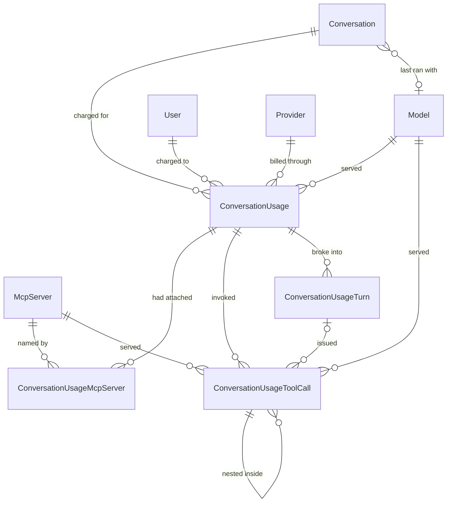

# Conversation Usage and Favourites

End-to-end reference for the conversation usage audit trail: the append-only record of every model call charged to a conversation, of every model turn inside that call, of every tool the call invoked, the model and MCP selection a conversation is resumed with, and the favourite flag. Covers the data model, what is recorded when, how cancelled and naming calls are accounted for, the two kinds of token count a row now carries, the price snapshot that turns tokens into money, the per-model-turn breakdown that makes a tool's *prompt* cost attributable, the resume shape returned by `GET api/conversations/{id}`, the favourite routes, how the schema reaches a real database, and the reports the trail makes possible. Audience: engineers maintaining conversations, and whoever has to answer "what did we spend, and on what?".

Companion to [Conversation Streaming Contract](streaming-contract.md), which covers the events the same turn writes to the client while it runs.

## 1. Overview

Before this feature the platform billed model calls it could not account for. A conversation carried running `InputTokens`/`OutputTokens` counters and nothing else: no per-call breakdown, no record of which model or provider served a turn, and two whole classes of call that moved no counter at all — a turn the user cancelled, and the completion that names a conversation from its first prompt. Both are billed by the provider. Neither was recorded anywhere.

Four things close that gap:

1. **An audit trail.** `Core.ConversationUsage` gets one row per model call, with the model, the provider, the deployment, the token split, and how the call ended. `Core.ConversationUsageMcpServer` names the MCP servers that were attached to it. Rows are never updated and never soft-deleted (§3).
2. **Per-tool attribution.** `Core.ConversationUsageToolCall` gets one row per tool the call invoked — a function, an MCP tool, or an agent — with nesting preserved, so a turn's cost breaks down into *which* tool spent it rather than landing in one undifferentiated total (§3.6).
3. **Model tracking.** `Core.Conversation` gains a nullable `ModelId` — the model its most recent turn ran with — so a client can reopen a conversation on the model it was last used with, and so that lookup does not have to read the audit trail (§5.1).
4. **A favourite flag.** `Core.Conversation.IsFavorite`, set through a dedicated route and filterable from the search endpoint (§5.2, §5.3).

Per-tool attribution arrived after the rest, and it moved two things the first release had promised not to touch. **A turn's token counters now include what its tools spent** (§4), and **the streaming endpoint now writes structured events instead of raw answer text** — a breaking change for API clients, documented in [Conversation Streaming Contract](streaming-contract.md). What it left unchanged: the Cosmos DB transcript format and the permission model — the permission model still is, and the transcript format has since changed completely (next paragraph).

A later release added the two quantities this document's first version could not answer: **what a turn's transcript weighs** (`ContextTokens`, estimated and recomputable) and **what a call cost in money** (a price snapshot per usage row, and an unmapped `EstimatedCost` derived from it). Both are described in §6.1, §6.5 and §7, and the naming rule that keeps them apart from the billed columns is in §3.8. That release also moved the transcript itself to one Cosmos document per message — see [Transcript Storage and Tokenization](transcript-storage.md) — and **destroys every existing transcript at cutover**; the SQL side of this document is untouched by that, but read [Transcript Cutover](transcript-cutover.md) before deploying it.

The most recent release added the piece that makes a tool's *prompt* cost attributable: a **per-model-turn breakdown**. A tool consumes no tokens of its own worth speaking of — an MCP tool is a round trip to another process — but its arguments and its result enter the *next* model turn's prompt and are billed there, folded into one aggregate the provider never itemizes. `Core.ConversationUsageTurn` now records each iteration of the function-invocation loop as the provider reported it, `Core.ConversationUsageToolCall.Iteration` names the turn that issued each call, and both `Core.ConversationUsage` and each turn row carry nullable `CachedInputTokens`/`ReasoningTokens`. The invariant that governs all of it, and the one thing to get right before writing a query: **turn rows partition the assistant columns — they never add to them** (§3.9, §6.4). The attribution itself is a documented query rather than a stored column, and it is in §7.

> **Before deploying:** the schema now reaches a database through EF migrations applied at startup, which is a change from how this document originally described it. Read §6.6 — it is short, and a database that predates the migration history needs one manual step before `Database.Migrate()` can run against it.

### 1.1 Data model at a glance



The edges from `ConversationUsage` to `Model`, `Provider` and `McpServer` are foreign keys for referential integrity, not the values reports read: the deployment name, the provider and the server name are **also copied onto the row** as they stood when the call ran (§3.2). `ConversationUsageToolCall` follows the same convention with its `Source` column, and its two catalog edges are both nullable — an MCP call is attributed only when it can be correlated, and nothing today can name the model behind a tool call at all (§3.7, §9).

**One edge on that diagram is not a foreign key.** `ConversationUsageTurn → ConversationUsageToolCall` is a join on `(ConversationUsageId, Iteration)`, nullable on the tool side and unenforced by the database: a tool row can predate iteration tracking, and must be readable rather than rejected for it (§3.9). And note an edge that is deliberately *absent* — a turn's `ReportedModelId` is the provider's own string, not a key into the catalog. It is the one place in the trail where a model names *itself*, which is a different claim from `ConversationUsage.ModelId`, the catalog row this application chose to call.

### 1.2 Where each piece lives

| Concern | Where |
|---|---|
| Writing a chat turn's usage row | `ConversationService.PersistTurnAsync` ([`ConversationService.cs`](../../enterprise-gpt-api/Enterprise.Gpt.Service/ConversationService.cs)) |
| Classifying how a turn ended | `ConversationService.StreamConversationCoreAsync`, the `try`/`finally` around the stream loop (§4) |
| Collecting the tool-tracking report | [`Chat/ChatUsageScope.cs`](../../enterprise-gpt-api/Enterprise.Gpt.Service/Chat/ChatUsageScope.cs) and [`Chat/ChatUsageObserver.cs`](../../enterprise-gpt-api/Enterprise.Gpt.Service/Chat/ChatUsageObserver.cs) (§4.4) |
| Turning the report into audit rows | [`Chat/UsageReportTranslator.cs`](../../enterprise-gpt-api/Enterprise.Gpt.Service/Chat/UsageReportTranslator.cs) (§3.6) |
| Per-model-turn rows, and the iteration on each tool call | `UsageReportTranslator.BuildTurns` / `SumReported` (§3.9) |
| The catalog name a tool call reports as its `Source` | [`McpToolProvider.cs`](../../enterprise-gpt-api/Enterprise.Gpt.Service/McpToolProvider.cs) — `WithTracking(server.Name, …)` (§3.7) |
| Inserting the middleware into every pipeline | `UseToolTracking(...)` in [`Program.cs`](../../enterprise-gpt-api/Enterprise.Gpt.Api/Program.cs) |
| Writing a naming call's usage row | `ConversationService.UpdateConversationNameAsync` (§4.2) |
| Restoring model + MCP selection | `ConversationService.GetConversationAsync` (§5.1) |
| Favourites | `ConversationService.SetConversationFavoriteAsync`, `SearchConversationsAsync` (§5.2, §5.3) |
| Filtering the listing by project | `ConversationService.SearchConversationsAsync` + the private `EnsureProjectExistsAsync` (§5.4) |
| Entities and mapping | [`ConversationUsage.cs`](../../enterprise-gpt-api/Enterprise.Gpt.Entity/ConversationUsage.cs), [`ConversationUsageMcpServer.cs`](../../enterprise-gpt-api/Enterprise.Gpt.Entity/ConversationUsageMcpServer.cs), [`ConversationUsageToolCall.cs`](../../enterprise-gpt-api/Enterprise.Gpt.Entity/ConversationUsageToolCall.cs), [`ConversationUsageTurn.cs`](../../enterprise-gpt-api/Enterprise.Gpt.Entity/ConversationUsageTurn.cs), [`Conversation.cs`](../../enterprise-gpt-api/Enterprise.Gpt.Entity/Conversation.cs) |
| Schema | EF migrations in [`Repository/Migrations/`](../../enterprise-gpt-api/Enterprise.Gpt.Repository/Migrations/), applied by `Database.Migrate()` at startup (§6.6) |
| Prices, cost and context tokens | [`ConversationUsage.cs`](../../enterprise-gpt-api/Enterprise.Gpt.Entity/ConversationUsage.cs) (`ContextTokens`, the two price columns, `EstimatedCost`), [`Model.cs`](../../enterprise-gpt-api/Enterprise.Gpt.Entity/Model.cs) (§6.1, §7) |

## 2. Quick start

Star a conversation, then list only the starred ones:

```http
PUT /api/conversations/9c1f1c8e-6a1e-4c1a-9f7a-2b3c4d5e6f70/favorite
Authorization: Bearer <token>
Content-Type: application/json

{ "isFavorite": true }
```

```http
204 No Content
```

```http
GET /api/conversations/search?isFavorite=true&take=20
→ 200 PaginatedResponseDto<ConversationDto>   (each item carries modelId and isFavorite)
```

Or list one project's conversations, which is the same route with one more filter (§5.4):

```http
GET /api/conversations/search?projectId=9c1f1c8e-6a1e-4c1a-9f7a-2b3c4d5e6f70&take=25
→ 200 PaginatedResponseDto<ConversationDto>
→ 404 if that project is unknown, deactivated, or someone else's
```

Reopen a conversation with the model and tools it was last run with:

```http
GET /api/conversations/9c1f1c8e-6a1e-4c1a-9f7a-2b3c4d5e6f70
→ 200 ConversationDetailDto   (adds mcpServerIds)
```

And, from the reporting side, what a conversation cost — the assistant's own turns and its tools, side by side:

```sql
SELECT Kind, Status, DeploymentName,
       InputTokens, OutputTokens,               -- the assistant's own turns
       ToolInputTokens, ToolOutputTokens,       -- everything its tools spent
       DateCreated
FROM   [Core].[ConversationUsage]
WHERE  ConversationId = '9C1F1C8E-6A1E-4C1A-9F7A-2B3C4D5E6F70'
ORDER BY DateCreated;
```

Then which tools those were, for one of those turns:

```sql
SELECT Depth, Sequence, Iteration, Kind, ToolName, Source,
       TotalTokens, SubtreeTotalTokens, DurationMs, Succeeded
FROM   [Core].[ConversationUsageToolCall]
WHERE  ConversationUsageId = @usageId
ORDER BY Depth, Sequence;
```

`Iteration` is the model turn that issued each call, and it is what makes the *prompt* those tools grew attributable — the query for that is in §7, and the invariant it rests on is in §3.9.

## 3. The audit trail

### 3.1 One row per model call

A row is written for each call the platform makes on a user's behalf, classified by [`ConversationUsageKinds`](../../enterprise-gpt-api/Enterprise.Gpt.Common/Enums/ConversationUsageKinds.cs):

| Kind | Value | Written by |
|---|---|---|
| `Chat` | 1 | Every chat turn, at finalization — completed or not (§4) |
| `Naming` | 2 | The completion that names a conversation from its opening prompt (§4.2) |

and by how it ended, [`ConversationUsageStatuses`](../../enterprise-gpt-api/Enterprise.Gpt.Common/Enums/ConversationUsageStatuses.cs):

| Status | Value | Meaning |
|---|---|---|
| `Completed` | 1 | The model produced its complete response |
| `Cancelled` | 2 | The caller cancelled or the client disconnected mid-stream |
| `Failed` | 3 | The call faulted before the response completed |

A conversation's **first** turn therefore writes two rows: one `Naming` and one `Chat`.

### 3.2 Snapshots, not joins

`ProviderId`, `DeploymentName` and `McpServerName` are copied onto the audit rows even though the foreign keys could reach them. That is the point: the catalog is editable. An administrator can rename a model, repoint it at a different provider, or rename an MCP server, and a report that joined out to the catalog would silently rewrite the history of every call those rows ever served. `ModelId` still points at the catalog row, so a report can group either way — by what the model is called *now* (join) or by what actually billed the call *then* (`DeploymentName`).

### 3.3 Append-only

`ConversationUsage` derives from `BaseEntity`, not `BaseModifiedEntity`: there is no `DateModified`, nothing updates a row after it is written, and `DateDeactivated` stays `null` forever. A usage record that can be edited or hidden is not an audit trail. `DateCreated` is the moment the call *finished*, and it is the timestamp every report groups by.

### 3.4 MCP rows record attachment; tool-call rows record invocation

The two MCP-related child tables answer different questions and are easy to confuse.

A `ConversationUsageMcpServer` row means the server was **selected by the client and successfully leased**, so its tools were on the request. It does not mean the model called any of them, and it is written whether or not it did. It is also what §5.1 reads to restore a conversation's tool selection.

A `ConversationUsageToolCall` row with `Kind = McpTool` means a tool **actually ran** (§3.6). A turn can easily have three attachment rows and one invocation row, or three attachment rows and none at all.

Reports built on the two therefore mean different things: attachment answers "what was on the table", invocation answers "what was used". §7 has a query for each.

### 3.5 `TotalTokens` is computed, and now spans tools

`ConversationUsage.TotalTokens` is an expression-bodied C# getter with no backing field, so EF does not map it and there is no column. Giving it a setter would add a column that could disagree with its own operands.

What it computes has widened. There are now four token columns on the row, and the getter spans all of them:

| Member | Column? | Meaning |
|---|---|---|
| `InputTokens`, `OutputTokens` | yes | The **assistant's own** model turns, tools excluded |
| `ToolInputTokens`, `ToolOutputTokens` | yes | Everything **every tool** consumed, nested tools included |
| `AssistantTokens` | no | `InputTokens + OutputTokens` — the assistant-only figure |
| `TotalTokens` | no | `AssistantTokens + ToolInputTokens + ToolOutputTokens` — the whole call |

The change of meaning matters for anything written against the first release: `TotalTokens` used to mean "the assistant's turns", because that was all there was. **It now means the whole call**, and the old meaning moved to `AssistantTokens`. A SQL report that adds `InputTokens + OutputTokens` is still computing the assistant-only number and is now understating the call, silently. §7 spells out which is which per query.

`ToolInputTokens`/`ToolOutputTokens` are denormalized from the child rows so the split of a call is readable without touching the tool table at all. They are zero when no tool ran — and also when the tools that ran surfaced no usage, which is the common case for an MCP server that does not report what it spent.

The row carries **two more token columns that are not in this arithmetic and never will be.** `CachedInputTokens` sits inside `InputTokens` and `ReasoningTokens` inside `OutputTokens` — they describe what *kind* of token was billed, not how many more (§3.9). Adding either to `TotalTokens` counts the same tokens twice.

### 3.6 The tool-call tree

`Core.ConversationUsageToolCall` holds one row per invocation, classified by [`ConversationToolKinds`](../../enterprise-gpt-api/Enterprise.Gpt.Common/Enums/ConversationToolKinds.cs):

| Kind | Value | Meaning |
|---|---|---|
| `Unknown` | 0 | The category could not be determined — a tool declaration the pipeline could not invoke, seen only through the model's function call |
| `Function` | 1 | A plain in-process function tool |
| `McpTool` | 2 | A tool served by an MCP server. What the server spends internally is opaque, so it reports usage only if it chooses to surface it |
| `Agent` | 3 | An agent exposed to the model as a function. Its run may use a different model and may call tools of its own, which become child rows |

These are the values the middleware's own `ToolKind` uses, mirrored into an enum this repository owns rather than persisting the library's. **The numbers are an on-disk contract**: a package upgrade that renumbered its enum must not silently renumber ten million audit rows, and the entity layer has no other reason to depend on the tracking middleware.

**Nesting.** A tool that calls tools — an agent, or an MCP tool running its own tracked pipeline — produces child rows linked by `ParentId`, arbitrarily deep. `Depth` is denormalized from the parent chain (`0` for a tool the assistant called directly) and `Sequence` orders siblings in the order the middleware reported them, because nothing else does reliably: identifiers are assigned on save, and `DateCreated` is the whole turn's timestamp rather than the invocation's. Every row also carries `ConversationUsageId`, nested ones included, so a turn's whole tree loads in one query instead of a walk down the chain.

**The token-column split, which is the one thing to get right.** The middleware reports each invocation's usage as a **rollup** — its own consumption plus every descendant's. Persisting that number alone would double-count a nested agent under any `SUM`, so each row stores both:

| Column | Holds |
|---|---|
| `InputTokens`, `OutputTokens`, `TotalTokens` | What **this invocation alone** consumed, with its children subtracted out |
| `SubtreeTotalTokens` | The reported rollup: this invocation **and everything nested inside it** |

with the invariant

```text
SubtreeTotalTokens = TotalTokens + sum(children.SubtreeTotalTokens)
```

The practical rule follows from that invariant, and every query in §7 obeys it:

- **Summing the own-token columns** (`InputTokens`, `OutputTokens`, `TotalTokens`) over any filter — a kind, a server, a month, the whole table — counts each token **exactly once**. This is what a report wants.
- **Summing `SubtreeTotalTokens`** over anything other than top-level rows (`ParentId IS NULL`) **double-counts** every nested call. It exists so the end-to-end cost of one call is a single-column read, not so it can be aggregated freely.

Three smaller properties of the columns:

- **Null is not zero.** A tool that surfaced no usage leaves all four token columns `null`, which says "nothing was attributed" rather than "it was free". `SUM` ignores nulls, so reports need `ISNULL(...)` only where they also want a count.
- **`TotalTokens` is stored, not recomputed.** Providers do not always agree that the total is the sum of its operands — cached and reasoning tokens are billed without appearing in either — so the reported total is kept as reported. Corollary: `ToolInputTokens + ToolOutputTokens` on the parent and `SUM(SubtreeTotalTokens)` over the top-level rows can legitimately disagree. Pick one and do not join across them.
- **An own-token value is floored at zero.** The rollup is computed as own-plus-children upstream, so a negative could only come from a defect there; letting one reach a column other queries `SUM` would corrupt totals far from where it originated.

**A failed invocation is recorded, not dropped.** `Succeeded` is `false` and whatever it consumed before throwing is still on the row — the same reasoning that makes cancelled turns worth recording at all (§4.1). `DurationMs` is on every row regardless of outcome.

### 3.7 Attributing an MCP call to a catalog server

`McpServerId` is resolved by the tool **name**, not by the reported source. `McpToolProvider` stamps a sanitized `{prefix}_` onto every tool it leases, so the name the model called carries its server with it, and the longest matching prefix wins — two servers whose names sanitize to prefixes where one extends the other would otherwise send the more specific server's tools to the shorter one.

When no prefix matches, the reported `Source` name is compared against the leased servers' catalog names. **That fallback is now an exact match rather than a hopeful one.** `McpToolProvider` used to hand the tracking wrapper the connected client and let it read the server's *self-advertised* `ServerInfo` name, which need not equal the catalog name an administrator registered; it now passes `server.Name` explicitly, so a tool this application leased reports the catalog string and matches by construction. A tool that reached the model by some other path still reports whatever name its own wrapper carries, which is why the comparison stays case-insensitive.

When that misses too, `McpServerId` stays **null rather than guessed**, so a report can tell "not an MCP tool" from "an MCP tool we could not place". `Source` is written either way, snapshotted as it stood at the time, for the same reason `DeploymentName` is (§3.2).

The same change is what lets a client undo the prefix on screen: `Source` is now the exact string the tool-name prefix was built from, so the UI can strip `{sanitizedServer}_` off the tool name and label a card with the tool that ran rather than the server that hosts it ([streaming contract §4.2](streaming-contract.md#42-fields)). Reverting to the client overload would break both that label and this fallback, silently and in the same way.

### 3.8 `Context*` is estimated; every other token column is billed

Since the transcript moved to one document per message, a usage row carries **two kinds of token count**, and they are not addable. One rule governs every token field in this schema:

> **`Context*` means estimated, recomputable and replayed. Every other token field is provider-billed.**

| | `ContextTokens` | `InputTokens`, `OutputTokens`, `ToolInputTokens`, `ToolOutputTokens` |
|---|---|---|
| Source | This application's local tokenizer, run over the message text it stored | The provider, via the tracking middleware |
| Measures | What the turn's two transcribed messages will contribute to *future* prompts | What the provider charged for *this* turn |
| Includes tool calls, tool results, reasoning | **No** — none of it is transcribed, so none of it is replayed | **Yes** |
| Nullable | Yes — null means "not transcribed" | No |

**The two are supposed to disagree, and by more the more tools a turn runs.** Every tool round trip re-sends the conversation plus the tool's result and none of it is written to the transcript, so the billed columns climb above `ContextTokens` with each one. They measure the same thing only on a turn with zero tool calls, which is exactly the condition the estimator's accuracy telemetry isolates ([storage §10](transcript-storage.md#10-estimator-accuracy-telemetry)). A report that treats a divergence as a defect is reading the wrong invariant; a report that sums across the two is simply wrong.

`ContextTokens` is nullable on `Core.ConversationUsage` and not nullable on `Core.Conversation`, for the reason §3.6 already gives for the tool columns: a cancelled or failed turn is billed and never transcribed, so null says "not transcribed" where `0` would claim it was transcribed and weighed nothing. A conversation that has never completed a turn genuinely weighs nothing, so `0` is honest there. The same rule makes the price columns nullable — unpriced is not free.

`ContextTokens` is an estimate on both tables and inherits every limitation of the tokenizer behind it. It is comparable across conversations because it is computed the same way for all of them; it is **not** a figure to bill against, which is why `EstimatedCost` (§6.1) deliberately does not use it.

### 3.9 Turn rows partition the assistant columns; they never add to them

A chat turn is not one model call. Function invocation runs a loop: the model answers, asks for tools, the tools run, and the model is called again with their results appended to the prompt. `Core.ConversationUsage` records the whole loop as one row. `Core.ConversationUsageTurn` records **one row per iteration of it**, exactly as the provider reported that iteration, and `ConversationUsageToolCall.Iteration` names the turn that issued each call.

> **The invariant, and the only one that matters here:** `SUM(ConversationUsageTurn.InputTokens) = ConversationUsage.InputTokens`, and the same for output. Turn rows are a **breakdown** of the assistant columns, not an addition to them. A report that adds them to the parent double-counts the entire call.

That is the opposite arrangement from `ConversationUsageToolCall`, and confusing the two is the mistake this section exists to prevent. Tool rows describe tokens the assistant columns *exclude* — that is why `ToolInputTokens`/`ToolOutputTokens` are separate columns (§3.5). Turn rows describe tokens the assistant columns already contain.

**Why the breakdown is worth storing.** A tool consumes no tokens of its own that the platform can see; an MCP tool is a round trip to another process, and what it costs *this* application is that its arguments and its result are appended to the next model turn's prompt and billed there. With one aggregate per call that cost is invisible. With one row per turn it is arithmetic:

```text
prompt growth caused by the tools turn N issued  =  input(N+1) − input(N) − output(N)
```

joining turn `N` to turn `N+1`. §7 has that as SQL, with the null cases it has to respect.

**It is not stored as a column, deliberately.** The figure is *derived* and it is *group-level*. When one iteration issues three tool calls the delta covers all three together and cannot be split between them — splitting would need the tool results, and the middleware's privacy posture keeps arguments and results off the wire and out of the database entirely ([streaming contract §6.1](streaming-contract.md#61-it-carries-no-prompt-content-arguments-or-results)). A per-row column would have to invent a share, and an invented number in an audit trail is worse than no number.

Four properties of the join, each of which a query has to respect:

- **Group by `Iteration` only over `Depth = 0`.** A nested call carries the iteration of the outer turn that issued its enclosing **root** call, not one of its own — a subtree is issued once, however deep it goes. Grouping over every row counts that subtree once per level it is deep.
- **A null `Iteration` is a row from before iteration tracking, and is excluded rather than assumed.** It was deliberately not backfilled to `0`, because `0` is a real iteration: backfilling would assert that every historical call was issued by the first model turn, and the delta query would then attribute real tokens to calls nobody can place.
- **No turns at all means "no breakdown available", never "the call had no turns".** Providers report a single aggregate for a non-streamed request, and the naming call (§4.2) is the only non-streamed call this application makes, so the middleware has nothing to break down. Rows written before this release have no turns either.
- **Wall-clock ordering cannot substitute for `Iteration`.** Function invocation is serial by configuration, so three calls from one turn look exactly like one call each across three turns if all you have is the order they finished in.

**`CachedInputTokens` and `ReasoningTokens` are subsets, on both tables.** Cached input tokens are already counted inside `InputTokens`; reasoning tokens are already counted inside `OutputTokens`. Neither is ever added to its parent — they say *what kind* of token was billed, not *how many more*. Both are nullable, and null means the provider reported no figure, which is not the same as reporting zero. On `ConversationUsage` they are summed from the turn rows rather than read off the aggregate, so the row reports the same number whichever the middleware happens to carry; on the naming path, which has no turns, they are read straight off the response.

**They arrive `null` on every row today**, whatever the provider reported, and the wiring is correct for the day that changes — §9 has the reason. One consequence belongs here, because it is a correction to the arithmetic above rather than a missing report: reasoning tokens are billed inside `output(N)` but are **not** replayed into the next prompt, so a faithful delta has to subtract them back out of `output(N)`. Until the values arrive, that correction cannot be applied, and the delta understates what a turn's tools cost by however much reasoning that turn did.

## 4. What happens on a chat turn

Finalization runs in a `finally` inside the streaming iterator, so it runs on **every** exit path — the loop completing, the request being cancelled, or the model call faulting:

```text
acquire conversation lock
  ├─ first turn? → name the conversation      → Naming usage row + counters (§4.2)
  ├─ stream events to the client               (streaming-contract.md)
  └─ finally
        ├─ dispose the response stream         → the middleware finalizes and reports (§4.4)
        └─ PersistTurnAsync
              ├─ transaction ┐ conversation counters += tokens, ContextTokens += estimate,
              │              │ ModelId = model, DateModified = now
              │              ├ insert ConversationUsage (+ one child row per attached MCP server)
              │              ├ insert the ConversationUsageToolCall tree, as one graph
              │              └ insert one ConversationUsageTurn per model iteration (§3.9)
              └─ completed only → one transactional batch on the conversation's Cosmos partition:
                                  create the user message, create the assistant message,
                                  patch the header's messageCount / contextTokens / dateModified
```

The counter update and both audit inserts share one transaction, so a conversation whose totals moved always carries the rows that account for the movement. Finalization runs with `CancellationToken.None` — the token that ended the stream is exactly the one that would abort the write recording it.

**The billed counters move by everything the turn consumed**, tools included: `Core.Conversation.InputTokens` gains `InputTokens + ToolInputTokens` and `OutputTokens` gains `OutputTokens + ToolOutputTokens`. So does the `usage` block on the assistant message document, which is deliberately *not* the same split as the identically named SQL columns: what belongs beside a message in a transcript is what the turn cost, and the breakdown belongs in the relational trail. Both figures are derived from the same numbers written to the audit row rather than read separately off the report, so a conversation's counters cannot disagree with the sum of its rows.

**The context roll-ups move separately, and by a different number** (§3.8). `ConversationUsage.ContextTokens` gets the turn's own two messages; `Conversation.ContextTokens` gets those plus any message the write had to reseed, so it stays equal to the transcript header's `contextTokens`. Neither costs a round trip: the conversation figure is one more `.SetProperty` on the `ExecuteUpdateAsync` that was already running, and the turn figure is one more initializer on the entity that was already being built. Both are inside the transaction that was already open. Prices are snapshotted onto the same row from the catalog model at the same moment, for the same reason `DeploymentName` is (§3.2) — including on naming calls, which are real billed completions.

The tool-call tree is saved as **one object graph**, not row by row: EF assigns the sequential keys and fixes each child's `ParentId` from the navigation, so nesting survives without generating random identifiers into the clustered key of the fastest-growing table in the schema (§6.1). The turn rows ride the same graph, on the usage row's `Turns` navigation, so they land in the same transaction and cannot exist without the call they break down.

**Turn rows follow the report, not the outcome.** Every row in the outcome table below carries whatever turns the provider had reported by the time the call ended, which for a cancelled turn is the completed iterations only — the same lower bound §4.4 describes for the totals, seen one iteration at a time. The naming call is the exception that is structural rather than partial: it does not stream, so it produces no breakdown at all (§3.9).

| Outcome | Usage row | Tool-call rows | Billed counters | `ContextTokens` | Transcript |
|---|---|---|---|---|---|
| Stream completes | `Chat` / `Completed`, `AssistantMessageId` set | whatever ran | moved | set | two message documents created, header counters patched |
| Client disconnects, or stop pressed | `Chat` / `Cancelled` | whatever ran before the stop | moved | **null** | **not** written |
| Model call faults | `Chat` / `Failed` | whatever ran before the fault | moved | **null** | **not** written |
| First-turn naming call | `Naming` / `Completed` | none — naming attaches no tools | moved | null — it transcribes nothing | header `name` patched only |

### 4.1 Abandoned turns are billed and recorded, but never transcribed

Tokens the model produced before the user hit stop are tokens the provider charged for. Previously they were lost entirely: the conversation's counters never moved and no record existed. Now the turn is recorded with `Cancelled` or `Failed` and the counters move — including for the tools it had already run (§4.4 explains how the numbers survive, and what they still cannot capture).

The partial answer is deliberately **not** appended to the Cosmos transcript. The transcript is replayed to the model on every later turn, so a truncated answer would be presented as something the assistant actually said, forever. The turn is accounted for in SQL and absent from the conversation history — those two facts are consistent, not contradictory.

Two consequences worth knowing:

- **`AssistantMessageId` is `null`** on cancelled and failed rows, and on naming rows. On a completed row it correlates to the assistant message in the Cosmos transcript — best-effort, because the audit row commits before the transcript append is attempted. A failed append logs both identifiers so the pair can be reconciled.
- **Recording an abandoned turn can itself fail silently.** If `PersistTurnAsync` throws while the turn is already failing, the exception is logged and swallowed: throwing out of a `finally` would replace the in-flight exception, and a cancelled turn would surface to the client as a database error instead of the `499` it is owed. Losing the usage row is the lesser harm. A turn that *completed* has no exception to mask, so its finalization failures still propagate.

### 4.2 Naming calls are real calls

`UpdateConversationNameAsync` runs inline on a conversation's first turn and asks the model for a short title. It is a real completion against a real deployment, billed like any other, and it used to be charged to nobody — which made every conversation's totals, and every report built on them, understate what was spent. It now writes its own `Naming` row and adds its tokens to the conversation counters, in the same transaction as the rename.

Naming rows never carry MCP child rows: the naming call attaches no tools.

### 4.3 Naming charges accumulate on a repeatedly failing first turn

Naming is triggered by the transcript holding only the seeded system prompt. An abandoned turn is not transcribed (§4.1), so a conversation whose first turn keeps failing stays at one message — and **every retry re-enters the naming path**, writing another `Naming` row and another charge. A conversation with a dozen naming rows is a conversation whose first turn failed a dozen times, not a bug in the accounting.

### 4.4 How the numbers survive a cancelled turn

The tracking middleware publishes its report two ways: **in-band**, as the final update of the streamed response, and **out-of-band**, to every registered `IChatProgressObserver`. Only the second is usable here. The in-band update is exactly what a cancelled turn never reaches — the user pressed stop, the enumeration ended, and the update that carried the totals was never produced — and those tokens were billed all the same.

So the service collects the report out of band. [`ChatUsageObserver`](../../enterprise-gpt-api/Enterprise.Gpt.Service/Chat/ChatUsageObserver.cs) is a singleton the container hands to `UseToolTracking()` when each chat client is built; it routes `OnRequestCompleted` into the [`ChatUsageScope`](../../enterprise-gpt-api/Enterprise.Gpt.Service/Chat/ChatUsageScope.cs) the calling flow opened. The observer fires **once per request in every outcome**, which is the whole point.

Two details of that plumbing are load-bearing and non-obvious:

- **The scope is entered around each move of the enumerator, not once at the top.** An `async IAsyncEnumerable` resumes on whatever execution context its consumer supplies, so anything written to an `AsyncLocal<T>` inside one is gone after the first `yield return`. Re-entering the scope around each `MoveNextAsync` — and around the disposal below — is what keeps the ambient in effect for exactly the windows the middleware occupies.
- **Disposing the enumerator happens before the report is read**, inside its own `try`/`catch`. Disposal is where the middleware finalizes a request that was abandoned rather than drained, and where it hands the observer the partial account of what that turn had already spent. It is guarded separately because it runs ahead of the audit write: a provider aborting its stream during teardown would otherwise replace the exception already in flight and skip the accounting entirely.

A turn that produced no report at all is still recorded, at zero tokens, with a warning logged. A gap in the audit trail is worse than a zero-token row explaining the gap.

**The honest limit.** Providers report usage at the **end of a model turn**, not continuously. A turn cut off mid-flight — stopped while the model was still generating its first response — was billed for the tokens produced up to that instant, and nothing in the response says how many. Those tokens are unknowable, not merely unrecorded. What §4.1 guarantees is that everything the provider *did* report before the stop is recorded; tool calls that had already finished are on the row in full, and a model turn that had not finished contributes nothing. A cancelled turn's numbers are therefore a lower bound, and the further into a turn the stop lands, the tighter that bound gets.

## 5. API surface

All routes are in the authenticated `api/conversations` group and are scoped to the signed-in user. A conversation belonging to someone else is reported as `404`, never `403`, so the API cannot be used to probe for conversation ids. Errors are RFC 9457 Problem Details with `type` values from [`ProblemTypes`](../../enterprise-gpt-api/Enterprise.Gpt.Api/Problems/ProblemTypes.cs) — `/problems/resource-not-found` for the 404s here.

`POST /api/conversations/{id}/stream` is the route that produces everything §3 and §4 record, and its **response body changed shape in this release**. It has its own reference: [Conversation Streaming Contract](streaming-contract.md).

| Verb | Route | Success | Failure modes |
|---|---|---|---|
| GET | `/api/conversations/{id:guid}` | `200 ConversationDetailDto` | 404 unknown, deactivated, or another user's |
| PUT | `/api/conversations/{id:guid}/favorite` | `204` | 400 malformed body, 404 unknown, deactivated, or another user's |
| GET | `/api/conversations/search?name=&skip=&take=&isFavorite=&projectId=&sort=&dir=` | `200 PaginatedResponseDto<ConversationDto>` | 400 a query parameter that will not bind, 400 validation-error an unrecognised `sort` or `dir` (§5.6), 404 `projectId` is not an active project of the caller (§5.4) — paging itself is clamped, not rejected |

### 5.1 The resume shape — `ConversationDetailDto`

`GET /api/conversations/{id}` returns [`ConversationDetailDto`](../../enterprise-gpt-api/Enterprise.Gpt.Dto/ConversationDto.cs), which extends `ConversationDto` with the MCP selection:

```json
{
  "id": "9c1f1c8e-6a1e-4c1a-9f7a-2b3c4d5e6f70",
  "projectId": null,
  "modelId": "c36e22ed-1f4b-4f6d-9a2c-7e8f9a0b1c2d",
  "name": "Q3 pricing questions",
  "isFavorite": true,
  "dateCreated": "2026-08-01T09:14:23.117+00:00",
  "dateModified": "2026-08-01T10:02:11.884+00:00",
  "mcpServerIds": ["3f2a91b5-8c7d-4e6f-9a0b-1c2d3e4f5a6b"]
}
```

Together, `modelId` and `mcpServerIds` are enough for a client to restore the model picker and the tool selection exactly as the conversation was last run. Four rules govern them:

- **`modelId` comes from the conversation row**, denormalized on every turn, so the common case costs no extra query. It is set for abandoned turns too — it is still the model the user last chose.
- **`mcpServerIds` comes from the newest `Chat` usage row.** `Naming` rows are excluded; because naming is the newest row on a conversation's first turn, including them would blank the selection exactly when the user most expects it back.
- **The list is filtered to servers that are still active and still permitted for the caller**, matching what the streaming path will accept. Handing back a deactivated or revoked server would have the client replay it into the next turn and take a `404` or a `403` it cannot act on. The audit row keeps the historical selection either way — filtering happens on read, not on write.
- **The list is empty in two different situations** — no turn has run yet, and no servers were selected — and the response does not distinguish them. That ambiguity is why `mcpServerIds` is on the detail shape and not on `ConversationDto`: the listing would pay a subquery per row to return a field clients could not interpret.

The selection is fetched in a second round trip rather than as a correlated subquery: taking the newest turn's collection per conversation row translates to SQL `APPLY`, which not every provider this model runs on can express.

### 5.2 Favourites — `PUT /api/conversations/{id}/favorite`

```http
PUT /api/conversations/{id}/favorite
{ "isFavorite": false }
→ 204 No Content
```

It is a dedicated route rather than a field on `PUT /api/conversations`, which is a **full-representation** replace: a client renaming a conversation without echoing the flag back would silently un-favourite it. The same trap already exists there for `projectId`, and adding a second field to it was not worth the risk.

Two deliberate omissions:

- **No Cosmos write.** The flag only affects how conversations are listed; the transcript has no use for it. Keeping it out also keeps a star click off a document a live turn may be appending to.
- **`DateModified` is not bumped.** Starring a conversation does not modify it, and moving the SQL timestamp would put it out of step with the Cosmos document's own, which the transcript endpoint returns.

The request has no FluentValidation validator — `isFavorite` is a `bool`, so the only 400 it can produce is a binding failure, which carries no `errors` dictionary.

Projects grew the identical route in US-909 — `PUT /api/projects/{id}/favorite`, the same two omissions and the same reasoning for both — once a second entity needed to be starrable. See [Projects §3.5](../projects/project-management.md#35-favourites--put-apiprojectsidfavorite-and-isfavorite).

### 5.3 Filtering the search — `?isFavorite=`

`GET /api/conversations/search` takes an optional `isFavorite`: `true` returns only favourites, `false` only non-favourites, and **omitting it applies no filter at all** (it is a `bool?`, not a defaulted `bool`). The name filter, paging and newest-first ordering are unchanged. `GET /api/projects` grew the same parameter with US-909, on the same `bool?` terms — applied before its own `CountAsync` so `totalCount` describes the filtered set, exactly as here.

### 5.4 Filtering the search — `?projectId=` (US-907)

The same route takes an optional `projectId`, so a client can list one project's conversations without draining the whole list and filtering locally. It narrows the existing predicate rather than replacing it: the results are still the caller's own **active** conversations, newest first, in the same `PaginatedResponseDto` envelope, and `name` and `isFavorite` still apply alongside it.

```http
GET /api/conversations/search?projectId=9c1f1c8e-6a1e-4c1a-9f7a-2b3c4d5e6f70&name=pricing&take=25
→ 200 PaginatedResponseDto<ConversationDto>
```

**An unknown, deactivated or foreign project answers `404`, not an empty page.** `SearchConversationsAsync` calls the same private `EnsureProjectExistsAsync` the create and update paths use, and it runs **before** the page is read, so the route cannot be used to probe for other users' project ids — the posture §3.3 of [Projects](../projects/project-management.md) describes, applied here rather than exempted from. The deactivated case is the one that needs the check most: deleting a project releases its conversations (`ProjectId = NULL`), so without it the route would answer a cheerful empty page for a project that had rows an hour ago.

**Omitting the parameter leaves behaviour byte-for-byte unchanged**, and that is a property of the code rather than a claim about it: the filter and the ownership check both sit behind one `projectId.HasValue` guard, so an absent value executes nothing new.

The route declares `.ProducesValidationProblem()` alongside the 404, since US-706 — before that it declared `.ProducesProblem(400)`. `?projectId=banana` is still a **binding** failure carrying no `errors` dictionary, exactly as it always was: `skip`, `take`, `isFavorite` and `projectId` are typed query parameters that can fail to bind (a `string? name` always binds), and there is still no validator on *this* route for any of them, matching the favourite route (§5.2). What changed is that `?sort=` and `?dir=` (§5.6) **are** validated, by the service rather than by binding, and reported with an `errors` dictionary — and OpenAPI allows only one declared schema per status, so the richer of the two shapes is the one now declared. A client reading `errors` defensively — checking whether it is present before reading from it — handles both cases without knowing which one occurred.

No index was added for it, and that is deliberate. `(ProjectId, DateDeactivated)` already exists on `Core.Conversation` for the delete cascade, but the filtered listing is **owner-scoped too**, so the engine seeks `(UserId, DateDeactivated, DateCreated DESC)` and gets the ordering off it for free, leaving `ProjectId` a residual predicate over one user's conversations — a bounded set. Folding `DateCreated` into the project index would buy a second ordered path for a query that already has one, and cost every conversation write for it.

### 5.5 `ConversationDto` gains two fields

`modelId` (nullable) and `isFavorite` are now on `ConversationDto`, so they appear on the search listing, on `POST`, and on `PUT` as well as on the detail read. Both the materialized mapper and the `MapToChatDtoExpression` projection carry them; a new conversation returns `"modelId": null` until its first turn runs.

### 5.6 Ordering — `?sort=` and `?dir=` (US-706)

`GET /api/conversations/search` accepts `?sort=` (`created` | `name`) and `?dir=` (`asc` | `desc`, case-insensitive), resolved by [`ConversationSortKeys`](../../enterprise-gpt-api/Enterprise.Gpt.Service/Sorting/ConversationSortKeys.cs) against the shared parser in `Enterprise.Gpt.Service.Sorting` — the same folder and pattern projects and users search use (§3.6 of [Projects](../projects/project-management.md#36-ordering--sort-and-dir-us-706), §2 of [User Management](../users/user-management.md#2-api-surface)).

**`dateModified` is deliberately absent from the accepted set.** It moves on a rename, a favourite, a model change and a move between projects as readily as on a turn, so a "recently active" sort built on it would promise something the column cannot answer — the transcript, which is where activity actually lands, lives in Cosmos and is not queryable from here (§1.2's data-model summary).

An unrecognised `sort` or `dir` is refused as a `400 /problems/validation-error`, keyed by the lowercase query-parameter name it came from rather than a C# property name:

```json
{
  "type": "/problems/validation-error",
  "errors": { "sort": ["'updated' is not a supported sort field. Supported fields are 'created', 'name'."] }
}
```

`dir` alone is a real request: it applies to the listing's default field (`created`), which defaults to descending — `name` defaults to ascending, since a name reads A–Z and a date reads most usefully newest first.

**Omitting both parameters is byte-for-byte the pre-existing `DateCreated DESC` order**, with no `Id` tiebreak — this listing never had one, unlike the project listing's `Id DESC` (§3.2 of [Projects](../projects/project-management.md#32-paging-is-clamped-not-validated)), and adding one to the default path would be a behaviour change existing clients are promised against. Supplying either parameter switches to the requested field and *adds* an `Id` tiebreak that **follows the requested direction** — a review round caught this as a real defect when the tiebreak was first fixed rather than direction-following: with a fixed tiebreak, ascending and descending both collapse onto the tiebreak's own order on a screen where many rows share one name, which every untitled conversation does.

No migration and no new index: the filtered listing already seeks `(UserId, DateDeactivated, DateCreated DESC)` for its default order, and a requested `name` or reversed `created` order is a residual sort over that same seeked set rather than a second index-backed path.

## 6. Database schema

Four tables and twelve columns, in the `Core` and `Core.Ref` schemas, following the conventions the rest of the database already uses: every foreign key is `NoAction`, soft delete is a nullable `DateDeactivated` with no query filter, and `Version` is a `rowversion`. Note that `Core.Ref` is a single schema whose name contains a dot — SQL references need `[Core.Ref].[Model]`.

They did not all land at once, and the "new in this release" labels below refer to whichever release introduced each piece: `Core.ConversationUsage` and `Core.ConversationUsageMcpServer` came first, `Core.ConversationUsageToolCall` and the two tool-token columns came with per-tool attribution, `ContextTokens` plus the four price columns came with the transcript and tokenization release, and `Core.ConversationUsageTurn`, `ConversationUsageToolCall.Iteration` and the two detail-token columns came with per-model-turn accounting. §6.6 is how any of it reaches a database.

### 6.1 `Core.ConversationUsage`

[`ConversationUsage`](../../enterprise-gpt-api/Enterprise.Gpt.Entity/ConversationUsage.cs), [`ConversationUsageConfiguration`](../../enterprise-gpt-api/Enterprise.Gpt.Repository/Configurations/ConversationUsageConfiguration.cs)

| Column | Type | Null | Notes |
|---|---|---|---|
| `Id` | `uniqueidentifier` | no | PK (clustered). No database default — EF assigns a **sequential** GUID client-side, because this is the fastest-growing table in the schema and random keys fragment its clustered index |
| `ConversationId` | `uniqueidentifier` | no | FK → `Core.Conversation(Id)` |
| `UserId` | `uniqueidentifier` | no | FK → `Core.User(Id)`; denormalized from the conversation so per-user reporting needs no join |
| `ModelId` | `uniqueidentifier` | no | FK → `[Core.Ref].Model(Id)` |
| `ProviderId` | `uniqueidentifier` | no | FK → `[Core.Ref].Provider(Id)`; snapshotted (§3.2) |
| `DeploymentName` | `nvarchar(512)` | no | snapshotted; 512 to match the catalog column |
| `Kind` | `int` | no | `ConversationUsageKinds` |
| `Status` | `int` | no | `ConversationUsageStatuses` |
| `InputTokens` | `bigint` | no | the **assistant's own** model turns (§3.5) |
| `OutputTokens` | `bigint` | no | the assistant's own model turns |
| `ToolInputTokens` | `bigint` | no | Everything the call's tools consumed, nested tools included; `DEFAULT 0` for existing rows |
| `ToolOutputTokens` | `bigint` | no | On the same terms; `DEFAULT 0` for existing rows |
| `CachedInputTokens` | `bigint` | **yes** | **New.** Input tokens the assistant's turns served from the provider's prompt cache — **already counted inside `InputTokens`**, never added to it (§3.9). Summed from the turn rows; read off the response on the naming path, which has none. Null means the provider reported no figure, which is not a cache miss — and it is null on **every** row today (§9) |
| `ReasoningTokens` | `bigint` | **yes** | **New**, on the same terms, already counted inside `OutputTokens` |
| `ContextTokens` | `bigint` | **yes** | **New.** What the turn's two transcribed messages weigh, **estimated** — the only estimated figure on the row (§3.8). Null on a turn that was billed and never transcribed, and on every row written before this release |
| `InputPricePerMillionTokens` | `decimal(18, 6)` | **yes** | **New.** What the deployment charged per 1,000,000 input tokens when the call ran, snapshotted from the catalog. Null means unpriced, not free |
| `OutputPricePerMillionTokens` | `decimal(18, 6)` | **yes** | **New**, on the same terms |
| `AssistantMessageId` | `uniqueidentifier` | yes | correlates to the transcript's assistant message document; no FK, Cosmos is a different store |
| `DateCreated` | `datetimeoffset` | no | when the call finished |
| `DateDeactivated` | `datetimeoffset` | yes | inherited from `BaseEntity`; always `null` here (§3.3) |
| `Version` | `rowversion` | no | inherited; nothing updates these rows, so it never changes |

Indexes:

| Index | Serves |
|---|---|
| `(ConversationId, Kind, DateCreated)` | the per-conversation history, and the newest-`Chat`-turn lookup in §5.1 — `Kind` is in the key because that lookup filters on it, otherwise the engine scans back through however many naming rows sit at the tail |
| `(UserId, DateCreated)` | usage for one user over a period |
| `(ModelId, DateCreated)` | usage for one model over a period |
| `(DateCreated)` **covering**, includes every column §7's reporting API reads | **New** (US-1301, migration `20260821224810_AddConversationUsageReportingIndex`). The scan behind `GET api/reports/usage` — the three indexes above all lead with a dimension and answer *this user's* or *this model's* history, the opposite question to a report's *one window, every dimension at once*, and a grouping by day has nothing date-leading at all. Built **offline**; see the migration's remarks for what that costs at startup on a table this size |

EF also adds a foreign-key index for `ProviderId` by convention; the other three foreign keys already lead an index above. No index was added for the new columns on the release that added them: nothing filters on a price, on `ContextTokens`, or on either detail-token column. That held until §7's reporting API needed a different shape of index entirely — the fourth, above — because scanning one window across every dimension at once is not a query any date-leading-but-dimension-first index can seek.

**`EstimatedCost` is a member, not a column.** Like `AssistantTokens` and `TotalTokens` (§3.5), it is an unmapped expression-bodied getter, so no column can drift from its own operands:

```csharp
((InputTokens + ToolInputTokens) * inputPrice + (OutputTokens + ToolOutputTokens) * outputPrice) / 1_000_000m
```

Three properties of it are deliberate. It returns **null when either price is missing**, rather than a partial figure — adding only the priced half produces a number that looks like a cost, understates it, and cannot be told apart afterwards. **Tool tokens are priced at the driving model's rate**, because nothing in a tool call names the model behind it (§9), so cost is an approximation by construction. And **`ContextTokens` is absent from the arithmetic and must stay absent**: cost is what the provider reported it billed, never what the transcript weighs.

One property is a known overstatement rather than a decision. **`EstimatedCost` prices every input token at the same rate, so a cached call costs less than it says.** `CachedInputTokens` exists to make that visible, but closing the gap needs a *cached-input price* on the catalog model, and there is no such column — the catalog carries one input price and one output price (§6.5). Until it does, the figure is an upper bound on a provider that discounts cache hits, and the size of the error is unknowable from the row. It is doubly inert today, since the cached count itself arrives null (§9).

Being unmapped, it cannot appear in a server-side projection — `Select(x => x.EstimatedCost)` over an `IQueryable<T>` throws, because there is no column to translate. Materialize first, or repeat the arithmetic in SQL as §7 does.

### 6.2 `Core.ConversationUsageMcpServer`

[`ConversationUsageMcpServer`](../../enterprise-gpt-api/Enterprise.Gpt.Entity/ConversationUsageMcpServer.cs), [`ConversationUsageMcpServerConfiguration`](../../enterprise-gpt-api/Enterprise.Gpt.Repository/Configurations/ConversationUsageMcpServerConfiguration.cs)

`Id`, `ConversationUsageId` (FK → `Core.ConversationUsage`), `McpServerId` (FK → `[Core.Ref].McpServer`), `McpServerName nvarchar(256)` (snapshotted), plus the inherited `DateCreated`, `DateDeactivated` and `Version`.

Indexes: `(ConversationUsageId, McpServerId)` **unique** — a server is attached to a call at most once — and `(McpServerId)` for per-server reporting. The unique index is unfiltered, unlike the other unique indexes in this model: these rows are append-only, so no soft-deleted row can ever block a replacement.

### 6.3 `Core.ConversationUsageToolCall`

**New in this release.** [`ConversationUsageToolCall`](../../enterprise-gpt-api/Enterprise.Gpt.Entity/ConversationUsageToolCall.cs), [`ConversationUsageToolCallConfiguration`](../../enterprise-gpt-api/Enterprise.Gpt.Repository/Configurations/ConversationUsageToolCallConfiguration.cs)

One row per tool invocation, nesting carried by a self-reference (§3.6).

| Column | Type | Null | Notes |
|---|---|---|---|
| `Id` | `uniqueidentifier` | no | PK (clustered), sequential and client-assigned for the same reason as §6.1 — this table grows faster than its parent |
| `ConversationUsageId` | `uniqueidentifier` | no | FK → `Core.ConversationUsage(Id)`. Carried by **every** row, nested ones included, so a turn's tree loads in one query |
| `ParentId` | `uniqueidentifier` | yes | FK → `Core.ConversationUsageToolCall(Id)` — the **self-reference**. `null` when the model called the tool directly |
| `Sequence` | `int` | no | position among siblings, in the order the middleware reported them |
| `Depth` | `int` | no | nesting depth, `0` for a directly-called tool. Denormalized so a tree render or a top-level filter needs no recursive query |
| `Iteration` | `int` | **yes** | **New.** The model turn that issued the invocation, joining to `Core.ConversationUsageTurn.Iteration` (§6.4). A nested row carries the **enclosing root's** iteration, so any grouping must filter `Depth = 0` (§3.9). Null on a row written before this release — deliberately not backfilled to `0`, which is a real iteration |
| `Kind` | `int` | no | `ConversationToolKinds` — an on-disk contract (§3.6) |
| `ToolName` | `nvarchar(256)` | no | the name as the model called it, `{prefix}_{tool}` for a leased MCP tool |
| `Source` | `nvarchar(256)` | yes | the MCP server's or agent's name, snapshotted. `null` for a plain function, which has no origin beyond itself |
| `CallId` | `nvarchar(128)` | yes | the identifier the model assigned to the function call; `null` when the invocation did not come from a model's tool loop |
| `McpServerId` | `uniqueidentifier` | yes | FK → `[Core.Ref].McpServer(Id)`; resolved by tool-name prefix, `null` rather than guessed (§3.7) |
| `ModelId` | `uniqueidentifier` | yes | FK → `[Core.Ref].Model(Id)`. **Always `null` today** — nothing in a tool call names the model behind it (§9) |
| `DeploymentName` | `nvarchar(512)` | yes | the deployment that billed the invocation, snapshotted. Always `null` today, for the same reason |
| `InputTokens` | `bigint` | yes | this invocation **alone**, children subtracted out. `null` means nothing was attributed, which is not zero |
| `OutputTokens` | `bigint` | yes | this invocation alone |
| `TotalTokens` | `bigint` | yes | this invocation alone, **as reported** rather than recomputed from its operands |
| `SubtreeTotalTokens` | `bigint` | yes | the reported rollup: this invocation and everything nested inside it |
| `DurationMs` | `bigint` | no | how long the invocation took |
| `Succeeded` | `bit` | no | `0` for an invocation that threw; it is recorded, not dropped |
| `DateCreated` | `datetimeoffset` | no | the parent call's timestamp, shared by every row in the tree |
| `DateDeactivated` | `datetimeoffset` | yes | inherited from `BaseEntity`; always `null` here (§3.3) |
| `Version` | `rowversion` | no | inherited; nothing updates these rows, so it never changes |

Four foreign keys, all `NoAction` like every other key in this model: `ConversationUsageId`, the self-referencing `ParentId`, `McpServerId` and `ModelId`.

Indexes:

| Index | Serves |
|---|---|
| `(ConversationUsageId, Sequence)` | reading one call's tools back in report order — the per-turn breakdown in §7 |
| `(ParentId)` | walking down from a parent, and the lookup the self-referencing FK constraint itself needs |
| `(Kind, DateCreated)` | "what did MCP tools cost this month", and the same question per kind |
| `(McpServerId, DateCreated)` | usage reported for one MCP server over a period |

EF adds a foreign-key index for `ModelId` by convention. Nothing else does: an explicit `(ModelId, DateCreated)` would cost writes on the largest table in the schema to serve a column that is null on every row this application can currently write. It goes in with the first agent that reports a model.

**`Iteration` gets no index either**, and the attribution query in §7 pays for that. Grouping one call's calls by iteration runs over rows the `(ConversationUsageId, Sequence)` seek already returned, so the per-call and per-conversation shapes are cheap. The cross-tenant windowed shape is not: no index on this table leads with `DateCreated`, so a date-bounded attribution report scans. Window it tightly, or scope it through `Core.ConversationUsage`, which does have date-leading indexes (§6.1). An `(Iteration)` index would not have helped either shape — grouping is not seeking.

**The self-reference has a cost worth knowing before you write a cleanup script.** With `NoAction` on `ParentId` and no cascade anywhere in this model, a set-based `DELETE` over the table has no ordering guarantee and will trip the constraint. Break the links first, then delete — which is exactly what the integration fixture's reset does:

```sql
UPDATE [Core].[ConversationUsageToolCall] SET ParentId = NULL WHERE ParentId IS NOT NULL;
DELETE  FROM [Core].[ConversationUsageToolCall];
```

### 6.4 `Core.ConversationUsageTurn`

**New in this release.** [`ConversationUsageTurn`](../../enterprise-gpt-api/Enterprise.Gpt.Entity/ConversationUsageTurn.cs), [`ConversationUsageTurnConfiguration`](../../enterprise-gpt-api/Enterprise.Gpt.Repository/Configurations/ConversationUsageTurnConfiguration.cs)

One row per model iteration of the function-invocation loop, as the provider reported it. Read §3.9 before querying it: these rows **partition** the parent's assistant columns rather than adding to them.

| Column | Type | Null | Notes |
|---|---|---|---|
| `Id` | `uniqueidentifier` | no | PK (clustered), sequential and client-assigned like its siblings (§6.1) |
| `ConversationUsageId` | `uniqueidentifier` | no | FK → `Core.ConversationUsage(Id)` |
| `Iteration` | `int` | no | The zero-based model iteration this row reports. Joins to `Core.ConversationUsageToolCall.Iteration` (§6.3) |
| `ResponseId` | `nvarchar(128)` | yes | The provider's response identifier for this turn, when it reported one. **Carried for support correlation only — nothing joins on it** |
| `ReportedModelId` | `nvarchar(512)` | yes | The model identifier the **provider** reported. Named for what it is rather than `ModelId`, which everywhere else in this schema is a catalog `Guid`: this is the one place a model names *itself*, which is a different claim from the catalog row this application chose |
| `InputTokens` | `bigint` | yes | What the provider reported for this turn. **Null is not zero** — it says nothing was reported |
| `OutputTokens` | `bigint` | yes | On the same terms |
| `TotalTokens` | `bigint` | yes | The turn's total **as reported**, not recomputed — providers do not always agree that the total is the sum of its operands (§3.6) |
| `CachedInputTokens` | `bigint` | yes | Already counted inside `InputTokens`, never added to it. Null on every row today (§9) |
| `ReasoningTokens` | `bigint` | yes | Already counted inside `OutputTokens`, on the same terms — and the count a faithful delta has to subtract back out of `output(N)` (§3.9) |
| `DateCreated` | `datetimeoffset` | no | the parent call's timestamp, shared by every turn of the call |
| `DateDeactivated` | `datetimeoffset` | yes | inherited from `BaseEntity`; always `null` here (§3.3) |
| `Version` | `rowversion` | no | inherited; nothing updates these rows, so it never changes |

One index, and it does two jobs:

| Index | Serves |
|---|---|
| `(ConversationUsageId, Iteration)` **unique** | Reading a call's turns back in order, and every attribution query in §7 — those pair turn `N` with turn `N+1`, so the seek and the window's ordering come off the one index |

The uniqueness is a real constraint, not a hint: a call reports each iteration once. It is **unfiltered**, like the unique index on `Core.ConversationUsageMcpServer` and for the same reason — these rows are append-only, so no soft-deleted row can ever block a replacement.

There is no self-reference and no catalog foreign key here, so the table is far simpler to clean up than §6.3's. One ordering rule applies: a turn row references its `ConversationUsage`, and every foreign key in this model is `NoAction`, so **delete turns before their parent**. The integration fixture's reset does exactly that, between clearing the tool-call tree and deleting the usage rows.

**Rows are written only for a streamed request.** A non-streamed call — the naming path (§4.2) — gets none, because providers report one aggregate for it and the middleware has no breakdown to surface. An empty `Turns` collection therefore means "no breakdown available", never "the call had no turns", and the same is true of every row written before this table existed.

### 6.5 `Core.Conversation` gains three columns, and `[Core.Ref].[Model]` two

| Column | Type | Null | Notes |
|---|---|---|---|
| `ModelId` | `uniqueidentifier` | yes | FK → `[Core.Ref].Model(Id)`; `null` until the first turn runs |
| `IsFavorite` | `bit` | no | defaults to `0` for existing rows |
| `ContextTokens` | `bigint` | no | **New.** What the conversation's stored transcript weighs, estimated (§3.8). `DEFAULT 0`, and `0` is the truthful value for every pre-cutover row, since the cutover destroyed its transcript. Mirrors the transcript header's `contextTokens` |

`TotalTokens` on the entity is unchanged and still computes the **billed** figure only. The two quantities never merge into one member.

The relationship is configured in [`ConversationConfiguration`](../../enterprise-gpt-api/Enterprise.Gpt.Repository/Configurations/ConversationConfiguration.cs) rather than by annotation, for the same reason `ProjectId` is: an annotation-only mapping would make the navigation required. Two listing indexes come with it:

- `(UserId, DateDeactivated, DateCreated DESC)` — the sidebar listing. The trailing descending `DateCreated` is what lets the engine page straight off the index instead of sorting the user's whole history on each request.
- `(UserId, DateDeactivated, IsFavorite, DateCreated DESC)` — the favourites-only variant. A separate index rather than one combined: placed before `DateCreated`, `IsFavorite` would break the ordering for the unfiltered listing; placed after it, it could not narrow the seek.

EF adds a foreign-key index for `Core.Conversation.ModelId` by convention.

The catalog gains the prices the snapshots are copied from, editable by an administrator through `POST api/models` and `PUT api/models/{id}` and returned on `ModelDto`:

| Column | Type | Null | Notes |
|---|---|---|---|
| `InputPricePerMillionTokens` | `decimal(18, 6)` | yes | **New.** USD per 1,000,000 input tokens. Six decimal places rather than the two the sibling columns use, because a per-token rate rounded to cents is entirely rounding error |
| `OutputPricePerMillionTokens` | `decimal(18, 6)` | yes | **New**, on the same terms |

Per **million** rather than per thousand, because provider price sheets are quoted that way. A single currency is assumed and it is USD; a multi-currency deployment would need a currency column beside these. The validator accepts zero — a genuinely free deployment exists — and omitting the value is how "unpriced" is expressed. This is the *current* price and not what any past call was charged, which is what the per-row snapshot in §6.1 is for.

### 6.6 Applying the schema — read this before deploying

> **This section previously said `Enterprise.Gpt.Repository/Migrations/` was empty and the schema had to be applied by hand. That is no longer true.** The folder now holds **five** migrations, and `Database.Migrate()` runs at startup, so a database with an initialized migration history takes the schema on deployment with no manual step.

| Migration | Carries |
|---|---|
| `20260811024339_InitialCreate` | The whole schema — including everything in §6.1 to §6.5 that predates the rows below — plus the `HasData` seeds |
| `20260813233326_AddModelIsReasoningEnabled` | `[Core.Ref].[Model].IsReasoningEnabled` |
| `20260814031023_AddAzureAIFoundryProvider` | The Azure AI Foundry provider row |
| `20260815202757_AddContextTokensAndModelPricing` | `ContextTokens` on `Core.Conversation` and `Core.ConversationUsage`, and the price columns on `Core.ConversationUsage` and `[Core.Ref].[Model]` (§6.1, §6.5) |
| `20260818213232_AddPerTurnUsageAndTokenDetails` | `Core.ConversationUsageTurn` and its unique index (§6.4), `Iteration` on `Core.ConversationUsageToolCall` (§6.3), and `CachedInputTokens`/`ReasoningTokens` on `Core.ConversationUsage` (§6.1) |

The last one is **additive and reversible**: three nullable columns and one new table, no backfill, no data movement, and a `Down` that drops exactly what it added. Existing rows keep a null `Iteration` and no turns, which §3.9 makes an honest state rather than a gap to repair.

`Migrate()` is skipped in the `Testing` environment only. **Both test harnesses build the schema from the EF model** — `SqliteDbContextFixture` for unit tests, Testcontainers plus `EnsureCreatedAsync` for integration tests — so `dotnet test` passes regardless of what any real database looks like, and schema drift still cannot fail the build.

Two things can still go wrong on a real database, and both fail at startup rather than at the first request:

- **A database that predates the migration history has no `__EFMigrationsHistory`**, so `Migrate()` will try to run `InitialCreate` against objects that already exist and fail with "There is already an object named …". Baseline it first: generate a script for the migrations it is actually missing, apply that, then record every earlier migration as applied. The steps are in [Transcript Cutover §3](transcript-cutover.md#3-step-1--the-sql-migration).
- **The engine must be SQL Server 2025 or later.** The context pins `UseCompatibilityLevel(170)`; pre-2025 engines and LocalDB reject it outright, and the failure happens on the first connection, before any migration runs.

If you are applying DDL by hand anyway — an environment where the application does not own its schema — the EF model remains the source of truth, and `context.Database.GenerateCreateScript()` against a SQL Server-provider context emits it. Run it with `SET QUOTED_IDENTIFIER ON` and `SET ANSI_NULLS ON`: the surrounding schema has filtered indexes and `sqlcmd` connects with `QUOTED_IDENTIFIER OFF`. Order matters in one place only — `Core.ConversationUsageToolCall` references `Core.ConversationUsage`, so the parent goes first.

**What a missing object still looks like**, because it lands somewhere that looks like a bug elsewhere: `PersistTurnAsync` runs in a `finally`, and the `catch` around it is filtered `when (!completed)` so a cancelled turn's recording failure cannot replace the exception already in flight (§4.1). A turn that *completed* has no exception to mask, so an `Invalid object name` propagates out of a response that has already begun, past exception handlers that short-circuit on `Response.HasStarted`. The client sees a full answer and then a stream that dies with no error, the conversation's counters never move, and nothing is transcribed.

## 7. Reporting

Everything below is SQL for an analyst working against the database directly. Substitute a real window for `@from`/`@to` — the trail grows by one row per model call and one more per tool invocation, so unbounded scans get expensive quickly, and every index in §6.1 and §6.3 has `DateCreated` in it for exactly that reason. As of US-1301 there is also a reporting API answering the same shape of question over HTTP — see the end of this section — for the administration dashboard (US-1302, [Administration](../ui/administration.md)) and for anyone who would rather not hold a database connection open.

**Read this before copying a query.** Two things changed with per-tool attribution, and both are silent:

1. On `Core.ConversationUsage`, `InputTokens + OutputTokens` is now the **assistant-only** figure (§3.5). The whole call is `InputTokens + OutputTokens + ToolInputTokens + ToolOutputTokens`. The queries below name both, so the choice is explicit rather than accidental.
2. On `Core.ConversationUsageToolCall`, sum the **own-token** columns (`InputTokens`, `OutputTokens`, `TotalTokens`) over *all* rows, or `SubtreeTotalTokens` over *top-level* rows only (`ParentId IS NULL`). Either counts each token exactly once. Summing `SubtreeTotalTokens` across all rows double-counts every nested call (§3.6).
3. **Never add `ContextTokens` to a billed column.** It is an estimate of what the transcript weighs, not a charge, and the two are supposed to disagree (§3.8). Report it beside them, never inside them.
4. **Never add `Core.ConversationUsageTurn` to its parent either, and for the opposite reason.** Turn rows *partition* the assistant columns — `SUM(turn.InputTokens)` equals `ConversationUsage.InputTokens` — so adding them doubles the call (§3.9). The same applies within a row: `CachedInputTokens` is inside `InputTokens` and `ReasoningTokens` is inside `OutputTokens`.

**Cost, per conversation and per model — from one table, with no join.** This is the query the price snapshot exists for. It reads `Core.ConversationUsage` alone: the prices, the deployment name and the token counts are all on the row, so it reports what each call *was* charged rather than what it would cost at today's catalog prices. Three token columns are reported separately and never summed — billed model tokens, billed tool tokens, and the estimated `ContextTokens` beside them (§3.8).

```sql
-- Per conversation
SELECT   u.ConversationId,
         COUNT(*)                                              AS Calls,
         SUM(u.InputTokens + u.OutputTokens)                    AS BilledModelTokens,
         SUM(u.ToolInputTokens + u.ToolOutputTokens)            AS BilledToolTokens,
         SUM(ISNULL(u.ContextTokens, 0))                        AS ContextTokens,
         SUM(CASE WHEN u.InputPricePerMillionTokens IS NOT NULL
                   AND u.OutputPricePerMillionTokens IS NOT NULL
                  THEN ((u.InputTokens  + u.ToolInputTokens)  * u.InputPricePerMillionTokens
                      + (u.OutputTokens + u.ToolOutputTokens) * u.OutputPricePerMillionTokens)
                       / 1000000.0
             END)                                              AS CostUsd,
         SUM(CASE WHEN u.InputPricePerMillionTokens IS NULL
                    OR u.OutputPricePerMillionTokens IS NULL
                  THEN 1 ELSE 0 END)                           AS UnpricedCalls
FROM     [Core].[ConversationUsage] u
WHERE    u.DateCreated >= @from AND u.DateCreated < @to
GROUP BY u.ConversationId
ORDER BY CostUsd DESC;
```

Swap the grouping for the same figures per model. `DeploymentName` is the snapshot, so a model renamed or repointed in the catalog does not move historical calls:

```sql
-- Per model
SELECT   u.DeploymentName,
         COUNT(*)                                              AS Calls,
         SUM(u.InputTokens + u.OutputTokens)                    AS BilledModelTokens,
         SUM(u.ToolInputTokens + u.ToolOutputTokens)            AS BilledToolTokens,
         SUM(ISNULL(u.ContextTokens, 0))                        AS ContextTokens,
         SUM(CASE WHEN u.InputPricePerMillionTokens IS NOT NULL
                   AND u.OutputPricePerMillionTokens IS NOT NULL
                  THEN ((u.InputTokens  + u.ToolInputTokens)  * u.InputPricePerMillionTokens
                      + (u.OutputTokens + u.ToolOutputTokens) * u.OutputPricePerMillionTokens)
                       / 1000000.0
             END)                                              AS CostUsd,
         SUM(CASE WHEN u.InputPricePerMillionTokens IS NULL
                    OR u.OutputPricePerMillionTokens IS NULL
                  THEN 1 ELSE 0 END)                           AS UnpricedCalls
FROM     [Core].[ConversationUsage] u
WHERE    u.DateCreated >= @from AND u.DateCreated < @to
GROUP BY u.DeploymentName
ORDER BY CostUsd DESC;
```

Five things to read correctly:

- **`UnpricedCalls` is part of the answer, not diagnostics.** A row with either price null contributes no cost, so `CostUsd` covers only the priced calls. A non-zero `UnpricedCalls` means the figure is a floor, and the fix is a price on the catalog row (§6.5), which applies from then on and never retroactively.
- **`CostUsd` is null, not zero, when nothing in the group was priced.** `SUM` over an all-null `CASE` returns null, which is the honest answer.
- **Tool tokens are priced at the driving model's rate.** Nothing in a tool call names the model behind it (§9), so this is an approximation by construction.
- **`ContextTokens` is here to be looked at beside the billed columns, not added to them.** Expect it to be lower, and much lower on tool-heavy traffic. `ISNULL(…, 0)` folds in cancelled and failed turns, which are billed and never transcribed; drop the `ISNULL` if you would rather the sum go null when any turn in the group was not transcribed.
- **This query is also the estimator's durable accuracy signal.** Filter to rows whose `ConversationUsageId` has no `Core.ConversationUsageToolCall` children and compare `ContextTokens` against `InputTokens` — on a zero-tool turn the two measure the same thing, and the metric in [storage §10](transcript-storage.md#10-estimator-accuracy-telemetry) only covers a rolling window, where these rows cover history.

**Tokens by model, over a period.** Grouping on the catalog `Name` reports under the label the model has *now*; group on `u.DeploymentName` instead to report under what actually billed the call. Note that the tool columns are attributed to the model that *drove* the turn, not to whatever ran inside a tool — nothing knows that (§9).

```sql
SELECT   m.Name                                AS Model,
         COUNT(*)                              AS Calls,
         SUM(u.InputTokens + u.OutputTokens)   AS AssistantTokens,
         SUM(u.ToolInputTokens + u.ToolOutputTokens) AS ToolTokens,
         SUM(u.InputTokens + u.OutputTokens
             + u.ToolInputTokens + u.ToolOutputTokens) AS TotalTokens
FROM     [Core].[ConversationUsage] u
JOIN     [Core.Ref].[Model] m ON m.Id = u.ModelId
WHERE    u.DateCreated >= @from AND u.DateCreated < @to
GROUP BY m.Name
ORDER BY TotalTokens DESC;
```

**Tokens by provider.** `u.ProviderId` is the snapshot, so repointing a model at another provider does not move historical calls.

```sql
SELECT   p.Name AS Provider,
         COUNT(*) AS Calls,
         SUM(u.InputTokens + u.OutputTokens
             + u.ToolInputTokens + u.ToolOutputTokens) AS TotalTokens
FROM     [Core].[ConversationUsage] u
JOIN     [Core.Ref].[Provider] p ON p.Id = u.ProviderId
WHERE    u.DateCreated >= @from AND u.DateCreated < @to
GROUP BY p.Name
ORDER BY TotalTokens DESC;
```

**Tokens by user, by day.**

```sql
SELECT   CAST(u.DateCreated AS date) AS [Day],
         usr.Email,
         SUM(u.InputTokens + u.OutputTokens
             + u.ToolInputTokens + u.ToolOutputTokens) AS TotalTokens
FROM     [Core].[ConversationUsage] u
JOIN     [Core].[User] usr ON usr.Id = u.UserId
WHERE    u.DateCreated >= @from AND u.DateCreated < @to
GROUP BY CAST(u.DateCreated AS date), usr.Email
ORDER BY [Day], TotalTokens DESC;
```

**What abandoned turns cost.** This is the number that did not exist before: tokens billed for answers nobody read. `Kind` 1 is `Chat` and 2 is `Naming`; `Status` 1 is `Completed`, 2 `Cancelled`, 3 `Failed`. A cancelled turn's total is a **lower bound** (§4.4).

```sql
SELECT   CASE u.Status WHEN 1 THEN 'Completed' WHEN 2 THEN 'Cancelled' ELSE 'Failed' END AS Outcome,
         COUNT(*) AS Calls,
         SUM(u.InputTokens + u.OutputTokens
             + u.ToolInputTokens + u.ToolOutputTokens) AS TotalTokens
FROM     [Core].[ConversationUsage] u
WHERE    u.Kind = 1
  AND    u.DateCreated >= @from AND u.DateCreated < @to
GROUP BY u.Status;
```

**The reporting API does not filter `Kind` the way this query does.** `GET api/reports/usage`'s outcome breakdown, at the end of this section, counts chat and naming calls together — a deliberate departure from the query above, recorded where the endpoint is described.

**What naming costs.** One row per conversation created, so this is effectively a per-conversation overhead — and an outlier count here points at first turns that keep failing (§4.3). The tool columns are always zero here, because naming attaches no tools.

```sql
SELECT   COUNT(*) AS NamingCalls,
         SUM(u.InputTokens + u.OutputTokens) AS TotalTokens
FROM     [Core].[ConversationUsage] u
WHERE    u.Kind = 2 AND u.DateCreated >= @from AND u.DateCreated < @to;
```

**Tokens by tool kind.** Every row at every depth, so the own-token columns are the ones to sum. Served by `(Kind, DateCreated)`.

```sql
SELECT   CASE t.Kind WHEN 0 THEN 'Unknown' WHEN 1 THEN 'Function'
                     WHEN 2 THEN 'McpTool' ELSE 'Agent' END AS ToolKind,
         COUNT(*)                                          AS Invocations,
         SUM(CASE WHEN t.Succeeded = 0 THEN 1 ELSE 0 END)  AS Failures,
         SUM(ISNULL(t.InputTokens, 0))                     AS InputTokens,
         SUM(ISNULL(t.OutputTokens, 0))                    AS OutputTokens,
         SUM(CASE WHEN t.TotalTokens IS NULL THEN 1 ELSE 0 END) AS UnreportedUsage
FROM     [Core].[ConversationUsageToolCall] t
WHERE    t.DateCreated >= @from AND t.DateCreated < @to
GROUP BY t.Kind
ORDER BY InputTokens + OutputTokens DESC;
```

`UnreportedUsage` is not noise, it is the answer to "why is the MCP row so cheap": a server that does not surface what it spent leaves the token columns null (§3.6), and those invocations cost something the platform cannot see.

**Tokens by MCP server — invocation, not attachment.** This counts tools that actually ran, which is the question the previous release could not answer (§3.4). Joining the catalog reports under the server's *current* name; group on `t.Source` for the name as it stood at the time.

```sql
SELECT   s.Name                            AS McpServer,
         COUNT(*)                          AS Invocations,
         COUNT(DISTINCT t.ToolName)        AS DistinctTools,
         SUM(ISNULL(t.InputTokens, 0) + ISNULL(t.OutputTokens, 0)) AS Tokens
FROM     [Core].[ConversationUsageToolCall] t
JOIN     [Core.Ref].[McpServer] s ON s.Id = t.McpServerId
WHERE    t.Kind = 2
  AND    t.DateCreated >= @from AND t.DateCreated < @to
GROUP BY s.Name
ORDER BY Invocations DESC;
```

The inner join drops MCP calls that could not be attributed to a catalog row (§3.7). Count them, rather than assuming there are none:

```sql
SELECT   t.Source, COUNT(*) AS UnattributedInvocations
FROM     [Core].[ConversationUsageToolCall] t
WHERE    t.Kind = 2 AND t.McpServerId IS NULL
  AND    t.DateCreated >= @from AND t.DateCreated < @to
GROUP BY t.Source;
```

**Usage per MCP server — attachment.** The older question, kept because it is still worth asking: `McpServerName` is the snapshot, so a renamed server does not retroactively rename its history. A turn with two servers attached counts its tokens under both, and a server can be attached without the model calling any of its tools (§3.4).

```sql
SELECT   s.McpServerName,
         COUNT(*) AS CallsAttachedTo,
         SUM(u.InputTokens + u.OutputTokens
             + u.ToolInputTokens + u.ToolOutputTokens) AS TokensOnThoseCalls
FROM     [Core].[ConversationUsageMcpServer] s
JOIN     [Core].[ConversationUsage] u ON u.Id = s.ConversationUsageId
WHERE    u.DateCreated >= @from AND u.DateCreated < @to
GROUP BY s.McpServerName
ORDER BY CallsAttachedTo DESC;
```

**What one turn cost, tools and all.** Start with the row itself:

```sql
SELECT   u.Id, u.Status, u.DeploymentName,
         u.InputTokens      AS AssistantInput,
         u.OutputTokens     AS AssistantOutput,
         u.ToolInputTokens  AS ToolInput,
         u.ToolOutputTokens AS ToolOutput,
         u.InputTokens + u.OutputTokens
           + u.ToolInputTokens + u.ToolOutputTokens AS TurnTotal
FROM     [Core].[ConversationUsage] u
WHERE    u.ConversationId = @conversationId
ORDER BY u.DateCreated;
```

then expand one turn into its tool tree. `Depth`/`Sequence` alone order by *level*, not pre-order, so a readable tree needs the sibling path built recursively:

```sql
WITH Tree AS (
    SELECT t.Id, t.ToolName, t.Kind, t.Depth, t.TotalTokens, t.SubtreeTotalTokens,
           t.DurationMs, t.Succeeded,
           CAST(RIGHT('00000' + CAST(t.Sequence AS varchar(5)), 5) AS varchar(400)) AS Path
    FROM   [Core].[ConversationUsageToolCall] t
    WHERE  t.ConversationUsageId = @usageId AND t.ParentId IS NULL
    UNION ALL
    SELECT c.Id, c.ToolName, c.Kind, c.Depth, c.TotalTokens, c.SubtreeTotalTokens,
           c.DurationMs, c.Succeeded,
           CAST(p.Path + '/' + RIGHT('00000' + CAST(c.Sequence AS varchar(5)), 5) AS varchar(400))
    FROM   [Core].[ConversationUsageToolCall] c
    JOIN   Tree p ON p.Id = c.ParentId
)
SELECT   REPLICATE('    ', Depth) + ToolName AS Tool,
         Kind, TotalTokens AS OwnTokens, SubtreeTotalTokens, DurationMs, Succeeded
FROM     Tree
ORDER BY Path;
```

`OwnTokens` is what that invocation spent; `SubtreeTotalTokens` on a root row is what that whole branch cost. The two agree on a leaf.

**What a turn's tools cost the *next* prompt.** This is the attribution query per-model-turn accounting exists for, and it is the one query in this document that is a *model* rather than a reading. A tool's arguments and its result are billed in the next model turn's prompt, so the cost of the calls one turn issued is what the next turn's input grew by, net of what this turn produced:

```text
input(N+1) − input(N) − output(N)
```

First the turns, then the calls each one issued, then the join:

```sql
WITH Turns AS (
    SELECT  t.ConversationUsageId,
            t.Iteration,
            t.InputTokens,
            t.OutputTokens,
            t.ReasoningTokens,
            -- input(N+1). Null on a call's last turn, which is what makes the
            -- last group unattributable rather than free.
            LEAD(t.InputTokens) OVER (
                PARTITION BY t.ConversationUsageId
                ORDER BY     t.Iteration) AS NextInputTokens
    FROM    [Core].[ConversationUsageTurn] t
),
Groups AS (
    SELECT   c.ConversationUsageId,
             c.Iteration,
             COUNT(*)                       AS CallsInGroup,
             STRING_AGG(c.ToolName, ' + ')  AS Tools
    FROM     [Core].[ConversationUsageToolCall] c
    -- Depth 0 only. A nested call carries its enclosing root's iteration, so
    -- without this a subtree is counted once per level it is deep (§3.9).
    WHERE    c.Depth = 0
      AND    c.DateCreated >= @from AND c.DateCreated < @to
    GROUP BY c.ConversationUsageId, c.Iteration
)
SELECT   g.ConversationUsageId,
         g.Iteration,
         g.CallsInGroup,
         g.Tools,
         t.NextInputTokens - t.InputTokens - t.OutputTokens AS PromptGrowthTokens
FROM     Groups g
-- LEFT, not INNER: a group with no turn to pair with must surface as null
-- rather than vanish, or a call the middleware could not break down looks
-- like a call that issued no tools.
LEFT JOIN Turns t
       ON t.ConversationUsageId = g.ConversationUsageId
      AND t.Iteration           = g.Iteration
ORDER BY g.ConversationUsageId, g.Iteration;
```

**`PromptGrowthTokens` is null in three situations, and null is the answer in all three** — never zero, which would claim the tools were free:

| Null because | Why it is not zero |
|---|---|
| The group is the call's **last** turn | There is no turn `N+1`, so nothing measured what its tools added. The model answered from those results and stopped |
| The call has **no turn rows at all** | It did not stream (§3.9), so the provider reported one aggregate and there is no breakdown to difference. `LEFT JOIN` is what keeps the group visible |
| The tool rows carry a **null `Iteration`** | They predate iteration tracking, so nothing can say which turn issued them. `t.Iteration = g.Iteration` is never true for null, which produces the null without a special case |

Three more things to read correctly before acting on the number:

- **It is a group figure, and the group cannot be split.** When one iteration issues three calls the delta covers all three together. Splitting it needs the size of each tool's result, which is never recorded — the middleware keeps arguments and results out of both the stream and the database by design (§9). Report it per group; do not divide it by `CallsInGroup`.
- **It can legitimately come out negative.** A provider that starts serving the prompt from cache, or a turn whose reasoning dominated its output, can make turn `N+1`'s reported input smaller than the subtraction expects. Floor it for display if you must, but do not floor it in a stored aggregate — the negatives are signal about the model, not noise.
- **The reasoning correction is not applied here, because it cannot be yet.** Reasoning tokens are billed inside `output(N)` and are *not* replayed into the next prompt, so a faithful delta reads `NextInputTokens - t.InputTokens - (t.OutputTokens - ISNULL(t.ReasoningTokens, 0))`. That expression is inert today: `ReasoningTokens` is null on every row (§9), and `ISNULL(…, 0)` therefore restores exactly the uncorrected arithmetic above. It is written out here so the correction lands in one place the day the values arrive.

**Reading one call's turns on their own**, which is also how the partition invariant gets checked against a real database:

```sql
SELECT   t.Iteration, t.ReportedModelId, t.ResponseId,
         t.InputTokens, t.OutputTokens, t.TotalTokens,
         t.CachedInputTokens, t.ReasoningTokens
FROM     [Core].[ConversationUsageTurn] t
WHERE    t.ConversationUsageId = @usageId
ORDER BY t.Iteration;

-- Should return nothing: turn rows partition the assistant columns (§3.9).
SELECT   u.Id, u.InputTokens, u.OutputTokens,
         SUM(t.InputTokens)  AS TurnInput,
         SUM(t.OutputTokens) AS TurnOutput
FROM     [Core].[ConversationUsage] u
JOIN     [Core].[ConversationUsageTurn] t ON t.ConversationUsageId = u.Id
WHERE    u.DateCreated >= @from AND u.DateCreated < @to
GROUP BY u.Id, u.InputTokens, u.OutputTokens
HAVING   u.InputTokens  <> SUM(t.InputTokens)
   OR    u.OutputTokens <> SUM(t.OutputTokens);
```

The inner join is right in the second query: a call with no turns has no partition to check, and a `LEFT JOIN` would report every non-streamed call as a violation.

**Cross-checking the tool columns against the tree.** `ToolInputTokens`/`ToolOutputTokens` are denormalized (§3.5), so they can be verified:

```sql
SELECT   u.Id, u.ToolInputTokens, u.ToolOutputTokens,
         SUM(ISNULL(t.InputTokens, 0))  AS TreeInput,
         SUM(ISNULL(t.OutputTokens, 0)) AS TreeOutput
FROM     [Core].[ConversationUsage] u
JOIN     [Core].[ConversationUsageToolCall] t ON t.ConversationUsageId = u.Id
WHERE    u.DateCreated >= @from AND u.DateCreated < @to
GROUP BY u.Id, u.ToolInputTokens, u.ToolOutputTokens
HAVING   u.ToolInputTokens  <> SUM(ISNULL(t.InputTokens, 0))
   OR    u.ToolOutputTokens <> SUM(ISNULL(t.OutputTokens, 0));
```

This should return nothing. Do **not** extend it to compare against `SubtreeTotalTokens`: the tool columns are summed from the providers' input and output counts while the total columns store the providers' reported *total*, and a provider that bills cached or reasoning tokens outside both operands makes the two legitimately disagree (§3.6).

**Reconciling a conversation's counters.** `Core.Conversation.InputTokens`/`OutputTokens` should equal the sum of that conversation's usage rows — **assistant plus tool columns**, since that is what the counters now move by (§4). A discrepancy means a usage row was lost while recording an abandoned turn (§4.1) — or that the conversation predates this feature. `Conversation.ContextTokens` is deliberately **not** reconcilable the same way: it also counts the seeded system message and any message the write had to reseed, neither of which belongs to a turn, so it is expected to exceed `SUM(ConversationUsage.ContextTokens)`. Its counterpart is the transcript header's `contextTokens`, and those two should agree exactly.

```sql
SELECT   c.Id, c.InputTokens, c.OutputTokens,
         SUM(u.InputTokens  + u.ToolInputTokens)  AS AuditedInput,
         SUM(u.OutputTokens + u.ToolOutputTokens) AS AuditedOutput
FROM     [Core].[Conversation] c
LEFT JOIN [Core].[ConversationUsage] u ON u.ConversationId = c.Id
GROUP BY c.Id, c.InputTokens, c.OutputTokens
HAVING   c.InputTokens  <> ISNULL(SUM(u.InputTokens  + u.ToolInputTokens), 0)
   OR    c.OutputTokens <> ISNULL(SUM(u.OutputTokens + u.ToolOutputTokens), 0);
```

**`GET api/reports/usage` — the same aggregates, over HTTP (US-1301).** Everything above is SQL for an analyst with a database connection. This is the same shape of question, administrator-gated and answered from one request: period totals, the equal-length prior period beside them for a delta, the outcome split, a dense day-by-day series, a grouped breakdown by `model`, `provider`, `user` or `day`, and a fixed top-ten-by-model list for the chart that asks that question however the table beside it is grouped. One request answers the whole dashboard (US-1302, frames `5j`/`5k`) rather than four, because four round trips for four cards on one screen would make the range control feel broken.

`?from=`/`?to=` are optional `DateTimeOffset`s and `?groupBy=` is one of `model | provider | user | day` (default `model` — the question the dashboard asks first). The window is **half-open**, `[from, to)`, so consecutive periods tile without a row falling into both, which is what makes the prior-period comparison arithmetic rather than an estimate. `to` defaults to now and is **clamped** to now if it names the future; `from` defaults to thirty days before `to`. The response always echoes the window it actually measured, so a client's date chip can never claim a range the figures beside it were not taken from. Two things are **refused rather than clamped**, unlike this API's paging arguments: `from >= to`, and a span longer than `Reports:MaxRangeDays` (default 366 days) — both a 400 validation problem keyed `"from"`, because a client with a range control adjusts the start rather than the end. An unrecognised `groupBy` is a 400 keyed `"groupBy"`.

**Every model call counts — a chat turn and the out-of-band naming completion alike — which is the one deliberate departure from the cookbook above.** "What abandoned turns cost" filters `Kind = 1`; the totals and the outcome breakdown here do not, so the turn count on screen always agrees with the donut beside it, and a first turn that keeps failing its naming call (§4.3) is not silently dropped from either. `Totals.NamingTurns`/`NamingTokens` carry that overhead apart for anyone who wants to see it separately. Cost, tool tokens and `ContextTokens` all still follow the three rules at the top of this section: tool tokens price at the driving model's rate, `ContextTokens` sits beside the billed columns and never inside them, and cost is **null, not zero**, when nothing in the period could be priced — restored from a per-group unpriced count, because EF wraps the `SUM` in a `COALESCE` that would otherwise fold an all-null group to zero and make an unpriceable deployment read as a free one. A group priced entirely at `$0` — a genuinely free deployment — still answers `0`.

**Labels come from the catalog; every figure beside them is the row's own snapshot.** A model or provider renamed after the call still reports under its *current* catalog name — a rename relabels history — while the tokens, the outcome and the price are exactly what that call was billed, which a repricing never rewrites. Grouping by user carries the email as a sublabel, because two people can share a display name and a spend figure attributed to the wrong one is worse than a second line; every other grouping already has a unique label.

**Day bucketing is UTC only, because every writer in this codebase is `DateTimeOffset.UtcNow`.** The query reads the offset stored on each `datetimeoffset` value rather than normalising it, so a row ever written with a non-UTC offset would bucket to its own local day; nothing corrects for that, and the service logs a warning naming any bucket it finds outside the requested window rather than dropping it silently. Normalising in SQL instead needs `DateTimeOffset.UtcDateTime` or `EF.Functions.DateTrunc`, both EF Core 11 translations this application's EF Core 10 does not have.

**`Groups` can be cut short; `Totals` never is.** `Reports:MaxGroups` (default 500) caps the grouped breakdown — reachable in practice only when grouping by user, since a model, provider or day grouping is already bounded by the catalog and by the range — and a truncated response says so (`groupsTruncated`, `groupLimit`), with the period totals computed over the whole window regardless, so a truncated breakdown never makes the headline figures wrong, only incomplete. `TopModels` is always the ten heaviest models by token count, whatever `groupBy` says: the bar chart it feeds asks a fixed question that does not change when the table beside it is re-cut, so the server answers both from one request. Under `groupBy=model` it is the head of `Groups`; grouped any other way it costs a second query.

**A new covering index makes the scan seekable.** `IX_ConversationUsage_DateCreated` (migration `20260821224810_AddConversationUsageReportingIndex`, §6.1) leads with `DateCreated` and includes every column the aggregate reads. The three indexes already on this table all lead with a dimension and answer "this user's/model's history" — the opposite question to a report's "one window, every dimension at once" — and a grouping by day has nothing date-leading at all to seek on. The included set is close to the whole row, which roughly doubles the write cost on `ConversationUsage`, the fastest-growing table in the schema, and it is built **offline**, inside `Database.Migrate()` at startup, so a deployment with real history pays a startup pause proportional to its row count. See the migration's own remarks for the `WITH (ONLINE = ON)` escape and a columnstore index as the considered-and-rejected alternative.

**It carries no prompt content, no tool arguments and no tool results, and structurally cannot** — nothing in the response is sourced from the transcript or from `Core.ConversationUsageToolCall`, on the same privacy posture the rest of this document describes.

**Testing splits on what SQLite can and cannot run.** `ReportServiceTests` (unit, SQLite in-memory) covers only the refusals that throw *before* a query is built — a bad window, a bad grouping — because SQLite translates no member of `DateTimeOffset` at all, so the day-bucketing query behind the series does not compile there. Every aggregate behaviour — the outcome split, the cost arithmetic, the prior-period comparison, the grouping and its labels, the truncation — is verified in `ReportEndpointsIntegrationTests` against real SQL Server 2025 instead, including that the response **serialises camelCase** (`groupBy`, `estimatedCost`, `topModels`, …): the TypeScript mirror at `enterprise-gpt-ui/src/app/domain/api/usage-report.ts` is written against those exact names, and a deserializer that reads case-insensitively — which every test that round-trips a DTO does — would hide the day that contract stopped holding.

## 8. Testing

`dotnet test --filter "Category!=Integration"` reports **1174 passing unit tests**; the full run adds **250 integration tests** and needs Docker.

Unit coverage lives in [`Services/ConversationServiceTests.cs`](../../enterprise-gpt-api/tests/Enterprise.Gpt.Unit.Test/Services/ConversationServiceTests.cs) and [`Chat/`](../../enterprise-gpt-api/tests/Enterprise.Gpt.Unit.Test/Chat/) — xUnit v3, NSubstitute, and a SQLite in-memory `DbContext` via `SqliteDbContextFixture`:

| Area | Asserted |
|---|---|
| Completed turns | the row records the model, provider and deployment that served it; the attached MCP servers become child rows; `AssistantMessageId` matches the transcript message; the conversation's `ModelId` is updated |
| Abandoned turns | cancellation mid-stream writes a `Cancelled` row and appends nothing to the transcript; a turn abandoned after usage was reported still bills the conversation; a faulting stream writes a `Failed` row **and rethrows**; a finalization failure on an abandoned turn does not mask the original exception |
| Naming | the first turn records its naming call as a separate row |
| Tool calls | a tool that reports usage becomes a row with its name, kind, depth, sequence and own/rollup tokens; the usage row splits assistant from tool tokens; the conversation's counters move by both; a turn with no tools writes no rows and zero tool tokens |
| Report collection ([`ChatUsageScopeTests`](../../enterprise-gpt-api/tests/Enterprise.Gpt.Unit.Test/Chat/ChatUsageScopeTests.cs)) | the scope captures the report for a completed, a faulted and an **abandoned** streamed request, and for a non-streamed one; nested activations do not leak between requests; a request outside any scope is a safe no-op; an observer registered in the container is picked up by `UseToolTracking()` without being passed in |
| Report translation ([`UsageReportTranslatorTests`](../../enterprise-gpt-api/tests/Enterprise.Gpt.Unit.Test/Chat/UsageReportTranslatorTests.cs)) | the rollup-to-own-tokens reduction and the `SubtreeTotalTokens` invariant at two levels of nesting; pre-order flattening; sibling numbering; every `ToolKind` mapping; MCP attribution by prefix, by sanitized prefix, longest-prefix-wins, source-name fallback, and null when nothing matches; a function named like an MCP tool is not attributed; names clipped to their column widths |
| Per-model turns (same file) | one row per reported turn, in report order; the **partition invariant** — turn tokens sum to the assistant totals; a report with no turns writes no rows; a turn reporting no counts leaves them null rather than zero; oversized `ResponseId`/`ReportedModelId` clipped to their column widths; the detail counts summed across turns, summed over only the turns that reported them, and left null when none did |
| Tool-call iteration (same file) | a root call carries the iteration that issued it; a **nested** call carries the enclosing root's iteration rather than one of its own — the property every `Depth = 0` filter in §7 depends on |
| Turns end to end ([`ConversationServiceTests`](../../enterprise-gpt-api/tests/Enterprise.Gpt.Unit.Test/Services/ConversationServiceTests.cs)) | a turn that runs several iterations writes one row per iteration, and a tool's `Iteration` pairs with the turns that bracket it — both driven through the real `UseToolTracking()` → `UseFunctionInvocation()` pipeline, so the iteration numbers are the middleware's rather than the arrangement's |
| The prefix sanitizer ([`McpToolProviderTests`](../../enterprise-gpt-api/tests/Enterprise.Gpt.Unit.Test/Services/McpToolProviderTests.cs)) | `SanitizeToolNamePrefix` replaces everything outside the ASCII tool-name class — pinned as a theory because the client mirrors this exact rule to strip the prefix back off a label ([streaming contract §4.2](streaming-contract.md#42-fields)) |
| Resume shape | the newest turn's model and servers are returned; a server that is no longer permitted is omitted; a conversation with no turns returns neither |
| Favourites | setting and clearing persists without touching the transcript; another user's conversation throws `NotFound` |
| Search | the favourite filter returns only favourites, and omitting it returns everything; the project filter returns only that project's conversations and **excludes its deactivated ones** — the "active" half of the criterion is pinned separately, because a refactor that rebuilt the query for the filtered case would drop the soft-delete clause with nothing else failing; `projectId` and `name` applying together; a foreign or deactivated project throwing `NotFound`; and an omitted `projectId` returning standalone and project conversations alike |

The tool-call tests are not built on a stubbed report. `ConversationServiceTests` wires the **real middleware in the real order** — `UseToolTracking()` then `UseFunctionInvocation()` — over a fake provider that scripts a two-iteration tool loop, because token accounting is a property of that pipeline rather than of the service; a test that stubbed the report would only be asserting its own arrangement.

Integration coverage runs against real SQL Server 2025 in Testcontainers, where the indexes and foreign keys actually exist:

- [`Endpoints/ConversationEndpointsIntegrationTests.cs`](../../enterprise-gpt-api/tests/Enterprise.Gpt.Integration.Test/Endpoints/ConversationEndpointsIntegrationTests.cs) — the newest turn's selection wins over an older one, a newer `Naming` row does not blank it, a revoked server is filtered out of the response, and (§5.4) `?projectId=` returns only that project's active conversations while another user's project answers **404 rather than an empty page**.
- [`Persistence/ConversationUsageToolCallIntegrationTests.cs`](../../enterprise-gpt-api/tests/Enterprise.Gpt.Integration.Test/Persistence/ConversationUsageToolCallIntegrationTests.cs) — a nested tree saved as one graph gets its parent links and sequential keys from EF, every row carries the owning `ConversationUsageId`, the subtree invariant holds against what the database stored, and the self-referencing key can actually be cleared (§6.3). With no migrations, the model configuration is the only thing that creates this table, and this is the only place that proves it can.

The integration fixture's seeded usage row now carries **two turn rows whose tokens partition its assistant columns**, and its nested tool call carries the enclosing root's `Iteration` rather than one of its own — so the §3.9 invariant and the `Depth = 0` rule are exercised against a real SQL Server rather than only in memory. The fixture's reset deletes turn rows between clearing the tool-call tree and deleting the usage rows, which is the ordering §6.4 describes.

## 9. Known limits and gaps

- ~~**No reporting API, and no UI.**~~ **Closed.** `GET api/reports/usage` (§7, US-1301) aggregates the audit trail behind an administrator-gated endpoint, and the administration dashboard renders it (US-1302, [Administration](../ui/administration.md)). What remains open: **no per-user quota or budget enforcement is built on it** — the point of these releases was that the data would exist to build those on, and a report is not enforcement. Per-tool attribution still is not exposed over HTTP: the reporting API answers turns and tokens, never a tool tree, which stays reconstructible from SQL only.
- ~~**No cost, only tokens.**~~ **Closed.** The catalog carries nullable input and output prices per **1,000,000** tokens (per million, not per thousand — provider price sheets are quoted that way), each usage row snapshots the pair at write time, and `EstimatedCost` derives a figure from the snapshot (§6.1, §6.5). The §7 query answers cost per conversation and per model from one table with no join. What remains open about it: **cost is an approximation by construction**, because tool tokens can only be priced at the driving model's rate; **a single currency is assumed** and it is USD, with no currency column; **prices are snapshotted rather than versioned**, so the trail answers "what did this call cost" and not "what would last quarter cost at today's rates"; and an unpriced call contributes nothing to a total, which is why the query reports `UnpricedCalls` beside it.
- **Context tokens are an estimate, and are not money.** `ContextTokens` on both tables is computed by this application's own tokenizer, not reported by a provider, and it inherits that tokenizer's error — including a known undercount for providers whose tokenizer tiktoken is not. It is comparable across conversations and it is deliberately absent from every cost calculation (§3.8, §6.1). Nothing recomputes historical values when a calibration multiplier changes.
- **A tool call never names its model.** `ConversationUsageToolCall.ModelId` and `DeploymentName` are `null` on every row this application can write, and honestly so: nothing in a tool call identifies the model behind it. An MCP server is opaque by construction, and a function that reports usage does not say what produced it. Only an agent whose catalog model this application configured could answer, so a report can attribute tool tokens to a *tool*, never to a *deployment*. That is also why there is no `(ModelId, DateCreated)` index yet (§6.3).
- ~~**Cached and reasoning tokens are not captured, on either table.**~~ **Changed shape rather than closed.** `Core.ConversationUsage` and `Core.ConversationUsageTurn` now both carry `CachedInputTokens` and `ReasoningTokens` (§6.1, §6.4), and the translation reads them from the report and sums them across a call's turns — **and they are `null` on every row today, whatever the provider reported.** The cause is upstream and specific: Andes 0.7.0's usage arithmetic copies input, output, total and the `AdditionalCounts` dictionary and nothing else, and *every* `UsageDetails` on the report — the assistant aggregate and each turn alike — is produced by that copy. These two counts became first-class properties on `UsageDetails` after that code was written, so they are dropped in transit rather than never sent. The columns are written anyway, because they are correct the day the middleware carries the values and a null that means "not reported" reads the same either way. Two consequences are live now: the reasoning correction to the attribution delta cannot be applied (§7), and `EstimatedCost` cannot be corrected for cache discounts (below). They also still explain the one place the schema tolerates arithmetic that does not add up: a reported `TotalTokens` need not equal its own input plus output (§3.6).
- **`EstimatedCost` overstates a cached call, and the fix is not in this schema.** Every input token is priced at the same rate, so a call the provider served largely from its prompt cache is billed in the report at the uncached rate. Closing that needs a **cached-input price on the catalog model**, and `[Core.Ref].[Model]` has one input price and one output price (§6.5). The overstatement is invisible per row today for the reason above.
- **Prompt-cost attribution is per group of tool calls, never per call.** `input(N+1) − input(N) − output(N)` measures what *all* the calls one model turn issued added to the next prompt (§3.9, §7). When an iteration issues several calls the figure cannot be split between them: splitting needs the size of each tool's result, and the middleware's privacy posture keeps arguments and results out of both the stream and the database by design ([streaming contract §6.1](streaming-contract.md#61-it-carries-no-prompt-content-arguments-or-results)). This is a bound on what the data can answer, not a defect to fix — turning `IncludeToolArguments` on would put tool payloads in an audit trail to buy a per-call split.
- **The attribution figure is a model, not an invoice, and it is null more often than it is wrong.** A call's last turn has no successor to difference against, a non-streamed call has no turns at all, and a tool row written before this release has a null `Iteration` — all three return null rather than zero (§7). It can also come out negative on a cache-served or reasoning-heavy turn. Nothing reconciles it against a provider's bill, because nothing in the trail could.
- **Agent rows are wired but unproven.** Agent-as-tool classification is installed in every pipeline, and `ConversationToolKinds.Agent` rows will be written correctly the day an `AIAgent` is registered. **No agent exists in this codebase yet**, so nothing has produced one outside tests.
- **A turn cut off mid-model-turn loses tokens that were billed.** Providers report usage at the end of a model turn, so a stop that lands mid-generation records a lower bound (§4.4).
- **A failed naming call is billed and unrecorded.** `UpdateConversationNameAsync` writes its row only after the completion succeeds, so a naming call that faults is charged by the provider and leaves no trace — the same hole this feature closed for chat turns.
- **An abandoned turn's usage row can be dropped.** If the finalization write fails while the turn is already failing, the error is logged and swallowed (§4.1). The reconciliation query in §7 is how such a loss is found.
- **`AssistantMessageId` is best-effort.** The audit row commits before the transcript write, so a Cosmos failure leaves the row pointing at a message that was never written. Both identifiers are logged when that happens. Every pre-cutover row also points at a message that no longer exists, because the transcript cutover destroyed them ([cutover §1](transcript-cutover.md#1-what-is-destroyed-and-what-survives)); nothing joins the two stores, so no cleanup is needed.
- **Attachment still is not invocation.** `ConversationUsageMcpServer` records what was leased, not what ran, and the two tables are not reconciled against each other (§3.4).
- **Favourites are a flag, not a collection.** No ordering, no folders, no per-user cap, and no bulk favourite/unfavourite route.
- **`mcpServerIds` cannot distinguish "none selected" from "no turn yet"** (§5.1). Clients that care must look at `modelId` being `null`.
- **Nothing prunes the trail.** `ConversationUsage` grows by one row per model call forever, `ConversationUsageToolCall` faster still, `ConversationUsageTurn` by one row per model iteration on top of that, and deactivating a conversation does not touch any of them — deliberately, since deleting an audit trail with the thing it audits defeats the purpose. Archival is unsolved, and each new child table makes it more urgent than it was.

## 10. Key files

| Concern | File |
|---|---|
| Usage entities | [`Enterprise.Gpt.Entity/ConversationUsage.cs`](../../enterprise-gpt-api/Enterprise.Gpt.Entity/ConversationUsage.cs), [`ConversationUsageMcpServer.cs`](../../enterprise-gpt-api/Enterprise.Gpt.Entity/ConversationUsageMcpServer.cs), [`ConversationUsageToolCall.cs`](../../enterprise-gpt-api/Enterprise.Gpt.Entity/ConversationUsageToolCall.cs), [`ConversationUsageTurn.cs`](../../enterprise-gpt-api/Enterprise.Gpt.Entity/ConversationUsageTurn.cs) |
| Conversation entity + mapping | [`Enterprise.Gpt.Entity/Conversation.cs`](../../enterprise-gpt-api/Enterprise.Gpt.Entity/Conversation.cs) |
| Transcript documents and their usage block | [`Enterprise.Gpt.Entity/Transcripts/TranscriptDocuments.cs`](../../enterprise-gpt-api/Enterprise.Gpt.Entity/Transcripts/TranscriptDocuments.cs) (`TranscriptMessageUsage` — the turn total, not the SQL split) |
| Model catalog and its prices | [`Enterprise.Gpt.Entity/Model.cs`](../../enterprise-gpt-api/Enterprise.Gpt.Entity/Model.cs) |
| Migrations | [`Enterprise.Gpt.Repository/Migrations/`](../../enterprise-gpt-api/Enterprise.Gpt.Repository/Migrations/) (§6.6) |
| Enums | [`Enterprise.Gpt.Common/Enums/ConversationUsageKinds.cs`](../../enterprise-gpt-api/Enterprise.Gpt.Common/Enums/ConversationUsageKinds.cs), [`ConversationUsageStatuses.cs`](../../enterprise-gpt-api/Enterprise.Gpt.Common/Enums/ConversationUsageStatuses.cs), [`ConversationToolKinds.cs`](../../enterprise-gpt-api/Enterprise.Gpt.Common/Enums/ConversationToolKinds.cs) |
| EF configuration | [`ConversationUsageConfiguration.cs`](../../enterprise-gpt-api/Enterprise.Gpt.Repository/Configurations/ConversationUsageConfiguration.cs), [`ConversationUsageMcpServerConfiguration.cs`](../../enterprise-gpt-api/Enterprise.Gpt.Repository/Configurations/ConversationUsageMcpServerConfiguration.cs), [`ConversationUsageToolCallConfiguration.cs`](../../enterprise-gpt-api/Enterprise.Gpt.Repository/Configurations/ConversationUsageToolCallConfiguration.cs), [`ConversationUsageTurnConfiguration.cs`](../../enterprise-gpt-api/Enterprise.Gpt.Repository/Configurations/ConversationUsageTurnConfiguration.cs), [`ConversationConfiguration.cs`](../../enterprise-gpt-api/Enterprise.Gpt.Repository/Configurations/ConversationConfiguration.cs) |
| `DbSet`s + configuration registration | [`Enterprise.Gpt.Repository/EnterpriseGptDbContext.cs`](../../enterprise-gpt-api/Enterprise.Gpt.Repository/EnterpriseGptDbContext.cs) |
| Turn finalization, naming, favourites, resume | [`Enterprise.Gpt.Service/ConversationService.cs`](../../enterprise-gpt-api/Enterprise.Gpt.Service/ConversationService.cs) |
| Collecting the usage report | [`Enterprise.Gpt.Service/Chat/ChatUsageScope.cs`](../../enterprise-gpt-api/Enterprise.Gpt.Service/Chat/ChatUsageScope.cs), [`Chat/ChatUsageObserver.cs`](../../enterprise-gpt-api/Enterprise.Gpt.Service/Chat/ChatUsageObserver.cs) |
| Report → audit rows | [`Enterprise.Gpt.Service/Chat/UsageReportTranslator.cs`](../../enterprise-gpt-api/Enterprise.Gpt.Service/Chat/UsageReportTranslator.cs) (`TurnUsage`, `BuildTurns`, `SumReported`, MCP attribution) |
| Middleware registration | [`Enterprise.Gpt.Api/Program.cs`](../../enterprise-gpt-api/Enterprise.Gpt.Api/Program.cs) (`UseToolTracking` before `UseFunctionInvocation`, on every provider) |
| MCP server references on a lease | [`Enterprise.Gpt.Service/McpToolProvider.cs`](../../enterprise-gpt-api/Enterprise.Gpt.Service/McpToolProvider.cs) (`McpServerReference`, `IMcpToolLeaseSet.Servers`, `SanitizeToolNamePrefix`, `WithTracking`) |
| Response DTOs | [`Enterprise.Gpt.Dto/ConversationDto.cs`](../../enterprise-gpt-api/Enterprise.Gpt.Dto/ConversationDto.cs) |
| The reporting API (§7) | [`Enterprise.Gpt.Api/Endpoints/ReportEndpoints.cs`](../../enterprise-gpt-api/Enterprise.Gpt.Api/Endpoints/ReportEndpoints.cs), [`Enterprise.Gpt.Service/Reports/ReportService.cs`](../../enterprise-gpt-api/Enterprise.Gpt.Service/Reports/ReportService.cs), [`UsageGroupKeys.cs`](../../enterprise-gpt-api/Enterprise.Gpt.Service/Reports/UsageGroupKeys.cs), [`Enterprise.Gpt.Dto/UsageReportDto.cs`](../../enterprise-gpt-api/Enterprise.Gpt.Dto/UsageReportDto.cs), [`Enterprise.Gpt.Service/Settings/ReportOptions.cs`](../../enterprise-gpt-api/Enterprise.Gpt.Service/Settings/ReportOptions.cs) |
| Request DTO | [`Enterprise.Gpt.Dto/Actions/Chat/ConversationActions.cs`](../../enterprise-gpt-api/Enterprise.Gpt.Dto/Actions/Chat/ConversationActions.cs) (`SetConversationFavoriteActionDto`) |
| Related reference | [Streaming Contract](streaming-contract.md), [Transcript Storage and Tokenization](transcript-storage.md), [Transcript Cutover](transcript-cutover.md), [Model Management](../models/model-management.md), [Projects](../projects/project-management.md), [Permission Cache](../permissions/permission-cache.md) |
