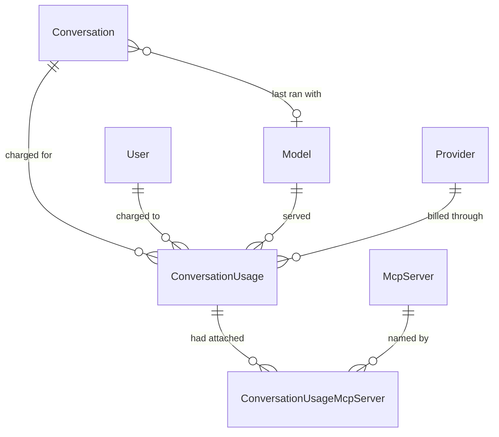

# Conversation Usage and Favourites

End-to-end reference for the conversation usage audit trail: the append-only record of every model call charged to a conversation, the model and MCP selection a conversation is resumed with, and the favourite flag. Covers the data model, what is recorded when, how cancelled and naming calls are accounted for, the resume shape returned by `GET api/conversations/{id}`, the favourite routes, how the schema reaches a real database, and the reports the trail makes possible. Audience: engineers maintaining conversations, and whoever has to answer "what did we spend, and on what?".

## 1. Overview

Before this feature the platform billed model calls it could not account for. A conversation carried running `InputTokens`/`OutputTokens` counters and nothing else: no per-call breakdown, no record of which model or provider served a turn, and two whole classes of call that moved no counter at all — a turn the user cancelled, and the completion that names a conversation from its first prompt. Both are billed by the provider. Neither was recorded anywhere.

Three things close that gap:

1. **An audit trail.** `Core.ConversationUsage` gets one row per model call, with the model, the provider, the deployment, the token split, and how the call ended. `Core.ConversationUsageMcpServer` names the MCP servers that were attached to it. Rows are never updated and never soft-deleted (§3).
2. **Model tracking.** `Core.Conversation` gains a nullable `ModelId` — the model its most recent turn ran with — so a client can reopen a conversation on the model it was last used with, and so that lookup does not have to read the audit trail (§5.1).
3. **A favourite flag.** `Core.Conversation.IsFavorite`, set through a dedicated route and filterable from the search endpoint (§5.2, §5.3).

What this deliberately does **not** change: the Cosmos DB transcript format, the streaming contract, the permission model, and the conversation's existing token counters — those still exist and still mean the same thing. The audit trail sits beside them and explains them.

> **Before deploying this:** the two new tables and the two new `Core.Conversation` columns do not exist in any database yet, and nothing in this repository creates them. Read §6.4 first — until they are applied, chat turns fail.

### 1.1 Data model at a glance



The edges from `ConversationUsage` to `Model`, `Provider` and `McpServer` are foreign keys for referential integrity, not the values reports read: the deployment name, the provider and the server name are **also copied onto the row** as they stood when the call ran (§3.2).

### 1.2 Where each piece lives

| Concern | Where |
|---|---|
| Writing a chat turn's usage row | `ConversationService.PersistTurnAsync` ([`ConversationService.cs`](../../enterprise-gpt-api/Enterprise.Gpt.Service/ConversationService.cs)) |
| Classifying how a turn ended | `ConversationService.StreamConversationCoreAsync`, the `try`/`finally` around the stream loop (§4) |
| Writing a naming call's usage row | `ConversationService.UpdateConversationNameAsync` (§4.2) |
| Restoring model + MCP selection | `ConversationService.GetConversationAsync` (§5.1) |
| Favourites | `ConversationService.SetConversationFavoriteAsync`, `SearchConversationsAsync` (§5.2, §5.3) |
| Entities and mapping | [`ConversationUsage.cs`](../../enterprise-gpt-api/Enterprise.Gpt.Entity/ConversationUsage.cs), [`ConversationUsageMcpServer.cs`](../../enterprise-gpt-api/Enterprise.Gpt.Entity/ConversationUsageMcpServer.cs), [`Conversation.cs`](../../enterprise-gpt-api/Enterprise.Gpt.Entity/Conversation.cs) |
| Schema | The EF model only — no migration, no DDL script (§6.4) |

## 2. Quick start

Star a conversation, then list only the starred ones:

```http
PUT /api/conversations/9c1f1c8e-6a1e-4c1a-9f7a-2b3c4d5e6f70/favorite
Authorization: Bearer <token>
Content-Type: application/json

{ "isFavorite": true }
```

```http
204 No Content
```

```http
GET /api/conversations/search?isFavorite=true&take=20
→ 200 PaginatedResponseDto<ConversationDto>   (each item carries modelId and isFavorite)
```

Reopen a conversation with the model and tools it was last run with:

```http
GET /api/conversations/9c1f1c8e-6a1e-4c1a-9f7a-2b3c4d5e6f70
→ 200 ConversationDetailDto   (adds mcpServerIds)
```

And, from the reporting side, what a conversation cost:

```sql
SELECT Kind, Status, InputTokens, OutputTokens, DeploymentName, DateCreated
FROM   [Core].[ConversationUsage]
WHERE  ConversationId = '9C1F1C8E-6A1E-4C1A-9F7A-2B3C4D5E6F70'
ORDER BY DateCreated;
```

## 3. The audit trail

### 3.1 One row per model call

A row is written for each call the platform makes on a user's behalf, classified by [`ConversationUsageKinds`](../../enterprise-gpt-api/Enterprise.Gpt.Common/Enums/ConversationUsageKinds.cs):

| Kind | Value | Written by |
|---|---|---|
| `Chat` | 1 | Every chat turn, at finalization — completed or not (§4) |
| `Naming` | 2 | The completion that names a conversation from its opening prompt (§4.2) |

and by how it ended, [`ConversationUsageStatuses`](../../enterprise-gpt-api/Enterprise.Gpt.Common/Enums/ConversationUsageStatuses.cs):

| Status | Value | Meaning |
|---|---|---|
| `Completed` | 1 | The model produced its complete response |
| `Cancelled` | 2 | The caller cancelled or the client disconnected mid-stream |
| `Failed` | 3 | The call faulted before the response completed |

A conversation's **first** turn therefore writes two rows: one `Naming` and one `Chat`.

### 3.2 Snapshots, not joins

`ProviderId`, `DeploymentName` and `McpServerName` are copied onto the audit rows even though the foreign keys could reach them. That is the point: the catalog is editable. An administrator can rename a model, repoint it at a different provider, or rename an MCP server, and a report that joined out to the catalog would silently rewrite the history of every call those rows ever served. `ModelId` still points at the catalog row, so a report can group either way — by what the model is called *now* (join) or by what actually billed the call *then* (`DeploymentName`).

### 3.3 Append-only

`ConversationUsage` derives from `BaseEntity`, not `BaseModifiedEntity`: there is no `DateModified`, nothing updates a row after it is written, and `DateDeactivated` stays `null` forever. A usage record that can be edited or hidden is not an audit trail. `DateCreated` is the moment the call *finished*, and it is the timestamp every report groups by.

### 3.4 MCP rows record attachment, not invocation

A `ConversationUsageMcpServer` row means the server was selected by the client and successfully leased, so its tools were on the request. It does **not** mean the model called any of them. Nothing currently records individual tool invocations (§9).

### 3.5 `TotalTokens` is computed, not stored

`ConversationUsage.TotalTokens` is an expression-bodied C# getter with no backing field, so EF does not map it and there is no column. Reports add `InputTokens + OutputTokens` themselves. Giving it a setter would add a column that could disagree with its own operands.

## 4. What happens on a chat turn

Finalization runs in a `finally` inside the streaming iterator, so it runs on **every** exit path — the loop completing, the request being cancelled, or the model call faulting:

```
acquire conversation lock
  ├─ first turn? → name the conversation      → Naming usage row + counters (§4.2)
  ├─ stream fragments to the client
  └─ finally → PersistTurnAsync
        ├─ transaction ┐ conversation counters += tokens, ModelId = model, DateModified = now
        │              └ insert ConversationUsage (+ one child row per attached MCP server)
        └─ completed only → append user + assistant messages to the Cosmos transcript
```

The counter update and the audit insert share one transaction, so a conversation whose totals moved always carries the row that accounts for the movement. Finalization runs with `CancellationToken.None` — the token that ended the stream is exactly the one that would abort the write recording it.

| Outcome | Usage row | Counters | Transcript |
|---|---|---|---|
| Stream completes | `Chat` / `Completed`, `AssistantMessageId` set | moved | user + assistant messages appended |
| Client disconnects, or stop pressed | `Chat` / `Cancelled` | moved | **not** appended |
| Model call faults | `Chat` / `Failed` | moved | **not** appended |
| First-turn naming call | `Naming` / `Completed` | moved | name patched only |

### 4.1 Abandoned turns are billed and recorded, but never transcribed

Tokens the model produced before the user hit stop are tokens the provider charged for. Previously they were lost entirely: the conversation's counters never moved and no record existed. Now the turn is recorded with `Cancelled` or `Failed` and the counters move.

The partial answer is deliberately **not** appended to the Cosmos transcript. The transcript is replayed to the model on every later turn, so a truncated answer would be presented as something the assistant actually said, forever. The turn is accounted for in SQL and absent from the conversation history — those two facts are consistent, not contradictory.

Two consequences worth knowing:

- **`AssistantMessageId` is `null`** on cancelled and failed rows, and on naming rows. On a completed row it correlates to the assistant message in the Cosmos transcript — best-effort, because the audit row commits before the transcript append is attempted. A failed append logs both identifiers so the pair can be reconciled.
- **Recording an abandoned turn can itself fail silently.** If `PersistTurnAsync` throws while the turn is already failing, the exception is logged and swallowed: throwing out of a `finally` would replace the in-flight exception, and a cancelled turn would surface to the client as a database error instead of the `499` it is owed. Losing the usage row is the lesser harm. A turn that *completed* has no exception to mask, so its finalization failures still propagate.

### 4.2 Naming calls are real calls

`UpdateConversationNameAsync` runs inline on a conversation's first turn and asks the model for a short title. It is a real completion against a real deployment, billed like any other, and it used to be charged to nobody — which made every conversation's totals, and every report built on them, understate what was spent. It now writes its own `Naming` row and adds its tokens to the conversation counters, in the same transaction as the rename.

Naming rows never carry MCP child rows: the naming call attaches no tools.

### 4.3 Naming charges accumulate on a repeatedly failing first turn

Naming is triggered by the transcript holding only the seeded system prompt. An abandoned turn is not transcribed (§4.1), so a conversation whose first turn keeps failing stays at one message — and **every retry re-enters the naming path**, writing another `Naming` row and another charge. A conversation with a dozen naming rows is a conversation whose first turn failed a dozen times, not a bug in the accounting.

## 5. API surface

All routes are in the authenticated `api/conversations` group and are scoped to the signed-in user. A conversation belonging to someone else is reported as `404`, never `403`, so the API cannot be used to probe for conversation ids. Errors are RFC 9457 Problem Details with `type` values from [`ProblemTypes`](../../enterprise-gpt-api/Enterprise.Gpt.Api/Problems/ProblemTypes.cs) — `/problems/resource-not-found` for the 404s here.

| Verb | Route | Success | Failure modes |
|---|---|---|---|
| GET | `/api/conversations/{id:guid}` | `200 ConversationDetailDto` | 404 unknown, deactivated, or another user's |
| PUT | `/api/conversations/{id:guid}/favorite` | `204` | 400 malformed body, 404 unknown, deactivated, or another user's |
| GET | `/api/conversations/search?name=&skip=&take=&isFavorite=` | `200 PaginatedResponseDto<ConversationDto>` | — (paging is clamped, not rejected) |

### 5.1 The resume shape — `ConversationDetailDto`

`GET /api/conversations/{id}` returns [`ConversationDetailDto`](../../enterprise-gpt-api/Enterprise.Gpt.Dto/ConversationDto.cs), which extends `ConversationDto` with the MCP selection:

```json
{
  "id": "9c1f1c8e-6a1e-4c1a-9f7a-2b3c4d5e6f70",
  "projectId": null,
  "modelId": "c36e22ed-1f4b-4f6d-9a2c-7e8f9a0b1c2d",
  "name": "Q3 pricing questions",
  "isFavorite": true,
  "dateCreated": "2026-08-01T09:14:23.117+00:00",
  "dateModified": "2026-08-01T10:02:11.884+00:00",
  "mcpServerIds": ["3f2a91b5-8c7d-4e6f-9a0b-1c2d3e4f5a6b"]
}
```

Together, `modelId` and `mcpServerIds` are enough for a client to restore the model picker and the tool selection exactly as the conversation was last run. Four rules govern them:

- **`modelId` comes from the conversation row**, denormalized on every turn, so the common case costs no extra query. It is set for abandoned turns too — it is still the model the user last chose.
- **`mcpServerIds` comes from the newest `Chat` usage row.** `Naming` rows are excluded; because naming is the newest row on a conversation's first turn, including them would blank the selection exactly when the user most expects it back.
- **The list is filtered to servers that are still active and still permitted for the caller**, matching what the streaming path will accept. Handing back a deactivated or revoked server would have the client replay it into the next turn and take a `404` or a `403` it cannot act on. The audit row keeps the historical selection either way — filtering happens on read, not on write.
- **The list is empty in two different situations** — no turn has run yet, and no servers were selected — and the response does not distinguish them. That ambiguity is why `mcpServerIds` is on the detail shape and not on `ConversationDto`: the listing would pay a subquery per row to return a field clients could not interpret.

The selection is fetched in a second round trip rather than as a correlated subquery: taking the newest turn's collection per conversation row translates to SQL `APPLY`, which not every provider this model runs on can express.

### 5.2 Favourites — `PUT /api/conversations/{id}/favorite`

```http
PUT /api/conversations/{id}/favorite
{ "isFavorite": false }
→ 204 No Content
```

It is a dedicated route rather than a field on `PUT /api/conversations`, which is a **full-representation** replace: a client renaming a conversation without echoing the flag back would silently un-favourite it. The same trap already exists there for `projectId`, and adding a second field to it was not worth the risk.

Two deliberate omissions:

- **No Cosmos write.** The flag only affects how conversations are listed; the transcript has no use for it. Keeping it out also keeps a star click off a document a live turn may be appending to.
- **`DateModified` is not bumped.** Starring a conversation does not modify it, and moving the SQL timestamp would put it out of step with the Cosmos document's own, which the transcript endpoint returns.

The request has no FluentValidation validator — `isFavorite` is a `bool`, so the only 400 it can produce is a binding failure, which carries no `errors` dictionary.

### 5.3 Filtering the search — `?isFavorite=`

`GET /api/conversations/search` takes an optional `isFavorite`: `true` returns only favourites, `false` only non-favourites, and **omitting it applies no filter at all** (it is a `bool?`, not a defaulted `bool`). The name filter, paging and newest-first ordering are unchanged.

### 5.4 `ConversationDto` gains two fields

`modelId` (nullable) and `isFavorite` are now on `ConversationDto`, so they appear on the search listing, on `POST`, and on `PUT` as well as on the detail read. Both the materialized mapper and the `MapToChatDtoExpression` projection carry them; a new conversation returns `"modelId": null` until its first turn runs.

## 6. Database schema

Two new tables and two new columns, all in the `Core` schema, following the conventions the rest of the database already uses: every foreign key is `NoAction`, soft delete is a nullable `DateDeactivated` with no query filter, and `Version` is a `rowversion`. Note that `Core.Ref` is a single schema whose name contains a dot — SQL references need `[Core.Ref].[Model]`.

### 6.1 `Core.ConversationUsage`

[`ConversationUsage`](../../enterprise-gpt-api/Enterprise.Gpt.Entity/ConversationUsage.cs), [`ConversationUsageConfiguration`](../../enterprise-gpt-api/Enterprise.Gpt.Repository/Configurations/ConversationUsageConfiguration.cs)

| Column | Type | Null | Notes |
|---|---|---|---|
| `Id` | `uniqueidentifier` | no | PK (clustered). No database default — EF assigns a **sequential** GUID client-side, because this is the fastest-growing table in the schema and random keys fragment its clustered index |
| `ConversationId` | `uniqueidentifier` | no | FK → `Core.Conversation(Id)` |
| `UserId` | `uniqueidentifier` | no | FK → `Core.User(Id)`; denormalized from the conversation so per-user reporting needs no join |
| `ModelId` | `uniqueidentifier` | no | FK → `[Core.Ref].Model(Id)` |
| `ProviderId` | `uniqueidentifier` | no | FK → `[Core.Ref].Provider(Id)`; snapshotted (§3.2) |
| `DeploymentName` | `nvarchar(512)` | no | snapshotted; 512 to match the catalog column |
| `Kind` | `int` | no | `ConversationUsageKinds` |
| `Status` | `int` | no | `ConversationUsageStatuses` |
| `InputTokens` | `bigint` | no | |
| `OutputTokens` | `bigint` | no | |
| `AssistantMessageId` | `uniqueidentifier` | yes | correlates to the Cosmos transcript message; no FK, Cosmos is a different store |
| `DateCreated` | `datetimeoffset` | no | when the call finished |
| `DateDeactivated` | `datetimeoffset` | yes | inherited from `BaseEntity`; always `null` here (§3.3) |
| `Version` | `rowversion` | no | inherited; nothing updates these rows, so it never changes |

Indexes:

| Index | Serves |
|---|---|
| `(ConversationId, Kind, DateCreated)` | the per-conversation history, and the newest-`Chat`-turn lookup in §5.1 — `Kind` is in the key because that lookup filters on it, otherwise the engine scans back through however many naming rows sit at the tail |
| `(UserId, DateCreated)` | usage for one user over a period |
| `(ModelId, DateCreated)` | usage for one model over a period |

EF also adds a foreign-key index for `ProviderId` by convention; the other three foreign keys already lead an index above.

### 6.2 `Core.ConversationUsageMcpServer`

[`ConversationUsageMcpServer`](../../enterprise-gpt-api/Enterprise.Gpt.Entity/ConversationUsageMcpServer.cs), [`ConversationUsageMcpServerConfiguration`](../../enterprise-gpt-api/Enterprise.Gpt.Repository/Configurations/ConversationUsageMcpServerConfiguration.cs)

`Id`, `ConversationUsageId` (FK → `Core.ConversationUsage`), `McpServerId` (FK → `[Core.Ref].McpServer`), `McpServerName nvarchar(256)` (snapshotted), plus the inherited `DateCreated`, `DateDeactivated` and `Version`.

Indexes: `(ConversationUsageId, McpServerId)` **unique** — a server is attached to a call at most once — and `(McpServerId)` for per-server reporting. The unique index is unfiltered, unlike the other unique indexes in this model: these rows are append-only, so no soft-deleted row can ever block a replacement.

### 6.3 `Core.Conversation` gains two columns

| Column | Type | Null | Notes |
|---|---|---|---|
| `ModelId` | `uniqueidentifier` | yes | FK → `[Core.Ref].Model(Id)`; `null` until the first turn runs |
| `IsFavorite` | `bit` | no | defaults to `0` for existing rows |

The relationship is configured in [`ConversationConfiguration`](../../enterprise-gpt-api/Enterprise.Gpt.Repository/Configurations/ConversationConfiguration.cs) rather than by annotation, for the same reason `ProjectId` is: an annotation-only mapping would make the navigation required. Two listing indexes come with it:

- `(UserId, DateDeactivated, DateCreated DESC)` — the sidebar listing. The trailing descending `DateCreated` is what lets the engine page straight off the index instead of sorting the user's whole history on each request.
- `(UserId, DateDeactivated, IsFavorite, DateCreated DESC)` — the favourites-only variant. A separate index rather than one combined: placed before `DateCreated`, `IsFavorite` would break the ordering for the unfiltered listing; placed after it, it could not narrow the seek.

EF adds a foreign-key index for `Core.Conversation.ModelId` by convention.

### 6.4 Applying the schema — read this before deploying

> **The application does not create any of this, and nothing in this repository does either.** `Enterprise.Gpt.Repository/Migrations/` is empty, so `Database.Migrate()` at startup **applies nothing**. There is no migration and no checked-in DDL script for this feature — the schema has always been managed outside the repository, and this feature follows that practice.

**Until the objects in §6.1–§6.3 exist in a deployed database, chatting is broken**, and it fails in two different places:

- A conversation's **first** turn fails before producing any text: the naming call writes its usage row inside a transaction (§4.2), which throws on the missing table.
- Every **later** turn streams its answer and then throws at finalization. Because the answer has already been sent, the client sees text — but the counters do not move, no usage row is written, and the transcript is never appended, so the turn disappears when the conversation is reopened.

The EF model is the source of truth for what to apply. The fastest way to read it out:

```csharp
// against a SqlServer-provider DbContext, with UseCompatibilityLevel(170)
var ddl = context.Database.GenerateCreateScript();
```

That emits the whole schema, so lift out exactly these pieces: `Core.ConversationUsage` and its four indexes, `Core.ConversationUsageMcpServer` and its two indexes, all six foreign keys, and — on the existing `Core.Conversation` table — the `ModelId` and `IsFavorite` columns, the `ModelId` foreign key, and the three indexes from §6.3. `IsFavorite` must be added as `bit NOT NULL` with a `DEFAULT 0` for existing rows (drop the constraint afterwards if you prefer to match the generated script exactly).

Two carry-overs from the existing schema notes still apply: run with `SET QUOTED_IDENTIFIER ON` and `SET ANSI_NULLS ON` (the surrounding schema has filtered indexes, and `sqlcmd` connects with `QUOTED_IDENTIFIER OFF`), and target **SQL Server 2025 or later**, which the application pins through `UseCompatibilityLevel(170)`.

**Neither test harness needs any of this.** Both build the schema from the EF model — `SqliteDbContextFixture` for unit tests, Testcontainers plus `EnsureCreatedAsync` for integration tests — so `dotnet test` passes regardless of what any real database looks like. That is also why schema drift cannot fail the build.

## 7. Reporting

Everything below reads `Core.ConversationUsage` directly; there is no reporting API (§9). Substitute a real window for `@from`/`@to` — the trail grows by one row per model call, so unbounded scans get expensive quickly, and every index in §6.1 has `DateCreated` in it for exactly that reason.

**Tokens by model, over a period.** Grouping on the catalog `Name` reports under the label the model has *now*; group on `u.DeploymentName` instead to report under what actually billed the call.

```sql
SELECT   m.Name                                AS Model,
         COUNT(*)                              AS Calls,
         SUM(u.InputTokens)                    AS InputTokens,
         SUM(u.OutputTokens)                   AS OutputTokens,
         SUM(u.InputTokens + u.OutputTokens)   AS TotalTokens
FROM     [Core].[ConversationUsage] u
JOIN     [Core.Ref].[Model] m ON m.Id = u.ModelId
WHERE    u.DateCreated >= @from AND u.DateCreated < @to
GROUP BY m.Name
ORDER BY TotalTokens DESC;
```

**Tokens by provider.** `u.ProviderId` is the snapshot, so repointing a model at another provider does not move historical calls.

```sql
SELECT   p.Name AS Provider,
         COUNT(*) AS Calls,
         SUM(u.InputTokens + u.OutputTokens) AS TotalTokens
FROM     [Core].[ConversationUsage] u
JOIN     [Core.Ref].[Provider] p ON p.Id = u.ProviderId
WHERE    u.DateCreated >= @from AND u.DateCreated < @to
GROUP BY p.Name
ORDER BY TotalTokens DESC;
```

**Tokens by user, by day.**

```sql
SELECT   CAST(u.DateCreated AS date) AS [Day],
         usr.Email,
         SUM(u.InputTokens + u.OutputTokens) AS TotalTokens
FROM     [Core].[ConversationUsage] u
JOIN     [Core].[User] usr ON usr.Id = u.UserId
WHERE    u.DateCreated >= @from AND u.DateCreated < @to
GROUP BY CAST(u.DateCreated AS date), usr.Email
ORDER BY [Day], TotalTokens DESC;
```

**What abandoned turns cost.** This is the number that did not exist before: tokens billed for answers nobody read. `Kind` 1 is `Chat` and 2 is `Naming`; `Status` 1 is `Completed`, 2 `Cancelled`, 3 `Failed`.

```sql
SELECT   CASE u.Status WHEN 1 THEN 'Completed' WHEN 2 THEN 'Cancelled' ELSE 'Failed' END AS Outcome,
         COUNT(*) AS Calls,
         SUM(u.InputTokens + u.OutputTokens) AS TotalTokens
FROM     [Core].[ConversationUsage] u
WHERE    u.Kind = 1
  AND    u.DateCreated >= @from AND u.DateCreated < @to
GROUP BY u.Status;
```

**What naming costs.** One row per conversation created, so this is effectively a per-conversation overhead — and an outlier count here points at first turns that keep failing (§4.3).

```sql
SELECT   COUNT(*) AS NamingCalls,
         SUM(u.InputTokens + u.OutputTokens) AS TotalTokens
FROM     [Core].[ConversationUsage] u
WHERE    u.Kind = 2 AND u.DateCreated >= @from AND u.DateCreated < @to;
```

**Usage per MCP server.** `McpServerName` is the snapshot, so a renamed server does not retroactively rename its history — group on `s.McpServerId` if you want current names instead. Read this as *attachment*, not attribution: a turn with two servers attached counts its tokens under both, and a server can be attached without the model calling any of its tools (§3.4).

```sql
SELECT   s.McpServerName,
         COUNT(*) AS CallsAttachedTo,
         SUM(u.InputTokens + u.OutputTokens) AS TokensOnThoseCalls
FROM     [Core].[ConversationUsageMcpServer] s
JOIN     [Core].[ConversationUsage] u ON u.Id = s.ConversationUsageId
WHERE    u.DateCreated >= @from AND u.DateCreated < @to
GROUP BY s.McpServerName
ORDER BY CallsAttachedTo DESC;
```

**Reconciling a conversation's counters.** `Core.Conversation.InputTokens`/`OutputTokens` should equal the sum of that conversation's usage rows. A discrepancy means a usage row was lost while recording an abandoned turn (§4.1) — or that the conversation predates this feature.

```sql
SELECT   c.Id, c.InputTokens, c.OutputTokens,
         SUM(u.InputTokens) AS AuditedInput, SUM(u.OutputTokens) AS AuditedOutput
FROM     [Core].[Conversation] c
LEFT JOIN [Core].[ConversationUsage] u ON u.ConversationId = c.Id
GROUP BY c.Id, c.InputTokens, c.OutputTokens
HAVING   c.InputTokens <> ISNULL(SUM(u.InputTokens), 0)
   OR    c.OutputTokens <> ISNULL(SUM(u.OutputTokens), 0);
```

## 8. Testing

`dotnet test --filter "Category!=Integration"` reports **814 passing unit tests**.

Unit coverage lives in [`Services/ConversationServiceTests.cs`](../../enterprise-gpt-api/tests/Enterprise.Gpt.Unit.Test/Services/ConversationServiceTests.cs) — xUnit v3, NSubstitute, and a SQLite in-memory `DbContext` via `SqliteDbContextFixture`:

| Area | Asserted |
|---|---|
| Completed turns | the row records the model, provider and deployment that served it; the attached MCP servers become child rows; `AssistantMessageId` matches the transcript message; the conversation's `ModelId` is updated |
| Abandoned turns | cancellation mid-stream writes a `Cancelled` row and appends nothing to the transcript; a turn abandoned after usage was reported still bills the conversation; a faulting stream writes a `Failed` row **and rethrows**; a finalization failure on an abandoned turn does not mask the original exception |
| Naming | the first turn records its naming call as a separate row |
| Resume shape | the newest turn's model and servers are returned; a server that is no longer permitted is omitted; a conversation with no turns returns neither |
| Favourites | setting and clearing persists without touching the transcript; another user's conversation throws `NotFound` |
| Search | the favourite filter returns only favourites, and omitting it returns everything |

Integration coverage ([`Endpoints/ConversationEndpointsIntegrationTests.cs`](../../enterprise-gpt-api/tests/Enterprise.Gpt.Integration.Test/Endpoints/ConversationEndpointsIntegrationTests.cs)) runs the same behaviour against real SQL Server 2025 in Testcontainers, where the indexes and foreign keys actually exist: the newest turn's selection wins over an older one, a newer `Naming` row does not blank it, and a revoked server is filtered out of the response.

## 9. Known limits and gaps

- **No reporting API, and no UI.** The audit trail is queryable only in SQL (§7). There is no endpoint, no aggregate view, and no per-user quota or budget enforcement built on it — the point of this release is that the data now exists to build those on.
- **No cost, only tokens.** Nothing stores a price per 1K tokens, so money is a spreadsheet exercise. A `Price` column on the catalog model would have to be snapshotted onto the usage row like `DeploymentName` is, for the same reason.
- **A failed naming call is billed and unrecorded.** `UpdateConversationNameAsync` writes its row only after the completion succeeds, so a naming call that faults is charged by the provider and leaves no trace — the same hole this feature closed for chat turns.
- **An abandoned turn's usage row can be dropped.** If the finalization write fails while the turn is already failing, the error is logged and swallowed (§4.1). The reconciliation query in §7 is how such a loss is found.
- **`AssistantMessageId` is best-effort.** The audit row commits before the transcript append, so a Cosmos failure leaves the row pointing at a message that was never written. Both identifiers are logged when that happens.
- **Attachment is not invocation.** There is no record of which tools ran, how often, or how long they took (§3.4).
- **Favourites are a flag, not a collection.** No ordering, no folders, no per-user cap, and no bulk favourite/unfavourite route.
- **`mcpServerIds` cannot distinguish "none selected" from "no turn yet"** (§5.1). Clients that care must look at `modelId` being `null`.
- **Nothing prunes the trail.** `ConversationUsage` grows by one row per model call forever, and deactivating a conversation does not touch its usage rows — deliberately, since deleting an audit trail with the thing it audits defeats the purpose. Archival is unsolved.

## 10. Key files

| Concern | File |
|---|---|
| Usage entities | [`Enterprise.Gpt.Entity/ConversationUsage.cs`](../../enterprise-gpt-api/Enterprise.Gpt.Entity/ConversationUsage.cs), [`ConversationUsageMcpServer.cs`](../../enterprise-gpt-api/Enterprise.Gpt.Entity/ConversationUsageMcpServer.cs) |
| Conversation entity + mapping | [`Enterprise.Gpt.Entity/Conversation.cs`](../../enterprise-gpt-api/Enterprise.Gpt.Entity/Conversation.cs) |
| Enums | [`Enterprise.Gpt.Common/Enums/ConversationUsageKinds.cs`](../../enterprise-gpt-api/Enterprise.Gpt.Common/Enums/ConversationUsageKinds.cs), [`ConversationUsageStatuses.cs`](../../enterprise-gpt-api/Enterprise.Gpt.Common/Enums/ConversationUsageStatuses.cs) |
| EF configuration | [`ConversationUsageConfiguration.cs`](../../enterprise-gpt-api/Enterprise.Gpt.Repository/Configurations/ConversationUsageConfiguration.cs), [`ConversationUsageMcpServerConfiguration.cs`](../../enterprise-gpt-api/Enterprise.Gpt.Repository/Configurations/ConversationUsageMcpServerConfiguration.cs), [`ConversationConfiguration.cs`](../../enterprise-gpt-api/Enterprise.Gpt.Repository/Configurations/ConversationConfiguration.cs) |
| `DbSet`s + configuration registration | [`Enterprise.Gpt.Repository/EnterpriseGptDbContext.cs`](../../enterprise-gpt-api/Enterprise.Gpt.Repository/EnterpriseGptDbContext.cs) |
| Turn finalization, naming, favourites, resume | [`Enterprise.Gpt.Service/ConversationService.cs`](../../enterprise-gpt-api/Enterprise.Gpt.Service/ConversationService.cs) |
| MCP server references on a lease | [`Enterprise.Gpt.Service/McpToolProvider.cs`](../../enterprise-gpt-api/Enterprise.Gpt.Service/McpToolProvider.cs) (`McpServerReference`, `IMcpToolLeaseSet.Servers`) |
| Response DTOs | [`Enterprise.Gpt.Dto/ConversationDto.cs`](../../enterprise-gpt-api/Enterprise.Gpt.Dto/ConversationDto.cs) |
| Request DTO | [`Enterprise.Gpt.Dto/Actions/Chat/ConversationActions.cs`](../../enterprise-gpt-api/Enterprise.Gpt.Dto/Actions/Chat/ConversationActions.cs) (`SetConversationFavoriteActionDto`) |
| Related reference | [Model Management](../models/model-management.md), [Projects](../projects/project-management.md), [Permission Cache](../permissions/permission-cache.md) |
