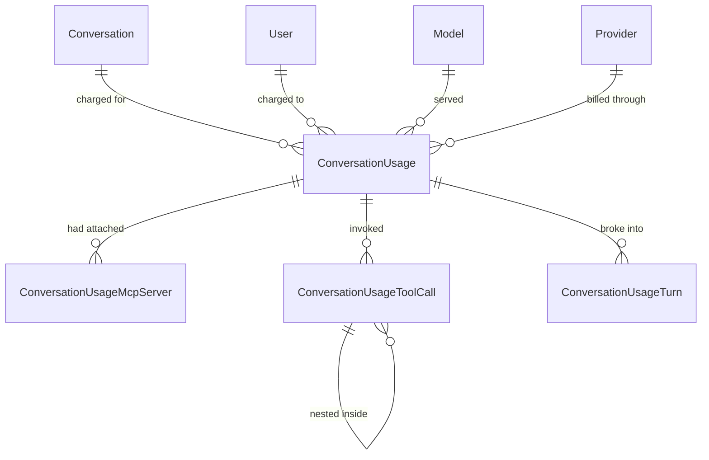

# Usage and Reporting

The append-only audit trail behind every model call, and the report built on it.

## Shape

The edges to `Model`, `Provider` and `McpServer` exist for referential integrity; they are **not**
what reports read. See "Snapshots, not joins" below.

`ConversationUsageTurn` to `ConversationUsageToolCall` is not a foreign key — it is a join on
`(ConversationUsageId, Iteration)`, nullable on the tool side and unenforced, because a tool row can
predate iteration tracking and must be readable rather than rejected.

## One row per model call

| Kind | Value | Written by |
| --- | --- | --- |
| `Chat` | 1 | Every chat turn, at finalization — completed or not |
| `Naming` | 2 | The completion that names a conversation from its opening prompt |
| `Summarization` | 3 | A `document_summarize` run, one row per run rather than per model call |

| Status | Value | Meaning |
| --- | --- | --- |
| `Completed` | 1 | The model produced its complete response |
| `Cancelled` | 2 | The caller cancelled or the client disconnected mid-stream |
| `Failed` | 3 | The call faulted before the response completed |

A conversation's **first** turn writes two rows: one `Naming` and one `Chat`.

### Snapshots, not joins

`ProviderId`, `DeploymentName` and `McpServerName` are copied onto the row even though the foreign
keys could reach them. That is the point: the catalog is editable. An administrator can rename a
model, repoint it at a different provider, or rename an MCP server, and a report that joined out to
the catalog would silently rewrite the history of every call those rows served. `ModelId` still
points at the catalog row, so a report can group either way — by what the model is called *now*
(join) or by what actually billed the call *then* (`DeploymentName`).

### Append-only

`ConversationUsage` derives from `BaseEntity`, not `BaseModifiedEntity`: no `DateModified`, nothing
updates a row after it is written, and `DateDeactivated` stays null forever. A usage record that can
be edited or hidden is not an audit trail. `DateCreated` is the moment the call *finished*, and it
is the timestamp every report groups by.

### Attachment is not invocation

The two MCP child tables answer different questions and are easy to confuse.

- A `ConversationUsageMcpServer` row means the server was **selected and successfully leased**, so
  its tools were on the request. It does not mean the model called any of them. This is also what
  restores a conversation's tool selection on reopen.
- A `ConversationUsageToolCall` row with `Kind = McpTool` means a tool **actually ran**.

A turn can easily have three attachment rows and one invocation row, or three and none.

## Token columns

`TotalTokens` is an expression-bodied getter with no backing field, so EF maps no column for it.
Giving it a setter would add a column that could disagree with its own operands.

| Member | Column | Meaning |
| --- | --- | --- |
| `InputTokens`, `OutputTokens` | yes | The **assistant's own** model turns, tools excluded |
| `ToolInputTokens`, `ToolOutputTokens` | yes | Everything **every tool** consumed, nested tools included |
| `AssistantTokens` | no | `InputTokens + OutputTokens` |
| `TotalTokens` | no | `AssistantTokens + ToolInputTokens + ToolOutputTokens` |

**`TotalTokens` means the whole call.** A SQL report that adds `InputTokens + OutputTokens` is
computing the assistant-only figure and understating the call.

`ToolInputTokens` / `ToolOutputTokens` are denormalized from the child rows so the split is readable
without touching the tool table. They are zero when no tool ran, and also when the tools that ran
surfaced no usage — the common case for an MCP server that does not report what it spent.

Two further columns are **not** in this arithmetic and never will be: `CachedInputTokens` sits
*inside* `InputTokens` and `ReasoningTokens` *inside* `OutputTokens`. They describe what kind of
token was billed, not how many more. Adding either counts the same tokens twice.

`ContextTokens` is estimated, not billed — see [transcripts.md](transcripts.md).

## What a turn records

Every turn writes its usage row in a `finally`, so the trail does not depend on the turn ending
well:

- **An abandoned turn is billed and recorded, but never transcribed.** A client that disconnects
  still spent the tokens.
- **Naming calls are real calls** and get their own row. A repeatedly failing first turn accumulates
  naming charges.
- **A cancelled turn keeps the numbers** the provider reported before the cancellation.

## Favourites

`PUT api/conversations/{id}/favorite` returns **204 with no body**. That is the one place the client
raises a cross-store event from something the server did not describe: the conversation store patches
optimistically and rolls back on failure, and the event carries the fact rather than a DTO.

Search accepts `?isFavorite=` and `?projectId=` filters and `?sort=` / `?dir=` ordering.

## Reporting

`GET api/reports/usage` is admin-only. `ReportService` groups over `ConversationUsage` and its
children, bucketed by time, with the grouping keys in `Service/Reports/UsageGroupKeys.cs`.

`IX_ConversationUsage_DateCreated` exists because this is the fastest-growing table in the schema;
it was built offline inside the migration for the same reason.

The report screen is described in [../admin/users-and-permissions.md](../admin/users-and-permissions.md).

## Known gaps

- Nothing can name the model behind a tool call, so `ConversationUsageToolCall.ModelId` is nullable
  and usually null.
- An MCP call is attributed to a catalog server only when it can be correlated by name.

## Key files

| Path | Role |
| --- | --- |
| `enterprise-gpt-api/Enterprise.Gpt.Entity/ConversationUsage.cs` | The row and its computed totals |
| `enterprise-gpt-api/Enterprise.Gpt.Entity/ConversationUsageToolCall.cs` | The tool-call tree |
| `enterprise-gpt-api/Enterprise.Gpt.Service/Chat/ChatUsageObserver.cs` | Collects provider usage during a turn |
| `enterprise-gpt-api/Enterprise.Gpt.Service/Chat/UsageReportTranslator.cs` | Provider usage to row columns |
| `enterprise-gpt-api/Enterprise.Gpt.Service/Reports/ReportService.cs` | Grouping and bucketing |
| `enterprise-gpt-api/Enterprise.Gpt.Common/Enums/ConversationUsageKinds.cs` | Kind and status catalogs |
| `enterprise-gpt-api/tests/Enterprise.Gpt.Unit.Test/Chat/` | Usage translation tests |

## Related

- [transcripts.md](transcripts.md)
- [turn-lifecycle.md](turn-lifecycle.md)
- [../models/catalog.md](../models/catalog.md)
