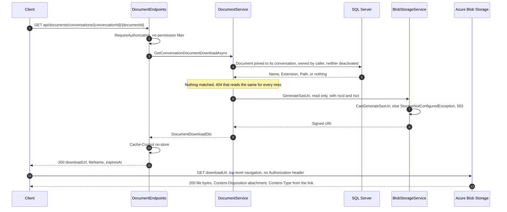

# Document Download

End-to-end reference for reading the **original file** back out of a document the user uploaded, from either a conversation or a project. Audience: engineers maintaining the document endpoints, the storage layer, or the frontend that will consume the link. Companion to [Document Upload and Ingestion](upload-workflow.md), which covers everything that happens on the way in.

## 1. Overview

A download is **one request, and the file never passes through the API**:

1. `GET /api/documents/conversations/{conversationId}/{documentId}` (or the project equivalent) authorizes the caller against the **parent** conversation or project.
2. The service signs a short-lived Azure Storage **service SAS** over the blob ingestion wrote.
3. The response is `200 OK` with `Cache-Control: no-store` and a small JSON body: the signed URL, the original file name, and when the URL stops working.
4. The client navigates to that URL, and **Azure Storage** serves the bytes.

**Why not proxy the bytes.** Streaming the file through the API would be simpler to reason about, and it is the wrong trade here. `Documents:MaxFileSizeBytes` defaults to **50 MB**, and unlike the upload path there is nothing bounding read concurrency: ingestion caps queued work at `Documents:MaxQueuedBytes` and in-flight work at `BackgroundJobs:MaxConcurrent`, whereas a download is a plain `GET` that any number of callers can issue at once. Proxying would put all of that traffic — and, if the response were buffered anywhere, all of that memory — on the API process, to add nothing storage does not already do. Signing a link moves the transfer to the service that exists to perform it, and leaves this process allocating nothing per download.

**What it costs.** The link carries its own authorization, so it is a **bearer credential** for its lifetime (§5). Every other design decision below follows from that one fact.

### 1.1 Sequence



## 2. API surface

Both routes join the existing `api/documents` group, so they inherit its `RequireAuthorization()` and its group-level `401` problem response. Three path segments keep them from colliding with `upload-status/{jobId}` or `file-extensions`.

| Verb | Route | Access | Success | Failure modes |
|---|---|---|---|---|
| GET | `/api/documents/conversations/{conversationId:guid}/{documentId:guid}` | the **conversation** owner | `200 DocumentDownloadDto`, `Cache-Control: no-store` | 401 anonymous, 404 unknown / not owned / deactivated, 503 storage not configured |
| GET | `/api/documents/projects/{projectId:guid}/{documentId:guid}` | the **project** owner | `200 DocumentDownloadDto`, `Cache-Control: no-store` | 401 anonymous, 404 unknown / not owned / deactivated, 503 storage not configured |

There is **no `403`**, because there is no permission filter (§3.2), and no `400`, because both route parameters are constrained to `:guid` and a malformed one simply does not match the route.

### 2.1 Response

```json
{
  "downloadUrl": "https://acct.blob.core.windows.net/documents/8f3.../q3-report.pdf?sv=2024-11-04&se=2026-08-08T14%3A35%3A00Z&sr=b&sp=r&rscd=attachment%3B%20filename%3D%22q3-report.pdf%22%3B%20filename%2A%3DUTF-8%27%27q3-report.pdf&rsct=application%2Fpdf&sig=...",
  "fileName": "q3-report.pdf",
  "expiresAt": "2026-08-08T14:35:00+00:00"
}
```

| Field | Notes |
|---|---|
| `downloadUrl` | The signed URL. Treat as a secret until `expiresAt` — see §5 |
| `fileName` | The name as uploaded (`ConversationDocument.Name` / `ProjectDocument.Name`). The link already carries it as a `Content-Disposition` override, so a client does **not** have to supply it to get the right file name on disk (§4.2) |
| `expiresAt` | When `downloadUrl` stops working. Recomputed from the same clock as the signature rather than parsed back off the URI, because the SDK does not expose the token's expiry |

`Cache-Control: no-store` is set by the endpoint on every success. The body contains a credential that reads a file with no sign-in; a private browser cache would otherwise write it to disk, where it outlives the few minutes the link is good for.

### 2.2 Problem responses

Error bodies are RFC 9457 Problem Details (`application/problem+json`), with `type` URIs from [`ProblemTypes`](../../enterprise-gpt-api/Enterprise.Gpt.Api/Problems/ProblemTypes.cs) that clients match **verbatim** rather than resolve.

| Status | `type` | Raised by | `detail` |
|---|---|---|---|
| 401 | the RFC 9110 status-section link | the authentication challenge, given a body by `app.UseStatusCodePages()` | — |
| 404 | `/problems/resource-not-found` | `NotFoundException` from `DocumentService` | `Document with id '{id}' was not found.` |
| 503 | `/problems/storage-not-configured` | `StorageNotConfiguredException` (§8.1) | `Document storage is not configured correctly.` |

`/problems/storage-not-configured` is **new with this feature**. Like every other domain type it is an opaque identifier, so renaming it later is a breaking API change.

Every problem also carries `traceId` and `instance`:

```json
{
  "type": "/problems/storage-not-configured",
  "title": "Storage not configured",
  "status": 503,
  "detail": "Document storage is not configured correctly.",
  "instance": "/api/documents/conversations/3f2b91c4-.../8f3a....",
  "traceId": "00-a1b2c3d4e5f60718293a4b5c6d7e8f90-1122334455667788-01"
}
```

## 3. Authorization

### 3.1 The parent owns the document, not `Document.UserId`

Ownership is read off the **conversation or project**, not off the document row:

```csharp
_ctx.ConversationDocuments
    .AsNoTracking()
    .Where(x => x.Id == documentId
        && x.ConversationId == conversationId
        && !x.DateDeactivated.HasValue
        && x.Conversation.UserId == userId
        && !x.Conversation.DateDeactivated.HasValue)
    .Select(x => new DocumentBlobRef(x.Name, x.Extension, x.Path))
```

`ConversationDocument.UserId` records **who uploaded** the file; it is not the access-control column. Reading ownership off the parent makes the rule that decides a document is downloadable the same rule that made it visible in the first place — a document that shows up in a conversation the caller owns is one they can download, with no second, subtly different notion of ownership to keep in sync. Two unit tests pin exactly this case (`..._DocumentUploadedByAnotherUser_StillIssuesALinkTo{TheConversationOwner,TheProjectOwner}`); today the two ids always agree, and they would stop agreeing the moment conversations or projects are shared.

One query authorizes and reads the blob reference together, projected server-side into a small `DocumentBlobRef(Name, Extension, Path)` record so the chunk rows — and their 1536-float embeddings — are never materialized.

### 3.2 No permission gate

Uploading is gated by the `Upload File` permission ([upload workflow §3.1](upload-workflow.md#31-the-upload-file-permission-gate)). Downloading is **not**. That permission is about *adding* documents to the platform; whether an existing document can be read back is decided by owning its parent, and it would be incoherent for revoking `Upload File` to make a user's own documents unreadable.

### 3.3 404, never 403

All four ways the query can miss produce the **same** 404 with the same message:

| Condition | Response |
|---|---|
| No document with that id | `404` — `Document with id '{id}' was not found.` |
| Document is soft-deleted (`DateDeactivated`) | same |
| Document belongs to a different conversation/project than the route names | same |
| The parent conversation/project belongs to another user, or is deactivated | same |

If a foreign document answered `403`, the route would confirm that a given guid names a real document — and the payload it guards is a link anyone could then use, so the id is the only secret protecting it. This matches how conversations and job status already answer (`upload-workflow.md` §3.3), and the integration test `Download_ConversationDocumentBelongingToAnotherUser_ReturnsNotFound` asserts both halves: the other user gets a 404, and the owner still gets a `200` for the very same URL, so the 404 is authorization rather than the document having gone.

The rejection is logged once, at Warning, with the document id and the caller — the link itself never is (§5.2).

## 4. The signed link

[`BlobStorageService.GenerateSasUri`](../../enterprise-gpt-api/Enterprise.Gpt.Service/BlobStorageService.cs) builds a **service SAS** over the single blob, with `BlobSasPermissions.Read` and nothing else:

| SAS field | Value | Why |
|---|---|---|
| `Resource` | `"b"` | One blob, not the container. A container SAS would grant the whole user's document set |
| permissions | `Read` | The only operation a download needs |
| `StartsOn` | `UtcNow - 5 min` | Clock skew between the API host and the storage service; without it a freshly issued link can be rejected as not-yet-valid |
| `ExpiresOn` | `UtcNow + Documents:DownloadUrlLifetimeMinutes` | §4.4 |
| `ContentDisposition` (`rscd`) | `attachment; filename="…"; filename*=UTF-8''…` | §4.2 |
| `ContentType` (`rsct`) | derived from the extension | §4.3 |

`rscd` and `rsct` are the [service SAS response-header overrides](https://learn.microsoft.com/rest/api/storageservices/create-service-sas#construct-a-service-sas): storage returns them **instead of** whatever the blob itself carries, and because they are part of the string-to-sign they cannot be tampered with after the fact. Both are set only when non-empty — `BlobSasBuilder` signs every non-null field, so assigning an empty string would sign an empty header and strip the real one rather than leave it alone.

### 4.1 Why the overrides are mandatory here, not cosmetic

Ingestion stores the blob under a **guid key with no `BlobHttpHeaders`**: `{userId}/{conversationId}/{documentId}{ext}` for a conversation, `{userId}/projects/{projectId}/{documentId}{ext}` for a project ([upload workflow §4.1](upload-workflow.md#41-store)). Blob metadata records the original name, but metadata is not returned as HTTP headers. Without `rscd`/`rsct` a browser following the link would save the file as `8f3a1c2e-….pdf` with `Content-Type: application/octet-stream`.

The alternative — writing `BlobHttpHeaders` at upload time — was not taken because it would bake the presentation into storage, and the values would then have to be corrected in place for every already-ingested blob. Signing them per link keeps the stored object opaque and lets the naming rule change without touching a single blob.

### 4.2 `Content-Disposition` is RFC 6266, with both forms

```
attachment; filename="q3-report.pdf"; filename*=UTF-8''q3-report.pdf
```

`filename*` carries the real name percent-encoded as UTF-8, so `отчёт.pdf` or `決算.pdf` survives; the quoted `filename` is the ASCII fallback for anything that does not understand the extended form. The fallback is the **only** part that is not percent-encoded, so it is filtered down to printable ASCII with `"`, `\`, `/` and `:` removed — a quote in a file name would otherwise terminate the header early and let the rest of the name be read as header parameters. A name with nothing printable left becomes `download`.

`attachment` is deliberate: the file is user-supplied content served from a storage host, and an `inline` disposition would let an uploaded HTML or SVG file execute in that origin.

### 4.3 The content type comes from the extension, not from `MimeType`

Both `ConversationDocument` and `ProjectDocument` have a `MimeType` column, and the download path **ignores it**. That column stores `IFormFile.ContentType` — whatever the uploading client declared — and nothing validates it. The extension, by contrast, is derived server-side from the file name and is validated at upload against the registered extractors *and* against the file's magic bytes ([upload workflow §3.3](upload-workflow.md#33-synchronous-failures-versus-asynchronous-job-failures)), so it is the trustworthy half of the pair.

This matters more than a mislabelled download, because the value is **signed into the link as the header storage will actually return**. Serving an uploader's chosen media type back out would leave the `attachment` disposition as the only thing standing between a crafted upload and stored XSS on the storage origin.

| Extension | Content type |
|---|---|
| `.doc` | `application/msword` |
| `.docx` | `application/vnd.openxmlformats-officedocument.wordprocessingml.document` |
| `.md` | `text/markdown` |
| `.pdf` | `application/pdf` |
| `.pptx` | `application/vnd.openxmlformats-officedocument.presentationml.presentation` |
| `.txt` | `text/plain` |
| anything else | `application/octet-stream` |

Falling back to a byte stream is safe rather than a degradation: every link is an `attachment`, so the type only decides which application opens the saved file. The map is a `FrozenDictionary` with an ordinal-ignore-case comparer, and it covers the six formats ingestion accepts — an extension outside that set can only exist on a row that predates the current validator.

### 4.4 Lifetime

`Documents:DownloadUrlLifetimeMinutes` — default **5**, range **1–60**, validated at startup with the rest of `DocumentOptions`.

Minutes rather than hours because the link needs no sign-in: the window is the period during which a leaked URL is still usable, and the only thing a download actually has to survive is the moment between the client receiving the response and the browser starting the transfer. **A transfer already in progress is not cut off when the SAS expires** — expiry is checked when the request is authorized, not continuously — so a slow 50 MB download over a slow connection is fine on a 5-minute link.

The 5-minute back-dated start is *additional* to the configured lifetime, so the whole configured window is usable; it is not deducted from it.

## 5. The link is a credential

`downloadUrl` grants read access to the file to **anyone holding it**, until `expiresAt`. Not "the user who requested it" — anyone. Three consequences are already handled, and one is not.

### 5.1 Handled: caching

`Cache-Control: no-store` on the API response (§2.1). Without it, a private browser cache is entitled to persist the JSON body, and a credential in a disk cache outlives the credential itself.

### 5.2 Handled: logging

- `BlobStorageService` logs that a SAS was generated, for which blob and with which permissions — **never the URI**.
- `DocumentService` logs the document id, the caller and the expiry — not the link.
- `downloadUrl` was added to the request-logging middleware's default `RequestLogging:Bodies:RedactedPropertyNames`, alongside `password`, `accessToken`, `connectionString` and the rest ([Request Logging](../observability/request-logging.md)).

That last one is defence in depth: `/api/documents` is already on the default `Bodies:ExcludedPaths`, so response bodies on these routes are not captured at all. The redaction rule is what keeps the link out of the log if an operator ever narrows `ExcludedPaths` — and note that configuring **any** of those lists *replaces* its default rather than extending it, which is precisely the case that would otherwise re-expose the URL.

### 5.3 Handled: the ambient credential is not reused

Nothing about the link identifies the caller, so it cannot be replayed as them against anything else. It reads one blob, read-only, for a few minutes.

### 5.4 Not handled: revocation

**An issued link cannot be withdrawn.** A service SAS signed with the account key is valid until it expires; deleting the document, deactivating the conversation, or removing the user changes nothing about a link already in someone's hands. The only revocation mechanisms Azure offers are rotating the account key (which invalidates *every* outstanding link) or a stored access policy (which this code does not use). The short lifetime is the mitigation, and it is why `DownloadUrlLifetimeMinutes` is capped at 60 rather than left open.

## 6. Client integration

**Navigate to `downloadUrl`; do not fetch it.**

```typescript
// Correct: a top-level navigation. No Authorization header, no CORS preflight.
window.location.href = download.downloadUrl;
```

A plain top-level navigation is not subject to CORS at all, and carries no `Authorization` header — which is what the SAS host wants, since an unexpected `Authorization` header on a SAS request is an error rather than a bonus. `Content-Disposition: attachment` from the link makes the browser save the file under `fileName` instead of navigating to it.

Fetching the URL with `HttpClient` instead would require a **CORS rule on the storage account** allowing the SPA's origin, and would buffer the whole file into a `Blob` in the page. The existing `DocumentService.downloadFile(blob, fileName)` helper in the frontend is for the conversation-history export, which really is served by the API; it is the wrong tool for this link. Note also that the `download` attribute on an `<a>` is ignored for cross-origin URLs, so the file name comes from the signed `Content-Disposition` either way.

The MSAL interceptor's `protectedResourceMap` is keyed on the API URI, so it would not attach a token to a storage host in any case — but that is a coincidence of configuration, not a guarantee to rely on.

**There is no frontend consumer yet.** `document.service.ts` has no method for these routes; the API side ships first.

## 7. Configuration

| Key | Default | Range | Meaning |
|---|---|---|---|
| `Documents:DownloadUrlLifetimeMinutes` | `5` | 1 … 60 | How long an issued link stays valid (§4.4). Validated at startup; **not present in `appsettings.json`**, so it runs on the default unless added |
| `AzureStorage:ConnectionString` | — | — | Builds the singleton `BlobServiceClient`. Must be a **shared-key** connection string for signing to work (§8.1) |
| `AzureStorage:DocumentsContainer` | — | — | The container every document blob lives in. Read on **each use** rather than cached, so a reloaded configuration takes effect without a restart. Unset → `503` |

```json
"Documents": {
  "DownloadUrlLifetimeMinutes": 5
}
```

Downloads add no other configuration; everything else is inherited from the storage setup ingestion already needed.

## 8. Operational notes and known limits

### 8.1 Signing requires a shared-key connection string

`BlobBaseClient.CanGenerateSasUri` is true **only** when the client was constructed with a [`StorageSharedKeyCredential`](https://learn.microsoft.com/dotnet/api/azure.storage.blobs.specialized.blobbaseclient.cangeneratesasuri). `Program.cs` builds `BlobServiceClient` from `AzureStorage:ConnectionString`, so a connection string carrying the account key works and a SAS-only or token-credential client does not. When it cannot sign, `GenerateSasUri` logs the reason and throws `StorageNotConfiguredException` → **503** `/problems/storage-not-configured`.

The same exception covers an unset `AzureStorage:DocumentsContainer`, which would otherwise surface from the Azure SDK as an opaque `500` with the message suppressed.

Two things about the type are deliberate: it derives from `Exception` rather than `InvalidOperationException` (the exception handler maps the latter to `400`, which would report an operator's configuration gap as the caller's bad request), and its message names no account, container or credential, so it is safe to return verbatim.

**This is the constraint to know before moving to `DefaultAzureCredential`.** The repo standard prefers managed identity over keys, and adopting it here is not a config change: a token-credential client cannot produce a service SAS. It would have to request a [user delegation key](https://learn.microsoft.com/rest/api/storageservices/create-user-delegation-sas) (valid up to 7 days, so it needs caching and renewal) and sign a **user delegation SAS** instead. `IBlobStorageService.GenerateSasUri` is the seam that change lands behind; nothing above it would move.

### 8.2 The API does not verify the blob exists

The link is signed from `Document.Path` without touching storage, which is what keeps the request to a single database round-trip. If the blob is missing — deleted out of band, or a container restored from an inconsistent backup — the API still returns `200` and the failure appears when the client uses the link, as a `404` from the storage host in a shape that is not Problem Details. Ingestion makes this rare: a job that fails deletes its blob, and a job that succeeds writes the row and the blob together.

### 8.3 Soft-deleted documents 404, but their blobs stay

Deactivating a document, conversation or project closes the download route immediately (`Download_DeletedProjectDocument_ReturnsNotFound` pins this) — but nothing removes the blob. That is the pre-existing gap noted in [upload workflow §11.5](upload-workflow.md#115-everything-else); downloads neither worsen nor fix it. An orphaned blob is unreachable through the API, since a link can only be signed from a live row.

### 8.4 Nothing throttles link issuance

A caller can request links for their own documents as fast as they can send requests. Each one is a database read plus an in-process HMAC — cheap — but each also mints a fresh credential with a fresh expiry, so a client holding one document id can keep a valid link alive indefinitely. That is not an escalation (they were entitled to the file anyway), but it does mean the lifetime bounds a *leaked* link, not a *deliberately renewed* one.

### 8.5 Downloads are stateless, so they scale out

Unlike upload status, which lives in a process-local dictionary and breaks under multi-instance routing ([upload workflow §11.2](upload-workflow.md#112-job-state-is-in-memory)), the download path holds no state: any instance can sign a link for any document, and the client's transfer goes to storage rather than back to the API. No sticky routing needed.

## 9. Testing

Unit tests — 23 in [`Services/DocumentServiceTests.cs`](../../enterprise-gpt-api/tests/Enterprise.Gpt.Unit.Test/Services/DocumentServiceTests.cs) and 4 in [`Endpoints/DocumentEndpointsTests.cs`](../../enterprise-gpt-api/tests/Enterprise.Gpt.Unit.Test/Endpoints/DocumentEndpointsTests.cs):

| Area | Covered |
|---|---|
| Happy path | The signed link and file name are returned; the **stored** blob path is what gets signed; permissions are `Read` only |
| Header overrides | `rscd` and `rsct` are passed to the signer; a non-ASCII file name keeps an ASCII fallback beside the encoded name; path separators and quotes are stripped from the fallback |
| Content type | Comes from the extension, **not** from the declared `MimeType`; an unrecognised extension falls back to `application/octet-stream` |
| Ownership | A document uploaded by another user into the caller's conversation/project still issues a link (§3.1) |
| Refusals | Foreign parent, deactivated document, deactivated parent, document from another parent, unknown document — each a `NotFoundException`, and the foreign-parent case asserts that **nothing was signed** |
| Configuration | Missing container → `StorageNotConfiguredException`; a client that cannot sign propagates the same |
| Endpoint | The service's link is returned unchanged, `Cache-Control: no-store` is set on both routes, and `NotFoundException` propagates untouched |

Integration tests — [`Endpoints/DocumentEndpointsIntegrationTests.cs`](../../enterprise-gpt-api/tests/Enterprise.Gpt.Integration.Test/Endpoints/DocumentEndpointsIntegrationTests.cs), `[Trait("Category", "Integration")]`, needs Docker. They upload a real file through the real pipeline first, then download it: anonymous `401`; a link whose path matches the key ingestion actually wrote, for both conversations and projects; `rscd`/`rsct` carrying `attachment; filename="notes.txt"; filename*=UTF-8''notes.txt` and `text/plain`; another user's document `404` while the owner still gets `200`; unknown document `404`; and a soft-deleted project document `404`.

`FakeBlobStorageService` stands in for Azure Storage and **echoes the overrides back as `rscd`/`rsct` query values** — the names a real service SAS uses — which is what lets a test assert the link really does rename the file. Not covered end-to-end, and worth verifying by hand against a real account: that a genuine SAS with these overrides is accepted, and that the `503` path fires when the container is unset.

```bash
# from enterprise-gpt-api/
dotnet test --filter "Category!=Integration"   # unit only
dotnet test                                    # everything; Docker must be running
```

## 10. Key files

| Concern | File |
|---|---|
| Routes, `no-store` | [`Enterprise.Gpt.Api/Endpoints/DocumentEndpoints.cs`](../../enterprise-gpt-api/Enterprise.Gpt.Api/Endpoints/DocumentEndpoints.cs) |
| Authorization, disposition, content type | [`Enterprise.Gpt.Service/DocumentService.cs`](../../enterprise-gpt-api/Enterprise.Gpt.Service/DocumentService.cs) |
| SAS generation | [`Enterprise.Gpt.Service/BlobStorageService.cs`](../../enterprise-gpt-api/Enterprise.Gpt.Service/BlobStorageService.cs) |
| Response contract | [`Enterprise.Gpt.Dto/DocumentDownloadDto.cs`](../../enterprise-gpt-api/Enterprise.Gpt.Dto/DocumentDownloadDto.cs) |
| 503 condition | [`Enterprise.Gpt.Service/Exceptions/StorageNotConfiguredException.cs`](../../enterprise-gpt-api/Enterprise.Gpt.Service/Exceptions/StorageNotConfiguredException.cs) |
| Lifetime option | [`Enterprise.Gpt.Service/Settings/DocumentOptions.cs`](../../enterprise-gpt-api/Enterprise.Gpt.Service/Settings/DocumentOptions.cs) |
| Problem type | [`Enterprise.Gpt.Api/Problems/ProblemTypes.cs`](../../enterprise-gpt-api/Enterprise.Gpt.Api/Problems/ProblemTypes.cs) |
| 503 mapping | [`Enterprise.Gpt.Api/ExceptionHandlers/GlobalExceptionHandler.cs`](../../enterprise-gpt-api/Enterprise.Gpt.Api/ExceptionHandlers/GlobalExceptionHandler.cs) |
| Link redaction | [`Enterprise.Gpt.Api/Middleware/RequestLoggingOptions.cs`](../../enterprise-gpt-api/Enterprise.Gpt.Api/Middleware/RequestLoggingOptions.cs) |
| Related reference | [Document Upload and Ingestion](upload-workflow.md), [Project Management](../projects/project-management.md), [Request Logging](../observability/request-logging.md) |
