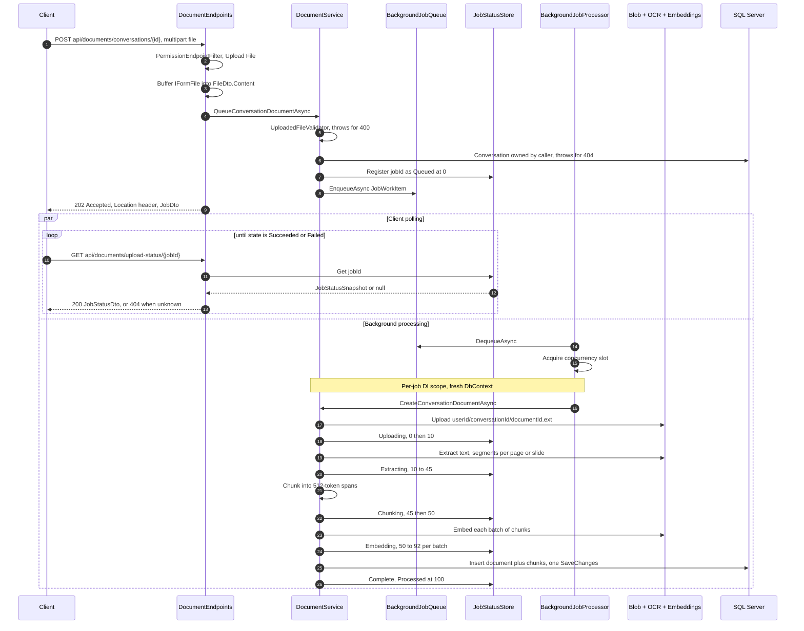

# Document Upload and Ingestion

End-to-end reference for the conversation document pipeline: how an uploaded file is validated, queued, stored in Azure Blob Storage, read, split into token-bounded chunks, embedded, and persisted as `Core.ConversationDocumentChunk` rows — and how a client tracks that work while it happens. Audience: engineers maintaining or extending document ingestion, background jobs, or the retrieval layer that consumes these chunks.

## 1. Overview

A document upload is **two requests and one background job**:

1. `POST /api/documents/conversations/{conversationId}` validates the file *synchronously* and returns `202 Accepted` with a job id. Everything that can be rejected cheaply — permission, conversation ownership, file size, extension, magic bytes — is rejected here, as a normal problem-details response (§3).
2. The ingestion pipeline runs on a background job: store → extract → chunk → embed → persist.
3. `GET /api/documents/upload-status/{jobId}` returns the job's live snapshot until it reaches `Processed` or `Failed`.

The pipeline is fully in-process. There is no Hangfire, no external broker, and no durable job table: a bounded `Channel<T>` queue, a `BackgroundService` consumer with a `SemaphoreSlim` concurrency gate, and a `ConcurrentDictionary` status store. Durability across restarts is **not** provided (§11.2).

Reading the original file back out is a much shorter path — one request, a short-lived signed link, and no bytes through the API — and is covered separately in [Document Download](download-workflow.md).

**What changed from the previous design.** This feature was rewritten; the old document is superseded in every section:

| Then | Now |
|---|---|
| `DocumentsController` (MVC) | [`DocumentEndpoints`](../../enterprise-gpt-api/Enterprise.Gpt.Api/Endpoints/DocumentEndpoints.cs) minimal-API group, gated by the `Upload File` permission |
| One embedding per **page** (`ConversationDocumentPage`) | One embedding per **chunk** (`ConversationDocumentChunk`), 512 tokens with 128 tokens of overlap |
| Extension `switch` inside `DocumentService` over ~25 extensions | Registered [`IDocumentTextExtractor`](../../enterprise-gpt-api/Enterprise.Gpt.Service/Extraction/IDocumentTextExtractor.cs) implementations; six formats, one source of truth |
| Bad files accepted with a 202, failing minutes later | Validated on the request thread, rejected with 400 |
| Four coarse progress checkpoints (25/50/75/100) | Six stages with per-batch progress and a user-facing message |
| Unbounded queue | Queue bounded by a memory budget (`Documents:MaxQueuedBytes`) that applies backpressure |

The route URLs are unchanged, so [`document.service.ts`](../../enterprise-ui/src/app/services/document.service.ts) needed no edits.

### 1.1 Sequence



## 2. Supported formats

Six extensions are accepted. The set is **derived from the registered extractors**, not configured: [`DocumentTextExtractorFactory`](../../enterprise-gpt-api/Enterprise.Gpt.Service/Extraction/IDocumentTextExtractorFactory.cs) builds a map from every `IDocumentTextExtractor` in DI, and both the upload validator and `GET /api/documents/file-extensions` read that map. Configuration therefore cannot advertise a format nothing can read, and two extractors claiming the same extension fail at startup rather than silently picking a winner.

| Extension | Extractor | Reader | Segment | `SourceNumber` | Why this reader |
|---|---|---|---|---|---|
| `.pdf` | [`DocumentIntelligenceTextExtractor`](../../enterprise-gpt-api/Enterprise.Gpt.Service/Extraction/DocumentIntelligenceTextExtractor.cs) | Azure AI Document Intelligence, `prebuilt-read` | page | page number | A PDF can be pure images; OCR is the only thing that reads a scan |
| `.docx` | `DocumentIntelligenceTextExtractor` | Azure AI Document Intelligence | page, or the whole document | page number when the service paginates, else `null` | Document Intelligence accepts OOXML Word directly |
| `.doc` | `DocumentIntelligenceTextExtractor`, after [`DocSharpLegacyWordConverter`](../../enterprise-gpt-api/Enterprise.Gpt.Service/Converters/DocSharpLegacyWordConverter.cs) | DocSharp (managed b2xtranslator fork) → Document Intelligence | whole document in practice | `null` | **Document Intelligence does not accept the binary `.doc` (OLE2) container.** Converting to `.docx` in memory keeps one OCR-backed route for every Word file instead of a second, lower-fidelity one |
| `.pptx` | [`PresentationTextExtractor`](../../enterprise-gpt-api/Enterprise.Gpt.Service/Extraction/PresentationTextExtractor.cs) | `DocumentFormat.OpenXml` | slide, plus speaker notes | slide number | A `.pptx` **already stores its text as text**. Parsing locally is free and lossless, gives a real slide number for provenance, and picks up speaker notes — none of which a rasterizing OCR pass would give |
| `.md` | [`PlainTextExtractor`](../../enterprise-gpt-api/Enterprise.Gpt.Service/Extraction/PlainTextExtractor.cs) | `StreamReader` | whole file | `null` | Already text. Markdown is embedded **as written**: headings, lists and code fences are real structure that helps the embedding |
| `.txt` | `PlainTextExtractor` | `StreamReader` | whole file | `null` | Already text |

Notes that matter in practice:

- **`.doc` conversion is in memory.** `DocSharpLegacyWordConverter` reads the OLE2 structured storage and writes a `.docx` package to a `MemoryStream`; nothing touches the host's disk. Malformed input surfaces from the reader as a wide, undocumented range of exception types, so the catch is deliberately broad and every one of them becomes the same 400-class `ValidationException`.
- **Encoding.** `PlainTextExtractor` honours a UTF-16/UTF-32 byte-order mark and falls back to UTF-8, then normalises line endings to `\n` so chunk boundaries and token counts do not depend on the authoring OS.
- **Slides are read through `SlideIdList`**, not `PresentationPart.SlideParts` — only the former is in presentation order. The slide-number placeholder inside a notes slide is skipped, because its text is just the slide number and would otherwise be embedded as content.
- **Empty segments are dropped.** Every extractor omits whitespace-only pages/slides, so a document with no readable text returns zero segments and the job fails with an explanation (§4.2).
- Document Intelligence has one fallback: if `result.Pages` yields nothing but `result.Content` is non-empty, a single segment with `SourceNumber = null` is emitted. This is what keeps a Word document from silently producing zero chunks.

## 3. API surface

All three routes live in the `api/documents` group with `RequireAuthorization()`, so an anonymous request gets `401` before any handler runs.

| Verb | Route | Access | Success | Failure modes |
|---|---|---|---|---|
| POST | `/api/documents/conversations/{conversationId:guid}` | authenticated **+ `Upload File` permission** | `202 Accepted`, `Location: /api/documents/upload-status/{jobId}`, body `JobDto { id }` | 400 validation, 403 missing permission, 404 conversation unknown / not owned / deactivated |
| GET | `/api/documents/upload-status/{jobId}` | the user who queued the job | `200 JobStatusDto` | 404 unknown, evicted, or queued by someone else |
| GET | `/api/documents/file-extensions` | any authenticated | `200 string[]` — e.g. `[".doc", ".docx", ".md", ".pdf", ".pptx", ".txt"]` | — |

Error bodies are **RFC 9457 Problem Details**, served as `application/problem+json`. The `type` URIs come from [`ProblemTypes`](../../enterprise-gpt-api/Enterprise.Gpt.Api/Problems/ProblemTypes.cs) and are opaque identifiers to match verbatim, not links to follow:

| Status | `type` | Raised by | Extra fields |
|---|---|---|---|
| 400 | `/problems/validation-error` | [`UploadedFileValidator`](../../enterprise-gpt-api/Enterprise.Gpt.Service/Validators/UploadedFileValidator.cs), as a `ValidationException` | `errors`, keyed by the failing property |
| 400 | `/problems/upload-too-large` | `MaxUploadSizeEndpointFilter` (§3.2) | `maxBytes` |
| 403 | `/problems/permission-required` | `PermissionEndpointFilter` (§3.1) | `permissions`, e.g. `["Upload File"]` |
| 404 | `/problems/resource-not-found` | `NotFoundException` — unknown conversation or unknown job | — |
| 401 | the RFC 9110 status-section link | the authentication challenge, given a body by `app.UseStatusCodePages()` | — |

Every problem also carries `traceId` (the W3C traceparent) and `instance` (the request path). A rejected upload therefore reads:

```json
{
  "type": "/problems/upload-too-large",
  "title": "Upload too large",
  "status": 400,
  "detail": "The file exceeds the maximum upload size of 50 MB.",
  "instance": "/api/documents/conversations/3f2b91c4-...",
  "traceId": "00-a1b2c3d4e5f60718293a4b5c6d7e8f90-1122334455667788-01",
  "maxBytes": 52428800
}
```

Status reads are scoped to the user who queued the job. The snapshot carries the created document id and the failure detail, so leaving it globally readable would let anyone holding a job id learn both. The response is `404` rather than `403` so a job id is never confirmed as valid — the same posture taken for conversations.

### 3.1 The `Upload File` permission gate

The upload route carries `PermissionEndpointFilter.Require(PermissionIds.UploadFile)`. [`PermissionEndpointFilter`](../../enterprise-gpt-api/Enterprise.Gpt.Api/Filters/PermissionEndpointFilter.cs) is a **static factory returning a filter delegate**, not an `IEndpointFilter` type: the generic `AddEndpointFilter<T>` activates its type from the container and so cannot carry permission ids. It is the single gate for every permission in the API, admin routes included — `Require(params Guid[])` is **AND**, so a route can demand several grants at once.

The filter runs after authorization (a principal must exist) and reads the caller's grant set from the singleton [`IUserPermissionCache`](../../enterprise-gpt-api/Enterprise.Gpt.Service/Caching/UserPermissionCache.cs). On a hit — the normal case, since `POST /api/users/me` warms the entry at sign-in — it performs **no query and constructs no `EnterpriseGptDbContext`**; on a miss it loads every active `Core.UserPermission` row for the oid once and caches it. Administrators are *not* implicitly granted `Upload File` — they hold exactly the grants the permission service records. On failure the filter returns a `403` problem of type `/problems/permission-required`, with `"Upload File permission is required."` as the `detail` and `permissions: ["Upload File"]` naming the whole requirement — the response does not vary with which grants the caller happens to hold.

Two consequences worth knowing: the display name in that message comes from the static `PermissionIds.Names` map (validated at map time, so an unknown id fails startup), and a revoked `Upload File` grant takes effect immediately on the instance that served the revoke but only within `Permissions:Cache:EntryLifetime` elsewhere. [Permission Cache](../permissions/permission-cache.md) covers both.

The permission is seeded with `IsDefault = true` ([`PermissionConfiguration`](../../enterprise-gpt-api/Enterprise.Gpt.Repository/Configurations/PermissionConfiguration.cs)), so every user provisioned after it existed receives it, and `UserService` reconciles missing default grants on sign-in for users created before it existed. Its id is fixed in [`PermissionIds.UploadFile`](../../enterprise-gpt-api/Enterprise.Gpt.Dto/Enums/PermissionIds.cs) — see §10.2 for the row a real database still needs.

### 3.2 `.DisableAntiforgery()` and the request-size limit

Two pieces of endpoint metadata on the upload route deserve explanation.

**`.DisableAntiforgery()`** — minimal APIs automatically opt `IFormFile` endpoints into antiforgery validation, which throws at request time unless the antiforgery middleware is registered or the endpoint opts out. This API is authenticated **by bearer token and never by cookie**, so a forged cross-site request cannot carry the caller's credentials and CSRF does not apply. Opting out is the correct call here, not a shortcut; it would *not* be if a cookie scheme were ever added.

**`.AddEndpointFilter(MaxUploadSizeEndpointFilter.Require(maxFileSizeBytes))`** — the size cap is applied by an explicit filter rather than by `[RequestSizeLimit]`. That attribute is an MVC filter; Microsoft documents it as the way to override the limit *in an MVC app*, and its enforcement on a minimal-API endpoint is not something the framework guarantees. A cap that may or may not apply is worse than no cap, so [`MaxUploadSizeEndpointFilter`](../../enterprise-gpt-api/Enterprise.Gpt.Api/Filters/MaxUploadSizeEndpointFilter.cs) does the work in two layers:

1. **`Content-Length` check** — rejects the common case with a `400` of type `/problems/upload-too-large` *before a single byte is buffered*. The `detail` states the limit in human terms and the `maxBytes` extension repeats it as a number, so a client can render the cap without parsing prose.
2. **Lowering `IHttpMaxRequestBodySizeFeature`** — covers a chunked upload that declares no length, so the server aborts the connection once the body actually exceeds the cap. The feature is skipped when it is already read-only (the body has started being read) or absent (`TestServer` does not implement it).

The limit is read from `IOptions<DocumentOptions>` **once, at map time**, so changing `Documents:MaxFileSizeBytes` requires a restart. The validator's size rule (§3.3) still exists as the in-process backstop for a request that understates its own length.

### 3.3 Synchronous failures versus asynchronous job failures

Anything the API can know before queuing is an HTTP error. Anything only the pipeline can discover is a *failed job* — the HTTP call still returned `202`.

Synchronous, from [`UploadedFileValidator`](../../enterprise-gpt-api/Enterprise.Gpt.Service/Validators/UploadedFileValidator.cs) and the ownership check in `DocumentService.QueueConversationDocumentAsync`:

| Condition | Status | Message source |
|---|---|---|
| Caller lacks the `Upload File` grant | 403 | `PermissionEndpointFilter` |
| Missing file name, or longer than 256 characters | 400 | validator |
| Empty file | 400 | validator |
| `Content-Length` larger than `Documents:MaxFileSizeBytes` | 400 | `MaxUploadSizeEndpointFilter`, before the body is buffered |
| Body larger than `Documents:MaxFileSizeBytes` despite its declared length | 400 | validator |
| Extension not backed by a registered extractor (or absent) | 400 | validator, and the message lists what *is* supported |
| Leading bytes do not match the extension — `%PDF`, `PK` for OOXML, the OLE2 signature for `.doc`, no NUL bytes in the first 8 KB for text | 400 | validator |
| Conversation does not exist, belongs to another user, or is deactivated | 404 | `NotFoundException` |

The magic-byte check is a security control, not politeness: extensions are attacker-controlled, and every downstream reader assumes a particular container. Handing a renamed file to the Open XML or OLE2 reader turns a user mistake into a parser fault, and handing one to Document Intelligence spends money to learn the same thing.

The "not found" and "not owned" cases are deliberately indistinguishable, so the endpoint cannot be used to probe for other users' conversation ids.

Asynchronous, surfaced only through the status endpoint as `status: "Failed"` with an `errorMessage`:

| Condition | What the client sees |
|---|---|
| Document Intelligence rejects the document (HTTP 400/415 — corrupt, password-protected, unsupported variant) | "The document could not be read. It may be corrupt, password-protected, or an unsupported variant of the format." |
| `.doc` conversion fails | "…try saving it as .docx and uploading again." |
| `.pptx` cannot be opened | "The presentation could not be read. It may be corrupt or password-protected." |
| Extraction or chunking yields nothing | "No readable text was found in the document, so there is nothing to index." |
| Blob, embedding, database or any other unexpected fault | "Processing failed because of an unexpected error. Please try again, or contact support if the problem persists." |
| Host shut down mid-job | "Job cancelled during host shutdown." / "Host shutdown before job could start." |

`BackgroundJobProcessor.DescribeFailure` is what draws that line: FluentValidation messages are written for users and say something actionable, so they pass through verbatim; **every other exception message is replaced**, because exception text from data access and Azure SDK clients routinely embeds connection strings, endpoints and credential-bearing request URLs, and the job status endpoint is not an appropriate place for any of that. The full exception is logged.

## 4. The ingestion pipeline

[`DocumentService.CreateConversationDocumentAsync`](../../enterprise-gpt-api/Enterprise.Gpt.Service/DocumentService.cs) owns sequencing, persistence and progress reporting; format-specific reading and splitting live behind `IDocumentTextExtractor` and `ITextChunker`. It runs on a background scope and therefore takes `userId` as a parameter — there is no `HttpContext` to read the oid from.

### 4.1 Store

The blob path is `{userId}/{conversationId}/{documentId}{extension}` in the `AzureStorage:DocumentsContainer` container, with `userId`, `conversationId`, `documentId`, `contentType` and `length` written as blob metadata.

Keying on the **document id rather than the file name** is deliberate: two uploads of the same name into the same conversation are legitimate, and a name-based path made the second one overwrite/collide with the first and fail the whole job. `Upload_SameFileNameTwice_BothSucceedWithoutColliding` pins this.

No `BlobHttpHeaders` are written — only metadata — so the stored object carries neither the original file name nor a content type as HTTP headers. That is why a download link has to sign both in as response-header overrides; see [Document Download §4.1](download-workflow.md#41-why-the-overrides-are-mandatory-here-not-cosmetic).

### 4.2 Extract

The factory resolves the extractor for the file's extension and the extractor reports progress through an `IProgress<DocumentExtractionProgress>`. Zero segments is a `ValidationException` → the job fails with "No readable text was found…".

Progress here has a wrinkle worth understanding. `DocumentExtractionProgress.Fraction` is **nullable**: a remote OCR call is opaque until it returns, so it cannot report a percentage. A `null` fraction pins the reported percentage at the band's floor and refreshes only the *message* and the timestamp — the status feed still shows the job is alive without claiming progress it cannot know. `DocumentIntelligenceService` polls the long-running operation itself (`WaitUntil.Started`, then a 2-second poll loop) purely so the extractor can emit "Recognizing text (37s elapsed)" heartbeats.

Reports are delivered through a private `InlineProgress<T>` rather than `System.Progress<T>`. `Progress<T>` posts each callback to the thread pool, which lets reports arrive out of order and land after the stage that raised them has finished, so a stale message could overwrite a newer one. The callback only touches a concurrent dictionary, so there is nothing to offload.

### 4.3 Chunk, embed, persist

Covered in §5 and §6. The final write is a **single `SaveChangesAsync`** covering the `ConversationDocument` and all of its `ConversationDocumentChunk` children, so a document is never half-indexed. `CreateConversationDocumentAsync` does not wrap itself in `try`/`catch`: anything it throws reaches `BackgroundJobProcessor.ProcessAsync`, which logs it and marks the job `Failed`.

After the save, both ingest paths **re-check that the parent is still active** (US-1001, 2026-08-19): ingestion spans seconds to minutes, and a conversation or project deactivated meanwhile has already run its document cascade, which never re-runs — so a row persisted after it would linger as an active orphan under a deactivated parent. When the re-check fails, the just-inserted document and chunks are deactivated set-based via `ExecuteUpdateAsync` (idempotent if the cascade did catch them — no rowversion involved) and the job fails with the same not-found message an upload into a deleted parent gets. See [Documents Library §3.4](../ui/documents-library.md#34-the-ingestion-re-check).

## 5. Chunking

[`TokenTextChunker`](../../enterprise-gpt-api/Enterprise.Gpt.Service/Chunking/TokenTextChunker.cs) repacks extracted segments into **chunks of at most 512 tokens with 128 tokens of overlap** (`Documents:Chunking`). It is registered as a **singleton** because constructing its tokenizer loads and indexes a large vocabulary, which must not happen per request.

**Why tokens, not characters.** Tokens are what the embedding model actually bounds. A character budget over-shoots on prose and under-shoots on code, tables and non-Latin scripts.

**Why chunks and not pages.** A long page can exceed the embedding model's input limit; a sparse one produces an almost empty vector. Neither is a good retrieval unit.

### 5.1 The paragraph → sentence → token-slice fallback

Text is flattened into *units* and units are packed greedily, joined with `\n` (the separator's own token cost is accounted for on every join):

1. **Paragraphs** — split on a blank line (`\n[ \t]*\n[\s]*`).
2. **Sentences** — a paragraph that still exceeds `MaxTokens` is split on whitespace after sentence-ending punctuation (`.!?…。！？`) or a single line break.
3. **Raw slices** — text with no boundaries at all (minified JSON, a base64 blob, a script written without spaces) is cut at the last character that still fits the budget.

Splitting at natural boundaries first keeps most chunks from starting or ending mid-sentence, which measurably helps retrieval. The token slice is the last resort, reached by scripts written without spaces (Tamil, Devanagari, Japanese, Korean), emoji runs, and minified data.

That last step cuts by **character index**, via the tokenizer's `GetIndexByTokenCount`, never by token index. Slicing a range of encoded token ids and decoding it back is not round-trip safe — a byte-pair encoding assigns tokens to *byte* sequences, so a cut inside a character's bytes yields replacement characters on both sides of the seam, which corrupts the text and re-encodes to a different, sometimes larger, token count than was taken. Cutting on a character boundary avoids both, and the resulting prefix is verified against the budget rather than assumed to fit. Surrogate pairs are never split. `TokenTextChunkerTests` sweeps five scripts across seven token budgets asserting both that no chunk exceeds the limit and that concatenating the chunks reproduces the input exactly.

Because every unit is capped at `MaxTokens` by that fallback, the packer's "drop carried-over units until the incoming one fits" loop always terminates and always makes forward progress.

**Overlap.** After emitting a chunk, the trailing units are carried into the next one until `OverlapTokens` is reached; if only part of a unit fits, its **token-level tail** is carried instead. Whole-unit-only overlap would be all-or-nothing for documents written as a few very long paragraphs. `OverlapTokens` is clamped at construction to at most `MaxTokens / 2` (with a warning), because an overlap that leaves no room for new content would stall the packer.

**Belt and braces.** If a joined chunk re-tokenizes above `MaxTokens` — not expected, since joins are accounted separator by separator — it is re-sliced rather than trusted, so "no chunk exceeds `MaxTokens`" holds for every possible input.

### 5.2 Why chunks span segment boundaries

Units from *all* segments flow through one packer. Chunking per page or per slide would emit a chunk of a handful of tokens for every sparse slide, and those embed poorly. The cost is that a chunk can begin on one page and end on the next — which is exactly why provenance is recorded per chunk rather than inferred.

### 5.3 `SourceNumber` provenance

A chunk's `SourceNumber` is **the source number of the first unit it contains** — the page or slide the chunk *starts on*. Each unit inherits it from the segment it came from, so the value survives repacking.

| Format | `SourceNumber` |
|---|---|
| `.pdf` | 1-based page number |
| `.pptx` | 1-based slide number |
| `.docx` | page number when Document Intelligence paginates the document, otherwise `null` |
| `.doc`, `.md`, `.txt` | `null` — the format offers no such division (a converted `.doc` comes back as flat content, and a text file is one segment) |

`null` is a first-class value here, not a defect: [`BaseDocumentChunk.SourceNumber`](../../enterprise-gpt-api/Enterprise.Gpt.Entity/BaseDocumentChunk.cs) is `int?` and the column is nullable. A future citation UI must handle it.

### 5.4 Tokenizer selection

The tokenizer comes from `TiktokenTokenizer.CreateForModel(AzureOpenAI:EmbeddingModel)`. Azure OpenAI addresses models by *deployment* name, which is whatever the deployment's creator chose and often is not a model identifier the tokenizer library knows — so an unrecognised name falls back to the **`cl100k_base`** encoding (used by the `text-embedding-3-*` and `ada-002` families) and logs which path it took. Token counts are therefore approximate only if you deploy a model outside those families under an unrecognised alias.

The chunker reads that name from the **validated** `IOptions<AzureOpenAIOptions>`, not from `IConfiguration` by key. That distinction matters because the two failures look alike and are not: an unrecognised *deployment alias* is the benign case above, while a missing or mistyped *setting* used to slip through the same fallback and chunk every document against a tokenizer nobody chose. The startup validator now rejects a blank `AzureOpenAI:EmbeddingModel` before the chunker is ever constructed.

## 6. Embeddings

`DocumentService.EmbedAsync` calls the **batch overload** of `IEmbeddingGenerator<string, Embedding<float>>.GenerateAsync`, `Documents:EmbeddingBatchSize` chunks at a time (default **64**). One request carrying 64 inputs replaces 64 round-trips, and each completed batch is a natural, truthful progress tick.

Two invariants:

- **Positional alignment is verified.** Vectors are matched to chunks by index, so a short or padded response would silently attach the wrong embedding to every chunk after the gap. A batch whose returned count differs from its input count throws `InvalidOperationException`, failing the job.
- **Dimension is fixed by the column.** `Embedding` is `SqlVector<float>` mapped to `vector(1536)` ([`BaseDocumentChunk`](../../enterprise-gpt-api/Enterprise.Gpt.Entity/BaseDocumentChunk.cs)). SQL Server rejects any other length, and no `dimensions` option is passed to the generator, so the deployment behind `AzureOpenAI:EmbeddingModel` **must natively return 1536-dimension vectors** (for example `text-embedding-3-small` or `text-embedding-ada-002`). Moving to a model of a different width is a schema change, not a config change.

Embeddings are generated for the chunk text exactly as stored — there is no "EMPTY PAGE" placeholder any more, because empty segments never become chunks.

## 7. Status model

### 7.1 `JobStatus`

```csharp
public enum JobStatus
{
    Queued = 1, Uploading = 2, Extracting = 3, Embedding = 4, Processed = 5, Failed = 6,
    Chunking = 7, Persisting = 8,
}
```

**Values 1–6 are frozen** — deployed clients compare against them. `Chunking` and `Persisting` were **appended as 7 and 8** rather than inserted in pipeline order, which is why the numeric order no longer matches the execution order. Never renumber; always append.

### 7.2 Coarse `state` projection

`DocumentEndpoints.MapState` projects the stage onto the four-value vocabulary the frontend already understands (inherited from the Hangfire job states this replaced):

| `JobStatus` | `state` |
|---|---|
| `Queued` | `Enqueued` |
| `Processed` | `Succeeded` |
| `Failed` | `Failed` |
| everything else — including the appended stages | `Processing` |

The `_ => "Processing"` default is what makes appending stages safe: a client written before `Chunking` existed still sees a sensible Enqueued → Processing → Succeeded/Failed progression.

### 7.3 Progress bands

Each stage owns a slice of 0–100, sized roughly by how long it takes. Embedding gets the widest band because it is the longest phase and the only one whose progress is *countable*, so that is where a moving percentage is worth the most.

| Stage | Band | What is actually reported |
|---|---|---|
| `Queued` | 0 | `Register` writes `0` with "Waiting to start" |
| `Uploading` | 0–10 | `0` before the blob upload, `10` after it |
| `Extracting` | 10–45 | `10 + 35 × fraction`, clamped; a `null` fraction pins it to `10` and refreshes the message only |
| `Chunking` | 45–50 | `45` on entry, `50` once the chunk count is known |
| `Embedding` | 50–92 | `50 + 42 × completed / total` after **each batch**, with `completedUnits` / `totalUnits` populated |
| `Persisting` | 92–99 | a single `92` with "Saving N chunk(s)" — nothing reports inside this band today |
| `Processed` | 100 | `Complete` writes `100` with "Ready — N chunk(s) indexed" |
| `Failed` | — | progress is **left where it stopped**: a failure is not a completion, and where it stopped tells the user which stage broke |

**Progress is monotonic.** `JobStatusStore.Report` clamps the incoming value to 0–100 and then takes `Math.Max(existing, clamped)`, using `AddOrUpdate` rather than an indexer assignment because reports for one job can race — the extraction heartbeat fires on a timer while the pipeline advances stages. A percentage that went backwards would read as the job restarting. Passing a `null` message keeps the previous one.

### 7.4 `JobStatusDto`

`id`, `state`, `status` and `progress` keep their original names and semantics; everything else is **additive**, so a client written against the previous shape keeps working.

```json
{
  "id": "b0f2c1a4-1f3e-4b7a-9a2e-5c6d7e8f9a0b",
  "state": "Processing",
  "status": "Embedding",
  "progress": 71,
  "message": "Embedded 12 of 24 chunk(s)",
  "completedUnits": 12,
  "totalUnits": 24,
  "documentId": null,
  "errorMessage": null,
  "updatedAt": "2026-08-01T09:14:23.117+00:00"
}
```

| Field | Notes |
|---|---|
| `state` | `Enqueued` \| `Processing` \| `Succeeded` \| `Failed` (§7.2) |
| `status` | the `JobStatus` name — the fine-grained stage |
| `progress` | 0–100, never decreases across polls |
| `message` | short, user-facing, refreshed even when `progress` cannot move |
| `completedUnits` / `totalUnits` | populated only while a stage can count itself (chunking and embedding); **reset to `null` by any report that does not supply them** |
| `documentId` | populated only on success — this is how a client learns the persisted document id |
| `errorMessage` | populated only on failure, and sanitised (§3.3) |
| `updatedAt` | timestamp of the last transition, so clients can show staleness |

## 8. Background job infrastructure

All four pieces live in [`Enterprise.Gpt.Service/BackgroundJobs/`](../../enterprise-gpt-api/Enterprise.Gpt.Service/BackgroundJobs/) and are wired in [`Program.cs`](../../enterprise-gpt-api/Enterprise.Gpt.Api/Program.cs):

```csharp
builder.Services.AddSingleton<IBackgroundJobQueue, BackgroundJobQueue>();
builder.Services.AddSingleton<IJobStatusStore, JobStatusStore>();
builder.Services.AddHostedService<BackgroundJobProcessor>();
```

**`BackgroundJobQueue`** — a **bounded** `Channel<JobWorkItem>` (`SingleReader = true`, `SingleWriter = false`, `FullMode.Wait`). Each queued item holds the whole uploaded file in memory until it is processed, so an unbounded queue would let a burst of large uploads exhaust the host. A full channel makes the *writer* — the upload request — wait, pushing backpressure out to the caller instead of dropping work.

The capacity is **derived**, not configured directly: `Documents:MaxQueuedBytes ÷ Documents:MaxFileSizeBytes`, floored at one. A count-based bound would not have bounded memory at all — the worst case would have been the product of two independent settings — whereas this makes the ceiling a stated number of bytes. In-flight jobs are additional and bounded separately by `BackgroundJobs:MaxConcurrent`.

**`JobStatusStore`** — a `ConcurrentDictionary<string, JobStatusSnapshot>` plus a `Timer` that evicts **terminal** snapshots older than `BackgroundJobs:RetentionMinutes` (default 60, floored at 1). Non-terminal snapshots are never evicted, which is safe only because every path reaches a terminal state: success, the processor's catch block, the shutdown paths, and `DocumentService`'s own catch around `EnqueueAsync` (a job registered but never queued is marked `Failed` so retention can reclaim it and a racing poll sees a deterministic answer).

**`BackgroundJobProcessor`** — a `BackgroundService` that dequeues, throttles, and runs:

1. `DequeueAsync` blocks until an item arrives.
2. `SemaphoreSlim` gate sized `BackgroundJobs:MaxConcurrent`, or `Environment.ProcessorCount * 2` when that is `<= 0`.
3. Each job runs in its own `CreateAsyncScope()` — `DocumentService` depends on the scoped `EnterpriseGptDbContext`, and a `BackgroundService` is itself a singleton, so `IServiceScopeFactory` is mandatory. The status store, conversely, is a singleton precisely because both the request thread and the job scope must address it.
4. Exceptions are caught, logged and converted to a `Failed` snapshot; the semaphore is released in a `finally`. One bad job never tears down the loop.
5. In-flight tasks are tracked in a `ConcurrentDictionary` and awaited with `Task.WhenAll` on shutdown, so the host drains rather than abandoning work mid-flight.

The `CancellationToken` passed to `EnqueueAsync` cancels **the enqueue only**. Once queued, the job runs under the processor's stopping token — the client disconnecting does not cancel ingestion.

## 9. Configuration

The `Documents` section binds to [`DocumentOptions`](../../enterprise-gpt-api/Enterprise.Gpt.Service/Settings/DocumentOptions.cs) and is validated **at startup** (`ValidateDataAnnotations` + `ValidateOnStart`), so a bad chunk size or size limit fails the app rather than every upload:

```json
"Documents": {
  "MaxFileSizeBytes": 52428800,
  "MaxQueuedBytes": 536870912,
  "EmbeddingBatchSize": 64,
  "Chunking": {
    "MaxTokens": 512,
    "OverlapTokens": 128
  }
},
"BackgroundJobs": {
  "MaxConcurrent": 0,
  "RetentionMinutes": 60
}
```

| Key | Default | Range | Meaning |
|---|---|---|---|
| `Documents:MaxFileSizeBytes` | `52428800` (50 MB) | 1 … 500 MB | Largest accepted upload. Document Intelligence caps paid-tier (S0) inputs at 500 MB and **free-tier (F0) inputs at 4 MB** |
| `Documents:MaxQueuedBytes` | `536870912` (512 MB) | 1 MB … 8 GB | Memory budget for uploads waiting in the queue. Capacity is this ÷ `MaxFileSizeBytes`; writers wait when full |
| `Documents:EmbeddingBatchSize` | `64` | 1 … 512 | Chunks per embedding request |
| `Documents:Chunking:MaxTokens` | `512` | 1 … 8192 | Maximum tokens per chunk |
| `Documents:Chunking:OverlapTokens` | `128` | 0 … 8191 | Tokens carried between chunks; **must be smaller than `MaxTokens`** (a startup rule) and is additionally clamped at runtime to `MaxTokens / 2` |
| `BackgroundJobs:MaxConcurrent` | `0` | — | Concurrent jobs; `<= 0` means `Environment.ProcessorCount * 2` |
| `BackgroundJobs:RetentionMinutes` | `60` | — | How long terminal snapshots stay pollable |

Keys outside the `Documents` section that ingestion depends on — none of them validated at startup, so a wrong value fails inside the job or at the first Azure call:

| Key | Consumed by | Notes |
|---|---|---|
| `DocumentIntelligence:Endpoint`, `:ApiKey` | `DocumentIntelligenceClient` in `Program.cs` | Required for `.pdf`, `.doc`, `.docx` |
| `DocumentIntelligence:OCRModelId` | [`DocumentIntelligenceService`](../../enterprise-gpt-api/Enterprise.Gpt.Service/DocumentIntelligenceService.cs) | **Must be `prebuilt-read`.** The extractor consumes only `result.Pages[].Lines[].Content` with a fallback to `result.Content`; `prebuilt-read` is the plain text-extraction/OCR model that populates exactly those. `prebuilt-layout` or a document-specific model costs more and returns structure this code ignores |
| `DocumentIntelligence:AnalysisTimeout` | [`DocumentIntelligenceService`](../../enterprise-gpt-api/Enterprise.Gpt.Service/DocumentIntelligenceService.cs) | Optional `TimeSpan`, default `00:10:00`. Caps the poll loop: an analysis that never reaches a terminal state would otherwise hold one of the few background-processing slots until the host restarts, and its job would never become terminal so its snapshot would never be evicted either. Exceeding it fails the job with a timeout |
| `AzureStorage:ConnectionString` | `BlobServiceClient` | |
| `AzureStorage:DocumentsContainer` | `DocumentService.StoreAsync` | The container **must already exist** — nothing creates it |
| `AzureOpenAI:Url`, `:ApiKey` | embedding client in `Program.cs` | Validated at startup. **Renamed** from `AzureAIFoundry:*` — see [Azure OpenAI §8](../models/azure-openai.md#8-upgrading-from-the-previous-release--the-configuration-rename) |
| `AzureOpenAI:EmbeddingModel` | embedding client **and** `TokenTextChunker` | Must be a 1536-dimension model (§6); also selects the tokenizer (§5.4). Validated at startup |
| `Permissions:Cache:EntryLifetime` | [`UserPermissionCache`](../../enterprise-gpt-api/Enterprise.Gpt.Service/Caching/UserPermissionCache.cs), behind the `Upload File` gate (§3.1) | `TimeSpan`, default `00:05:00`, validated at startup. How long a revoked `Upload File` grant can still be honoured on an instance that did not serve the revoke — see [Permission Cache](../permissions/permission-cache.md) |

The repository's [`appsettings.json`](../../enterprise-gpt-api/Enterprise.Gpt.Api/appsettings.json) ships only the `Documents` and `BackgroundJobs` sections — the Azure sections come from user secrets or environment configuration. Per the repo standard, prefer Key Vault or a managed identity over API keys in any deployed environment.

## 10. Database schema

> **`Enterprise.Gpt.Repository` has no `Migrations/` folder at all**, and `Program.cs` calls `context.Database.Migrate()` at startup outside the `Testing` environment. Against a real SQL Server, **this feature ships nothing until migrations are regenerated**:
>
> ```bash
> # from enterprise-gpt-api/
> dotnet ef migrations add InitialCreate --project Enterprise.Gpt.Repository --startup-project Enterprise.Gpt.Api
> ```
>
> Integration tests do not catch this: they run in the `Testing` environment (which skips the startup `Migrate()`) and build the schema with `EnsureCreatedAsync`. A missing migration will never show up in `dotnet test`.

### 10.1 `Core.ConversationDocumentPage` → `Core.ConversationDocumentChunk`

The page table is **replaced**, not extended. The new table ([`ConversationDocumentChunk`](../../enterprise-gpt-api/Enterprise.Gpt.Entity/ConversationDocumentChunk.cs), [`ConversationDocumentChunkConfiguration`](../../enterprise-gpt-api/Enterprise.Gpt.Repository/Configurations/ConversationDocumentChunkConfiguration.cs)) is the shape EF expects:

| Column | Type | Null | Source |
|---|---|---|---|
| `Id` | `uniqueidentifier` | no | primary key (`BaseEntity`) |
| `ConversationDocumentId` | `uniqueidentifier` | no | FK → `Core.ConversationDocument(Id)` |
| `Index` | `int` | no | dense, zero-based, reading order |
| `SourceNumber` | `int` | **yes** | page/slide provenance (§5.3) |
| `TokenCount` | `int` | no | tokens in `Text` |
| `Text` | `nvarchar(max)` | no | the embedded text |
| `Embedding` | `vector(1536)` | no | `SqlVector<float>` |
| `DateCreated` | `datetimeoffset` | no | `BaseEntity` |
| `DateModified` | `datetimeoffset` | no | `BaseModifiedEntity` |
| `DateDeactivated` | `datetimeoffset` | yes | soft delete |
| `Version` | `rowversion` | no | optimistic concurrency |

Plus, both load-bearing:

- the foreign key to `Core.ConversationDocument`;
- a **unique filtered index** on `(ConversationDocumentId, Index) WHERE DateDeactivated IS NULL`. Chunk ordinals are dense and unique per document; the filter is what keeps soft-deleted rows from blocking a re-ingestion of the same document.

`Core.ConversationDocument` itself is unchanged apart from its new `Chunks` collection and its `(ConversationId, DateDeactivated)` index.

**Existing page rows are not migrated.** Pages carry one embedding per page and no token count; there is no way to derive chunks from them without re-reading the source. Documents ingested under the old schema must be **re-uploaded** to be indexed under the new one. Drop `Core.ConversationDocumentPage` once you are satisfied nothing reads it.

### 10.2 The `Upload File` permission row

`PermissionConfiguration` seeds the row via `HasData`, so a database created by `EnsureCreated` or by a regenerated migration already has it. A database that predates it needs the row inserted **with the fixed GUID from `PermissionIds`** — the filter compares ids, not names, so any other value silently 403s every upload:

```sql
DECLARE @systemUserId uniqueidentifier = '5f7ab694-1b6c-4b19-badd-c82b65e794cf';

INSERT INTO Core.Permission
    (Id, Name, Description, IsDefault, DateCreated, CreatedById, DateModified, ModifiedById)
VALUES
    ('b1c2d3e4-f5a6-4b7c-8d9e-0f1a2b3c4d5e', 'Upload File',
     'Upload documents into a conversation.', 1,
     SYSDATETIMEOFFSET(), @systemUserId, SYSDATETIMEOFFSET(), @systemUserId);
```

`IsDefault = 1` grants it to every user provisioned afterwards, and `UserService` reconciles missing default grants on sign-in, so existing users pick it up on their next `POST /api/users/me` — no per-user backfill needed.

## 11. Operational notes and known limits

### 11.1 Retrieval reads these chunks — see the companion document

**Chunks are read.** The `document_search` tool runs a hybrid `VECTOR_DISTANCE` + keyword search over `Core.ConversationDocumentChunk` (and its project sibling) on every turn where the conversation has documents, so uploading a document now changes the answers a user gets. Everything this pipeline records is what that layer consumes: provenance becomes the citation, the 128-token overlap is what lets adjacent chunks merge into one passage without repeating themselves, and the 1536-dimension column is the width the query vector must match.

Two consequences for anyone changing ingestion: altering `Documents:Chunking` changes how much context each answer is grounded in, and changing `AzureOpenAI:EmbeddingModel` invalidates every stored embedding — documents ingested under the old model must be re-uploaded, and `Documents:Retrieval:MaxDistance` needs re-tuning.

[Document Retrieval (RAG)](retrieval.md) is the full reference. Outside ingestion and retrieval, the only other code that touches `ConversationDocumentChunks` is the soft-delete cascade in `ConversationService.DeactivateConversationAsync` / `DeactivateConversationsBulkAsync`.

### 11.2 Job state is in-memory

`JobStatusStore` is a process-local dictionary and the queue is a process-local channel:

- **A restart loses in-flight jobs.** The blob may already exist; no document row does. The status endpoint returns `404` afterwards and the client's polling reports a failure. The user re-uploads.
- **The API cannot be scaled out as-is.** A poll routed to a different instance than the one that queued the job returns `404`. Multi-instance deployment needs sticky routing or an `IJobStatusStore` backed by a shared store — the interface is sized for that swap.
- **Terminal snapshots expire.** After `BackgroundJobs:RetentionMinutes` a completed job's status returns `404`; only late polls (a backgrounded tab) notice.

### 11.3 Azure Document Intelligence tiers

The **free tier (F0) processes only the first 2 pages** of a document and caps inputs at **4 MB** — well below the 50 MB default of `Documents:MaxFileSizeBytes`. On F0, a longer PDF silently indexes only its first two pages, which looks like a bug in chunking and is not. Use S0 for anything real, and consider lowering `MaxFileSizeBytes` to match whichever tier is deployed.

### 11.4 A scanned `.doc` yields almost nothing

`DocSharpLegacyWordConverter` faithfully converts a binary `.doc` to `.docx`, images included — but Document Intelligence reads Office documents **as documents**, extracting their text rather than rasterizing and OCR'ing the pictures inside them. A `.doc` whose content is a scanned page therefore produces little or no text, and the job usually fails with "No readable text was found…". The workaround is to upload the scan as a PDF, which *is* OCR'd.

### 11.5 Everything else

- **A failed job is final.** The user re-attaches the file; there is no dead-letter queue.
- **Memory is the real capacity limit.** Queued uploads are capped at `Documents:MaxQueuedBytes` (512 MB by default). In-flight jobs are on top of that: each holds the original bytes and the extracted text, and a `.doc` briefly holds its converted `.docx` too, bounded by `BackgroundJobs:MaxConcurrent`. Size both against the host.
- **Blobs of soft-deleted documents are never removed.** Deactivating a conversation soft-deletes its documents and chunks but leaves the blobs in the container; there is no reaper. A blob whose *ingestion* failed is deleted immediately, so failed uploads do not accumulate.
- **No retry on transient faults.** A 429 from the embedding deployment or a 503 from Document Intelligence fails the whole job, discarding every batch already embedded. Adding `Microsoft.Extensions.Http.Resilience` (or Polly) with exponential backoff around both calls is the obvious next step.
- **The frontend consumes the whole DTO, as of the rebuild's EP-8.** `enterprise-gpt-ui/` mirrors `JobStatusDto` field for field in [`domain/api/document.ts`](../../enterprise-gpt-ui/src/app/domain/api/document.ts) and uses all of it: `message` (falling back to `completedUnits`/`totalUnits`, read fresh on every poll because a report that omits them clears them) as the chip's sub-status line, `documentId` retained on success so a download needs no lookup, and `errorMessage` rendered verbatim as the failure reason. It branches on the coarse `state` and treats `status` as prose. It polls on a staged schedule — 500 ms → 1 s → 2 s → 4 s, held at 5 s — rather than a fixed 5 s, and a **404 renders as "status is only kept for a limited time", never as a failure**, which is the reading §7 intends. Synchronous rejections read properly too: the client normalizes RFC 9457 problem bodies, so `/problems/upload-too-large` quotes `maxBytes` alongside the file's own size, `/problems/permission-required` names the grant from `permissions`, and a `validation-error` shows the validator's own message. See [docs/ui/file-attachments.md](../ui/file-attachments.md). The *old* client at `enterprise-ui/` is deleted; nothing was migrated from it.

## 12. Testing

Unit tests ([`tests/Enterprise.Gpt.Unit.Test`](../../enterprise-gpt-api/tests/Enterprise.Gpt.Unit.Test)) — xUnit v3 with NSubstitute; services taking a `DbContext` run on SQLite in-memory via `SqliteDbContextFixture`:

| File | Covers |
|---|---|
| [`Services/DocumentServiceTests.cs`](../../enterprise-gpt-api/tests/Enterprise.Gpt.Unit.Test/Services/DocumentServiceTests.cs) | Queue path (ownership, deactivated/unknown conversation, validation before touching the queue, a failed enqueue marking the registered job `Failed`) and the ingestion path (persists document + chunks, blob keyed by document id, every stage reported then completed, per-batch embedding progress, batch sizing, misaligned vector counts, nothing persisted when extraction fails). Uses a real `InlineValidator` rather than a substitute, because `ValidateAndThrowAsync` only throws through `AbstractValidator`'s throw-on-failure strategy |
| [`Chunking/TokenTextChunkerTests.cs`](../../enterprise-gpt-api/tests/Enterprise.Gpt.Unit.Test/Chunking/TokenTextChunkerTests.cs) | No chunk exceeds `MaxTokens` (theory over several configurations), reported token counts match the tokenizer, dense ordered indices, overlap present/absent, unbroken runs split rather than loop forever, non-Latin text stays within limit, `SourceNumber` carry-over, overlap clamping, tokenizer fallback |
| [`Extraction/`](../../enterprise-gpt-api/tests/Enterprise.Gpt.Unit.Test/Extraction) | Factory resolution, duplicate-extension failure at construction, supported-name rendering; plain text (BOM handling, line-ending normalisation, Markdown preserved, whitespace-only file); PowerPoint (slide order, speaker notes, slide-number placeholder excluded, empty slides omitted, per-slide progress, non-presentation content) |
| [`Validators/UploadedFileValidatorTests.cs`](../../enterprise-gpt-api/tests/Enterprise.Gpt.Unit.Test/Validators/UploadedFileValidatorTests.cs) | Every signature check, size limit, missing/unsupported extension, missing file name, binary content renamed as text, content shorter than the expected signature |
| [`BackgroundJobs/JobStatusStoreTests.cs`](../../enterprise-gpt-api/tests/Enterprise.Gpt.Unit.Test/BackgroundJobs/JobStatusStoreTests.cs) | Register/Report/Complete/Fail semantics, monotonic progress, clamping, message retention, snapshots created for unknown jobs, concurrent reports never losing the highest progress |
| [`Endpoints/DocumentEndpointsTests.cs`](../../enterprise-gpt-api/tests/Enterprise.Gpt.Unit.Test/Endpoints/DocumentEndpointsTests.cs) | `202` + job id, the buffered file reaching the service, full snapshot projection, error surfacing, the `JobStatus` → `state` mapping as a theory, and `file-extensions` reflecting the registered extractors |
| [`Filters/MaxUploadSizeEndpointFilterTests.cs`](../../enterprise-gpt-api/tests/Enterprise.Gpt.Unit.Test/Filters/MaxUploadSizeEndpointFilterTests.cs) | Bodies within, exactly at, and over the limit; short-circuiting without invoking the endpoint; the server body limit being lowered when no `Content-Length` is declared; read-only and absent size features tolerated; a non-positive limit rejected at construction |
| [`Converters/DocSharpLegacyWordConverterTests.cs`](../../enterprise-gpt-api/tests/Enterprise.Gpt.Unit.Test/Converters/DocSharpLegacyWordConverterTests.cs) | Malformed, truncated and empty input surfacing as a caller-fixable `ValidationException` rather than a `500`, and cancellation staying an `OperationCanceledException`. The **success** path is deliberately uncovered — a valid Word 97–2003 file is an OLE2 compound document that cannot be synthesized, and a committed binary fixture would be opaque |

Integration tests ([`Endpoints/DocumentEndpointsIntegrationTests.cs`](../../enterprise-gpt-api/tests/Enterprise.Gpt.Integration.Test/Endpoints/DocumentEndpointsIntegrationTests.cs), `[Trait("Category", "Integration")]`, needs Docker) run the **real pipeline** against `WebApplicationFactory<Program>` plus a Testcontainers **SQL Server 2025** instance. `FakeBlobStorageService` records paths, `FakeEmbeddingGenerator` returns deterministic **1536-dimension** vectors (any other width and SQL Server would reject the insert), and `PresentationFixture` builds a genuine `.pptx`. The test host shrinks the knobs so a modest fixture still spans several chunks and batches: `MaxFileSizeBytes` 64 KB, `EmbeddingBatchSize` 2, `MaxTokens` 64, `OverlapTokens` 16.

They cover: 401 anonymous; 403 after revoking `Upload File`; 400 for unsupported extension, content/extension mismatch, empty file and oversize file; 404 for unknown, foreign and deactivated conversations; the full `.txt` pipeline through to persisted chunks with dense indices, bounded token counts and `null` `SourceNumber`; the document-id-keyed blob path; two uploads of the same file name; `.md`; `.pptx` with real slide numbers; a whitespace-only file failing the job with an explanation; `404` for an unknown job id; the legacy status fields; and the advertised format list.

Not covered end-to-end: the `.pdf`, `.doc` and `.docx` routes (they need Azure Document Intelligence), a **successful** `.doc` conversion (see the note above — verify this one by uploading a real `.doc` manually), and `BackgroundJobProcessor`'s throttling and shutdown behaviour.

```bash
# from enterprise-gpt-api/
dotnet test --filter "Category!=Integration"   # unit only
dotnet test                                    # everything; Docker must be running
```

## 13. Key files

| Concern | File |
|---|---|
| Endpoints | [`Enterprise.Gpt.Api/Endpoints/DocumentEndpoints.cs`](../../enterprise-gpt-api/Enterprise.Gpt.Api/Endpoints/DocumentEndpoints.cs) |
| Permission gate | [`Enterprise.Gpt.Api/Filters/PermissionEndpointFilter.cs`](../../enterprise-gpt-api/Enterprise.Gpt.Api/Filters/PermissionEndpointFilter.cs) |
| Cached grant sets ([reference](../permissions/permission-cache.md)) | [`Enterprise.Gpt.Service/Caching/UserPermissionCache.cs`](../../enterprise-gpt-api/Enterprise.Gpt.Service/Caching/UserPermissionCache.cs) |
| Orchestration | [`Enterprise.Gpt.Service/DocumentService.cs`](../../enterprise-gpt-api/Enterprise.Gpt.Service/DocumentService.cs) |
| Upload validation | [`Enterprise.Gpt.Service/Validators/UploadedFileValidator.cs`](../../enterprise-gpt-api/Enterprise.Gpt.Service/Validators/UploadedFileValidator.cs) |
| Text extraction | [`Enterprise.Gpt.Service/Extraction/`](../../enterprise-gpt-api/Enterprise.Gpt.Service/Extraction) |
| Legacy `.doc` conversion | [`Enterprise.Gpt.Service/Converters/`](../../enterprise-gpt-api/Enterprise.Gpt.Service/Converters) |
| OCR client | [`Enterprise.Gpt.Service/DocumentIntelligenceService.cs`](../../enterprise-gpt-api/Enterprise.Gpt.Service/DocumentIntelligenceService.cs) |
| Chunking | [`Enterprise.Gpt.Service/Chunking/TokenTextChunker.cs`](../../enterprise-gpt-api/Enterprise.Gpt.Service/Chunking/TokenTextChunker.cs) |
| Background jobs | [`Enterprise.Gpt.Service/BackgroundJobs/`](../../enterprise-gpt-api/Enterprise.Gpt.Service/BackgroundJobs) |
| Options | [`Enterprise.Gpt.Service/Settings/DocumentOptions.cs`](../../enterprise-gpt-api/Enterprise.Gpt.Service/Settings/DocumentOptions.cs) |
| Entities | [`BaseDocumentChunk.cs`](../../enterprise-gpt-api/Enterprise.Gpt.Entity/BaseDocumentChunk.cs), [`ConversationDocumentChunk.cs`](../../enterprise-gpt-api/Enterprise.Gpt.Entity/ConversationDocumentChunk.cs), [`ConversationDocument.cs`](../../enterprise-gpt-api/Enterprise.Gpt.Entity/ConversationDocument.cs) |
| EF configuration | [`ConversationDocumentChunkConfiguration.cs`](../../enterprise-gpt-api/Enterprise.Gpt.Repository/Configurations/ConversationDocumentChunkConfiguration.cs), [`ConversationDocumentConfiguration.cs`](../../enterprise-gpt-api/Enterprise.Gpt.Repository/Configurations/ConversationDocumentConfiguration.cs) |
| DTOs | [`JobDto.cs`](../../enterprise-gpt-api/Enterprise.Gpt.Dto/JobDto.cs), [`JobStatusDto.cs`](../../enterprise-gpt-api/Enterprise.Gpt.Dto/JobStatusDto.cs), [`DocumentSegmentDto.cs`](../../enterprise-gpt-api/Enterprise.Gpt.Dto/DocumentSegmentDto.cs), [`TextChunkDto.cs`](../../enterprise-gpt-api/Enterprise.Gpt.Dto/TextChunkDto.cs), [`FileDto.cs`](../../enterprise-gpt-api/Enterprise.Gpt.Dto/FileDto.cs) |
| Enums | [`JobStatus.cs`](../../enterprise-gpt-api/Enterprise.Gpt.Dto/Enums/JobStatus.cs), [`FileExtensions.cs`](../../enterprise-gpt-api/Enterprise.Gpt.Dto/Enums/FileExtensions.cs), [`PermissionIds.cs`](../../enterprise-gpt-api/Enterprise.Gpt.Dto/Enums/PermissionIds.cs) |
| DI + options validation | [`Enterprise.Gpt.Api/Program.cs`](../../enterprise-gpt-api/Enterprise.Gpt.Api/Program.cs) |
| Frontend consumer | [`enterprise-ui/src/app/services/document.service.ts`](../../enterprise-ui/src/app/services/document.service.ts), [`prompt-box.component.ts`](../../enterprise-ui/src/app/components/home/prompt-box/prompt-box.component.ts) |
| Related reference | [Document Retrieval (RAG)](retrieval.md), [Document Download](download-workflow.md), [Permission Cache](../permissions/permission-cache.md) |
