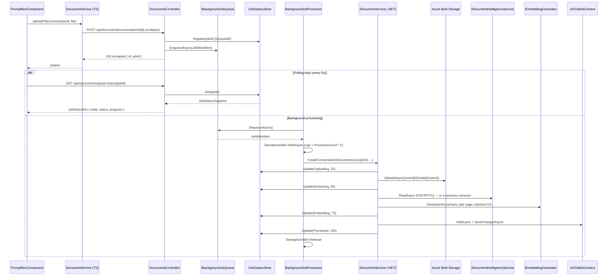

# Document Upload Workflow

End-to-end design for the conversation document upload feature: how a file moves from the Angular UI into Azure Blob Storage, through text extraction and embedding generation, into SQL Server with vector pages — and how the UI tracks progress while it happens.

**Audience:** engineers maintaining or extending document upload, RAG ingestion, or background-job infrastructure.

**Owning code:**
- Frontend: [`enterprise-ui/src/app/components/home/prompt-box/`](../../enterprise-ui/src/app/components/home/prompt-box/) and [`enterprise-ui/src/app/services/document.service.ts`](../../enterprise-ui/src/app/services/document.service.ts)
- API controller: [`enterprise-gpt-api/Enterprise.Gpt.Api/Controllers/DocumentsController.cs`](../../enterprise-gpt-api/Enterprise.Gpt.Api/Controllers/DocumentsController.cs)
- Background pipeline: [`enterprise-gpt-api/Enterprise.Gpt.Service/BackgroundJobs/`](../../enterprise-gpt-api/Enterprise.Gpt.Service/BackgroundJobs/)
- Processing: [`enterprise-gpt-api/Enterprise.Gpt.Service/DocumentService.cs`](../../enterprise-gpt-api/Enterprise.Gpt.Service/DocumentService.cs)

---

## 1. Overview

When a user attaches one or more files to a chat message, each file is uploaded asynchronously: the API returns a job id immediately and the UI polls for status until the file is fully processed (uploaded to blob, text extracted, embeddings generated, persisted to SQL with `SqlVector<float>` columns). Only then is the file considered ready for the chat completion to reference.

The pipeline is fully in-process — no Hangfire, no external broker. It runs on .NET's built-in `BackgroundService` with a `Channel<T>` queue and a `SemaphoreSlim` cap on concurrent jobs. Status is tracked in an in-memory singleton; durability across API restarts is intentionally not guaranteed (the user re-attaches the file).

---

## 2. End-to-end sequence



---

## 3. Frontend

### 3.1 Triggering upload

The user attaches files via the prompt box. Each file becomes a `FileUploadDto` (`{ id, name, size, file, status?, progress? }`) tracked in component state. When the user sends the message, [`prompt-box.component.ts`](../../enterprise-ui/src/app/components/home/prompt-box/prompt-box.component.ts) iterates the attached files and calls the upload service for each.

[`document.service.ts`](../../enterprise-ui/src/app/services/document.service.ts) wraps the request:

```typescript
uploadFile(conversationId: string, file: File): Observable<JobDto> {
  const formData = new FormData();
  formData.append('file', file);
  return this.http.post<JobDto>(
    `${environment.apiUrl}documents/conversations/${conversationId}`,
    formData,
  );
}
```

The MSAL HTTP interceptor attaches the bearer token automatically (see [`enterprise-ui/src/app/app.config.ts`](../../enterprise-ui/src/app/app.config.ts) and the `protectedResourceMap` in `MSALInterceptorConfigFactory`).

### 3.2 Polling for status

After the POST returns `JobDto { id }`, the component starts an RxJS polling loop in `startJobPolling`:

```typescript
interval(this.JOB_POLLING_INTERVAL_MS) // 5000 ms
  .pipe(
    switchMap(() => this.documentService.getUploadStatus(job)),
    takeUntilDestroyed(this.destroyRef),
    takeWhile(
      (status) =>
        status.state !== JobState.Succeeded &&
        status.state !== JobState.Failed,
      true,
    ),
  )
  .subscribe(...);
```

`takeWhile(..., true)` keeps the **terminal** emission so the success/failure handler runs once. The polling subscription is stored in `jobPollingSubscriptions` keyed by file id and disposed on completion or `destroyRef`.

Per-file outcomes:
- `state === Succeeded` → resolve, mark `attachedFile.status = result.status` (i.e. `'Processed'`).
- `state === Failed` → reject with the backend's `result.status` (i.e. `'Failed'`).
- Otherwise (Processing) → update `attachedFile.progress` and continue polling.

### 3.3 Wire-shape contracts

```typescript
// JobDto.ts
export interface JobDto { id: string; }

// JobStatusDto.ts
export interface JobStatusDto {
  id: string;
  state: string;     // 'Enqueued' | 'Processing' | 'Succeeded' | 'Failed'
  status: string;    // 'Queued' | 'Uploading' | 'Extracting' | 'Embedding' | 'Processed' | 'Failed'
  progress: number;  // 0..100
}
```

`state` is the coarse pipeline phase (the UI uses it for terminal detection); `status` is the fine-grained pipeline stage (rendered as the user-facing label).

---

## 4. API surface

[`DocumentsController`](../../enterprise-gpt-api/Enterprise.Gpt.Api/Controllers/DocumentsController.cs) exposes two relevant endpoints; both require Bearer authentication.

### 4.1 `POST /api/documents/conversations/{conversationId}`

Multipart `IFormFile` upload. Returns `202 Accepted` with `JobDto { id }`.

Critical implementation details:

1. The file bytes are read into memory (`ReadFileAsync` → `byte[]`) **on the request thread**. The work delegate captures this byte array, so the request can return immediately while the bytes survive in the closure.
2. `_tokenService.GetOid()` resolves the user's object id **on the request thread** — the background scope has no `HttpContext`. The captured `oid` is used inside the delegate.
3. A new `Guid.NewGuid().ToString()` is the job id. It is registered with `IJobStatusStore` *before* enqueueing so the very first poll has something to read.
4. The delegate resolves `IDocumentService` from the per-job DI scope. It does not resolve `ITokenService` from the background scope.

```csharp
var jobId = Guid.NewGuid().ToString();
var oid = _tokenService.GetOid();
_jobStatusStore.Register(jobId);

await _backgroundJobQueue.EnqueueAsync(new JobWorkItem(
    jobId,
    async (sp, ct) =>
    {
        var documentService = sp.GetRequiredService<IDocumentService>();
        await documentService.CreateConversationDocumentAsync(jobId, fileData, oid, conversationId, ct);
    }), cancellationToken);

return Accepted(new JobDto { Id = jobId });
```

### 4.2 `GET /api/documents/upload-status/{jobId}`

Reads the in-memory snapshot. Returns `404` if the job id is unknown or its terminal snapshot has been evicted by retention.

```csharp
var snapshot = _jobStatusStore.Get(jobId);
if (snapshot is null) return NotFound();

return Ok(new JobStatusDto
{
    Id = jobId,
    State = MapState(snapshot.Status),     // see § 7
    Status = snapshot.Status.ToString(),
    Progress = snapshot.Progress
});
```

---

## 5. Background pipeline

All four pieces live under [`Enterprise.Gpt.Service/BackgroundJobs/`](../../enterprise-gpt-api/Enterprise.Gpt.Service/BackgroundJobs/). They are wired in [`Program.cs`](../../enterprise-gpt-api/Enterprise.Gpt.Api/Program.cs):

```csharp
builder.Services.AddSingleton<IBackgroundJobQueue, BackgroundJobQueue>();
builder.Services.AddSingleton<IJobStatusStore, JobStatusStore>();
builder.Services.AddHostedService<BackgroundJobProcessor>();
```

### 5.1 `BackgroundJobQueue`

Singleton wrapper around `Channel<JobWorkItem>` configured `SingleReader = true, SingleWriter = false`. Producers (request threads) call `EnqueueAsync`; the single consumer (`BackgroundJobProcessor`) calls `DequeueAsync`. The channel is unbounded — there is no backpressure on the API thread today. If queue depth becomes a concern, switch to `Channel.CreateBounded` with `BoundedChannelFullMode.Wait`.

### 5.2 `JobStatusStore`

`ConcurrentDictionary<string, JobStatusSnapshot>` plus a `Timer` that periodically evicts terminal snapshots (`Processed` or `Failed`) older than `BackgroundJobs:RetentionMinutes` (default 60). A snapshot in a non-terminal state is *never* evicted, so a stuck job will accumulate memory — this is acceptable because terminal states are reached quickly and reliably (success or `Fail` from the processor's catch block).

### 5.3 `BackgroundJobProcessor`

A `BackgroundService` with three responsibilities:

1. **Dequeue** the next `JobWorkItem` from the channel (blocks until one arrives).
2. **Throttle** via `SemaphoreSlim _gate` whose initial+max count is `BackgroundJobs:MaxConcurrent` (or `Environment.ProcessorCount * 2` when configured as `0`). `WaitAsync` blocks dequeuing until a slot frees.
3. **Process** the job in a per-job DI scope (`IServiceScopeFactory.CreateAsyncScope()`). Exceptions are caught, logged, and converted to a `Failed` snapshot — they never tear down the loop.

Tracking in-flight tasks:

```csharp
var inFlight = new ConcurrentDictionary<Task, byte>();

while (!stoppingToken.IsCancellationRequested)
{
    var item = await _queue.DequeueAsync(stoppingToken);
    await _gate.WaitAsync(stoppingToken);

    var task = ProcessAsync(item, stoppingToken);
    inFlight[task] = 0;
    _ = task.ContinueWith(t => inFlight.TryRemove(t, out _), TaskScheduler.Default);
}

await Task.WhenAll(inFlight.Keys); // graceful drain on shutdown
```

The `ContinueWith` is fire-and-forget — its only job is to remove completed tasks from the in-flight set so memory doesn't grow unboundedly during long-running services.

### 5.4 Why a singleton store + scoped DocumentService?

`DocumentService` depends on `AIChatDbContext` (scoped). `BackgroundService` instances are themselves singletons, so they cannot inject scoped services directly — `IServiceScopeFactory` is required. The status store, by contrast, is intentionally a singleton: it must be addressable by both the request thread (to register and read) and the background scope (to update).

---

## 6. DocumentService — what runs inside the job

[`CreateConversationDocumentAsync`](../../enterprise-gpt-api/Enterprise.Gpt.Service/DocumentService.cs) executes the actual pipeline. Status checkpoints are reported via `IJobStatusStore.Update` at four phases (the initial `Queued/0` is set by the controller's `Register` call):

| Phase        | Progress | What happens |
|--------------|---------:|--------------|
| `Uploading`  |     `25` | Upload bytes to Azure Blob Storage at `{userId}/{chatId}/{fileName}` with metadata |
| `Extracting` |     `50` | Dispatch by file extension (see § 6.1) to extract per-page text |
| `Embedding`  |     `75` | Generate one embedding vector per page via `IEmbeddingGenerator`, batched 10 at a time |
| `Processed`  |    `100` | Persist `ConversationDocument` + `ConversationDocumentPage[]` rows (with `SqlVector<float>` embeddings) and return the DTO |

The method does **not** wrap its body in try/catch. Any exception bubbles to `BackgroundJobProcessor.ProcessAsync`, which logs and marks the job `Failed` with the exception message.

### 6.1 Text extraction dispatch

`ExtractTextAsync` chooses an extractor by `FileExtensions` enum value:

| Extensions | Extractor |
|---|---|
| `cs, csproj, css, html, js, json, jsx, log, md, ps1, py, scss, sql, ts, tsx, txt, xml, yaml, yml` | `[FromKeyedServices("common")] IFileService` |
| `csv, xls, xlsm, xlsx` | `[FromKeyedServices("excel")] IFileService` |
| `pdf, pptx` | `IDocumentIntelligenceService` (Azure AI Document Intelligence) |
| `doc, docx` | `[FromKeyedServices("word")] IFileService` |
| anything else | throws `InvalidOperationException` |

Each extractor returns `List<DocumentExtractorDto>` keyed by page number; embeddings are generated per page so the RAG index can score at page granularity.

### 6.2 Embedding batching

The loop generates up to 10 embeddings concurrently before draining and starting the next batch:

```csharp
var tasks = new List<Task<PageEmbeddingDto>>();
foreach (var documentExtractor in documentExtractors)
{
    tasks.Add(GeneratePageEmbeddingAsync(documentExtractor, cancellationToken));
    if (tasks.Count == 10) { /* await all, drain into documentPages, clear */ }
}
if (tasks.Count > 0) { /* drain remainder */ }
```

Empty pages are sent as the literal string `"EMPTY PAGE"` to keep the per-page row contract uniform.

### 6.3 Persistence

The final write is a single `SaveChangesAsync` covering `ConversationDocument` + all of its `ConversationDocumentPage` children. Each page row stores the embedding as a SQL Server `vector` column via `SqlVector<float>`, so KNN search can run server-side.

---

## 7. Status model

### 7.1 Backend enum

```csharp
public enum JobStatus
{
    Queued = 1, Uploading = 2, Extracting = 3,
    Embedding = 4, Processed = 5, Failed = 6,
}
```

Defined in [`Enterprise.Gpt.Dto/Enums/JobStatus.cs`](../../enterprise-gpt-api/Enterprise.Gpt.Dto/Enums/JobStatus.cs). Numeric values are stable — do not renumber.

### 7.2 `state` derivation

The DTO's `state` field is a coarser projection used by the UI to detect "is this job still running?" without enumerating every fine-grained stage:

| `JobStatus` | `state` |
|---|---|
| `Queued` | `Enqueued` |
| `Uploading`, `Extracting`, `Embedding` | `Processing` |
| `Processed` | `Succeeded` |
| `Failed` | `Failed` |

Mapped by `DocumentsController.MapState`. The vocabulary mirrors the legacy Hangfire job-state names so the existing frontend continued to work after the Hangfire removal — keep this contract stable unless you also update the Angular `JobState` enum.

### 7.3 Retention

Terminal snapshots stay queryable for `BackgroundJobs:RetentionMinutes` (default 60). After eviction, polling returns `404`. The frontend's `takeWhile` already terminates on `Succeeded`/`Failed`, so eviction only affects late polls (e.g. a tab that was backgrounded for an hour).

---

## 8. Configuration

[`appsettings.json`](../../enterprise-gpt-api/Enterprise.Gpt.Api/appsettings.json):

```json
"BackgroundJobs": {
  "MaxConcurrent": 0,        // 0 → Environment.ProcessorCount * 2
  "RetentionMinutes": 60     // terminal snapshot TTL
}
```

`AzureStorage:DocumentsContainer` (the blob container name) is read inside `DocumentService`. `DocumentIntelligence:Endpoint` / `:ApiKey` are required for PDF/PPTX uploads.

---

## 9. Failure handling

| Failure | Where caught | What the user sees |
|---|---|---|
| Unsupported file extension | `ExtractTextAsync` throws `InvalidOperationException` | Polling returns `Status: "Failed"`, `State: "Failed"`. Polling subscription completes; the UI rejects its promise. |
| Blob upload error | Azure SDK throws | Same as above; processor logs + marks failed. |
| Embedding generator transient error | Throws after retries exhausted | Same as above. |
| `OperationCanceledException` from host shutdown | Processor's catch block | Job marked `Failed` with message `"Job cancelled during host shutdown."` |
| Frontend HTTP error during polling | `httpInterceptor` toasts via `NotificationService`; the polling `error` callback marks the file `Failed` locally. |

The processor never lets one bad job kill the loop — `ProcessAsync` is wrapped in a try/catch/finally and always releases the semaphore.

---

## 10. Extending the workflow

| Change | Where to edit |
|---|---|
| Add a new file extension | Add to `FileExtensions` enum, then add a case in `DocumentService.ExtractTextAsync` |
| Change concurrency cap | `BackgroundJobs:MaxConcurrent` in `appsettings.json` |
| Persist job status across restarts | Replace `JobStatusStore` with an EF-backed implementation behind the same `IJobStatusStore` interface; add a migration. The interface is intentionally sized for this swap. |
| Push status instead of poll | Add a SignalR hub; have `JobStatusStore.Update` raise an event the hub handler subscribes to. Keep the polling endpoint for clients that can't hold a WebSocket. |
| Backpressure on the queue | Switch `BackgroundJobQueue` to `Channel.CreateBounded(...)` with `BoundedChannelFullMode.Wait`. The controller's `EnqueueAsync` will then await capacity. |
| Per-user throttle | Wrap `_gate.WaitAsync` with a per-user semaphore looked up in a `ConcurrentDictionary<Guid, SemaphoreSlim>`. Acquire the user gate first, then the global gate. |

---

## 11. Operational notes

- **Endpoint authorization:** both routes require Bearer auth; the upload route additionally trusts whatever conversation id the client sends. There is no server-side check that the caller owns the conversation today.
- **Container creation:** `AzureStorage:DocumentsContainer` is assumed to exist; nothing in `DocumentService` creates it.
- **No retries:** if a job fails, the user must retry by re-attaching the file. There is no exponential-backoff retry layer.
- **No max file size enforcement** beyond ASP.NET's default request limits; revisit if very large PDFs become common.
- **In-flight jobs are lost on restart.** A job that hasn't reached `Processed`/`Failed` when the API restarts has no record after restart — the status endpoint will return `404` and the UI's polling will report a request failure.
