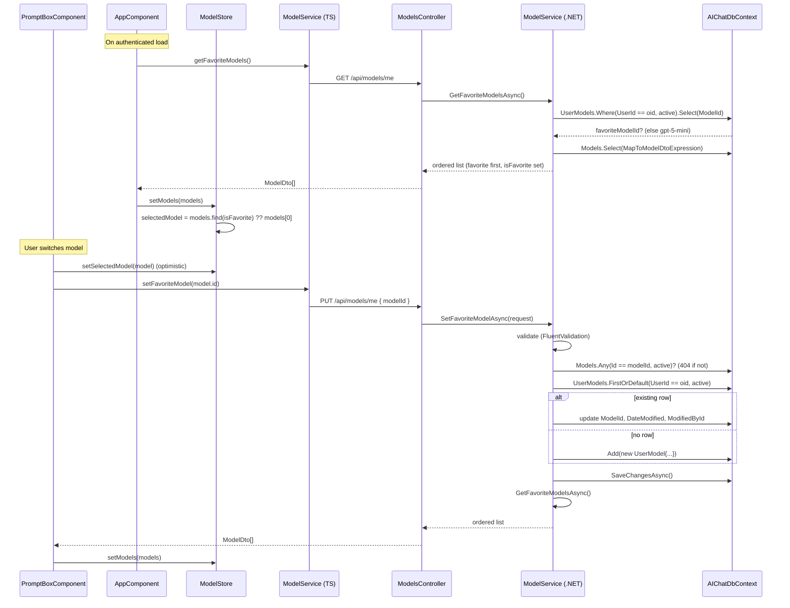

# Favorite Model

End-to-end design for per-user model preference: how the chat UI remembers the
last model a user picked, persists it server-side as a single row, and
pre-selects it on the next visit.

**Audience:** engineers maintaining or extending model selection, user
preferences, or the chat prompt toolbar.

**Owning code:**
- Frontend: [`enterprise-ui/src/app/components/home/prompt-box/prompt-box.component.ts`](../../enterprise-ui/src/app/components/home/prompt-box/prompt-box.component.ts), [`enterprise-ui/src/app/store/model.store.ts`](../../enterprise-ui/src/app/store/model.store.ts), [`enterprise-ui/src/app/services/model.service.ts`](../../enterprise-ui/src/app/services/model.service.ts), [`enterprise-ui/src/app/app.component.ts`](../../enterprise-ui/src/app/app.component.ts)
- API controller: [`enterprise-gpt-api/Enterprise.Gpt.Api/Controllers/ModelsController.cs`](../../enterprise-gpt-api/Enterprise.Gpt.Api/Controllers/ModelsController.cs)
- Service: [`enterprise-gpt-api/Enterprise.Gpt.Service/ModelService.cs`](../../enterprise-gpt-api/Enterprise.Gpt.Service/ModelService.cs)
- Entity + mapping: [`enterprise-gpt-api/Enterprise.Gpt.Entity/UserModel.cs`](../../enterprise-gpt-api/Enterprise.Gpt.Entity/UserModel.cs), [`enterprise-gpt-api/Enterprise.Gpt.Repository/Configurations/UserModelConfiguration.cs`](../../enterprise-gpt-api/Enterprise.Gpt.Repository/Configurations/UserModelConfiguration.cs), [`enterprise-gpt-api/Enterprise.Gpt.Service/Mappers/ModelMapper.cs`](../../enterprise-gpt-api/Enterprise.Gpt.Service/Mappers/ModelMapper.cs)

---

## 1. Overview

Each user has at most one **active** `Core.UserModel` row — their favorite,
i.e. the last model they picked in the UI. Two endpoints expose it:

- `GET /api/models/me` — all models, favorite first, each carrying
  `isFavorite`. Called once on app load.
- `PUT /api/models/me { modelId }` — upserts the single favorite row and
  returns the same favorite-first list. Called every time the user switches
  models.

If the user has never picked a model, the seeded **gpt-5-mini** model is
treated as the implicit favorite so the contract (favorite always first) holds
from the very first request.

The original `GET /api/models` (plain, unordered) is unchanged and still
available for any non-preference caller.

---

## 2. End-to-end sequence



---

## 3. Frontend

### 3.1 Load

[`app.component.ts`](../../enterprise-ui/src/app/app.component.ts) →
`loadDataIfAuthenticated()` `forkJoin`s `modelService.getFavoriteModels()`
(swapped from `getModels()`) alongside user/conversation/mcp/file-extension
fetches, then calls `modelStore.setModels(models)`.

[`model.store.ts`](../../enterprise-ui/src/app/store/model.store.ts)
`setModels` selects the favorite explicitly:

```ts
patchState(store, {
  models,
  selectedModel: models.find((m) => m.isFavorite) ?? models[0] ?? null,
});
```

The backend already returns the favorite first, so `find(isFavorite)` and
`models[0]` agree — the `find` makes the selection robust to ordering.

### 3.2 Switch

The model dropdown in
[`prompt-box.component.html`](../../enterprise-ui/src/app/components/home/prompt-box/prompt-box.component.html)
calls `onModelChange(model)`:

```ts
onModelChange(model: ModelDto): void {
  this.modelStore.setSelectedModel(model);              // optimistic, snappy UI
  this.modelService
    .setFavoriteModel(model.id)
    .pipe(takeUntilDestroyed(this.destroyRef))
    .subscribe((models) => this.modelStore.setModels(models));
}
```

The store updates immediately so the toolbar reflects the choice without
waiting on the network. The PUT response (favorite-first list) is fed back
into `setModels`, keeping `isFavorite` flags and ordering authoritative.
Errors are surfaced by the global `httpInterceptor` — no per-call handling.

The bearer token is attached automatically by the class-based
`MsalInterceptor` (URLs under `environment.apiUrl`).

### 3.3 Wire-shape contract

```typescript
// dtos/ModelDto.ts
export interface ModelDto {
  id: string;
  name: string;
  aiServiceId: string;   // pre-existing field; not populated by this endpoint
  isFavorite: boolean;
}
```

> `aiServiceId` predates this feature and is not returned by the backend
> `ModelDto` — left untouched to avoid scope creep.

---

## 4. API surface

[`ModelsController`](../../enterprise-gpt-api/Enterprise.Gpt.Api/Controllers/ModelsController.cs)
— all routes require Bearer auth (class-level `[Authorize]`).

### 4.1 `GET /api/models/me`

Returns `200 OK` with `ModelDto[]`, favorite first, each with `isFavorite`.
No body. Falls back to seeded gpt-5-mini as favorite when the user has no row.

### 4.2 `PUT /api/models/me`

Body: `{ "modelId": "<guid>" }` (`SetFavoriteModelActionDto`). Upserts the
single active `UserModel` row for the caller and returns the same shape as
`GET /me`.

- `400` — `modelId` empty/missing (`SetFavoriteModelActionDtoValidator`,
  surfaced via `ValidationExceptionHandler` as `ErrorDto`).
- `404` — `modelId` is unknown or deactivated (`NotFoundException`).

The `GET /api/models` plain list endpoint is unchanged.

---

## 5. Service-level logic

[`ModelService`](../../enterprise-gpt-api/Enterprise.Gpt.Service/ModelService.cs)
(scoped, `AIChatDbContext` injected directly; `IValidator<SetFavoriteModelActionDto>`
injected for the PUT).

**`GetFavoriteModelsAsync`:** resolve caller `oid` → look up active
`UserModel.ModelId` → fall back to
`ModelDefaults.DefaultModelId` (gpt-5-mini) when none → project all models via
`ModelMapper.MapToModelDtoExpression` → in-memory set `IsFavorite` and order
`OrderByDescending(IsFavorite).ThenBy(Name)`.

**`SetFavoriteModelAsync`:** `ValidateAndThrowAsync` → guard the target model
exists and is active (`NotFoundException` otherwise) → find the user's active
row; update it in place, or `_ctx.Add` a new one → `SaveChangesAsync` →
delegate to `GetFavoriteModelsAsync` so the response shape has a single
source of truth.

The seeded default id lives in
[`Enterprise.Gpt.Common/Constants/ModelDefaults.cs`](../../enterprise-gpt-api/Enterprise.Gpt.Common/Constants/ModelDefaults.cs)
to keep it in sync with the `ModelConfiguration` seed GUID.

---

## 6. Persistence model

`Core.UserModel` (`UserModel : BaseModifiedByEntity`) — `Id`, `UserId`,
`ModelId`, plus base audit/soft-delete/rowversion columns. FKs to `Core.User`
(`UserId`, `CreatedById`, `ModifiedById`) and `Core.Ref.Model` (`ModelId`),
all `DeleteBehavior.NoAction` (global default).

**Single favorite per user** is enforced by a unique filtered index:

```
IX_UserModel_UserId  UNIQUE  WHERE [DateDeactivated] IS NULL
```

So there is at most one *active* row per user. The upsert updates that row
rather than inserting a second one; the filter still permits historical
soft-deleted rows if a future change starts soft-deleting instead of updating
in place.

Migration: `20260517170000_AddUserModel` (auto-applied at startup via
`context.Database.Migrate()` in `Program.cs`).

> This migration + the model snapshot were authored by hand because the build
> environment had no .NET SDK. Regenerate parity with
> `dotnet ef migrations` in a full SDK environment before relying on a future
> `migrations add` diff.

---

## 7. Failure handling

| Failure | Where caught | Result |
|---|---|---|
| `modelId` empty/missing on PUT | `SetFavoriteModelActionDtoValidator` → `ValidationExceptionHandler` | `400` + `ErrorDto.errors[]` |
| Unknown / deactivated `modelId` | `ModelService` throws `NotFoundException` | `404` + `ErrorDto` |
| Unauthenticated request | `[Authorize]` / `TokenService.GetOid()` | `401` |
| Frontend HTTP error (load or switch) | global `httpInterceptor` | toast via `NotificationService`; switch keeps optimistic store value |
| Concurrent double-switch | unique filtered index + in-place update of the single active row | last write wins; no duplicate active rows |

---

## 8. Extending

| Change | Where to edit |
|---|---|
| Change the no-favorite default model | `Enterprise.Gpt.Common/Constants/ModelDefaults.cs` (and the seed GUID in `ModelConfiguration` if the model itself changes) |
| Keep favorite history instead of one row | soft-delete the old `UserModel` (`DateDeactivated`) and insert a new one instead of updating in place — the filtered unique index already supports this |
| Per-conversation model instead of per-user | add `ConversationId` to `UserModel` (or a new entity) and change the unique index; update `Get/SetFavoriteModelsAsync` to key by conversation |
| Surface `aiServiceId` in the picker | add it to backend `ModelDto` + `ModelMapper` projection (currently a frontend-only, unpopulated field) |
