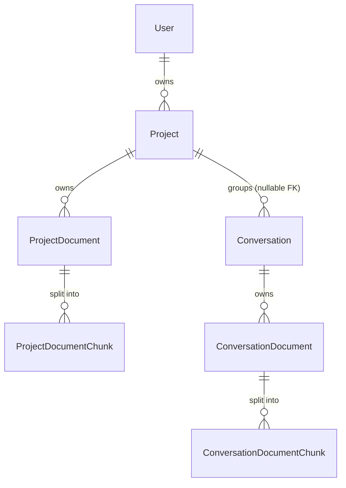
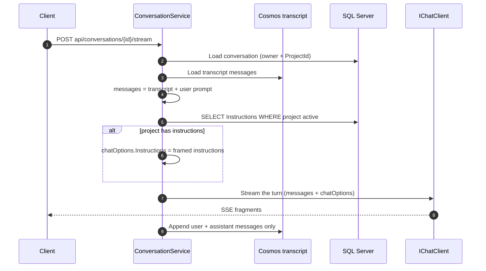

# Projects

End-to-end reference for the project feature: a user-owned container that groups conversations, owns its own document set, and carries standing instructions that reach the model on every turn inside it. Covers the data model, the `api/projects` surface, how a conversation joins or leaves a project, how instructions are injected at chat time, the delete cascade, and how the schema reaches a real database. Audience: engineers maintaining or extending projects, conversations, or the document pipeline they share.

## 1. Overview

A **project** is three things bundled behind one row:

1. **A grouping.** `Core.Conversation` gained a nullable `ProjectId`. A conversation is either standalone (`null`, the behaviour that existed before) or inside exactly one project.
2. **A shared document set.** Documents uploaded into a project live in `Core.ProjectDocument` and are meant to be visible to every conversation in it — as opposed to a conversation document, which stays private to the conversation it was uploaded into. See §10.1 before relying on that visibility: **nothing reads either kind of chunk yet.**
3. **Standing instructions.** Free text on the project that is read **fresh on every turn** and carried on the request's `ChatOptions.Instructions`, never injected into the transcript (§5).

Ownership is the entire authorization model. A project, its documents and its conversations all carry the same `UserId` (the caller's Entra oid), every query filters on it, and a project belonging to someone else is reported as `404`, never `403` (§3.3). There is no administrative view of another user's projects and no permission gate on `api/projects` — the one permission involved is `Upload File`, on the upload route, which is inherited from the existing document pipeline (§6).

What projects deliberately do **not** change: the ingestion pipeline (same extractors, same 512-token/128-overlap chunking, same job status route), the conversation transcript in Cosmos DB, and the permission model.

### 1.1 Data model at a glance



`ProjectDocument`/`ProjectDocumentChunk` are **siblings** of the conversation pair, not the same tables with a nullable owner. Both document types derive from [`BaseDocument`](../../enterprise-gpt-api/Enterprise.Gpt.Entity/BaseDocument.cs) and both chunk types from [`BaseDocumentChunk`](../../enterprise-gpt-api/Enterprise.Gpt.Entity/BaseDocumentChunk.cs), so the columns are identical; only the owning foreign key differs. The reason for two tables is stated on [`ProjectDocument`](../../enterprise-gpt-api/Enterprise.Gpt.Entity/ProjectDocument.cs): one table with two nullable owner columns would make every future retrieval query filter on "which owner column is set" instead of on an indexed foreign key, and the two have genuinely different visibility rules.

### 1.2 Where each piece lives

| Concern | Where |
|---|---|
| Project CRUD + document listing/removal | [`ProjectEndpoints`](../../enterprise-gpt-api/Enterprise.Gpt.Api/Endpoints/ProjectEndpoints.cs) → [`ProjectService`](../../enterprise-gpt-api/Enterprise.Gpt.Service/ProjectService.cs) |
| Uploading **into** a project | [`DocumentEndpoints`](../../enterprise-gpt-api/Enterprise.Gpt.Api/Endpoints/DocumentEndpoints.cs) → [`DocumentService`](../../enterprise-gpt-api/Enterprise.Gpt.Service/DocumentService.cs) (§6) |
| Attaching a conversation to a project | [`ConversationEndpoints`](../../enterprise-gpt-api/Enterprise.Gpt.Api/Endpoints/ConversationEndpoints.cs) → [`ConversationService`](../../enterprise-gpt-api/Enterprise.Gpt.Service/ConversationService.cs) (§4) |
| Instructions at chat time | `ConversationService.StreamConversationCoreAsync` + [`ConversationPrompts`](../../enterprise-gpt-api/Enterprise.Gpt.Service/Prompts/ConversationPrompts.cs) (§5) |
| Schema | The EF model only — no migration, no DDL script (§8.3) |

Upload lives on the documents group rather than under `api/projects` on purpose: both owner types then share one size limit, one permission filter, and — most importantly — the **single** `GET api/documents/upload-status/{jobId}` route, so a client polls project and conversation uploads with identical code.

## 2. Quick start

```http
POST /api/projects
Authorization: Bearer <token>
Content-Type: application/json

{ "name": "Q3 Pricing", "description": "Pricing review", "instructions": "Answer in British English. Prefer tables over prose." }
```

```http
201 Created
Location: /api/projects/9c1f1c8e-6a1e-4c1a-9f7a-2b3c4d5e6f70
```

Then upload a document into it, and start a conversation inside it:

```http
POST /api/documents/projects/9c1f1c8e-6a1e-4c1a-9f7a-2b3c4d5e6f70   (multipart/form-data, field "file")
→ 202 Accepted, Location: /api/documents/upload-status/{jobId}

POST /api/conversations   { "projectId": "9c1f1c8e-6a1e-4c1a-9f7a-2b3c4d5e6f70" }
→ the conversation's turns now carry the project's instructions
```

Poll `GET /api/documents/upload-status/{jobId}` exactly as for a conversation upload — see [Document Upload and Ingestion §7](../documents/upload-workflow.md) for the status model.

## 3. API surface

Every route lives in the `api/projects` group with `RequireAuthorization()`, so an anonymous request gets `401` before any handler runs. There is **no** `PermissionEndpointFilter` on this group (§3.3).

| Verb | Route | Success | Failure modes |
|---|---|---|---|
| GET | `/api/projects?name=&skip=&take=&isFavorite=` | `200 PaginatedResponseDto<ProjectSummaryDto>` — the caller's active projects, newest first | 400 a query parameter that will not bind (paging is clamped, not rejected — §3.2) |
| GET | `/api/projects/{id:guid}` | `200 ProjectDto` | 404 unknown, deactivated, or owned by someone else |
| POST | `/api/projects` | `201 ProjectDto` + `Location: /api/projects/{id}` | 400 validation **or duplicate name** |
| PUT | `/api/projects/{id:guid}` | `200 ProjectDto` | 400 validation or duplicate name, 404 unknown/foreign |
| PUT | `/api/projects/{id:guid}/favorite` | `204` | 400 malformed body, 404 unknown/foreign (§3.5) |
| DELETE | `/api/projects/{id:guid}` | `204` — soft delete plus cascade (§7) | 404 unknown/foreign/already deleted |
| GET | `/api/projects/{id:guid}/documents` | `200 ProjectDocumentDto[]` — active documents, newest first, **unpaginated** | 404 unknown/foreign project |
| DELETE | `/api/projects/{projectId:guid}/documents/{documentId:guid}` | `204` — soft-deletes the document and its chunks | 404 unknown/foreign project or document |

Uploading is a fourth route on a different group (§6):

| Verb | Route | Access | Success | Failure modes |
|---|---|---|---|---|
| POST | `/api/documents/projects/{projectId:guid}` | authenticated **+ `Upload File`** | `202 Accepted`, `Location: /api/documents/upload-status/{jobId}`, body `JobDto { id }` | 400 validation, 400 upload too large, 403 missing permission, 404 unknown/foreign project |

Error bodies are **RFC 9457 Problem Details** (`application/problem+json`), with `type` URIs from [`ProblemTypes`](../../enterprise-gpt-api/Enterprise.Gpt.Api/Problems/ProblemTypes.cs) — opaque identifiers to match verbatim, not links to follow:

| Status | `type` | Raised by |
|---|---|---|
| 400 | `/problems/validation-error` | the create/update validators, and the duplicate-name rule (§3.4) — carries `errors` keyed by property name |
| 400 | `/problems/upload-too-large` | `MaxUploadSizeEndpointFilter` on the upload route — carries `maxBytes` |
| 403 | `/problems/permission-required` | `PermissionEndpointFilter` on the upload route — carries `permissions: ["Upload File"]` |
| 404 | `/problems/resource-not-found` | `NotFoundException` — unknown, deactivated, or foreign project or document |
| 400 | the RFC 9110 status-section link | a binding failure on `?isFavorite=` or the favourite route's body — neither has a validator, so neither carries an `errors` dictionary (§3.5) |
| 401 | the RFC 9110 status-section link | the authentication challenge, given a body by `app.UseStatusCodePages()` |

Every problem also carries `traceId` and `instance`.

### 3.1 Wire shapes

[`ProjectDto`](../../enterprise-gpt-api/Enterprise.Gpt.Dto/ProjectDto.cs) — returned by `GET/POST/PUT` on a single project:

```json
{
  "id": "9c1f1c8e-6a1e-4c1a-9f7a-2b3c4d5e6f70",
  "name": "Q3 Pricing",
  "description": "Pricing review",
  "instructions": "Answer in British English. Prefer tables over prose.",
  "isFavorite": false,
  "dateCreated": "2026-08-01T09:14:23.117+00:00",
  "dateModified": "2026-08-01T09:14:23.117+00:00"
}
```

`ProjectSummaryDto` is the same shape **minus `instructions`**, and is what the listing returns. That omission is deliberate and enforced in the projection ([`ProjectMapper.MapToProjectSummaryDtoExpression`](../../enterprise-gpt-api/Enterprise.Gpt.Service/Mappers/ProjectMapper.cs)): instructions are the largest field on the type, no listing renders them, and a full page would otherwise ship up to a hundred instruction bodies. It is a server-side projection, so the column is never even read.

`isFavorite` sits on `ProjectSummaryDto`, not on `ProjectDto` — and `ProjectDto : ProjectSummaryDto`, so every project route carries it regardless of which shape it returns (§3.5).

The listing is wrapped in the existing `PaginatedResponseDto<T>` (`items`, `totalCount`, `pageSize`, `currentPage`, computed `totalPages`).

[`ProjectDocumentDto`](../../enterprise-gpt-api/Enterprise.Gpt.Dto/ProjectDocumentDto.cs) carries no chunk or embedding data — a document listing must never drag the vector column across the wire:

```json
{
  "id": "1b2c3d4e-...",
  "projectId": "9c1f1c8e-...",
  "documentId": "1b2c3d4e-...",
  "name": "pricing.pdf",
  "extension": ".pdf",
  "mimeType": "application/pdf",
  "size": 184320,
  "dateCreated": "2026-08-01T09:15:02.400+00:00"
}
```

`documentId` is a computed alias of `id`, present so a client can key this listing the same way it keys the `documentId` the upload-status response returns on success.

Request DTOs — [`ProjectActions.cs`](../../enterprise-gpt-api/Enterprise.Gpt.Dto/Actions/Project/ProjectActions.cs). `CreateProjectActionDto` and `UpdateProjectActionDto` are `record`s with the same three fields (`name`, `description`, `instructions`); the update DTO carries **no id** — it comes from the route. `SetProjectFavoriteActionDto` is a fourth, single-field record (`isFavorite`) that neither of them carries — see §3.5 for why it is its own DTO rather than a fourth field on the update one.

| Field | Rule | Why the cap |
|---|---|---|
| `name` | `NotEmpty`, ≤ 256 | matches `Core.Project.Name`; a longer value would fail as a truncation error at save time instead of as a validation problem |
| `description` | ≤ 1024 | matches `Core.Project.Description`. Never sent to the model |
| `instructions` | ≤ 8000 | **not** a storage limit — the column is `nvarchar(max)`. The text is prepended to every turn, so without a cap one project could consume the model's context window on every message and displace the conversation itself |

> **`PUT /api/projects/{id}` is a full-representation replace.** An omitted `description` or `instructions` **clears** the stored value — [`ProjectMapper.FromUpdateProjectActionDtoToProject`](../../enterprise-gpt-api/Enterprise.Gpt.Service/Mappers/ProjectMapper.cs) assigns all three fields unconditionally. A client that means to rename a project must echo the current description and instructions back. The same trap applies, with worse consequences, to `PUT /api/conversations` — see §4.1.

### 3.2 Paging is clamped, not validated

`skip` and `take` come straight off the query string and are clamped in `ProjectService.SearchProjectsAsync`: `skip` to `>= 0`, `take` to `1..100`. They are *not* validated, because rejecting them would turn a cosmetic client bug into a `400` — and because `take = 0` would divide by zero when computing `currentPage`. `?take=0` therefore returns one project, not a `500`.

Ordering is `DateCreated DESC, Id DESC`. The id tiebreak is load-bearing: `DateCreated` alone is not a total order, so two projects created in the same tick could straddle a page boundary and be duplicated or skipped.

The `name` filter is a `LIKE '%value%'` — case-insensitive under the database's default collation. It is **not** wildcard-escaped, so a `%` or `_` typed by the user behaves as a wildcard against that user's own projects (§10.4).

### 3.3 No permission gate, and 404 instead of 403

`api/projects` carries no `PermissionEndpointFilter`. A project is owned the way a conversation is: every service method starts from `ITokenService.GetOid()` and every query filters `x.UserId == userId && !x.DateDeactivated.HasValue`. Adding a permission would gate *whether a user may have projects at all*, which is not the question being asked.

A project that exists but belongs to someone else is reported as `404 /problems/resource-not-found` with the same message as one that never existed — `LogAndCreateNotFound` builds both. The cases are deliberately indistinguishable so the endpoints cannot be used to probe for other users' project ids. This matches the posture the conversation and document endpoints already take.

### 3.4 Duplicate names: two guards, one response

A user cannot hold two **active** projects with the same name. Two mechanisms enforce it and both produce the identical `400`:

1. `EnsureNameIsAvailableAsync` checks up front, so the normal case gets a clean validation problem.
2. The **filtered unique index** `IX_Project_UserId_Name ... WHERE DateDeactivated IS NULL` is the real guard. Two requests racing both pass the check; the loser hits the index, and `SaveTranslatingDuplicateNameAsync` catches `DbUpdateException` whose inner `SqlException.Number` is `2601` or `2627` and re-throws the same `ValidationException`.

That catch is narrowed to the duplicate-key numbers on purpose: a timeout, a deadlock or a broken foreign key are real faults and must not be reported to the caller as a naming problem.

```json
{
  "type": "/problems/validation-error",
  "title": "One or more validation errors occurred.",
  "status": 400,
  "instance": "/api/projects",
  "traceId": "00-a1b2c3d4e5f60718293a4b5c6d7e8f90-1122334455667788-01",
  "errors": { "Name": ["A project named 'Q3 Pricing' already exists."] }
}
```

The `errors` key is the **property name**, identical on the create and update DTOs, so one client-side binding serves both paths. Because the index is filtered on `DateDeactivated IS NULL`, deleting a project frees its name immediately (`DeleteProject_ThenRecreateWithTheSameName_Succeeds` pins this), and names are per-user: two users may both own a "Research" project.

### 3.5 Favourites — `PUT /api/projects/{id}/favorite` and `?isFavorite=`

```http
PUT /api/projects/{id}/favorite
{ "isFavorite": true }
→ 204 No Content
```

It mirrors the conversation favourite route ([Conversation Usage and Favourites §5.2](../conversations/usage-and-favorites.md#52-favourites--put-apiconversationsidfavorite)) down to the reasoning: it is its own route rather than a field on `PUT /api/projects/{id}`, which is a **full-representation replace** (§3.1's callout). A client renaming a project without echoing the flag back would otherwise silently un-favourite it — the same trap, and the same fix.

Two deliberate omissions, again matching the conversation route:

- **`DateModified` is not bumped.** `SetProjectFavoriteAsync` runs a set-based `ExecuteUpdateAsync` with one `SetProperty`, not the tracked load-and-save `UpdateProjectAsync` uses, because starring a project does not modify it — bumping the timestamp would put every client's cached copy out of step at the next fetch over a write that changes nothing a listing renders.
- **No FluentValidation validator.** `IsFavorite` is a `bool`, so the only 400 it can produce is a binding failure, which carries no `errors` dictionary — the route is `.ProducesProblem(400)`, not `.ProducesValidationProblem()`.

It is a **set, not a toggle**: the body carries the state being asked for, so a retried or duplicated request cannot land on the opposite value from the one the caller intended.

`GET /api/projects` takes an optional `isFavorite`: `true` returns only favourites, `false` only non-favourites, and **omitting it applies no filter at all** — it is a `bool?`, not a defaulted `bool`. The filter is applied **before** `CountAsync`, so `totalCount` describes the filtered set rather than the whole listing, the same ordering `SearchConversationsAsync` uses for its own filters.

**No index was added for `IsFavorite`, deliberately** — see [`ProjectConfiguration`](../../enterprise-gpt-api/Enterprise.Gpt.Repository/Configurations/ProjectConfiguration.cs)'s comment. `Core.Conversation` carries a favourites-aware index only because its *unfiltered* listing already seeks an ordered `(UserId, DateDeactivated, DateCreated DESC)` sibling that the favourites variant has to stay in parity with. `IX_Project_UserId_DateDeactivated` (§8.1) carries no `DateCreated`, so the unfiltered project listing already sorts *after* its seek — a favourites index would buy the *filtered* listing an ordered path the unfiltered one lacks, paid for on every project write. `IsFavorite` stays a residual predicate over one user's projects, which is a bounded set.

## 4. Putting a conversation in a project

`ProjectId` is set through the conversation API, not the project API — a project never adopts conversations, conversations join it.

| Route | Field | Behaviour |
|---|---|---|
| `POST /api/conversations` | `projectId` (optional) | Creates the conversation inside the project. Omitted ⇒ standalone |
| `PUT /api/conversations` | `projectId` (optional) | **Replaces** the value — see §4.1 |
| `GET /api/conversations/{id}`, `GET /api/conversations/search` | `projectId` on `ConversationDto` | Reports which project the conversation is in, or `null` |
| `GET /api/conversations/search?projectId=` | query parameter | Lists **one project's** conversations — see §4.2 |

Both action DTOs validate `ProjectId` with `NotEmpty().When(x => x.ProjectId.HasValue)`: only "omitted" and "a real id" are meaningful shapes, and an explicit all-zeros guid is a client bug that would otherwise reach the ownership check and come back as a confusing `404`.

Ownership is verified by `ConversationService.EnsureProjectExistsAsync` on create, on update **and on the listing filter**, which requires an active project with the caller's `UserId` and throws `NotFoundException` otherwise — again `404`, not `403`, for the reason in §3.3. On create the check runs *before* the transaction opens, so a bad `projectId` creates nothing at all.

### 4.1 `PUT /api/conversations` is a full-representation replace

> **This is the most surprising part of the contract.** `UpdateConversationActionDto` carries `id`, `name` and `projectId`, and the update writes all three:
>
> ```csharp
> .ExecuteUpdateAsync(s => s
>     .SetProperty(x => x.Name, request.Name)
>     .SetProperty(x => x.ProjectId, request.ProjectId)
>     .SetProperty(x => x.DateModified, date), …)
> ```
>
> **An omitted `projectId` removes the conversation from its project.** A client that only means to rename a conversation must echo the current project id back, or the rename silently orphans it. There is no `PATCH`.

Removal is the *only* way this is expressed, which is why it is not an accident: sending `{ "id": …, "name": …, "projectId": null }` is how a client takes a conversation out of a project. The alternative — treating `null` as "leave unchanged" — would leave no way to express removal at all without a second route.

**This is the trap the rebuilt client is written against.** The deleted `enterprise-ui/` had two rename call sites that passed only the id and the new name, either of which would have silently ejected a conversation from its project the moment a project UI shipped. Nothing was migrated, so the defect went with it — and the replacement at `enterprise-gpt-ui/` turned the rule into an acceptance criterion instead: US-304 requires a rename to echo the current `projectId`, and US-307 requires **every** update path to build its body through one `toUpdateBody()` helper, so no caller can omit it by accident. **Both have now landed**, and the helper is what the move flow itself goes through — the one path that legitimately sends `null`, and therefore the one that must never let an `undefined` reach the body ([Conversation Actions §4.1](../ui/conversation-actions.md#41-toupdatebody-and-the-full-representation-put)).

### 4.2 Listing one project's conversations — `?projectId=`

`GET /api/conversations/search` takes an optional `projectId` that narrows the caller's own active conversations to one project, in the same envelope, alongside the existing `name`, `isFavorite` and paging parameters. A project that is unknown, deactivated or another user's answers **`404`, not an empty page** — the same posture as the single-project route (§3.3), so the listing cannot be used to probe for project ids.

That check matters most for a **deactivated** project. The cascade in §7 sets `ProjectId = NULL` on every conversation the project held, so a filter with no existence check would answer a perfectly cheerful empty page for a project that had rows before it was deleted.

There is deliberately **no** `GET /api/projects/{id}/conversations`. The story allowed either shape, and one filter on the existing route means one paging contract, one ordering rule and one place the ownership check lives, rather than a second listing to keep in step with the first.

Full reference, including why no new index was needed: [Conversation Usage and Favourites §5.4](../conversations/usage-and-favorites.md#54-filtering-the-search--projectid-us-907).

## 5. Instructions at chat time

When a conversation belongs to a project, `ConversationService.StreamConversationCoreAsync` reads that project's `Instructions` and carries them on the turn's **`ChatOptions.Instructions`** — not as a message in the transcript.



Five properties are worth understanding, and each exists for a reason:

**Read per turn, never snapshotted.** The instructions are fetched on every turn instead of being copied into the transcript when the conversation is created. Editing a project's instructions therefore affects conversations that already exist, and moving a conversation between projects swaps which instructions apply. `StreamConversationAsync_ProjectInstructionsEdited_TheNextTurnUsesTheNewText` pins this.

**Never written to Cosmos.** The transcript is the conversation's own record, not derived context. Persisting the instructions would both duplicate them on every turn and freeze the text that was current at the time — defeating the previous point.

**Carried on the request, not injected into the message list.** `CreateChatOptionsAsync` sets the property alongside `ModelId` and the MCP tools:

```csharp
if (!string.IsNullOrWhiteSpace(projectInstructions))
{
    chatOptions.Instructions = ConversationPrompts.BuildProjectInstructionsPrompt(projectInstructions);
}
```

`ChatOptions.Instructions` is the channel Microsoft.Extensions.AI defines for exactly this, and each provider adapter maps it onto its own instruction slot. Two things follow. The message list stays equal to the transcript — no derived context is smuggled into it, so what the model receives as history is what Cosmos stores. And the placement question disappears: nothing has to reason about where in the message array a user-authored instruction may sit relative to the platform system prompt. The framing text (below) is what states the rank instead.

**Fenced by a per-call unguessable marker.** [`ConversationPrompts.BuildProjectInstructionsPrompt`](../../enterprise-gpt-api/Enterprise.Gpt.Service/Prompts/ConversationPrompts.cs) wraps the text with a delimiter minted per call:

```csharp
var delimiter = $"<<<project-instructions:{Guid.NewGuid():N}>>>";
return string.Format(CultureInfo.InvariantCulture, ProjectInstructionsPromptTemplate, instructions, delimiter);
```

A fixed delimiter such as `---` can be reproduced inside the instruction body, letting the text appear to close its own block and continue as if it were part of the frame. A fresh guid cannot be predicted by the author of the instructions. The template ([`project-instructions-prompt.md`](../../enterprise-gpt-api/Enterprise.Gpt.Service/Prompts/project-instructions-prompt.md), copied to the output directory) states the rank explicitly — the instructions "rank below the platform system prompt governing this conversation", do not override safety, privacy or AI-disclosure obligations, and only the exact closing marker ends the block. The user text is a `string.Format` **argument**, not part of the format string, so braces inside it are never re-interpreted. Note that this is the one prompt template that *is* a format string: a literal brace added to that file must be doubled, or every project conversation throws `FormatException`.

**Skipped whenever there is nothing to say.** No project, a deactivated project, or null/whitespace instructions all leave `ChatOptions.Instructions` null — not set to an empty string. `GetProjectInstructionsAsync` filters on `!x.DateDeactivated.HasValue`, so a deleted project stops influencing any conversation that outlived it (which, after the cascade in §7, should be none — the belt-and-braces case is a conversation whose `ProjectId` write was rolled back).

Ownership is not re-checked when reading the instructions: the caller has already been matched to the conversation, and a project can only ever hold that same user's conversations.

## 6. Uploading documents into a project

`POST /api/documents/projects/{projectId}` sits on the documents group and reuses every piece of the conversation upload path — see [Document Upload and Ingestion](../documents/upload-workflow.md) for the pipeline itself. What it inherits verbatim:

- The `Upload File` permission gate (`PermissionEndpointFilter.Require(PermissionIds.UploadFile)`) and `.DisableAntiforgery()`.
- `MaxUploadSizeEndpointFilter.Require(maxFileSizeBytes)`, reading the same `Documents:MaxFileSizeBytes`.
- The same `UploadedFileValidator` — extension, magic bytes, size, name.
- The same six supported formats, the same 512-token/128-overlap chunking, the same 1536-dimension embeddings.
- The same `JobStatus` progression (`Queued → Uploading → Extracting → Chunking → Embedding → Persisting → Processed`/`Failed`) polled through the **same** `GET /api/documents/upload-status/{jobId}` route, scoped to the user who queued the job.

The `Upload File` permission's seeded description was widened to "Upload documents into a conversation or a project." — the grant itself is unchanged, and it is still `IsDefault = true`.

What differs is exactly three things:

| | Conversation upload | Project upload |
|---|---|---|
| Ownership check | active conversation owned by caller | active project owned by caller |
| Blob key | `{userId}/{conversationId}/{documentId}{ext}` | `{userId}/projects/{projectId}/{documentId}{ext}` |
| Persisted entity | `ConversationDocument` + `ConversationDocumentChunk` | `ProjectDocument` + `ProjectDocumentChunk` |

The literal `projects` segment is what keeps the two key spaces from ever colliding: both are `{userId}/{ownerId}/…` and conversation and project ids are unrelated guids. Blob metadata carries `projectId` where the conversation path carries `conversationId`.

Internally, `DocumentService` was refactored rather than duplicated. `IngestAsync` runs the owner-agnostic half (store → extract → chunk → embed, including the best-effort blob cleanup when anything after the upload fails) and returns an `IngestionResult`; `BuildChunks<TChunk>` materializes either chunk type from it; `EnqueueAsync` registers the job and queues the work, marking a registered-but-unqueued job `Failed` so retention can reclaim it. The two `Create…DocumentAsync` methods are left with the ownership-specific parts only.

**A conversation upload never becomes a project document**, even when the conversation is inside a project. The two routes write to different tables and neither reads the other; `ConversationUpload_InAProjectConversation_DoesNotBecomeAProjectDocument` pins it. "Attach this file to the whole project" and "attach it to this chat" stay distinct actions.

## 7. Delete semantics

`DELETE /api/projects/{id}` soft-deletes four things and hard-deletes nothing:

| Rows | What happens |
|---|---|
| `Core.ProjectDocumentChunk` for the project's documents | `DateDeactivated` set |
| `Core.ProjectDocument` for the project | `DateDeactivated` set |
| `Core.Conversation` with this `ProjectId` | `ProjectId` set to `NULL`, `DateModified` bumped — **the conversations survive** |
| `Core.Project` | `DateDeactivated` and `DateModified` set |

All four run as `ExecuteUpdateAsync` statements inside **one explicit transaction**. They need it: a partial failure would otherwise leave conversations pointing at a deleted project, or chunks alive under a deleted document.

**Conversations are released, not deleted.** They keep their own documents and transcripts and simply become standalone, losing access to the project's documents and instructions. Deleting a project is a filing decision, not a data-destruction one, and a user who deleted a project would not expect months of chat history to go with it. Already-deactivated conversations are cleared too (the filter is `ProjectId == id`, with no `DateDeactivated` condition), so a future restore cannot resurrect a link to a deleted project.

`DELETE /api/projects/{projectId}/documents/{documentId}` is the same pattern one level down: chunks then document, in one transaction, after confirming both the project and the document belong to the caller.

**Blobs are never removed.** The original file stays in the container: the row is only soft-deleted, and reclaiming storage belongs to a retention job that can also handle blobs orphaned by failed ingestions (§10.5). A blob whose *ingestion* failed is still deleted immediately by the pipeline's own cleanup.

Deleting an already-deleted project is a `404`, not a silent success — the existence check runs first.

## 8. Database schema

Four schema changes, all in the `Core` schema. Every foreign key is `NoAction` (the model-wide rule in `EnterpriseGptDbContext`), soft delete is a nullable `DateDeactivated` with **no query filter**, and concurrency is the `rowversion Version` column — the conventions the rest of the database already follows.

### 8.1 Tables

**`Core.Project`** — [`Project`](../../enterprise-gpt-api/Enterprise.Gpt.Entity/Project.cs), [`ProjectConfiguration`](../../enterprise-gpt-api/Enterprise.Gpt.Repository/Configurations/ProjectConfiguration.cs)

| Column | Type | Null | Notes |
|---|---|---|---|
| `Id` | `uniqueidentifier` | no | PK |
| `UserId` | `uniqueidentifier` | no | FK → `Core.User(Id)`; the owner's Entra oid |
| `Name` | `nvarchar(256)` | no | unique among the owner's active projects |
| `Description` | `nvarchar(1024)` | yes | never sent to the model |
| `Instructions` | `nvarchar(max)` | yes | capped at 8000 characters by validation, not by the column (§3.1) |
| `IsFavorite` | `bit` | no | `DEFAULT 0`; set only through `PUT /api/projects/{id}/favorite`, never through the full-representation project `PUT` (§3.5) |
| `DateCreated` / `DateModified` | `datetimeoffset` | no | `BaseModifiedEntity` |
| `DateDeactivated` | `datetimeoffset` | yes | soft delete |
| `Version` | `rowversion` | no | optimistic concurrency |

Indexes: `IX_Project_UserId_DateDeactivated` (`UserId`, `DateDeactivated`) — projects are always listed for one user, filtered to active; and `IX_Project_UserId_Name` (`UserId`, `Name`) `UNIQUE WHERE DateDeactivated IS NULL` (§3.4). No index carries `IsFavorite`, deliberately (§3.5) — the reasoning lives as a comment on [`ProjectConfiguration`](../../enterprise-gpt-api/Enterprise.Gpt.Repository/Configurations/ProjectConfiguration.cs) rather than in a second place here.

**`Core.ProjectDocument`** — `ProjectId` (FK → `Core.Project`) plus the `BaseDocument` columns (`UserId`, `Name`, `Extension`, `MimeType`, `Size`, `Path`). Indexes: `IX_ProjectDocument_ProjectId_DateDeactivated`, and `IX_ProjectDocument_UserId` (EF's index for the user foreign key).

**`Core.ProjectDocumentChunk`** — `ProjectDocumentId` (FK → `Core.ProjectDocument`) plus the `BaseDocumentChunk` columns: `Index`, nullable `SourceNumber`, `TokenCount`, `Text nvarchar(max)`, and `Embedding vector(1536)`. One index: `IX_ProjectDocumentChunk_ProjectDocumentId_Index` `UNIQUE WHERE DateDeactivated IS NULL` — chunk ordinals are dense and unique per document, and the filter keeps soft-deleted rows from blocking a re-ingestion of the same document.

The vector width is fixed by the column, exactly as for conversation chunks: the deployment behind `AzureOpenAI:EmbeddingModel` **must** return 1536-dimension vectors. Moving to a model of a different width is a schema change, not a config change.

**`Core.Conversation.ProjectId`** — new nullable `uniqueidentifier`, FK → `Core.Project(Id)`, with `IX_Conversation_ProjectId_DateDeactivated`. That index is the one the cascade in §7 reads. It was **not** extended with `DateCreated` when §4.2's filter arrived: that query is owner-scoped too, so the engine seeks the `(UserId, DateDeactivated, DateCreated DESC)` listing index and gets the ordering off it for free, leaving `ProjectId` a residual predicate over one user's conversations. A second ordered path would cost every conversation write and buy a listing that already has one.

### 8.2 `ConversationConfiguration` — the first one

[`ConversationConfiguration`](../../enterprise-gpt-api/Enterprise.Gpt.Repository/Configurations/ConversationConfiguration.cs) is new, and `Conversation` had never had an `IEntityTypeConfiguration` before: the rest of its mapping still comes from data annotations on the entity. It exists because an **optional** foreign key and its index cannot be expressed in annotations without making the `Project` navigation required. Do not read its arrival as a decision to migrate `Conversation` off annotations — the file configures the project edge and nothing else.

All four configurations are registered explicitly in `EnterpriseGptDbContext.OnModelCreating`; there is no assembly scan, so a new configuration that is not added there is silently ignored.

### 8.3 Applying the schema

> **This section is stale and describes the pre-migration world.** `Repository/Migrations/` now holds seven migrations, `Database.Migrate()` at startup applies them, and the Project tables have been part of that history since `20260811024339_InitialCreate` — the whole feature, not just this section's premise, predates the switch to migrations. `IsFavorite` itself reached the schema through `20260820050001_AddProjectIsFavorite`, an ordinary `AddColumn` migration, not through any of the manual steps below. The rest of this section — generating a DDL script, the `QUOTED_IDENTIFIER`/`ANSI_NULLS` caveat, the `HasData` seed note — applies only to a database that predates `InitialCreate` and has no `__EFMigrationsHistory` to baseline from; see [Model Management §9](../models/model-management.md) for what baselining one looks like.
>
> The paragraphs immediately below are kept as written for that narrower audience — a database that predates `InitialCreate`.

Before Projects can be used against such a database, the four changes in §8.1 have to be applied by whatever process manages the schema in that environment. The EF model is the source of truth for exactly what to apply; the fastest way to read it out is:

```csharp
// against a SqlServer-provider DbContext, with UseCompatibilityLevel(170)
var ddl = context.Database.GenerateCreateScript();
```

That emits the whole schema, so the Project tables, their indexes, and the `Core.Conversation.ProjectId` column and foreign key have to be lifted out of it. Two things to carry across when doing so:

- **`SET QUOTED_IDENTIFIER ON` and `SET ANSI_NULLS ON` first.** Two of the new indexes are filtered (`… WHERE DateDeactivated IS NULL`), and `sqlcmd` connects with `QUOTED_IDENTIFIER OFF` — unlike SSMS and ADO.NET — so `CREATE INDEX … WHERE` fails with msg 1934 without it. The generated script does not set them for you.
- **SQL Server 2025 or later is required.** The `Embedding` column uses the native `vector` type; older engines reject it, and the application pins `UseCompatibilityLevel(170)` anyway.

The `Upload File` permission's seeded description also changed — it now reads "Upload documents into a conversation or a project." That value lives in `PermissionConfiguration`'s `HasData`, which only reaches databases built by `EnsureCreated`, so an existing database keeps the old wording until someone updates the row. Nothing depends on the text.

**Neither test harness needs any of this.** Both build the schema from the EF model via `EnsureCreated`, so `dotnet test` passes regardless of what any real database looks like — which is also why schema drift cannot fail the build.

## 9. Testing

`dotnet test --filter "Category!=Integration"` currently reports **1290 passing unit tests**; the integration project holds **290** and needs Docker.

Unit tests — xUnit v3 with NSubstitute; services taking a `DbContext` run on SQLite in-memory via `SqliteDbContextFixture`:

| File | Covers |
|---|---|
| [`Services/ProjectServiceTests.cs`](../../enterprise-gpt-api/tests/Enterprise.Gpt.Unit.Test/Services/ProjectServiceTests.cs) | Search (owner scoping, substring filter, paging + total, clamping as a theory, instructions omitted from listings); get/update/delete against unknown, deactivated and foreign projects; duplicate names across active, deleted and other users' projects; the delete cascade over documents, chunks and conversations, and that other projects are untouched; document listing and per-document deletion; `?isFavorite=` requested true, requested false, omitted (both returned) and combined with `?name=` (§3.5); `SetProjectFavoriteAsync` setting and clearing the flag, leaving `DateModified` where it was, and throwing `NotFound` for an unknown, deactivated or foreign project without touching the row; a rename leaving an already-favourited project's flag alone |
| [`Endpoints/ProjectEndpointsTests.cs`](../../enterprise-gpt-api/tests/Enterprise.Gpt.Unit.Test/Endpoints/ProjectEndpointsTests.cs) | Each handler's `TypedResults` shape — `Ok`, `Created` with the `Location`, `NoContent` — and the default page when no query string is supplied; `isFavorite` passed through to the service on the listing, and `SetProjectFavoriteAsync` returning `NoContent` |
| [`Mappers/ProjectMapperTests.cs`](../../enterprise-gpt-api/tests/Enterprise.Gpt.Unit.Test/Mappers/ProjectMapperTests.cs), [`Mappers/ProjectDocumentMapperTests.cs`](../../enterprise-gpt-api/tests/Enterprise.Gpt.Unit.Test/Mappers/ProjectDocumentMapperTests.cs) | Materialized and expression forms agreeing (the compiled expression is asserted against the hand-written map), and the summary projection carrying everything **but** instructions; `isFavorite` carried through both mapper forms in either state, as a theory, so a mapper that hard-coded `true` could not pass by accident; the update mapper leaving a favourited project's flag untouched |
| [`Services/DocumentServiceTests.cs`](../../enterprise-gpt-api/tests/Enterprise.Gpt.Unit.Test/Services/DocumentServiceTests.cs) | Project queue path (ownership, deactivated/unknown project, validation before the queue is touched, failed enqueue marking the job `Failed`) and ingestion (document + chunks persisted, project-scoped blob key, `projectId` blob metadata, every stage reported, blob removed when ingestion fails) — plus both directions of the isolation check, that a project upload never writes conversation documents and vice versa |
| [`Services/ConversationServiceTests.cs`](../../enterprise-gpt-api/tests/Enterprise.Gpt.Unit.Test/Services/ConversationServiceTests.cs) | Create/update with and without `projectId`, foreign and deactivated projects throwing `NotFound` and changing nothing, and the streaming path: instructions sent **after** the platform prompt, a deactivated project sending none, an edit taking effect on the next turn, a standalone conversation and an instruction-less project adding no message, and instructions never reaching the transcript. §4.2's filter adds six: only that project's conversations, its **deactivated** ones excluded, `projectId` and `name` applied together, a foreign project and a deactivated one each throwing `NotFound`, and an omitted filter returning standalone and project conversations alike |
| [`Endpoints/DocumentEndpointsTests.cs`](../../enterprise-gpt-api/tests/Enterprise.Gpt.Unit.Test/Endpoints/DocumentEndpointsTests.cs) | `202` pointing at the shared status route, and the buffered file reaching the service |

Integration tests ([`ProjectEndpointsIntegrationTests.cs`](../../enterprise-gpt-api/tests/Enterprise.Gpt.Integration.Test/Endpoints/ProjectEndpointsIntegrationTests.cs) and the project half of [`DocumentEndpointsIntegrationTests.cs`](../../enterprise-gpt-api/tests/Enterprise.Gpt.Integration.Test/Endpoints/DocumentEndpointsIntegrationTests.cs)) run against `WebApplicationFactory<Program>` plus a Testcontainers **SQL Server 2025** instance, so the filtered unique indexes, the `vector` column and the transaction are exercised for real. They cover: 401 anonymous; cross-user isolation on read, update and delete; clamped paging; instructions absent from listings; duplicate names within a user and allowed across users; the full replace on `PUT`; moving a conversation into a project and the omitted-`projectId` removal; the delete cascade keeping conversations; recreating a project with a deleted project's name; and the project upload path end to end — 403 without the grant, 404 for unknown/foreign projects, 400 for unsupported and oversize files, the pipeline persisting chunks, the project-scoped blob key, the document appearing in the listing, both delete paths deactivating chunks, same-name uploads not colliding, and a text-free file failing the job with an explanation. A `#region Favorites` block (§3.5) adds a `PUT .../favorite` round trip through a real database — marking a project and reading it back through `?isFavorite=true`, clearing the flag and asserting `DateModified` did not move, renaming a favourited project and finding the star still set, 404 for an unknown project and for one owned by another user (leaving it unstarred either way), and the filter omitted returning both favourited and plain projects alike.

Two pieces of harness were needed:

- **[`FakeAzureCosmosService`](../../enterprise-gpt-api/tests/Enterprise.Gpt.Integration.Test/TestInfrastructure/FakeAzureCosmosService.cs)** — an in-memory `IAzureCosmosService`. Without it every conversation write blocked until the Cosmos SDK gave up on the configured emulator address (~25 s) and the endpoint answered 500, which is what made conversation-writing endpoints untestable at the integration level at all. `PatchItemAsync` deliberately does **not** interpret the patch operations — JSON-patch semantics are exactly what a fake gets subtly wrong; it reports whether the document existed (the value production code branches on) and records the operations for assertions. Transcript *content* assertions belong in the unit tests, which substitute the interface outright.
- **A `DateTimeOffset` ↔ UTC-ticks value converter** in [`SqliteRowVersionModelCustomizer`](../../enterprise-gpt-api/tests/Enterprise.Gpt.Unit.Test/TestInfrastructure/SqliteRowVersionModelCustomizer.cs). The SQLite provider refuses to translate `DateTimeOffset` in `ORDER BY` and comparisons, because two rows can carry the same instant under different offsets — so the paged, `DateCreated`-ordered project search threw. Every value the application writes is `DateTimeOffset.UtcNow`, so the round trip is lossless here.

## 10. Known limits and gaps

### 10.1 Project documents reach answers only through retrieval

**Project document chunks are read by the `document_search` tool**, which searches a conversation's own documents and, when it is in a project, that project's as well. The scoping this feature was designed around is what makes that safe: `ProjectDocumentChunk` rows are reachable only through `ProjectDocument.ProjectId`, and the project is read from the conversation row rather than accepted from a caller, so "only conversations in the project can see the project's documents" is a `WHERE` clause on an indexed column. A deactivated project drops out of the scope entirely, even though its conversations still point at it. Outside ingestion and retrieval, the only code that touches `ProjectDocumentChunks` is the soft-delete cascade in §7.

Two caveats worth knowing before promising users the feature: retrieval needs a **tool-enabled model** — on one that cannot call tools it is skipped with a warning, and the answer is ungrounded — and it needs SQL Server 2025 or Azure SQL Database, so it cannot be exercised against the LocalDB connection string in `appsettings.json`. Project instructions (§5) have neither constraint; they reach every model on every turn. [Document Retrieval (RAG)](../documents/retrieval.md) is the full reference.

### 10.2 `GET /api/projects/{id}/documents` is unpaginated

It returns a `List<ProjectDocumentDto>` for every active document in the project. That is fine for the tens-of-documents case and wrong for the thousands-of-documents case, and there is no per-project document cap to stop the latter. Add `skip`/`take` and a `PaginatedResponseDto<T>` wrapper before that becomes real; the endpoint is the only consumer of the projection, so the change is local.

### 10.3 The frontend, and what it still does not cover

The old `enterprise-ui/` client is deleted, and its project scaffolding — a stray `projectId` signal, a menu item routing to a `/projects` path that had no route, and an `UpsertProjectActionDto` that did not match this API — went with it. Nothing was migrated, so the rebuilt client's DTOs are written fresh against the shapes in §2 rather than corrected.

**EP-9 has since shipped the whole area** in `enterprise-gpt-ui/` — the grid, the lifecycle dialogs, the detail screen with its standing instructions and files panel, a composer that creates conversations inside a project, US-307's move flow, and US-908's conversations panel on §4.2's filter. See [Projects (UI)](../ui/projects.md).

One API-side gap the client works around rather than closes: `GET api/projects` accepts no sort parameter, so both the grid and the root lookup **drain** to a 500-project ceiling and say so when they hit it (US-902 waits on US-706). The other has since closed: `ProjectSummaryDto` now carries `isFavorite` (§3.5), and US-910 put a star on the grid card, on the detail header, and a **Favorite projects** section in the sidebar that reads it — [Projects (UI) §5.7](../ui/projects.md#57-favourites-us-909-and-why-the-flip-is-not-optimistic), [Shell and Navigation §5.7](../ui/shell-and-navigation.md#57-favourite-projects-in-the-sidebar-us-910).

### 10.4 Everything else

- **The `name` filter is not wildcard-escaped.** `%` and `_` typed into `?name=` act as `LIKE` wildcards. The blast radius is one user's own project list, so this is a papercut rather than a vulnerability, but escape it if the filter is ever reused across users.
- **Blobs of soft-deleted project documents are never reclaimed.** Deleting a document or a project leaves the original file in the container; there is no reaper (§7).
- **No reactivation.** `DateDeactivated` is never cleared, and every read filters on it, so a deleted project is unreachable through the API. Its name is immediately reusable, though, so recreating one is cheap.
- **No quotas.** Nothing limits how many projects a user may create, how many documents a project may hold, or how many conversations may join one.
- **Instructions are capped by character count, not tokens.** 8000 characters is roughly 2000 tokens for English prose and considerably more for CJK or code. Nothing subtracts them from the model's `ContextWindowSize` budget, so a maximal instruction body on a small-context model eats into the room available for the conversation.
- **Concurrency on the project row is unguarded at the API level.** `PUT` loads the tracked entity and saves it; two concurrent updates race on the `rowversion` and the loser surfaces as `DbUpdateConcurrencyException` → 500. The same gap the model catalog has ([Model Management §9](../models/model-management.md)).
- **The project delete cascade is not resumable.** It is one transaction, so it is atomic, but a project with a very large number of documents runs four unbounded `ExecuteUpdate` statements inside it. Batch them if project sizes ever justify it.

## 11. Key files

| Concern | File |
|---|---|
| Endpoints | [`Enterprise.Gpt.Api/Endpoints/ProjectEndpoints.cs`](../../enterprise-gpt-api/Enterprise.Gpt.Api/Endpoints/ProjectEndpoints.cs) |
| Upload route | [`Enterprise.Gpt.Api/Endpoints/DocumentEndpoints.cs`](../../enterprise-gpt-api/Enterprise.Gpt.Api/Endpoints/DocumentEndpoints.cs) |
| Business logic | [`Enterprise.Gpt.Service/ProjectService.cs`](../../enterprise-gpt-api/Enterprise.Gpt.Service/ProjectService.cs) |
| Ingestion (shared) | [`Enterprise.Gpt.Service/DocumentService.cs`](../../enterprise-gpt-api/Enterprise.Gpt.Service/DocumentService.cs) |
| Conversation membership + instruction injection | [`Enterprise.Gpt.Service/ConversationService.cs`](../../enterprise-gpt-api/Enterprise.Gpt.Service/ConversationService.cs) |
| Instruction framing | [`Prompts/ConversationPrompts.cs`](../../enterprise-gpt-api/Enterprise.Gpt.Service/Prompts/ConversationPrompts.cs), [`Prompts/project-instructions-prompt.md`](../../enterprise-gpt-api/Enterprise.Gpt.Service/Prompts/project-instructions-prompt.md) |
| Mapping | [`Mappers/ProjectMapper.cs`](../../enterprise-gpt-api/Enterprise.Gpt.Service/Mappers/ProjectMapper.cs), [`Mappers/ProjectDocumentMapper.cs`](../../enterprise-gpt-api/Enterprise.Gpt.Service/Mappers/ProjectDocumentMapper.cs) |
| Response DTOs | [`ProjectDto.cs`](../../enterprise-gpt-api/Enterprise.Gpt.Dto/ProjectDto.cs), [`ProjectDocumentDto.cs`](../../enterprise-gpt-api/Enterprise.Gpt.Dto/ProjectDocumentDto.cs) |
| Request DTOs + validators | [`Actions/Project/ProjectActions.cs`](../../enterprise-gpt-api/Enterprise.Gpt.Dto/Actions/Project/ProjectActions.cs), [`Actions/Chat/ConversationActions.cs`](../../enterprise-gpt-api/Enterprise.Gpt.Dto/Actions/Chat/ConversationActions.cs) |
| Entities | [`Project.cs`](../../enterprise-gpt-api/Enterprise.Gpt.Entity/Project.cs), [`ProjectDocument.cs`](../../enterprise-gpt-api/Enterprise.Gpt.Entity/ProjectDocument.cs), [`ProjectDocumentChunk.cs`](../../enterprise-gpt-api/Enterprise.Gpt.Entity/ProjectDocumentChunk.cs), [`Conversation.cs`](../../enterprise-gpt-api/Enterprise.Gpt.Entity/Conversation.cs) |
| EF configuration | [`ProjectConfiguration.cs`](../../enterprise-gpt-api/Enterprise.Gpt.Repository/Configurations/ProjectConfiguration.cs), [`ProjectDocumentConfiguration.cs`](../../enterprise-gpt-api/Enterprise.Gpt.Repository/Configurations/ProjectDocumentConfiguration.cs), [`ProjectDocumentChunkConfiguration.cs`](../../enterprise-gpt-api/Enterprise.Gpt.Repository/Configurations/ProjectDocumentChunkConfiguration.cs), [`ConversationConfiguration.cs`](../../enterprise-gpt-api/Enterprise.Gpt.Repository/Configurations/ConversationConfiguration.cs) |
| DI + route mapping | [`Enterprise.Gpt.Api/Program.cs`](../../enterprise-gpt-api/Enterprise.Gpt.Api/Program.cs) |
| Related reference | [Document Upload and Ingestion](../documents/upload-workflow.md), [Conversation Usage and Favourites](../conversations/usage-and-favorites.md) (the search route §4.2 extends), [Projects (UI)](../ui/projects.md), [Model Management](../models/model-management.md), [Permission Cache](../permissions/permission-cache.md) |
