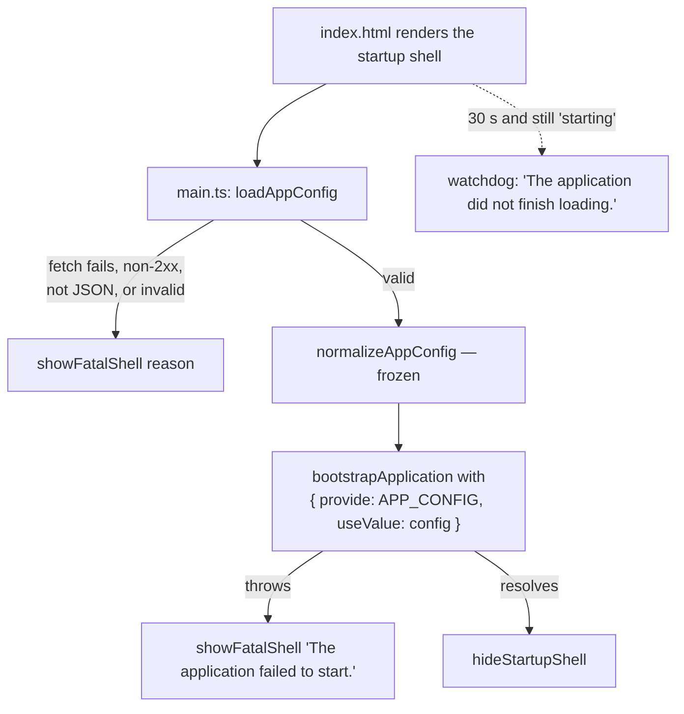

# Frontend Foundation

Reference for the two layers every other screen in the rebuilt Angular client is written on top of: the **runtime configuration** that decides where the app points and whether it starts at all, and the **error layer** that turns every failure — an `HttpClient` rejection, a raw `fetch` response, a thrown string — into one typed value. Audience: engineers writing stories against `enterprise-gpt-ui/`, and whoever deploys it.

Covers [US-101, US-102 and US-103](../prd/enterprise-ui-rebuild.md#ep-1-foundation-and-application-shell) of the frontend rebuild PRD. Companion to the [Conversation Streaming Contract](../conversations/streaming-contract.md), whose transport is the main non-`HttpClient` consumer of everything described here.

> **Directory note.** The PRD calls the client `enterprise-ui/`. The code lives at **`enterprise-gpt-ui/`**, and that drift is an accepted decision — the old `enterprise-ui/` was deleted rather than migrated, so there is no ambiguity about which tree is live. Every path in this document is relative to the repository root.

## 1. Why this exists

The previous client could not read the framed SSE stream and was deleted rather than repaired. Rebuilding from an empty `ng new` bought the chance to fix two things that were structural rather than incidental:

- **The API host was compiled in.** `environments/environment.prod.ts` plus `fileReplacements` meant a build was tied to one environment, and a production bundle shipped pointed at `https://localhost:7045` because a replacement entry was wrong. A build artifact that cannot be promoted is a build artifact that gets rebuilt per environment, and rebuilding is where that class of mistake lives.
- **Errors were untyped.** Every caller re-derived meaning from `err.status` and `err.error?.message`, so the API's RFC 9457 bodies — which name the problem, the missing permission, the unreachable MCP server and a correlation id — arrived and were thrown away. Two callers handling the same 403 differently is not a style problem; `mcp-authorization-required` in particular must never reach a token-refresh path, and nothing enforced that.

The foundation answers both **before** anything can depend on the wrong answer: configuration is resolved before `bootstrapApplication`, and error normalization is a pure function that no store may bypass.

## 2. The workspace

Angular **21.2.19**, standalone, zoneless, Vitest. What is worth knowing beyond `package.json`:

### 2.1 Pinned dependencies

| Package | Version | Why this pin |
|---|---|---|
| `@ngrx/signals`, `@ngrx/operators` | **exact** `21.1.1` | Pinned without a caret so the installed API matches the doc snapshot the `ngrx-signal-store` skill is built from. A caret silently drifting the store API away from the guidance is worse than a manual bump |
| `@azure/msal-angular` / `@azure/msal-browser` | `^6` / `^5` | Installed now, wired in [US-201](../prd/enterprise-ui-rebuild.md). Nothing in this batch touches authentication |
| `bootstrap` + `@popperjs/core` | `^5.3.8` | Imported through SCSS and per-component JS, never as an `angular.json` `scripts` entry — a global script is unconditional weight in the initial payload |
| `markdown-it` + `@types/markdown-it` | `^14` | Renderer for assistant answers, behind a single service when US-406 lands |
| `dompurify` | `^3.4.13` | Sanitizes the rendered HTML. Never `bypassSecurityTrustHtml` without it |

`@angular/animations` and `@angular/platform-browser-dynamic` are deliberately absent, and `zone.js` appears in neither the dependencies nor any polyfill list.

### 2.2 Compiler and build settings

| Setting | Where | Note |
|---|---|---|
| `strict`, `strictTemplates`, `noPropertyAccessFromIndexSignature` | `tsconfig.json` | Carried over from the previous client's config |
| `noUncheckedIndexedAccess` | `tsconfig.json` | **New.** Every indexed read is `T \| undefined`, which is what makes the problem-body readers in §4 honest about a member that may not be there |
| `paths` — `@core/* @domain/* @shared/* @features/* @testing/*` | `tsconfig.json` | Relative forms, because `baseUrl` is deliberately unset: setting it would also resolve every bare specifier against the project root |
| `changeDetection: OnPush` | `angular.json` schematics | The default for generated components, so it is not a review item |
| `stylePreprocessorOptions.includePaths: ["src/styles"]` | `angular.json` | Makes `@use 'tokens'` work from any component without a relative climb |
| `initial` budget — warn 240 kB, error 300 kB | `angular.json` production config | Set from the first real build (**220.30 kB raw / 59.60 kB transfer**), not guessed. The budget's job is to catch a diagram or math library leaking out of its lazy chunk, which only works while the ceiling stays near the measured size |

### 2.3 Zoneless, stated rather than inferred

`provideZonelessChangeDetection()` is **redundant on Angular 21** — zoneless is the default once `zone.js` is absent — and is called in `app.config.ts` anyway, so the change-detection model is readable in one place instead of deduced from a missing polyfill entry. `src/testing/test-providers.ts` mirrors it and adds `provideCheckNoChangesConfig({ exhaustive: true })`: in a zoneless app a view that reads mutated plain-object state simply never re-renders, and that bug is invisible until someone looks at the screen. The exhaustive pass turns it into a failing test.

The test target itself is explicit in `angular.json` rather than left to defaults — `@angular/build:unit-test`, `runner: vitest`, `watch: false`, `providersFile: src/testing/test-providers.ts` — so `npm test` behaves identically on a developer machine and on whatever eventually runs it unattended — there is no CI workflow in this repository yet.

## 3. Runtime configuration

### 3.1 The contract

`config.json` is deployment metadata, served unhashed next to `index.html`. `public/config.json` is the committed development copy; every environment replaces the file, and **nothing environment-specific is compiled into any chunk** — there is no `environments/` directory and no `fileReplacements` entry.

```json
{
  "apiBaseUrl": "https://localhost:7045",
  "auth": {
    "clientId": "b40defa0-5309-45c4-82fc-cb284010cc10",
    "authority": "https://login.microsoftonline.com/{tenantId}",
    "redirectUri": "/auth",
    "postLogoutRedirectUri": "/",
    "apiScopes": ["api://{apiClientId}/access_as_user"]
  },
  "features": { "diagrams": false, "math": false, "rawStreamCodec": false }
}
```

| Field | Type | Rule |
|---|---|---|
| `apiBaseUrl` | string | Absolute `http:`/`https:` URL. Any trailing slash is stripped on load, so callers join paths without producing `//` |
| `auth.clientId` | string | Must be a GUID. Checked here rather than at sign-in, where Entra reports it as an opaque "application not found" long after the cause has scrolled away |
| `auth.authority` | string | Absolute URL, **`https:` only** |
| `auth.redirectUri`, `auth.postLogoutRedirectUri` | string | Non-empty; relative to the app origin |
| `auth.apiScopes` | string[] | Non-empty, every element non-empty |
| `features.diagrams`, `features.math` | boolean | Whether the chunked renderers are loaded |
| `features.rawStreamCodec` | boolean | Read the chat stream as unframed text instead of SSE frames — the escape hatch for a deployment still running a server that predates the [framed contract](../conversations/streaming-contract.md) |

Two shape decisions worth knowing. **Unknown keys are accepted**, so a `config.json` written for a newer bundle still boots an older one — which is what makes a rollback survivable. And `cacheLocation` / `storeAuthStateInCookie` are deliberately *not* here: they are a security posture rather than an environment value, so they are fixed in the MSAL configuration itself where a deployment cannot weaken them.

### 3.2 The boot sequence



The value is resolved **before** `bootstrapApplication` rather than inside an `APP_INITIALIZER`, so `APP_CONFIG` is genuinely available to every provider factory from the injector's first moment. An initializer runs after the injector exists, which means anything constructed eagerly would have to defend against a config that is not there yet.

Each `fetch` option in [`load-app-config.ts`](../../enterprise-gpt-ui/src/app/core/config/load-app-config.ts) is load-bearing:

| Option | Reason |
|---|---|
| `new URL('config.json', document.baseURI)` | Not `/config.json`, so a sub-path deployment works; not `./config.json`, so a hard reload on a deep route such as `/chat/{id}` still resolves to the application root |
| `cache: 'no-store'` | A cached config is exactly how one environment ends up pointed at another |
| `credentials: 'omit'` | `config.json` is public deployment metadata; attaching cookies would leak them to a CDN origin |
| `signal: AbortSignal.timeout(10_000)` | Without it a wedged host produces the blank page the fatal shell exists to prevent |
| `response.ok` checked **before** reading the body | A host with SPA fallback routing answers a missing `config.json` with `index.html` and a `200`; parsing first would report "not valid JSON" for a file that is simply absent |

### 3.3 Failure modes

Validation is a narrow assertion, and **every message names the offending field**, because that message is what a deployer reads on the failure screen:

| Cause | Shown in the fatal shell |
|---|---|
| Network failure, DNS, TLS, timeout | `The application configuration could not be reached.` |
| Non-2xx response | `The application configuration could not be loaded (HTTP 404).` |
| Body is not JSON | `The application configuration is not valid JSON.` |
| A field is missing or malformed | `"auth.clientId" must be a GUID.`, `"apiBaseUrl" must be an absolute URL.`, `"features.math" must be a boolean.`, … |
| Anything else thrown during load | `The application configuration is invalid.` — a bug, so the raw message is not shown |
| `bootstrapApplication` rejected | `The application failed to start.` |
| Nothing ran within 30 s | `The application did not finish loading.` |

`features.*` rejects the **string** `"false"`, which is what environment-variable substitution produces when a deployment template forgets to strip the quotes — the single most common way a flag ends up permanently on.

### 3.4 The startup shell

The shell lives in `index.html` with inline styles, and it is **visible from first paint**, not revealed on failure. Starting hidden would leave a blank page whenever the bundle itself never loads — a hashed-filename mismatch, a CDN miss, a CSP block — because nothing would be running to reveal it. That is also why the 30-second watchdog is an inline `<script>` in the page rather than application code: it covers the one failure the application cannot report on its own.

[`fatal-shell.ts`](../../enterprise-gpt-ui/src/app/core/config/fatal-shell.ts) only flips that markup into its failure state, and it must not depend on Angular, on `styles.scss`, or on anything the failed step was going to provide. Three details in it are easy to undo by accident:

- **The detail line is written with `textContent`, never `innerHTML`.** `reason` can carry a server-supplied status line, and this page renders before any sanitizer exists.
- **The heading is focused before `role="alert"` is applied**, and the live region wraps the explanation only. Setting the role up front and mutating the content afterwards is the usual way a failure page announces nothing at all; including the focused heading in the region has it read twice.
- **The retry button is wired with `addEventListener`, not an inline `onclick`,** so the page stays CSP-clean. A transient 5xx or a cold cache on `config.json` is the most common real cause, and a reload fixes it.

If `index.html` has been replaced by a host that does not carry this markup, `showFatalShell` falls back to setting `document.body.textContent`. Still not a blank page.

### 3.5 Consuming the configuration

```typescript
import { inject } from '@angular/core';
import { APP_CONFIG } from '@core/config/app-config.token';
import { ApiUrl } from '@core/http/api-url';

const features = inject(APP_CONFIG).features;
const url = inject(ApiUrl).build(`conversations/${ApiUrl.segment(id)}`);
```

`APP_CONFIG` carries **no `factory`**: a missing provider fails loudly at injection rather than handing out a default that quietly points at the wrong environment. `provideAppConfig(config)` exists for tests and for any injector created outside the bootstrap path; `main.ts` provides the token directly.

[`ApiUrl`](../../enterprise-gpt-ui/src/app/core/http/api-url.ts) is a service rather than a bare function on purpose. A function calling `inject()` is only legal inside an injection context, and a URL built from runtime config is almost always built inside a store method, a resolver, or an interceptor — precisely where `inject()` throws NG0203.

### 3.6 Deploying

1. Copy the build output as-is. Do not rebuild per environment; that is the whole point.
2. Overwrite `config.json` in the deployed root. Keep it **unhashed and uncached** — `Cache-Control: no-store` at the CDN, matching the client's own `no-store`.
3. Reload the app once and confirm it starts. A misconfigured deployment fails at the door with a named field, not later at sign-in.

## 4. Errors

### 4.1 One union, fourteen arms

Every failure the client can observe becomes a single discriminated [`AppError`](../../enterprise-gpt-ui/src/app/core/errors/app-error.ts). Ten arms mirror the API's problem types verbatim from [`ProblemTypes.cs`](../../enterprise-gpt-api/Enterprise.Gpt.Api/Problems/ProblemTypes.cs); four cover everything that is not an application problem.

| `kind` | Status | `type` | Extra members |
|---|---|---|---|
| `validation-error` | 400 | `/problems/validation-error` | `errors` — keyed by the server's property paths, **verbatim** (§4.5) |
| `upload-too-large` | **400**, not 413 | `/problems/upload-too-large` | `maxBytes` |
| `resource-not-found` | 404 | `/problems/resource-not-found` | |
| `forbidden` | 403 | `/problems/forbidden` | |
| `permission-required` | 403 | `/problems/permission-required` | `permissions[]` — display names, not ids |
| `conversation-busy` | 409 | `/problems/conversation-busy` | |
| `mcp-authorization-required` | 403 | `/problems/mcp-authorization-required` | `serverName`, `scope` (null until US-411) |
| `mcp-server-unavailable` | 502 | `/problems/mcp-server-unavailable` | `serverName` |
| `provider-not-configured` | 503 | `/problems/provider-not-configured` | `providerId` |
| `storage-not-configured` | 503 | `/problems/storage-not-configured` | |
| `http` | any | none / RFC 9110 link | The catch-all: 401, a routing 404, a bare 413, 499, 500 |
| `network` | 0 | — | No response at all: DNS, TLS, offline, CORS rejection, **timeout** |
| `aborted` | 0 | — | The user pressed Stop. Not a failure |
| `client` | 0 | — | Anything thrown outside an HTTP exchange, including non-`Error` values |

Every arm carries the same base: `status`, `title`, `detail`, `traceId`, `instance`, `url`, `message`, `problem`, `cause`. `instance` comes from the body and carries no query string, which is why `url` — what the client actually requested — is held separately.

Two helpers guard distinctions that are easy to lose:

- `isProblemAppError(error)` — whether the error came from an application problem body. It reads a **positive** `satisfies Record<AppErrorKind, boolean>` table rather than negating a list, so adding an arm without classifying it is a compile error. Retry policy depends on this, so a silent default would change behaviour rather than just types.
- `isRouteNotFound(error)` — a routing 404 (`kind: 'http'`, status 404) means *no such endpoint* and is a client bug. `resource-not-found` is the API's deliberate answer for a row the caller may not see, and must never be reported as "deleted".

### 4.2 Two entry points

| Function | Input | Use it when |
|---|---|---|
| `toAppError(value, options?)` | anything caught — sync, never throws | Every `catch`, every interceptor, every store method |
| `toAppErrorFromResponse(response, url?)` | a `Response`-shaped object — async | The raw-`fetch` paths that must **read** the problem body: the chat stream ([US-405](../prd/enterprise-ui-rebuild.md)), file download |

Arm selection happens in exactly one place — `buildAppError` — so the two entry points cannot drift.

There is deliberately **no overload** of `toAppError` that returns `Promise<AppError>` for a `Response`. It type-checks, but every `catch` binds `unknown`, which selects the synchronous signature and hands the caller a promise typed as an `AppError` — a failure that surfaces far from its cause. Handed a bare `Response`, `toAppError` still returns a correct arm built from the status alone.

`toAppErrorFromResponse` is what the streaming transport calls the moment `response.ok` is false, **before reading a single byte of the stream**: the chat endpoint sets its `text/event-stream` headers lazily on the first frame, so every pre-stream failure arrives as ordinary `application/problem+json` ([streaming contract §3.3](../conversations/streaming-contract.md#33-errors-before-and-after-the-first-frame)). It never rejects and never hangs — an unreadable body, a non-JSON content type, an already-consumed body, or a body that stalls past 5 seconds all degrade to the plain `http` arm. The stalled-body race also swallows the losing promise's rejection: otherwise a body that fails later surfaces as an unhandled rejection, which `provideBrowserGlobalErrorListeners()` reports as a *fresh* error seconds after this one was already handled.

### 4.3 Classifying a thrown value: order matters

`toAppError` decides in this order, and the order is the design:

1. **`HttpErrorResponse`** → status 0 means the request never reached the server, so it splits into `aborted` or `network`; anything else parses `error` as a problem body. When the body was not JSON, `HttpClient` supplies `{ error: SyntaxError, text: string }`, which `parseProblemDetails` rejects — so it degrades to `http` instead of throwing.
2. **`TimeoutError` → `network`, not `aborted`.** `AbortSignal.timeout()` sets `signal.aborted` *and* rejects with a `TimeoutError`. Testing the signal first would classify every timeout as a user cancellation — silently, and only for the callers that pass the signal. A timeout is a failed request that should stay retriable, not a cancellation the UI reports as "stopped".
3. **`AbortError`, or a nameless value with `signal.aborted`** → `aborted`. `AbortController.abort(reason)` — the idiomatic way to record *why* a turn was stopped — rejects with the reason itself, which may be a plain string. Passing `options.signal` is what lets a deliberate stop be recognized whatever the reason was, and the reason is read off the signal so `AbortSignal.any([stop, timeout])` still attributes correctly.
4. **`TypeError`** → `network`. `fetch` reports every transport failure — DNS, TLS, offline, CORS — as a bare `TypeError` with no detail.
5. **A `Response`-like value** → built from its status.
6. **Anything else** → `client`.

### 4.4 What the union deliberately does not model

- **A truncated chat stream is not an error.** A `text/event-stream` body that stops without a `Finished` event arrives as a successful `200`, so normalization never sees it. It is a *turn state* the transcript renders as "cut off" ([streaming contract §3.3](../conversations/streaming-contract.md#33-errors-before-and-after-the-first-frame)).
- **`upload-too-large` is a 400 and carries `maxBytes`; a bare 413 is neither.** The API's upload filter rejects an oversized upload with `400 /problems/upload-too-large`. A **chunked** upload bypasses that filter and is killed by Kestrel, which answers a bare `413` with no problem body — so it lands on `http` with no `maxBytes`. Upload UI must handle both shapes: `userMessage` gives 413 its own sentence for exactly this reason.

### 4.5 Validation errors and reactive forms

`applyServerErrors(form, error)` projects a validation problem's `errors` dictionary onto a reactive form. Three things about that dictionary are unlike the rest of the wire format:

**The keys are PascalCase, verbatim.** Every other property in every response is camelCase, because `JsonSerializerDefaults.Web` camel-cases property *names* — but it leaves dictionary *keys* alone, and `errors` is a dictionary. So `ContextWindowSize` arrives next to `"status"` and `"traceId"`. Matching those keys to controls means applying **the server's own algorithm**, which is why [`camel-case.ts`](../../enterprise-gpt-ui/src/app/core/errors/camel-case.ts) reimplements `System.Text.Json.JsonNamingPolicy.CamelCase` exactly, multi-capital runs included: a naive lower-casing of the first character turns `IOStream` into `iOStream` where .NET produces `ioStream`, and the control is never found.

**Paths are dotted and indexed.** `Chunking.MaxTokens` and `Files[0].FileName` are parsed into segments and resolved with the **array** overload of `form.get()`, never the dotted string — a numeric segment in a dotted path is ambiguous between a `FormArray` index and a control literally named `"0"`. Lookup falls back from camel-cased, to verbatim, to a case-insensitive walk.

**Unmatched keys are returned, never written to the form root.** Object-level rules arrive keyed by the empty string, and any path the form does not model has nowhere to go. Attaching a summary to the root control looks right and does not survive: `updateValueAndValidity` walks up the tree and **each ancestor replaces its whole `errors` object** with its own validators' output, so a hand-set root error vanishes on the first keystroke in any field. Hold `result.unmatched` in a signal and render the summary from there.

```typescript
const result = applyServerErrors(this.form, error);
patchState(store, { formSummary: result.unmatched });
```

Messages land under the dedicated `SERVER_ERROR_KEY` (`'server'`), so Angular clears them on the control's next validation pass — the moment the user edits that field, which is what they expect. `clearServerErrors(control)` removes them without touching client-side validators; `serverErrorsOf(control)` reads them back for a template.

### 4.6 What the user sees

`AppErrorBase.message` is whatever the server said (`detail`, else `title`). The UI does not render it directly — [`error-message.ts`](../../enterprise-gpt-ui/src/app/core/errors/error-message.ts) supplies the actionable version, because `detail` is written for a developer reading a log:

| Function | Returns |
|---|---|
| `shouldNotify(error)` | Whether the error deserves a toast. `aborted` is false — announcing the user's own Stop as an error tells them their action failed. `validation-error` is false — the messages are already on the fields |
| `userMessage(error)` | The headline, per arm: `permission-required` names the grants, `upload-too-large` formats `maxBytes`, `mcp-server-unavailable` names the server |
| `traceLine(error)` | `Trace ID: …`, or **`No trace ID was returned.`** |

That fallback sentence is not padding. **`traceId` is body-only** — the API's CORS policy exposes `Content-Disposition` and nothing else, so there is no header to read it from — and a 499 carries no body at all. Rendering a blank where support expects an id is worse than saying there is none. The toast component itself lands with US-106; these functions are pure policy and are already exhaustive over the union.

### 4.7 Retry

[`retryInterceptor`](../../enterprise-gpt-ui/src/app/core/http/interceptors/retry.interceptor.ts) is registered first in `withInterceptors`, and must stay there: when the authentication interceptor lands it has to run *inside* each retry, so a retried request acquires a fresh token rather than replaying the one that already failed.

| Rule | Value |
|---|---|
| Verbs | **`GET` only.** No other verb is safe to replay |
| Retriable | `network`, plus statuses 502 / 503 / 504 with no application problem type |
| Attempts | 3, on top of the first |
| Backoff | Full jitter — a uniform draw from `[0, min(5000, 500 · 2^attempt))`, so at most ~3.5 s of added latency |
| Rethrow | The identical `HttpErrorResponse` instance, so downstream handlers see the original object |

Two exclusions carry the weight:

- **409 `conversation-busy` is never retried, at any interval.** A turn is already running for that conversation; retrying races the user's other tab.
- **A 503 carrying an application problem type is excluded.** `provider-not-configured` and `storage-not-configured` are deterministic *deployment* states, not transient load — the model has no chat client, or storage has no shared key. Retrying buys three round trips of nothing and delays an actionable message by seconds. This is the exclusion `isProblemAppError` exists to make un-forgettable: a new 503-shaped arm that forgets to classify itself would start being retried.

Jitter, not the backoff curve, is the point: synchronized clients retrying on the same schedule are what turn a recovering server back into an overloaded one. `RETRY_POLICY` is an injection token and `random` is a policy member, so specs pin the bounds instead of sampling them.

The chat stream is a `POST` over raw `fetch` and never reaches an `HttpClient` interceptor at all — it is not retried, and must not be.

### 4.8 Token refresh

`authErrorDecision(error)` is the **single source of truth** for whether a failure may trigger a token refresh, and it answers `'refresh'` for exactly one case: a bare `401`, which can only land on the `http` arm because a 401 carries no application type.

Every 403 is `'passthrough'`, and `mcp-authorization-required` is why the function exists. It asks for **interactive consent to a downstream MCP server**, which no number of token refreshes can supply — the API returns 403 rather than 401 for precisely this reason ([streaming contract §3.3](../conversations/streaming-contract.md#33-errors-before-and-after-the-first-frame)). Refreshing on it produces a loop that cannot terminate. `forbidden` and `permission-required` are the same shape: the token is fine, the grant is not (see [Permission Cache](../permissions/permission-cache.md)).

The decision ships now even though the authentication interceptor arrives with US-201, so that interceptor consults the rule rather than re-deriving it. The backing `AUTH_DECISIONS` table is `as const satisfies Record<AppErrorKind, AuthErrorDecision>` and is **exported**, so adding an arm without deciding its refresh behaviour fails the compiler, and a spec asserting the key set fails the suite too.

## 5. Testing

15 spec files, 222 tests, all on Vitest with no browser.

| Area | Spec | Covers |
|---|---|---|
| Config validation | `core/config/app-config.spec.ts` | every field rule, the GUID check, `"false"`-as-string, unknown keys accepted, trailing-slash normalization, frozen output |
| Config loading | `core/config/load-app-config.spec.ts` | `no-store` and `credentials: 'omit'` passed through, `baseURI` resolution, non-2xx before body read, non-JSON body, timeout |
| Token | `core/config/app-config.token.spec.ts` | injection fails without a provider |
| Fatal shell | `core/config/fatal-shell.spec.ts` | failure state, `textContent` escaping, focus-then-`role="alert"` order, missing-markup fallback, watchdog cleared |
| Problem bodies | `core/errors/problem-details.spec.ts`, `problem-types.spec.ts` | all ten type URIs verbatim, extension readers, non-problem bodies rejected |
| Normalization | `core/errors/to-app-error.spec.ts`, `to-app-error-from-response.spec.ts` | every arm, the timeout-before-abort order, `abort(reason)` with a string reason, unreadable and stalled bodies |
| Camel casing | `core/errors/camel-case.spec.ts` | parity with `JsonNamingPolicy.CamelCase`, including `URLValue` → `urlValue` and `URL` → `url` |
| Form mapping | `core/errors/apply-server-errors.spec.ts` | dotted and indexed paths, case-insensitive fallback, unmatched keys returned, clearing on edit |
| Policy | `core/errors/retry-policy.spec.ts`, `error-message.spec.ts` | jitter bounds, the 409 and typed-503 exclusions, the exhaustive `AUTH_DECISIONS` key set, per-arm messages |
| HTTP | `core/http/api-url.spec.ts`, `interceptors/retry.interceptor.spec.ts` | URL joining and segment escaping; GET-only, attempt counts, identical rethrown instance |

`ResponseLike` is structurally typed rather than `Response` itself: Node and jsdom put the class in different realms, so `instanceof` is unreliable under test and a plain object literal exercises every branch.

## 6. Key files

| Concern | File |
|---|---|
| Config shape + validation | [`core/config/app-config.ts`](../../enterprise-gpt-ui/src/app/core/config/app-config.ts) |
| Fetch + normalize | [`core/config/load-app-config.ts`](../../enterprise-gpt-ui/src/app/core/config/load-app-config.ts) |
| Injection token | [`core/config/app-config.token.ts`](../../enterprise-gpt-ui/src/app/core/config/app-config.token.ts) |
| Startup / fatal shell | [`core/config/fatal-shell.ts`](../../enterprise-gpt-ui/src/app/core/config/fatal-shell.ts), [`src/index.html`](../../enterprise-gpt-ui/src/index.html) |
| Bootstrap order | [`src/main.ts`](../../enterprise-gpt-ui/src/main.ts) |
| Committed dev config | [`public/config.json`](../../enterprise-gpt-ui/public/config.json) |
| The union | [`core/errors/app-error.ts`](../../enterprise-gpt-ui/src/app/core/errors/app-error.ts) |
| Problem bodies + type URIs | [`core/errors/problem-details.ts`](../../enterprise-gpt-ui/src/app/core/errors/problem-details.ts), [`problem-types.ts`](../../enterprise-gpt-ui/src/app/core/errors/problem-types.ts) |
| Arm selection | [`core/errors/build-app-error.ts`](../../enterprise-gpt-ui/src/app/core/errors/build-app-error.ts) |
| Entry points | [`core/errors/to-app-error.ts`](../../enterprise-gpt-ui/src/app/core/errors/to-app-error.ts), [`to-app-error-from-response.ts`](../../enterprise-gpt-ui/src/app/core/errors/to-app-error-from-response.ts) |
| Form mapping | [`core/errors/apply-server-errors.ts`](../../enterprise-gpt-ui/src/app/core/errors/apply-server-errors.ts), [`camel-case.ts`](../../enterprise-gpt-ui/src/app/core/errors/camel-case.ts) |
| Retry + auth policy | [`core/errors/retry-policy.ts`](../../enterprise-gpt-ui/src/app/core/errors/retry-policy.ts) |
| User-facing text | [`core/errors/error-message.ts`](../../enterprise-gpt-ui/src/app/core/errors/error-message.ts) |
| HTTP wiring | [`core/http/api-url.ts`](../../enterprise-gpt-ui/src/app/core/http/api-url.ts), [`interceptors/retry.interceptor.ts`](../../enterprise-gpt-ui/src/app/core/http/interceptors/retry.interceptor.ts) |
| App providers | [`src/app/app.config.ts`](../../enterprise-gpt-ui/src/app/app.config.ts) |
| Server-side counterpart | [`Enterprise.Gpt.Api/Problems/ProblemTypes.cs`](../../enterprise-gpt-api/Enterprise.Gpt.Api/Problems/ProblemTypes.cs) |

## 7. Known gaps and next steps

- **No authentication yet.** MSAL is installed and unwired; `authErrorDecision` has no caller until US-201 adds the interceptor. Nothing in this batch sends an `Authorization` header.
- **No toast, no store, no routes.** `shouldNotify` / `userMessage` / `traceLine` are pure policy waiting on the US-106 toast component; `app.routes.ts` is empty and `App` is a bare `<router-outlet />`.
- **`AnyProblemDetails` does not narrow on `type`.** The base member's `type` is `string`, which absorbs every literal, and TypeScript cannot express "any string except these ten". Narrow the **`AppError` arm** instead — which is what stores and toasts consume — or use the validating extension readers. The union's value is letting a fixture carry extension members without a cast.
- **The problem-type list is mirrored by hand.** All ten are asserted verbatim in a spec, but nothing fails when the API *adds* an eleventh; it will simply arrive as `http`. Adding an arm is the intended response, not widening the catch-all.
- **`scope` on `mcp-authorization-required` is always null** until US-411 puts it on the wire; the UI shows the explanation with no consent button in the meantime.
- **The bundle budget needs re-baselining** whenever a story adds a substantial initial-chunk dependency — MSAL, Bootstrap JS, markdown-it. Record the new figure in the pull request; a ceiling far above the measured size stops catching anything.
- **Docs still linking into the deleted client.** [`streaming-contract.md` §7 and §10](../conversations/streaming-contract.md#7-breaking-change-for-enterprise-ui) reference `enterprise-ui/src/app/services/conversation.service.ts`, which no longer exists in any tree. Those sections describe the rewrite this document is the first instalment of, and want a prose revision rather than a path fix.
