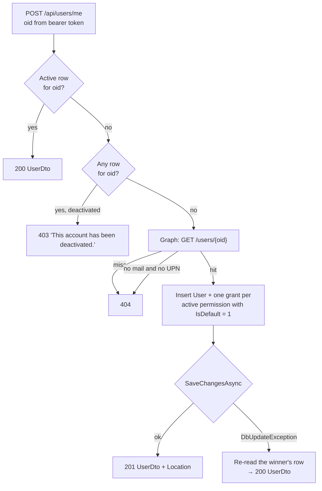

# User Management

End-to-end reference for the user lifecycle: how a person becomes a row in `Core.User`, how administrators pre-create and manage those rows, how permissions are granted and revoked, and which lockout scenarios the service refuses to allow. Audience: engineers onboarding to or extending user, permission, or admin-gating code.

## 1. Overview

A *user* is an Entra ID identity that has been mirrored into the application database. The primary key of [`User`](../../enterprise-gpt-api/Enterprise.Gpt.Entity/User.cs) **is the Entra ID object id (oid)** — not a generated surrogate. Everything else in this feature follows from that one decision: it is what lets a row created by an administrator (who only knows an email address) be the same row the user later signs in against.

Authorization is carried entirely by rows in `Core.UserPermission`. A user is an administrator if and only if they hold an active grant of the seeded [`PermissionIds.Administrator`](../../enterprise-gpt-api/Enterprise.Gpt.Dto/Enums/PermissionIds.cs) permission.

**What changed:** the former `UsersController` was deleted and replaced by [`UserEndpoints.cs`](../../enterprise-gpt-api/Enterprise.Gpt.Api/Endpoints/UserEndpoints.cs), a `MapGroup("api/users")` minimal-API group, following the pattern established by [`ModelEndpoints`](../../enterprise-gpt-api/Enterprise.Gpt.Api/Endpoints/ModelEndpoints.cs) (see [Model Management](../models/model-management.md)).

The migration was not cosmetic. Admin gating is an **endpoint filter** ([`PermissionEndpointFilter`](../../enterprise-gpt-api/Enterprise.Gpt.Api/Filters/PermissionEndpointFilter.cs)), which cannot be attached to an MVC controller action — so while user management lived on a controller, **every authenticated caller could deactivate any user**. Moving to minimal APIs is what made per-route admin gating possible at all.

The public URL the frontend depends on (`POST /api/users/me`) is unchanged; [`user.service.ts`](../../enterprise-ui/src/app/services/user.service.ts) required no edits.

## 2. API surface

Every route requires an authenticated caller (`RequireAuthorization()` on the group); anonymous requests get `401` before any handler runs. All routes except `me` additionally carry `PermissionEndpointFilter.Require(PermissionIds.Administrator)`, which authorizes off the [permission cache](../permissions/permission-cache.md) rather than the database.

| Verb | Route | Access | Success | Failure modes |
|---|---|---|---|---|
| POST | `/api/users/me` | any authenticated | 200 `UserDto` (existing user) — or 201 `UserDto` + `Location: /api/users/{id}` on first sign-in | 403 caller's account is deactivated, 404 no directory user for the oid / directory user has no email |
| GET | `/api/users` | **admin** | 200 `PaginatedResponseDto<UserDto>` — **active only**, in the requested order or by last name then first name by default | 400 validation-error — an unrecognised `sort`/`dir`, or a `permissionId` naming no active permission (below), 403 not admin |
| GET | `/api/users/{id:guid}` | **admin** | 200 `UserDto` | 403 not admin, 404 unknown/deactivated id |
| POST | `/api/users` | **admin** | 201 `UserDto` + `Location: /api/users/{id}` | 400 validation / email already active / email matches >1 directory user, 403 not admin, 404 unknown directory email / unusable directory object id / unknown permission |
| PUT | `/api/users/{id:guid}` | **admin** | 200 `UserDto` | 400 validation / self-revocation of Administrator, 403 not admin, 404 unknown user / unknown permission |
| DELETE | `/api/users/{id:guid}` | **admin** | 204 — soft delete, cascading to grants | 400 self-deactivation, 403 not admin, 404 unknown/already deactivated |

All error responses are **RFC 9457 Problem Details**, served as `application/problem+json` — `{ type, title, status, detail, instance, traceId }`, plus an `errors` dictionary on validation failures. `type` comes from [`ProblemTypes`](../../enterprise-gpt-api/Enterprise.Gpt.Api/Problems/ProblemTypes.cs): `/problems/validation-error` for the 400s, `/problems/forbidden` for a deactivated account, `/problems/permission-required` for a missing admin grant (with a `permissions` extension), `/problems/resource-not-found` for the 404s. Match those URIs verbatim — they are identifiers, not links, and changing one is a breaking API change. The 400s matter most here: the `errors` dictionary is keyed by the failing property, so a self-revocation attempt and a malformed email are distinguishable without parsing prose.

```json
{
  "type": "/problems/validation-error",
  "title": "One or more validation errors occurred.",
  "status": 400,
  "instance": "/api/users",
  "traceId": "00-a1b2c3d4e5f60718293a4b5c6d7e8f90-1122334455667788-01",
  "errors": {
    "Email": ["'Email' is not a valid email address."]
  }
}
```

`GET /api/users` accepts six optional query parameters:

| Parameter | Default | Behavior |
|---|---|---|
| `name` | `null` | `LIKE %name%` against `FirstName`, `LastName`, **and** `Email` (case sensitivity follows the database collation — case-insensitive on SQL Server defaults) |
| `skip` | `0` | Clamped to `>= 0` |
| `take` | `20` | Clamped to `1..100` |
| `permissionId` | `null` | Since US-1205: narrows the page to active users holding an active grant of that permission. Applied **before** `CountAsync`, so `totalCount` describes the filtered directory. Combines with `name` |
| `sort` | `null` | Since US-706: `name` \| `email` \| `created`. Unrecognised value → `400` (below) |
| `dir` | `null` | Since US-706: `asc` \| `desc`, case-insensitive. Applies to the default field when `sort` is omitted |

Paging arguments are **clamped, not validated** — they arrive straight off the query string, and `take = 0` would divide by zero when computing `CurrentPage`. A caller asking for `take=5000` silently gets 100 rather than a 400.

**`sort`/`dir` take the opposite stance: an unrecognised value is rejected**, because a page in the wrong order looks exactly like a page in the right one, where a clamped `skip`/`take` at least fails safe. Resolved by [`UserSortKeys`](../../enterprise-gpt-api/Enterprise.Gpt.Service/Sorting/UserSortKeys.cs) against the shared parser in `Enterprise.Gpt.Service.Sorting`, the same folder and pattern conversation and project search use ([Conversation Usage and Favourites §5.6](../conversations/usage-and-favorites.md#56-ordering--sort-and-dir-us-706), [Projects §3.6](../projects/project-management.md#36-ordering--sort-and-dir-us-706)). `name` and `email` default ascending, `created` defaults descending — a directory reads A–Z, a provisioning date reads newest first. Omitting both parameters preserves the pre-existing `LastName, FirstName` order byte-for-byte, with no `Id` tiebreak, exactly as before either parameter existed; requesting either one adds an `Id` tiebreak that **follows the requested direction**, because two people can share a surname and a fixed tiebreak would make a reversed sort collapse onto the same rows. No migration and no new index: `UserConfiguration` defines no indexes at all, so every order — including the pre-existing default — is a sort over the same unindexed active-user scan `name` already runs.

**`permissionId` is refused, not silently ignored, when it names nothing active.** Unlike every other permission-existence check in this service, which raises a `404 NotFoundException`, an unknown or deactivated `permissionId` here is a `400 ValidationException` keyed by the literal query-parameter name `permissionId` — deliberately: a `404` on a list route reads as "the directory is gone", where a filter control can render a `400` naming its own field. A deactivated permission is refused alongside an absent one, because the filter this parameter exists for is offered from `GET api/permissions`, which returns neither.

```json
{
  "type": "/problems/validation-error",
  "errors": { "permissionId": ["'3f2a91b5-...' is not an active permission."] }
}
```

The frontend control that sends `permissionId` — a "Permission: any" filter on the admin directory (US-1206, 2026-08-21) — is built; see [Administration §4.6](../ui/administration.md#46-the-permission-filter-us-1206) for the URL contract and the repair behaviour on an id the catalog no longer lists. `sort`/`dir` reach the endpoint but no control on that screen sends them yet (§12).

### 2.1 Related grant routes

Individual grant/revoke lives under the same URL prefix but is mapped by [`PermissionEndpoints`](../../enterprise-gpt-api/Enterprise.Gpt.Api/Endpoints/PermissionEndpoints.cs), because it is a permission concern rather than a profile concern. Both are admin-gated.

| Verb | Route | Success | Failure modes |
|---|---|---|---|
| POST | `/api/users/{userId:guid}/permissions/{permissionId:guid}` | 204 — idempotent; re-granting a previously revoked permission inserts a **fresh** row | 403 not admin, 404 unknown/deactivated user or permission |
| DELETE | `/api/users/{userId:guid}/permissions/{permissionId:guid}` | 204 — soft-deletes the grant | 400 self-revocation of Administrator, 403 not admin, 404 no active grant |

Use these for single-permission edits and `PUT /api/users/{id}` when you want to replace the whole set (see §6).

### 2.2 Wire-shape contracts

Response DTO — [`UserDto`](../../enterprise-gpt-api/Enterprise.Gpt.Dto/UserDto.cs) (camelCase on the wire):

```json
{
  "id": "0e984725-c51c-4bf5-9960-e1c80e27aba0",
  "firstName": "Ada",
  "lastName": "Lovelace",
  "email": "ada.lovelace@example.com",
  "permissions": [
    {
      "id": "3f2a91b5-...",
      "name": "Chat",
      "description": "Access to the chat experience.",
      "isDefault": true,
      "mcpServerId": null,
      "dateDeactivated": null
    }
  ],
  "fullName": "Ada Lovelace"
}
```

Two things to know about this payload:

- `fullName` is a computed, read-only property (`$"{FirstName} {LastName}".Trim()`). It is serialized but never deserialized into anything meaningful — do not send it back.
- `permissions` contains **active grants only**, and the nested `dateDeactivated` is therefore always `null`. [`UserMapper`](../../enterprise-gpt-api/Enterprise.Gpt.Service/Mappers/UserMapper.cs) applies the active filter in both the materialized and the `IQueryable` projection, because after a permission diff the tracked collection holds freshly revoked *and* freshly added rows in the same object graph.

Paged response — [`PaginatedResponseDto<UserDto>`](../../enterprise-gpt-api/Enterprise.Gpt.Dto/PaginatedResponseDto.cs):

```json
{
  "items": [],
  "totalCount": 42,
  "pageSize": 20,
  "currentPage": 1,
  "totalPages": 3
}
```

`totalPages` is computed (`ceil(totalCount / pageSize)`); `currentPage` is derived as `(skip / take) + 1`, so it is only meaningful when the client pages in `take`-sized steps.

Request DTOs — [`UserActions.cs`](../../enterprise-gpt-api/Enterprise.Gpt.Dto/Actions/User/UserActions.cs):

```jsonc
// CreateUserActionDto — POST /api/users
{
  "email": "grace.hopper@example.com",
  "permissionIds": ["3f2a91b5-..."]
}

// UpdateUserActionDto — PUT /api/users/{id}
{
  "firstName": "Grace",
  "lastName": "Hopper",
  "email": "grace.hopper@example.com",
  "permissionIds": ["3f2a91b5-...", "c36e22ed-..."]
}
```

`CreateUserActionDto` deliberately carries **no** id, first name, or last name: those come from Microsoft Graph (§4.2). `POST /api/users/me` takes no body at all.

## 3. Request flow

```
Client ──► RequireAuthorization (JWT) ──► PermissionEndpointFilter (admin routes only)
       ──► IUserPermissionCache (no query on a hit)
       ──► UserEndpoints handler ──► IUserService ──► FluentValidation
       ──► IGraphService (provisioning paths only) ──► EF Core ──► SQL
```

1. [`UserEndpoints`](../../enterprise-gpt-api/Enterprise.Gpt.Api/Endpoints/UserEndpoints.cs) handlers are thin: bind route/body/DI/`CancellationToken` (all inferred), call the service, wrap in `TypedResults`. Nothing is caught at the endpoint layer.
2. [`UserService`](../../enterprise-gpt-api/Enterprise.Gpt.Service/UserService.cs) owns all business logic and throws precise exceptions.
3. The chained handlers translate: FluentValidation `ValidationException` → 400 ([`ValidationExceptionHandler`](../../enterprise-gpt-api/Enterprise.Gpt.Api/ExceptionHandlers/ValidationExceptionHandler.cs)); `NotFoundException` → 404 and `ForbiddenException` → 403 ([`GlobalExceptionHandler`](../../enterprise-gpt-api/Enterprise.Gpt.Api/ExceptionHandlers/GlobalExceptionHandler.cs)); cancellation → 499.

`GetOrCreateCurrentUserAsync` is the only handler in the API that returns a **result union** (`Results<Ok<UserDto>, Created<UserDto>>`). The UI treats first sign-in and every later page load identically and reads a `UserDto` off both, so the status code has to vary while the body shape does not.

## 4. Three provisioning paths

There is exactly one way a `Core.User` row comes into existence per path, and all three converge on the same primary key.

### 4.1 Self-provisioning on first sign-in

The Angular shell calls `POST /api/users/me` from `AppComponent` on every authenticated bootstrap. It is a `POST` rather than a `GET` because the call can create.



Details worth knowing:

- **Deactivated ≠ absent.** `FindCurrentUserAsync` runs a second, cheap `AnyAsync` probe *only* when the active lookup misses. Without it a deactivated user would be treated as new, re-insert their own object id, and fail the save with a duplicate key instead of a clear 403. The happy path (every page load) stays at one query.
- **The duplicate-insert race is swallowed on purpose.** MSAL can emit more than one "signed in" notification per session, so two first-sign-in calls can both pass the existence check and both insert the same primary key. The loser clears the change tracker, re-reads the winner's row, and returns `200` — not a duplicate-key 500.
- **Email resolution:** `mail` is preferred, falling back to `userPrincipalName`; a directory user with neither yields a 404 rather than a null in the non-nullable `Email` column. The message names the *object id*, not the address, because both exception handlers log `Message` and the repo standard forbids PII in logs.
- **Grants are created against the new user.** EF orders the `User` insert ahead of its `UserPermission` children in the same `SaveChangesAsync`, so the self-referencing `CreatedById`/`ModifiedById` foreign keys resolve.
- **This call also warms the permission cache.** The response already carries the caller's active grants, so `GetOrCreateCurrentUserAsync` publishes that set into [`IUserPermissionCache`](../../enterprise-gpt-api/Enterprise.Gpt.Service/Caching/UserPermissionCache.cs) on every path (existing, created, and race-loser). Because the UI posts this endpoint on each bootstrap, the entry is warm before any gated route is hit. The write is ordered against concurrent evictions by an invalidation stamp captured *before* the grants are read, so a sign-in racing a revoke cannot republish the pre-revoke set — see [Permission Cache §4.1](../permissions/permission-cache.md#41-warm-fill-at-sign-in).

A self-provisioned user receives **exactly** the permissions flagged `IsDefault` — nothing else (§5).

### 4.2 Administrator pre-creation

`POST /api/users` provisions someone before they have ever signed in. The administrator supplies only an email address:

1. [`GraphService.GetUserByEmailAsync`](../../enterprise-gpt-api/Enterprise.Gpt.Service/GraphService.cs) queries Graph with `$filter=mail eq '…' or userPrincipalName eq '…'`.
2. The returned `id` is parsed into a `Guid` — that becomes the row's primary key. **This is the crux of the whole design:** because the pre-created row keys on the directory object id, the user's first `POST /api/users/me` finds it and takes the existing-user path, keeping the permissions the administrator assigned.
3. The requested `permissionIds` **plus every default permission** are granted, so a pre-created user is never worse off than one who self-provisions.

Two safeguards live in the Graph lookup:

- The email is embedded in an OData filter by string concatenation, so a single quote is escaped by doubling it. Without that, an address containing an apostrophe both breaks the query and opens an injection vector into the filter expression.
- `$top=2`, not `1`. `mail` is not unique in Entra ID (shared mailboxes, mail-enabled objects, mail/UPN collisions), and this id becomes a primary key — silently taking the first match could bind an administrator's pre-creation to the wrong person. More than one match is a `400`.

`POST /api/users` also doubles as the **reactivation path**. Because the primary key is the object id, a previously deactivated row cannot be re-inserted; the service revives it instead — clearing `DateDeactivated`, refreshing the profile from Graph, and adding any requested or default permissions the user does not already hold. Grants that survived the deactivation are skipped, since re-granting one would violate the filtered unique index on `(UserId, PermissionId) WHERE DateDeactivated IS NULL`. An **active** user with that email is a `400`, not a revive.

### 4.3 Administrator management

Once a row exists, administrators use the remaining routes:

| Task | Route |
|---|---|
| Find users (typeahead / list) | `GET /api/users?name=&skip=&take=&permissionId=&sort=&dir=` |
| Inspect one user and their active grants | `GET /api/users/{id}` |
| Edit profile and replace the permission set | `PUT /api/users/{id}` (§6) |
| Add or remove a single permission | `POST` / `DELETE /api/users/{userId}/permissions/{permissionId}` |
| Revoke access | `DELETE /api/users/{id}` (§7, §8) |

Note that `PUT` writes `firstName`, `lastName`, and `email` directly — it does not consult Graph. Administrator edits therefore override the directory values until the next pre-creation revive rewrites them.

## 5. Default permissions — the `IsDefault` flag

`IsDefault` is a new `bit` column on [`Permission`](../../enterprise-gpt-api/Enterprise.Gpt.Entity/Permission.cs). It is the only knob administrators have over what a brand-new user can do, and it is surfaced end to end: [`PermissionDto`](../../enterprise-gpt-api/Enterprise.Gpt.Dto/PermissionDto.cs), `CreatePermissionActionDto`, `UpdatePermissionActionDto`, and the Angular [`PermissionDto`](../../enterprise-ui/src/app/dtos/PermissionDto.ts) all carry it.

Where the flag is consulted:

| Path | Defaults applied? |
|---|---|
| `POST /api/users/me` — first sign-in | Yes — the grant set is *exactly* the active permissions with `IsDefault = 1` |
| `POST /api/users` — pre-creation or revive | Yes — requested ids **∪** every default |
| `PUT /api/users/{id}` — update | **No** (`includeDefaults: false`) |
| `POST /api/users/{userId}/permissions/{permissionId}` | **No** — explicit grant only |

The flag is applied at provisioning time, never retroactively. Turning `IsDefault` on for an existing permission does not backfill users who already have rows, and an administrator who omits a default permission from a `PUT` body revokes it permanently for that user. Both are deliberate: `PUT` is a *complete desired set* (§6), and a rule that silently re-added defaults would make it impossible to take a permission away from one person.

### 5.1 Why Administrator and MCP-managed permissions can never be default

Exposing a "grant this to everyone automatically" flag is only safe if privileged rows can never carry it. Three things close that off:

1. The seeded Administrator row is created with `IsDefault = false` in [`PermissionConfiguration`](../../enterprise-gpt-api/Enterprise.Gpt.Repository/Configurations/PermissionConfiguration.cs).
2. Permissions auto-created by an MCP server ([`McpServerService`](../../enterprise-gpt-api/Enterprise.Gpt.Service/McpServerService.cs)) never set the flag, so they default to `false`.
3. `PermissionService.EnsurePermissionIsCustom` rejects **all** mutation of both kinds of row — it runs at the top of `UpdatePermissionAsync` and `DeactivatePermissionAsync` and throws a `ValidationException` (400) for `PermissionIds.Administrator` and for anything with a non-null `McpServerId`.

Since `PUT /api/permissions/{id}` is the only route that can flip the flag, and it refuses those rows, there is no API path that makes Administrator or an MCP permission a default. `CreatePermissionActionDto` has no `mcpServerId` field either, so a newly created default permission cannot be attached to a server after the fact.

## 6. The permission diff on `PUT`

`UpdateUserActionDto.PermissionIds` is the **complete desired set**, not a delta. An empty list strips every permission the user holds (subject to §7).

[`UserService.UpdateUserAsync`](../../enterprise-gpt-api/Enterprise.Gpt.Service/UserService.cs) loads the user with its active grants tracked, then diffs:

| Bucket | Action |
|---|---|
| Held but **not** in `permissionIds` | Revoked — `DateDeactivated`, `DateModified`, `ModifiedById` set to now / the caller |
| In `permissionIds` but **not** held | New `UserPermission` row with fresh audit columns |
| In both | **Untouched** — keeps its original `DateCreated` / `CreatedById` |

That third row is the reason this is a diff rather than a revoke-and-regrant. Blowing away every grant and reinserting would be simpler, but it would destroy the record of *who first granted each permission* — the audit trail administrators actually reach for during an access review.

Everything is a tracked entity, so the profile edit and the entire permission diff land in **one** `SaveChangesAsync` — one implicit transaction, no half-applied state.

Ordering matters for error handling: unknown permission ids are resolved (and throw `NotFoundException` → 404) **before** the save. Revocations are already staged on tracked entities at that point, but since nothing has been flushed and the scoped `DbContext` is disposed with the request, the database is untouched.

Re-granting a permission the user previously lost inserts a **new** row rather than reviving the old one. The filtered unique index only covers active rows, so revocation history is preserved.

## 7. Safety invariants

Every admin route authorizes off a single grant, so the failure mode this feature has to design against is *an administrator accidentally locking themselves — or the tenant — out of user and permission management*.

| Invariant | Enforced in | Result |
|---|---|---|
| An administrator cannot revoke their own Administrator permission via the bulk diff | `UserService.EnsureAdministratorNotSelfRevoked` (`PUT /api/users/{id}`) | 400 |
| …nor via the single-grant route | `PermissionService.RevokePermissionAsync` (`DELETE /api/users/{userId}/permissions/{permissionId}`) | 400 |
| An administrator cannot deactivate their own account | `UserService.DeactivateUserAsync` | 400 |
| Deactivating a user cascades soft-delete to every active grant they hold | `UserService.DeactivateUserAsync`, same `SaveChangesAsync` | 204 |
| …and evicts their cached grant set, so this instance observes the cascade at once | `UserService.DeactivateUserAsync`, after the save | 204 |
| The built-in Administrator permission itself cannot be edited or deactivated | `PermissionService.EnsurePermissionIsCustom` | 400 |

**Why the self-revocation guard is duplicated.** Both routes can remove the same grant. Guarding only the bulk diff would leave the lockout reachable by calling `DELETE /api/users/{me}/permissions/{administrator}` — the guard has to live wherever the revocation can happen, which is why it appears in both `UserService` and `PermissionService`. The check is scoped to `targetUserId == callerOid`: administrators can freely revoke *other* administrators.

**Why deactivation must cascade.** `PermissionEndpointFilter` authorizes purely on `Core.UserPermission` and never joins `Core.User` — it asks "is there an active Administrator grant for this oid?" and nothing else. Leaving a deactivated administrator's grant alive would leave them with full admin access despite having no active account. The integration suite pins this: `DeactivateUser_DeactivatedAdministrator_LosesAdminAccess` calls `GET /api/users` as a second admin before and after deactivation and asserts `200` then `403`.

**Deactivation now has two halves.** Since authorization reads the [permission cache](../permissions/permission-cache.md) rather than the database, the grant cascade alone is not enough: a cached entry written before the deactivation would keep serving the revoked grants. `DeactivateUserAsync` therefore also calls `IUserPermissionCache.Invalidate(id)` after the save. The two are complementary — the cascade removes the rows, the eviction makes the removal visible on the next request.

That eviction is **per instance**. In a scaled-out deployment, other instances keep serving their cached entry until it expires, so a deactivated administrator can retain admin access elsewhere for up to `Permissions:Cache:EntryLifetime` (default 5 minutes). The same applies to every revoke in this section. See [Permission Cache §5.1](../permissions/permission-cache.md#51-entrylifetime--the-scale-out-staleness-bound).

Taken together, no single API call can reduce the system to zero active administrators: the caller must be an administrator to reach any of these routes, and none of them can strip the caller's own grant. That property holds only through the API — direct SQL, or disabling the last administrator's account in Entra ID, will still get you there.

## 8. Limitation — deactivation is not session revocation

> **Read this before treating `DELETE /api/users/{id}` as an offboarding control.**

Only two places in the codebase consult `Core.User.DateDeactivated`:

- `UserService.FindCurrentUserAsync` — makes `POST /api/users/me` return 403 for a deactivated account.
- `PermissionService.GrantPermissionAsync` — refuses to grant to a deactivated user.

Admin routes are additionally cut off, but indirectly: the grant cascade of §7 removes the `UserPermission` row behind the Administrator grant, and the accompanying cache eviction makes that removal effective on the instance that served the call — after up to `Permissions:Cache:EntryLifetime` on any other instance.

Everything else — conversations, documents, chat completions — resolves the caller with `ITokenService.GetOid()` and never looks the user up in `Core.User`. **A deactivated user holding an unexpired access token keeps chatting, keeps uploading documents, and keeps reading their conversation history until that token expires.** Deactivation blocks the *next* sign-in and all administrative access; it does not terminate a live session.

To cut access off immediately, **disable or delete the account in Entra ID**. Deactivating the application row is the right way to remove someone's permissions and hide them from the admin surface — it is not an emergency stop.

Closing this properly would mean an active-user check on the hot path (an extra query per chat request, or a cached lookup) plus Entra ID continuous access evaluation. Neither is implemented today.

## 9. Validation

Validators are colocated with the DTOs in [`UserActions.cs`](../../enterprise-gpt-api/Enterprise.Gpt.Dto/Actions/User/UserActions.cs) and auto-registered by `AddValidatorsFromAssemblies` in [`Program.cs`](../../enterprise-gpt-api/Enterprise.Gpt.Api/Program.cs). `UserService` injects `IValidator<T>` and calls `ValidateAndThrowAsync` at the top of create/update.

| Field | Rules (lengths mirror the entity) |
|---|---|
| `email` (both DTOs) | required, valid email format, ≤ 512 |
| `firstName` / `lastName` (update) | required, ≤ 256 |
| `permissionIds` (both) | non-null; no element may be `Guid.Empty` |

Checks that are *not* validator rules, because validators in `Enterprise.Gpt.Dto` have no database or Graph access:

| Check | Where | Status |
|---|---|---|
| Email already belongs to an active user | `CreateUserAsync` | 400 |
| Email matches more than one directory user | `GraphService.GetUserByEmailAsync` | 400 |
| Caller would self-revoke Administrator | `EnsureAdministratorNotSelfRevoked` / `RevokePermissionAsync` | 400 |
| Caller would deactivate themselves | `DeactivateUserAsync` | 400 |
| Requested permission id does not exist or is deactivated | `ResolveGrantablePermissionsAsync` | 404 |
| Directory has no user for the oid/email | `GraphService` | 404 |
| Directory user has no `mail` and no `userPrincipalName` | `ResolveEmail` | 404 |
| Directory returned an unparseable object id | `CreateUserAsync` | 404 |

Resolving permissions up front is a deliberate choice over letting the insert fail: a foreign-key violation would surface as an opaque 500, whereas `ResolveGrantablePermissionsAsync` names the offending id (`"Permission {id} not found."`).

## 10. Key files

| Concern | File |
|---|---|
| Endpoints (minimal API group) | [`Enterprise.Gpt.Api/Endpoints/UserEndpoints.cs`](../../enterprise-gpt-api/Enterprise.Gpt.Api/Endpoints/UserEndpoints.cs) |
| Grant/revoke endpoints | [`Enterprise.Gpt.Api/Endpoints/PermissionEndpoints.cs`](../../enterprise-gpt-api/Enterprise.Gpt.Api/Endpoints/PermissionEndpoints.cs) |
| Admin gate | [`Enterprise.Gpt.Api/Filters/PermissionEndpointFilter.cs`](../../enterprise-gpt-api/Enterprise.Gpt.Api/Filters/PermissionEndpointFilter.cs) |
| Cached grant sets ([reference](../permissions/permission-cache.md)) | [`Enterprise.Gpt.Service/Caching/UserPermissionCache.cs`](../../enterprise-gpt-api/Enterprise.Gpt.Service/Caching/UserPermissionCache.cs), [`Settings/UserPermissionCacheOptions.cs`](../../enterprise-gpt-api/Enterprise.Gpt.Service/Settings/UserPermissionCacheOptions.cs) |
| User business logic | [`Enterprise.Gpt.Service/UserService.cs`](../../enterprise-gpt-api/Enterprise.Gpt.Service/UserService.cs) |
| Permission/grant business logic | [`Enterprise.Gpt.Service/PermissionService.cs`](../../enterprise-gpt-api/Enterprise.Gpt.Service/PermissionService.cs) |
| Microsoft Graph lookups | [`Enterprise.Gpt.Service/GraphService.cs`](../../enterprise-gpt-api/Enterprise.Gpt.Service/GraphService.cs) |
| Caller identity (oid claim) | [`Enterprise.Gpt.Service/TokenService.cs`](../../enterprise-gpt-api/Enterprise.Gpt.Service/TokenService.cs) |
| Entity ↔ DTO mapping | [`Enterprise.Gpt.Service/Mappers/UserMapper.cs`](../../enterprise-gpt-api/Enterprise.Gpt.Service/Mappers/UserMapper.cs) |
| Response DTOs | [`UserDto.cs`](../../enterprise-gpt-api/Enterprise.Gpt.Dto/UserDto.cs), [`PermissionDto.cs`](../../enterprise-gpt-api/Enterprise.Gpt.Dto/PermissionDto.cs), [`PaginatedResponseDto.cs`](../../enterprise-gpt-api/Enterprise.Gpt.Dto/PaginatedResponseDto.cs) |
| Request DTOs + validators | [`Enterprise.Gpt.Dto/Actions/User/UserActions.cs`](../../enterprise-gpt-api/Enterprise.Gpt.Dto/Actions/User/UserActions.cs) |
| Entities | [`User.cs`](../../enterprise-gpt-api/Enterprise.Gpt.Entity/User.cs), [`Permission.cs`](../../enterprise-gpt-api/Enterprise.Gpt.Entity/Permission.cs), [`UserPermission.cs`](../../enterprise-gpt-api/Enterprise.Gpt.Entity/UserPermission.cs) |
| EF configuration + seed | [`UserConfiguration.cs`](../../enterprise-gpt-api/Enterprise.Gpt.Repository/Configurations/UserConfiguration.cs), [`PermissionConfiguration.cs`](../../enterprise-gpt-api/Enterprise.Gpt.Repository/Configurations/PermissionConfiguration.cs), [`UserPermissionConfiguration.cs`](../../enterprise-gpt-api/Enterprise.Gpt.Repository/Configurations/UserPermissionConfiguration.cs) |
| Built-in permission ids | [`Enterprise.Gpt.Dto/Enums/PermissionIds.cs`](../../enterprise-gpt-api/Enterprise.Gpt.Dto/Enums/PermissionIds.cs) |
| Frontend consumer | [`enterprise-ui/src/app/services/user.service.ts`](../../enterprise-ui/src/app/services/user.service.ts) (`POST /api/users/me` only) |
| Tests | [`UserServiceTests.cs`](../../enterprise-gpt-api/tests/Enterprise.Gpt.Unit.Test/Services/UserServiceTests.cs), [`UserEndpointsTests.cs`](../../enterprise-gpt-api/tests/Enterprise.Gpt.Unit.Test/Endpoints/UserEndpointsTests.cs), [`UserEndpointsIntegrationTests.cs`](../../enterprise-gpt-api/tests/Enterprise.Gpt.Integration.Test/Endpoints/UserEndpointsIntegrationTests.cs), [`FakeGraphService.cs`](../../enterprise-gpt-api/tests/Enterprise.Gpt.Integration.Test/TestInfrastructure/FakeGraphService.cs) |

## 11. Operational notes

### 11.1 Microsoft Graph app registration

`GraphServiceClient` is registered in [`Program.cs`](../../enterprise-gpt-api/Enterprise.Gpt.Api/Program.cs) with a `ClientSecretCredential` built from `AzureAd:TenantId` / `:ClientId` / `:ClientSecret`. That is the **client-credentials (app-only)** flow — there is no signed-in user on the Graph call, so delegated permissions do not apply.

The app registration therefore needs the **application** permission `User.Read.All`, with tenant admin consent granted:

| Call | Graph operation | Least-privileged application permission |
|---|---|---|
| `GetUserAsync(oid)` — self-provisioning | `GET /users/{id}` | `User.Read.All` |
| `GetUserByEmailAsync(email)` — pre-creation | `GET /users?$filter=…` | `User.Read.All` |

Without consent, `POST /api/users/me` fails for every new user and `POST /api/users` cannot resolve an object id. Note that `User.ReadBasic.All` is *not* sufficient for the app-only list query used by the by-email filter.

The client secret is read from configuration. Per the repo standard, move it to Azure Key Vault (or switch the credential to a managed identity) before any deployed environment — see [Azure Key Vault Configuration](../configuration/key-vault.md) for how `AzureAd--ClientSecret` maps onto this setting.

### 11.2 Database migrations

`Permission.IsDefault` is a **new column**, and `Enterprise.Gpt.Repository` currently has **no `Migrations/` folder at all**. `Program.cs` calls `context.Database.Migrate()` at startup outside the `Testing` environment, so against a real SQL Server this feature ships nothing until migrations are regenerated:

```bash
# from enterprise-gpt-api/
dotnet ef migrations add InitialCreate --project Enterprise.Gpt.Repository --startup-project Enterprise.Gpt.Api
```

Integration tests are unaffected — `CustomWebApplicationFactory` runs in the `Testing` environment (which skips the startup `Migrate()`), and `IntegrationTestFixture` builds the schema with `EnsureCreatedAsync` against a Testcontainers SQL Server 2025 instance. That is precisely why a missing migration will not show up in `dotnet test`.

Also relevant when generating: `UserPermissionConfiguration` declares a **filtered unique index** on `(UserId, PermissionId) WHERE DateDeactivated IS NULL`, and `PermissionConfiguration` one on `Name`. Both are load-bearing for the grant/revoke semantics described in §6.

### 11.3 Bootstrapping the first administrator

The seed creates the Administrator permission row and a system `Core.User` row (`5f7ab694-1b6c-4b19-badd-c82b65e794cf`, used for the audit columns of seeded data) — but **no `UserPermission` grant**. A fresh database has zero administrators, and every admin route returns 403 for everyone.

Because `UserPermission.UserId` is a foreign key to `Core.User`, the sequence is:

1. Sign in to the UI once so `POST /api/users/me` creates your row (or insert it manually).
2. Insert the grant out of band:

```sql
DECLARE @oid uniqueidentifier = '<your-entra-object-id>';

INSERT INTO Core.UserPermission
    (Id, UserId, PermissionId, DateCreated, CreatedById, DateModified, ModifiedById)
VALUES
    (NEWID(), @oid, 'a0b1c2d3-e4f5-4a6b-8c7d-9e0f1a2b3c4d',
     SYSDATETIMEOFFSET(), @oid, SYSDATETIMEOFFSET(), @oid);
```

The permission id must match `PermissionIds.Administrator` verbatim. Because this write bypasses `PermissionService`, it also bypasses cache eviction: if you already signed in at step 1, sign out and back in (or wait out `Permissions:Cache:EntryLifetime`) before the grant is honoured. From there, use `POST /api/users` or the grant routes to promote everyone else — this SQL should be needed exactly once per environment.

## 12. Known gaps and extension points

- **This bullet is stale and kept only as a marker of how much changed.** It used to read: "No admin UI. The frontend only calls `POST /api/users/me`; `UserDto` and `PermissionDto` exist in `enterprise-ui`, but there are no user- or permission-management screens. Everything in §2 is reachable only from Scalar/HTTP today." Both premises are gone — `enterprise-ui` was deleted and rebuilt from scratch as `enterprise-gpt-ui/`, and that rebuild's admin area (EP-12) now covers the whole of §2: a server-paged user directory with search, sort and a permission filter (US-1201, US-1206), a create modal (US-1202), a permission-editing offcanvas (US-1203), and a deactivate confirmation (US-1204), beside the model catalog and MCP server registry tabs. See [Administration](../ui/administration.md) for the frontend's own reference, which is the accurate document from here on.
- **Profiles never refresh from Graph.** After the row exists, `POST /api/users/me` returns it verbatim. A name change or mailbox move in Entra ID is not picked up until an administrator runs `PUT /api/users/{id}` or a pre-creation revive.
- **Concurrent pre-creation is not guarded.** The duplicate-insert recovery in §4.1 exists only on the `me` path. Two administrators racing `POST /api/users` for the same email can both miss the existence check and one will fail the save — surfacing as a 500 rather than a 400/409.
- **Concurrency conflicts surface as 500.** The `rowversion Version` column turns racing writes into `DbUpdateConcurrencyException`, which the fallback handler maps to 500. A 409 arm in `GlobalExceptionHandler` would make that honest (same gap as [model management](../models/model-management.md)).
- **Missing-OID tokens.** A principal that passes `RequireAuthorization()` but carries no OID claim (e.g. an app-only token) makes `TokenService.GetOid()` throw `UnauthorizedAccessException`, which the fallback handler maps to 500. A 401 arm would be more honest; this is pre-existing and also reachable through `PermissionEndpointFilter`.
- **Grant changes converge per instance only.** `PermissionService`, `UserService`, and `McpServerService` evict the affected users from the permission cache immediately, but only on the instance that served the mutation. Everywhere else the change lands when the entry expires. Fanning `Invalidate(userId)` out over Redis or Service Bus is the intended fix — see [Permission Cache §5.1](../permissions/permission-cache.md#51-entrylifetime--the-scale-out-staleness-bound).
- **Out-of-band grant SQL bypasses eviction.** The bootstrap `INSERT` in §11.3 writes `Core.UserPermission` directly, so nothing evicts the cache. If the new administrator already has a cached entry, the grant takes effect on their next sign-in or after `Permissions:Cache:EntryLifetime`.
- **Search does not scale.** `EF.Functions.Like($"%{name}%")` cannot seek an index — every search is a table scan over active users. Fine for hundreds of users; revisit with full-text search or a prefix-only match if the directory grows.
- **Neither does sorting or the permission filter, for the identical reason.** `UserConfiguration` defines no indexes at all — not even on `LastName`, the pre-existing default order — so `?sort=`, `?dir=` and `?permissionId=` all run as a scan alongside `?name=`. The `permissionId` filter additionally starts from `Users` and probes `UserPermission`'s existing filtered grant index from that side rather than the reverse; a directory large enough for `?name=` to need an index is large enough for these to need one too.
- **No "last administrator" guard beyond self-protection.** The API cannot reach zero administrators (§7), but nothing prevents an operator from doing so with direct SQL, and nothing warns an administrator that they are the last one.
- **Defaults are not retroactive.** Consider a `POST /api/permissions/{id}/backfill` (admin) if administrators need to push a newly flagged default onto existing users; today they must grant it user by user.
